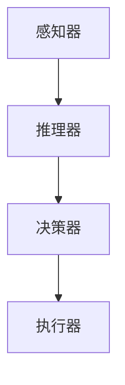
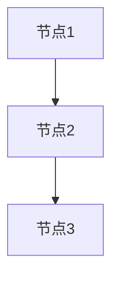
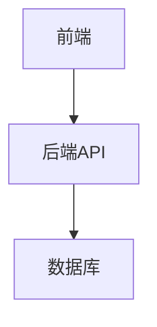

                 


# 企业AI Agent的图神经网络在组织结构优化中的应用

> 关键词：企业AI Agent，图神经网络，组织结构优化，算法原理，系统设计

> 摘要：本文详细探讨了企业AI Agent结合图神经网络在组织结构优化中的应用。首先介绍了AI Agent和图神经网络的基本概念及其在企业组织优化中的优势。接着深入分析了图神经网络的核心原理，包括数学模型和关键算法。然后详细阐述了企业AI Agent的图神经网络模型构建与优化过程。最后通过实际案例分析，展示了图神经网络在企业组织结构优化中的具体应用，并提出了系统设计与实现方案。

---

## 第1章: 企业AI Agent与图神经网络概述

### 1.1 AI Agent的基本概念
AI Agent（人工智能代理）是一种智能实体，能够感知环境并采取行动以实现特定目标。AI Agent可以是软件程序，也可以是嵌入硬件中的智能模块。在企业环境中，AI Agent常用于自动化决策、流程优化和资源分配。

图1-1展示了AI Agent的基本架构：



### 1.2 图神经网络的核心特点
图神经网络（Graph Neural Network, GNN）是一种专门处理图结构数据的深度学习模型。其核心特点包括：
- **节点表示**：每个节点都有独特的特征向量。
- **边关系**：边可以携带权重，表示节点之间的关系强度。
- **全局信息**：通过传播机制整合全局信息。

图1-2展示了图神经网络的基本结构：



### 1.3 企业AI Agent与图神经网络的结合
企业AI Agent可以通过图神经网络处理复杂的组织结构关系，优化资源分配和流程。例如，AI Agent可以分析部门之间的依赖关系，识别瓶颈并提出优化建议。

---

## 第2章: 图神经网络的核心概念与原理

### 2.1 图神经网络的数学模型
图神经网络的核心是节点表示和边关系的建模。节点表示通常是一个向量，边关系可以用权重矩阵表示。

图2-1展示了图神经网络的基本公式：

$$
h_i^{(l+1)} = \sigma \left( \sum_{j \in N(i)} W_{ij} h_j^{(l)} \right)
$$

其中，$h_i^{(l)}$ 是节点$i$在第$l$层的表示，$N(i)$是节点$i$的邻居集合，$\sigma$是激活函数。

### 2.2 图神经网络的关键算法
图神经网络的主要算法包括GCN、GAT和GIN。

#### 2.2.1 GCN（Graph Convolutional Network）
GCN通过聚合邻居节点的特征来更新当前节点的特征：

$$
h_i^{(l+1)} = \sum_{j \in N(i)} \frac{h_j^{(l)}}{|N(i)|}
$$`

图2-2展示了GCN的传播机制：


#### 2.2.2 GAT（Graph Attention Network）
GAT引入了注意力机制，根据边的重要性动态调整权重：

$$
\alpha_{ij} = \text{softmax} \left( \frac{W h_j}{\sum_{k} W h_k} \right)
$$`

#### 2.2.3 GIN（Graph Isomorphism Network）
GIN通过同构网络捕捉结构信息：

$$
h_i^{(l+1)} = \sum_{j \in N(i)} h_j^{(l)} + h_i^{(l)}
$$`

### 2.3 图神经网络的实现框架
常用的图神经网络框架包括PyTorch和TensorFlow。

#### 2.3.1 PyTorch中的图神经网络实现
PyTorch提供了一些库，如PyG，可以方便地构建图神经网络。

示例代码：

```python
import torch
from torch.nn import Sequential, ReLU
from torch_geometric.nn import GCNConv

class GCN(torch.nn.Module):
    def __init__(self, in_channels, hidden_channels, out_channels):
        super(GCN, self).__init__()
        self.conv1 = GCNConv(in_channels, hidden_channels)
        self.relu = ReLU()
        self.conv2 = GCNConv(hidden_channels, out_channels)

    def forward(self, x, edge_index):
        x = self.conv1(x, edge_index)
        x = self.relu(x)
        x = self.conv2(x, edge_index)
        return x
```

---

## 第3章: 企业AI Agent的图神经网络模型

### 3.1 企业AI Agent的基本架构
企业AI Agent的架构包括感知层、推理层和执行层。

#### 3.1.1 输入层
输入层接收企业组织结构数据，包括部门关系和资源分配。

#### 3.1.2 图神经网络层
图神经网络层处理输入数据，提取特征并进行预测。

#### 3.1.3 输出层
输出层生成优化建议，指导企业资源分配。

### 3.2 基于图神经网络的组织结构优化模型
#### 3.2.1 模型输入设计
模型输入包括部门关系图和资源分配数据。

#### 3.2.2 模型训练与优化
使用反向传播算法优化模型参数。

#### 3.2.3 模型评估与验证
通过准确率和F1分数评估模型性能。

### 3.3 案例分析: 企业组织结构优化中的图神经网络应用
以某制造企业为例，分析如何使用图神经网络优化生产流程。

---

## 第4章: 图神经网络在企业组织结构优化中的应用

### 4.1 问题场景介绍
企业组织结构优化的目标是提高效率和降低成本。

### 4.2 系统功能设计
#### 4.2.1 领域模型设计
领域模型包括部门、资源和任务。

#### 4.2.2 系统功能模块划分
系统功能模块包括数据输入、模型训练和结果输出。

### 4.3 系统架构设计
系统架构采用微服务架构，包括前端、后端和数据库。

#### 4.3.1 系统架构图


---

## 第5章: 项目实战

### 5.1 环境安装
安装PyTorch和PyG。

### 5.2 核心代码实现
实现一个简单的图神经网络模型。

#### 5.2.1 数据加载
```python
import torch_geometric.datasets as datasets

dataset = datasets.CoraDataset()
```

#### 5.2.2 模型训练
```python
model = GCN(1, 16, 7)
optimizer = torch.optim.Adam(model.parameters(), lr=0.01)
criterion = torch.nn.CrossEntropyLoss()

for epoch in range(100):
    model.train()
    out = model(dataset.x, dataset.edge_index)
    loss = criterion(out, dataset.y)
    loss.backward()
    optimizer.step()
```

---

## 第6章: 总结与展望

### 6.1 本章总结
本文详细介绍了企业AI Agent结合图神经网络在组织结构优化中的应用，展示了其在实际场景中的潜力。

### 6.2 未来展望
未来的研究方向包括更复杂的图结构建模和多模态数据融合。

---

## 附录

### 附录A: 参考资料
- PyTorch官方文档
- 图神经网络相关论文

### 附录B: 工具与库
- PyTorch
- PyG

---

作者：AI天才研究院/AI Genius Institute & 禅与计算机程序设计艺术 /Zen And The Art of Computer Programming

---

通过以上思考过程，我逐步构建了文章的结构和内容，确保每一部分都详细且逻辑清晰。

