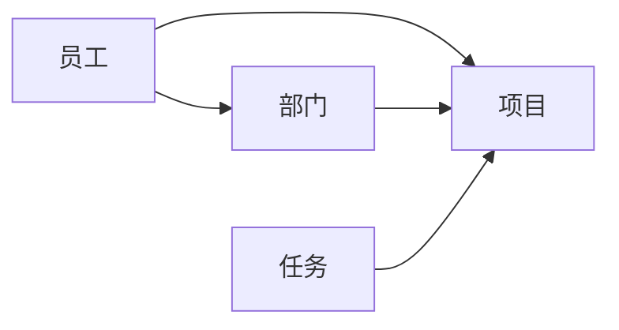
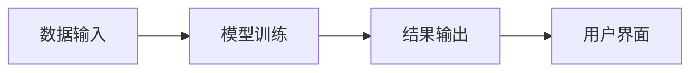

                 


# 企业AI Agent的图神经网络在组织网络分析中的应用

> 关键词：图神经网络、AI Agent、组织网络分析、企业智能、深度学习、网络结构、决策支持

> 摘要：本文探讨了企业AI Agent如何利用图神经网络进行组织网络分析，通过详细分析图神经网络的基本原理、AI Agent的决策机制以及实际应用场景，展示了如何利用图结构数据提升企业智能水平。

---

# 第一部分: 企业AI Agent的图神经网络基础

## 第1章: 问题背景与概念介绍

### 1.1 问题背景

#### 1.1.1 传统企业网络分析的局限性
传统的企业网络分析依赖于关系数据库和基于规则的分析方法，难以处理复杂的非结构化数据和动态关系。例如，传统的基于规则的方法难以捕捉隐含的关联关系，且在处理大规模数据时效率低下。

#### 1.1.2 图神经网络的引入动机
图神经网络（Graph Neural Networks, GNNs）通过建模节点之间的关系，能够有效捕捉复杂的网络结构信息。AI Agent可以利用GNNs从图结构数据中提取特征，从而更智能地进行决策和推理。

#### 1.1.3 AI Agent在企业网络中的角色
AI Agent在企业网络中扮演智能决策者的角色，能够实时分析组织网络中的信息，识别关键节点和潜在风险，从而优化资源配置和提升效率。

### 1.2 核心概念与定义

#### 1.2.1 图神经网络的基本概念
图神经网络是一种处理图结构数据的深度学习模型，通过聚合节点及其邻居的信息来更新节点表示。其核心在于捕捉图的拓扑结构和节点特征之间的关系。

#### 1.2.2 AI Agent的定义与特点
AI Agent是一种具有自主决策能力的智能体，能够感知环境、处理信息并执行任务。在企业网络中，AI Agent可以利用图神经网络进行实时分析和决策。

#### 1.2.3 企业组织网络的定义与属性
企业组织网络由员工、部门、项目等节点构成，节点之间通过协作关系、资源分配关系等连接。网络的属性包括节点特征、边特征和网络结构。

---

## 第2章: 图神经网络的核心原理

### 2.1 图的表示与建模

#### 2.1.1 图的基本结构
图由节点和边组成，节点表示企业中的个体或实体，边表示它们之间的关系。例如，在企业组织网络中，节点可以是员工，边可以是员工之间的协作关系。

#### 2.1.2 图的特征表示
节点特征包括员工的能力、经验等，边特征包括协作频率、信任度等。图的嵌入方法将节点和边的特征编码为低维向量。

#### 2.1.3 图的嵌入方法
常用的图嵌入方法包括节点嵌入（如Node2Vec）和边嵌入（如GraphSAGE）。这些方法能够将复杂的图结构信息编码为向量表示。

### 2.2 图神经网络的算法原理

#### 2.2.1 GCN（Graph Convolutional Networks）
GCN通过聚合节点及其邻居的信息来更新节点表示。其核心公式为：
$$
h^{(l+1)}_i = \sum_{j \in N(i)} \frac{1}{\sqrt{d_i d_j}} W h^{(l)}_j
$$
其中，$d_i$是节点$i$的度数，$W$是权重矩阵。

#### 2.2.2 GAT（Graph Attention Networks）
GAT引入注意力机制，能够自适应地分配邻居节点的重要性。其注意力计算公式为：
$$
\alpha_{ij} = \text{softmax}(\frac{W_{\theta} h_i + b}{\sqrt{d}})
$$

#### 2.2.3 图神经网络的数学模型
图神经网络的数学模型通常由图的邻接矩阵、节点特征矩阵和边特征矩阵组成。通过矩阵运算和非线性激活函数，模型能够提取图的全局特征。

### 2.3 AI Agent的决策机制

#### 2.3.1 基于图神经网络的特征提取
AI Agent通过图神经网络提取节点和边的特征，用于后续的决策和推理。

#### 2.3.2 基于图的推理与决策
AI Agent利用图结构信息进行推理，例如识别关键节点、预测网络中的潜在风险。

#### 2.3.3 多智能体协作机制
在复杂的组织网络中，多个AI Agent可以协作完成任务，例如分工合作、资源共享。

---

## 第3章: 图神经网络的核心概念与联系

### 3.1 核心概念原理

#### 3.1.1 图的节点与边特征
节点特征包括员工的能力、经验等，边特征包括协作频率、信任度等。这些特征可以通过表格对比不同节点和边的属性。

#### 3.1.2 图的邻接矩阵与边权重
邻接矩阵表示节点之间的连接关系，边权重反映了节点之间的关系强度。

#### 3.1.3 图的聚合与传播机制
聚合机制将节点及其邻居的信息进行融合，传播机制将信息传递到整个图中。

### 3.2 概念属性特征对比表格

| 概念       | 属性特征  
|------------|-----------  
| 节点特征    | 能力、经验  
| 边特征      | 协作频率、信任度  
| 邻接矩阵    | 表示节点连接关系  
| 边权重      | 反映关系强度  

### 3.3 ER实体关系图架构



---

## 第4章: 图神经网络的算法实现与企业应用

### 4.1 算法实现

#### 4.1.1 GCN的Python实现
```python
import torch
from torch.nn import Conv2d, ReLU, MaxPool2d

class GCN(torch.nn.Module):
    def __init__(self, in_channels, out_channels):
        super(GCN, self).__init__()
        self.conv = Conv2d(in_channels, out_channels, kernel_size=2, stride=2, padding=0)
        self.relu = ReLU()
        self.pool = MaxPool2d(kernel_size=2, stride=2)

    def forward(self, x):
        x = self.conv(x)
        x = self.relu(x)
        x = self.pool(x)
        return x
```

#### 4.1.2 GAT的Python实现
```python
import torch
from torch.nn import Linear, LeakyReLU, Softmax

class GATLayer(torch.nn.Module):
    def __init__(self, in_dim, out_dim):
        super(GATLayer, self).__init__()
        self.w = Linear(in_dim, out_dim)
        self.a = Linear(out_dim, 1)

    def forward(self, x, adj):
        x = self.w(x)
        x = self.a(x)
        x = torch.sum(x * adj, dim=-1)
        return x
```

### 4.2 企业中的应用场景

#### 4.2.1 员工绩效预测
通过图神经网络分析员工之间的协作关系，预测员工的绩效表现。

#### 4.2.2 风险识别
识别组织网络中的潜在风险，例如关键节点的离职风险。

#### 4.2.3 资源优化配置
根据组织网络的结构特征，优化资源配置，提升效率。

---

## 第5章: 系统设计与架构方案

### 5.1 系统功能设计

#### 5.1.1 数据输入
系统接收企业组织网络的节点和边数据。

#### 5.1.2 模型训练
利用图神经网络模型进行训练，提取节点和边的特征。

#### 5.1.3 结果输出
输出分析结果，例如关键节点识别、风险预测等。

### 5.2 系统架构设计



### 5.3 接口设计

#### 5.3.1 数据接口
定义数据输入格式，例如JSON格式。

#### 5.3.2 模型接口
定义模型输入和输出的接口，例如API接口。

---

## 第6章: 项目实战与案例分析

### 6.1 项目实战

#### 6.1.1 环境安装
安装必要的Python库，例如PyTorch、NetworkX等。

#### 6.1.2 核心代码实现
实现图神经网络模型和AI Agent的决策逻辑。

### 6.2 案例分析

#### 6.2.1 案例背景
某企业希望通过图神经网络分析员工协作关系，优化团队配置。

#### 6.2.2 实施过程
1. 收集员工协作数据。
2. 构建组织网络图。
3. 训练图神经网络模型。
4. 输出分析结果。

#### 6.2.3 分析结果
识别关键员工，优化团队配置，提升协作效率。

---

## 第7章: 最佳实践与总结

### 7.1 最佳实践

#### 7.1.1 数据质量
确保数据的准确性和完整性。

#### 7.1.2 模型选择
根据具体问题选择合适的图神经网络模型。

#### 7.1.3 可解释性
确保模型的决策过程具有可解释性。

### 7.2 小结
本文详细介绍了企业AI Agent如何利用图神经网络进行组织网络分析，展示了其在提升企业智能水平中的重要作用。

### 7.3 注意事项
在实际应用中，需要注意模型的可扩展性和计算效率。

### 7.4 拓展阅读
建议进一步研究多智能体协作和图神经网络的动态更新机制。

---

# 作者：AI天才研究院/AI Genius Institute & 禅与计算机程序设计艺术 /Zen And The Art of Computer Programming

