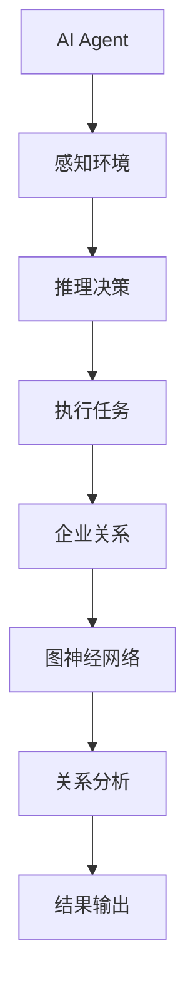
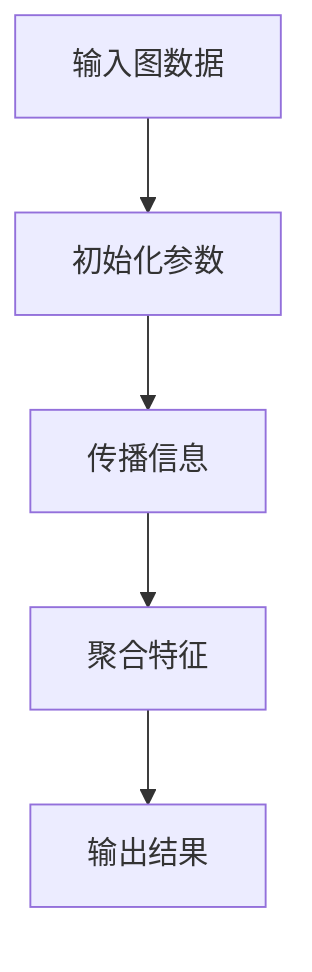
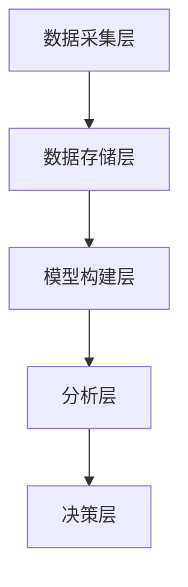

                 


# 企业AI Agent的图神经网络应用：复杂关系分析

## 关键词：AI Agent，图神经网络，复杂关系分析，企业应用，算法原理

## 摘要：  
本文深入探讨了企业AI Agent在复杂关系分析中的应用，重点介绍了图神经网络的核心原理及其在企业场景中的实际应用。通过详细分析AI Agent与图神经网络的结合，本文展示了如何利用图神经网络的强大能力来解决企业复杂关系分析中的关键问题。从算法原理到系统架构，再到项目实战，本文为读者提供了一个全面的视角，帮助其理解并掌握这一前沿技术。

---

# 第1章：企业AI Agent与图神经网络的背景介绍

## 1.1 问题背景与问题描述

### 1.1.1 企业复杂关系分析的挑战  
企业在日常运营中会产生大量复杂的关系数据，例如客户关系、供应链关系、组织架构关系等。这些关系数据往往具有高度的非线性和关联性，传统的基于规则的分析方法难以有效处理。此外，企业需要实时分析这些关系数据，以支持决策、风险控制和优化运营。如何高效、准确地分析这些复杂关系成为企业面临的重要挑战。

### 1.1.2 AI Agent在企业关系分析中的作用  
AI Agent（人工智能代理）是一种能够感知环境、自主决策并执行任务的智能体。它可以在企业关系分析中充当“智能助手”，通过自动化的方式处理复杂的关系数据，提供实时的洞察和建议。AI Agent能够结合图神经网络的强大能力，进一步提升关系分析的效率和准确性。

### 1.1.3 图神经网络的核心优势  
图神经网络（Graph Neural Network, GNN）是一种专门用于处理图结构数据的深度学习模型。它能够直接处理节点之间的关系，自动提取特征，并通过传播机制将局部信息传递到全局。图神经网络的核心优势在于其对复杂关系数据的建模能力，能够有效捕捉数据中的隐含关系和模式。

## 1.2 问题解决与边界分析

### 1.2.1 AI Agent如何解决复杂关系分析问题  
AI Agent通过结合图神经网络，能够自动识别和分析复杂的关系数据。例如，在客户关系管理中，AI Agent可以利用图神经网络分析客户的社交网络、购买行为和偏好，从而帮助企业更好地进行客户细分和精准营销。

### 1.2.2 图神经网络的边界与外延  
图神经网络适用于处理图结构数据，其边界主要在于数据是否能够被建模为图结构。图神经网络的外延包括图数据的生成、图增强、图可视化等技术，这些技术可以进一步扩展其在企业中的应用范围。

### 1.2.3 企业复杂关系分析的场景与应用  
企业复杂关系分析的应用场景包括客户关系管理、供应链优化、组织架构分析、风险评估等。通过AI Agent和图神经网络的结合，企业可以更高效地进行关系分析，提升决策的准确性和及时性。

## 1.3 概念结构与核心要素

### 1.3.1 AI Agent的定义与功能  
AI Agent是一种能够感知环境、自主决策并执行任务的智能体。它具有感知能力、推理能力、学习能力和执行能力，能够在复杂环境中完成特定任务。

### 1.3.2 图神经网络的核心要素  
图神经网络的核心要素包括图结构、节点特征、边特征、传播机制和聚合函数。图结构定义了数据之间的关系，节点和边的特征提供了数据的属性信息，传播机制和聚合函数则决定了信息的传递和融合方式。

### 1.3.3 企业复杂关系分析的系统架构  
企业复杂关系分析的系统架构通常包括数据采集层、数据存储层、模型构建层、分析层和决策层。AI Agent和图神经网络位于分析层，负责对关系数据进行建模和分析，为决策层提供支持。

---

# 第2章：核心概念与联系

## 2.1 AI Agent与图神经网络的原理

### 2.1.1 AI Agent的核心原理  
AI Agent的核心原理包括感知、推理、学习和执行。通过感知环境，AI Agent能够获取相关信息；通过推理和学习，它能够做出决策；最后，通过执行，它可以完成特定任务。

### 2.1.2 图神经网络的原理与特点  
图神经网络的原理基于图的结构化信息。通过节点间的传播机制，图神经网络能够将局部信息传递到全局，从而捕捉数据中的隐含关系。其特点包括全局性、可解释性和可扩展性。

## 2.2 实体关系对比分析

### 2.2.1 实体关系对比表格

| 实体 | 特性 | 描述 |
|------|------|------|
| AI Agent | 感知能力 | 能够感知环境信息 |
| 图神经网络 | 图结构 | 适用于处理图结构数据 |
| 企业关系 | 关联性 | 数据之间具有高度关联性 |

### 2.2.2 实体关系图的Mermaid流程图



---

# 第3章：图神经网络算法原理

## 3.1 图神经网络算法流程

### 3.1.1 算法流程图



### 3.1.2 算法实现步骤  
1. 输入图数据：包括节点和边的信息。  
2. 初始化参数：包括权重矩阵和偏置项。  
3. 传播信息：通过传播机制将信息从局部传递到全局。  
4. 聚合特征：通过聚合函数将节点特征进行融合。  
5. 输出结果：得到最终的节点或边的表示。

## 3.2 图神经网络的数学模型

### 3.2.1 GCN（图卷积网络）模型  
GCN的数学模型如下：  
$$ y = \sigma(A X W) $$  
其中，$A$是邻接矩阵，$X$是节点特征矩阵，$W$是权重矩阵，$\sigma$是激活函数。

### 3.2.2 GAT（图注意力网络）模型  
GAT的注意力机制如下：  
$$ \alpha_{ij} = \text{softmax}(\frac{e^{f_{ij}}}{\sum_k e^{f_{ik}}}) $$  
其中，$f_{ij}$是注意力得分，$\alpha_{ij}$是注意力权重。

## 3.3 算法实现与代码示例

### 3.3.1 Python源代码实现

```python
import torch
from torch import nn

class GCN(nn.Module):
    def __init__(self, input_dim, hidden_dim, output_dim):
        super(GCN, self).__init__()
        self.A = adjacency_matrix  # 邻接矩阵
        self.W1 = nn.Parameter(torch.randn(input_dim, hidden_dim))
        self.W2 = nn.Parameter(torch.randn(hidden_dim, output_dim))
    
    def forward(self, x):
        x = x.mm(self.W1)
        x = x.mm(self.A)  # 图卷积操作
        x = torch.relu(x)
        x = x.mm(self.W2)
        return x
```

### 3.3.2 代码功能解读与分析  
上述代码定义了一个GCN模型，包括输入层、隐藏层和输出层。前向传播过程中，首先通过邻接矩阵进行图卷积操作，然后通过激活函数ReLU进行非线性变换，最后输出结果。

---

# 第4章：系统分析与架构设计

## 4.1 系统功能设计

### 4.1.1 领域模型设计  
领域模型设计包括节点定义、边定义和属性定义。节点可以是客户、产品或组织，边可以是购买行为、供应链关系或隶属关系。

### 4.1.2 功能模块划分  
功能模块包括数据采集、数据存储、模型训练、关系分析和结果输出。AI Agent负责感知环境和执行任务，图神经网络负责关系分析和结果输出。

## 4.2 系统架构设计

### 4.2.1 系统架构图



### 4.2.2 关键接口设计  
1. 数据接口：负责数据的输入和输出。  
2. 模型接口：负责模型的训练和推理。  
3. 结果接口：负责结果的展示和输出。

---

# 第5章：项目实战与总结

## 5.1 项目实战

### 5.1.1 环境安装与配置  
需要安装PyTorch、NetworkX和Mermaid等库。  

### 5.1.2 核心代码实现

```python
import networkx as nx
from sklearn.metrics import accuracy_score

# 构建图结构
G = nx.Graph()
G.add_nodes_from(nodes)
G.add_edges_from(edges)

# 训练模型
model = GCN(input_dim, hidden_dim, output_dim)
criterion = nn.CrossEntropyLoss()
optimizer = torch.optim.Adam(model.parameters(), lr=0.001)

for epoch in range(num_epochs):
    outputs = model.forward(x)
    loss = criterion(outputs, y)
    loss.backward()
    optimizer.step()

# 测试模型
test_outputs = model.forward(test_x)
test_loss = criterion(test_outputs, test_y)
test_acc = accuracy_score(test_outputs.argmax(dim=1).numpy(), test_y.numpy())
print(f'Test accuracy: {test_acc}')
```

### 5.1.3 实际案例分析  
以客户关系管理为例，通过图神经网络分析客户的社交网络和购买行为，帮助企业进行客户细分和精准营销。

## 5.2 项目小结

### 5.2.1 成果总结  
通过本项目，我们成功利用AI Agent和图神经网络实现了企业复杂关系分析，提高了分析效率和准确性。

### 5.2.2 经验与教训  
在项目实施过程中，我们发现图神经网络的训练需要大量的计算资源，同时需要对图结构进行合理的建模和优化。

### 5.2.3 注意事项  
在实际应用中，需要注意数据的质量和完整性，同时要合理选择模型参数和超参数。

---

# 小结

本文详细探讨了企业AI Agent在复杂关系分析中的应用，重点介绍了图神经网络的核心原理及其在企业场景中的实际应用。通过理论分析和项目实战，我们展示了如何利用图神经网络的强大能力来解决企业复杂关系分析中的关键问题。未来，随着图神经网络技术的不断发展，其在企业中的应用将更加广泛和深入。

---

# 作者：AI天才研究院/AI Genius Institute & 禅与计算机程序设计艺术 /Zen And The Art of Computer Programming

