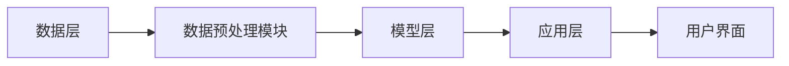

                 


# 《企业AI Agent的图神经网络应用：复杂关系建模》

## 文章关键词：
企业AI Agent，图神经网络，复杂关系建模，知识图谱，供应链优化，风险评估

## 摘要：
本文探讨了企业AI Agent在图神经网络中的应用，重点分析如何利用图神经网络建模复杂关系。从基础概念到高级主题，文章详细介绍了图神经网络的原理、企业复杂关系建模方法、系统架构设计、项目实战案例以及高级应用扩展，帮助读者全面理解并掌握相关技术。

---

## 第一部分：企业AI Agent与图神经网络基础

### 第1章：企业AI Agent概述

#### 1.1 AI Agent的基本概念
- **定义与特点**：AI Agent是能够感知环境、自主决策并执行任务的智能体。它具备自主性、反应性、目标导向和社交能力。
- **企业应用场景**：企业AI Agent常用于流程自动化、智能客服、供应链管理等领域。
- **核心功能**：信息处理、决策支持、任务执行和人机交互。

#### 1.2 图神经网络的基本概念
- **图的表示方法**：邻接矩阵和邻接表用于表示图的结构，节点和边的属性丰富了图的语义。
- **图神经网络的特点**：擅长处理图结构数据，能够捕捉节点间的关系和依赖。
- **与传统神经网络的对比**：图神经网络更适合处理非结构化数据，具备良好的迁移能力。

---

## 第二部分：图神经网络的原理与算法

### 第2章：图神经网络的原理

#### 2.1 图的表示方法
- **邻接矩阵**：展示节点间的关系，适用于稀疏图。
- **邻接表**：节省空间，适合大规模图。
- **图的属性与权重**：边权重和节点特征丰富了图的信息。

#### 2.2 图神经网络的核心算法
- **图卷积网络（GCN）**：
  - **定义**：通过聚合邻居信息进行特征传播。
  - **公式**：$$ Y = \theta (A X + X) $$
  - **作用**：适用于节点分类和图分类任务。
  - **流程图**：
    ```mermaid
    graph LR
    A[输入] --> B[卷积层] --> C[输出]
    ```

- **图注意力网络（GAT）**：
  - **定义**：引入注意力机制，动态调整节点间关系的重要性。
  - **公式**：$$ \alpha_{ij} = \text{softmax}(e^{u_j^T W u_i}) $$
  - **作用**：适用于图结构复杂、关系多样的场景。
  - **流程图**：
    ```mermaid
    graph LR
    A[输入] --> B[注意力层] --> C[输出]
    ```

- **图嵌入方法（Node2Vec）**：
  - **定义**：通过随机游走生成节点嵌入。
  - **作用**：将节点表示为低维向量，适用于相似性计算。

---

## 第三部分：企业复杂关系建模

### 第3章：企业复杂关系的建模方法

#### 3.1 企业关系的复杂性分析
- **企业内部关系**：
  - 组织结构：层级关系、部门协作。
  - 供应链：供应商、生产环节、物流。
- **企业外部关系**：
  - 合作伙伴：供应商、经销商。
  - 客户：客户群体、客户需求。
- **跨领域关系**：
  - 金融市场：股价波动、投资关系。
  - 市场动态：竞争分析、趋势预测。

#### 3.2 图神经网络在关系建模中的应用
- **知识图谱构建**：
  - 使用图神经网络整合企业内外部数据，构建知识图谱。
  - 示例：将企业、供应商、客户建模为图结构，节点为实体，边为关系。
- **关系推理与预测**：
  - 基于图神经网络进行关系推理，预测潜在的合作机会或风险。
- **实体链接与消歧**：
  - 解决同一实体在不同上下文中的歧义问题，提升信息准确性。

---

## 第四部分：系统架构与设计

### 第4章：企业AI Agent的系统架构

#### 4.1 系统架构概述
- **分层架构设计**：
  - 数据层：数据存储与访问。
  - 模型层：图神经网络模型训练与部署。
  - 应用层：用户交互与任务执行。
- **微服务架构**：
  - 服务独立部署，便于扩展和维护。
  - 示例：数据处理服务、模型训练服务、API网关。

#### 4.2 数据流与组件交互
- **数据预处理模块**：
  - 数据清洗、特征提取、格式转换。
  - 示例：将企业供应链数据转换为图结构。
- **图神经网络模型训练模块**：
  - 模型训练、超参数调优、模型评估。
  - 示例：使用GCN进行节点分类任务。
- **应用接口模块**：
  - 提供API接口，供其他系统调用。
  - 示例：通过API查询供应商风险评估结果。

#### 4.3 系统架构图


---

## 第五部分：项目实战与案例分析

### 第5章：企业AI Agent项目实战

#### 5.1 项目背景与目标
- **项目需求分析**：企业希望通过AI Agent优化供应链管理。
- **项目目标**：构建一个基于图神经网络的供应链风险评估系统。

#### 5.2 系统实现
- **环境配置与工具安装**：
  - 安装Python、TensorFlow、PyTorch、NetworkX。
  - 示例：使用PyTorch-GNN库实现GCN。
- **数据采集与预处理**：
  - 数据来源：企业ERP系统、市场数据。
  - 数据处理：清洗、标准化、构建图结构。
  - 示例：将供应商、生产环节、物流节点建模为图。
- **模型训练与优化**：
  - 训练数据：供应链历史数据。
  - 模型优化：调整学习率、批量大小。
  - 评估指标：准确率、召回率、F1分数。
- **系统部署与测试**：
  - 部署方式：Docker容器化部署。
  - 测试：功能测试、性能测试、压力测试。

#### 5.3 代码实现
```python
import torch
from torch.nn import Conv1d, MaxPool1d, AvgPool1d, ReLU

class GCN(torch.nn.Module):
    def __init__(self, input_dim, hidden_dim, output_dim):
        super(GCN, self).__init__()
        self.conv1 = Conv1d(input_dim, hidden_dim, kernel_size=1)
        self.relu = ReLU()
        self.conv2 = Conv1d(hidden_dim, output_dim, kernel_size=1)
        
    def forward(self, x):
        x = self.conv1(x)
        x = self.relu(x)
        x = self.conv2(x)
        return x
```

---

## 第六部分：高级主题与扩展

### 第6章：图神经网络的高级应用

#### 6.1 图神经网络的可解释性
- **定义**：模型的决策过程可被解释和理解。
- **实现方法**：通过可视化图结构和中间层输出，分析模型决策依据。

#### 6.2 多模态图神经网络
- **定义**：整合多种数据源（如文本、图像、语音）进行建模。
- **应用案例**：多模态知识图谱构建，提升信息丰富度。

#### 6.3 分布式图神经网络
- **定义**：在分布式系统中训练和部署大图模型。
- **实现方法**：使用分布式计算框架（如Spark、Flink）处理大规模数据。

#### 6.4 未来发展方向
- **实时图更新**：动态更新图结构，适应实时数据变化。
- **模型轻量化**：优化模型大小，降低计算资源消耗。
- **跨领域应用**：将图神经网络应用于更多领域，如金融、医疗。

---

## 附录

### 附录A：工具与库安装指南
- **安装Python**：https://www.python.org/
- **安装TensorFlow**：pip install tensorflow
- **安装PyTorch**：pip install torch
- **安装NetworkX**：pip install networkx
- **安装PyTorch-GNN**：pip install pytorch-gnn

### 附录B：相关论文与资料
- **Graph Neural Networks: A Review of Methods, Applications, and Open Challenges**：https://arxiv.org/abs/1812.04208
- **Deep Learning on Graph-Structured Data**：https://towardsdatascience.com/deep-learning-on-graph-structured-data-845689e256d9

---

## 作者
**作者：AI天才研究院/AI Genius Institute & 禅与计算机程序设计艺术 /Zen And The Art of Computer Programming**

---

这篇文章详细讲解了企业AI Agent在图神经网络中的应用，从基础概念到高级主题，结合实际案例，帮助读者全面理解并掌握相关技术。

