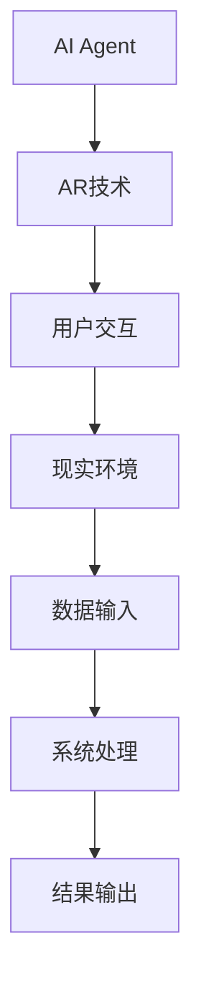
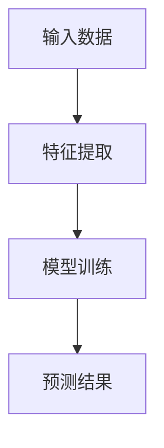
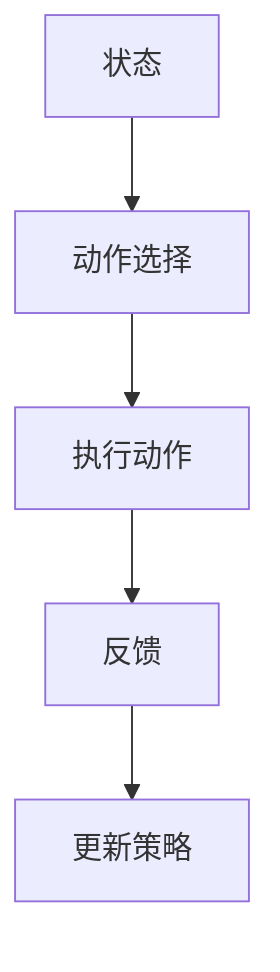
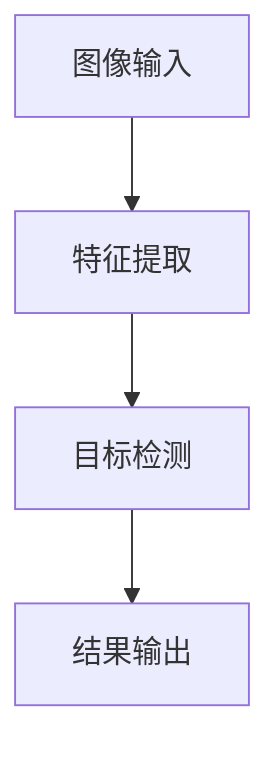
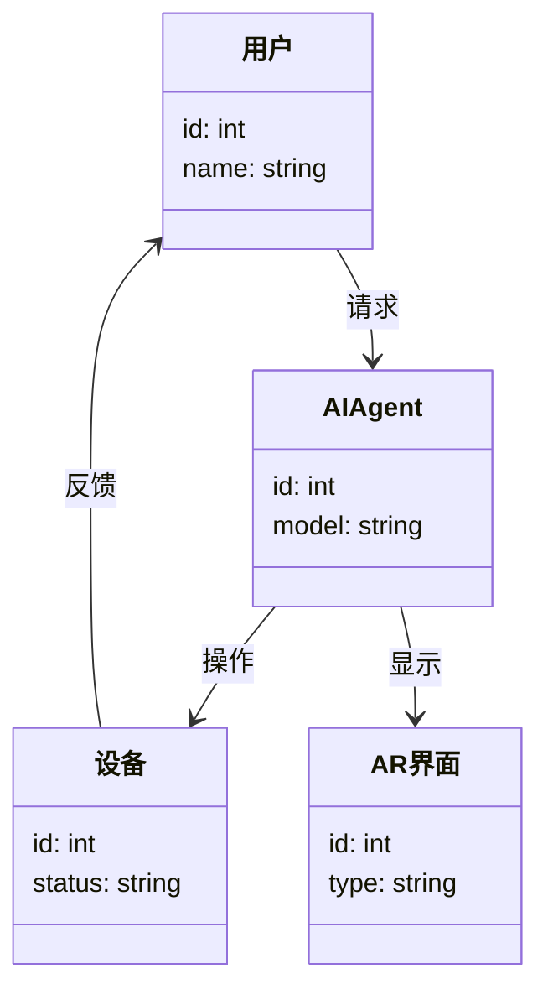
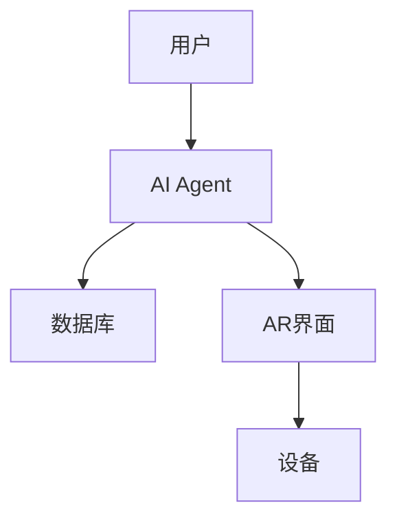
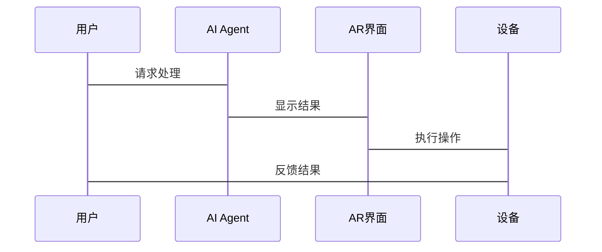

                 


# 企业AI Agent的增强现实(AR)技术集成

> 关键词：企业AI Agent，增强现实，AR技术，AI与AR结合，企业智能化

> 摘要：本文探讨了企业AI Agent与增强现实(AR)技术的集成，分析了两者结合的背景、核心概念、算法原理、系统架构、项目实战及最佳实践，为企业在智能化转型中提供理论与实践指导。

---

# 第一部分: 企业AI Agent的增强现实(AR)技术集成概述

---

## 第1章: 引言

### 1.1 问题背景

#### 1.1.1 企业AI Agent的发展现状
随着人工智能技术的快速发展，企业AI Agent（智能代理）逐渐成为企业数字化转型的重要工具。AI Agent能够自动化处理企业中的各种任务，如数据分析、决策支持、客户交互等，显著提高了企业的效率和竞争力。

#### 1.1.2 增强现实(AR)技术的崛起
增强现实（Augmented Reality，AR）技术近年来在多个领域得到了广泛应用。通过将虚拟信息叠加到真实环境中，AR为用户提供了一种全新的交互方式，特别是在企业培训、设备维护、远程协作等领域展现了巨大的潜力。

#### 1.1.3 两者的结合对企业的影响
企业AI Agent与AR技术的结合，不仅能够提升AI Agent的交互能力，还能通过AR的可视化能力增强用户的体验。这种结合将为企业智能化转型提供新的可能性，推动企业进入更高效、更智能的运营模式。

### 1.2 问题描述

#### 1.2.1 企业AI Agent的局限性
尽管AI Agent在企业中发挥了重要作用，但其主要依赖于文本或数据交互，缺乏直观的可视化能力，用户在使用过程中可能会感到单调或难以理解复杂的决策过程。

#### 1.2.2 AR技术在企业中的应用痛点
AR技术在企业中的应用还处于初级阶段，存在设备成本高、内容开发复杂、用户接受度低等问题。此外，AR技术的应用需要与企业的业务流程紧密结合，否则难以发挥其潜力。

#### 1.2.3 问题解决的必要性
通过将AR技术集成到企业AI Agent中，可以弥补AI Agent在交互上的不足，同时降低AR技术的使用门槛，推动其在企业中的广泛应用。

### 1.3 问题解决

#### 1.3.1 AR技术如何增强AI Agent的能力
AR可以通过提供实时的可视化反馈，增强AI Agent的交互能力。例如，在设备维护场景中，AI Agent可以通过AR技术指导用户进行操作，提高效率和准确性。

#### 1.3.2 企业AI Agent与AR技术的协同作用
企业AI Agent可以处理复杂的业务逻辑，而AR技术则通过提供直观的界面，帮助用户更好地理解和操作。两者协同作用，能够显著提升企业的智能化水平。

#### 1.3.3 解决方案的可行性分析
通过结合AI Agent的智能决策能力和AR技术的可视化优势，可以为企业提供一种全新的智能化解决方案。这种方案不仅能够提升用户体验，还能降低企业的运营成本。

### 1.4 边界与外延

#### 1.4.1 企业AI Agent的边界
企业AI Agent主要应用于企业的内部管理和业务流程优化，其边界包括数据处理、决策支持和用户交互等方面。

#### 1.4.2 AR技术的边界
AR技术主要应用于用户界面设计和实时交互，其边界包括硬件设备、软件开发和用户体验等方面。

#### 1.4.3 两者结合的外延
企业AI Agent与AR技术的结合，可以扩展到企业的多个领域，如培训、维护、销售等，为企业的全面智能化提供支持。

### 1.5 概念结构与核心要素组成

#### 1.5.1 企业AI Agent的核心要素
- 数据处理能力
- 智能决策能力
- 用户交互能力

#### 1.5.2 AR技术的核心要素
- 图像识别
- 三维建模
- 实时渲染

#### 1.5.3 两者的结合要素
- 数据共享与集成
- 用户界面设计
- 业务流程优化

### 1.6 本章小结
本章通过分析企业AI Agent和AR技术的背景、问题及解决方案，明确了两者结合的必要性和可行性。接下来将深入探讨两者的概念和联系。

---

## 第2章: 核心概念与联系

### 2.1 AI Agent的核心原理

#### 2.1.1 AI Agent的基本概念
AI Agent是一种能够感知环境并采取行动以实现目标的智能实体。它能够通过数据输入进行学习和决策，并通过输出与用户或系统交互。

#### 2.1.2 AI Agent的核心算法
AI Agent的核心算法包括机器学习算法和强化学习算法。机器学习算法用于模式识别和数据分类，强化学习算法用于策略优化和决策制定。

#### 2.1.3 AI Agent的决策机制
AI Agent的决策机制基于其感知到的环境信息和预设的目标，通过算法计算出最优行动方案。

### 2.2 AR技术的核心原理

#### 2.2.1 AR的基本概念
AR是一种通过计算机技术将虚拟信息叠加到真实环境中的技术，能够为用户提供一种增强的视觉体验。

#### 2.2.2 AR的关键技术
AR的关键技术包括图像识别、三维建模、实时渲染和用户交互技术。

#### 2.2.3 AR的实现流程
AR的实现流程包括数据采集、模型构建、实时渲染和用户交互。

### 2.3 核心概念对比分析

#### 2.3.1 AI Agent与传统软件的区别
- AI Agent具有自主决策能力，而传统软件依赖于用户输入。
- AI Agent能够学习和适应环境，而传统软件功能固定。

#### 2.3.2 AR与VR、MR的区别
- AR将虚拟信息叠加到真实环境中，而VR创建一个完全虚拟的世界，MR则是两者结合。

#### 2.3.3 两者结合的创新点
- 结合了AI Agent的智能决策能力和AR的可视化优势。
- 提供了一种全新的用户交互方式。

### 2.4 ER实体关系图



### 2.5 本章小结
本章通过对比分析AI Agent和AR技术的核心概念，明确了两者结合的创新点和实现流程。接下来将深入探讨两者的算法原理。

---

## 第3章: 算法原理讲解

### 3.1 AI Agent的核心算法

#### 3.1.1 机器学习算法

##### 3.1.1.1 机器学习算法的数学模型
机器学习算法的核心是通过数据训练模型，常用的算法包括线性回归、支持向量机和神经网络等。

##### 3.1.1.2 机器学习算法的实现流程


##### 3.1.1.3 机器学习算法的Python实现
```python
import numpy as np
from sklearn.linear_model import LinearRegression

# 示例数据
X = np.array([[1], [2], [3], [4]])
y = np.array([2, 4, 6, 8])

# 训练模型
model = LinearRegression()
model.fit(X, y)

# 预测结果
print(model.predict([[5]]))  # 输出 [10.]
```

#### 3.1.2 强化学习算法

##### 3.1.2.1 强化学习算法的数学模型
强化学习算法通过奖励机制优化策略，常用的算法包括Q-learning和深度强化学习。

##### 3.1.2.2 强化学习算法的实现流程


##### 3.1.2.3 强化学习算法的Python实现
```python
import numpy as np

# 示例环境
class Environment:
    def __init__(self):
        self.state = 0
        self.actions = [0, 1]

    def step(self, action):
        # 执行动作并返回反馈
        reward = 1 if action == 1 else 0
        return reward

# Q-learning算法
class QLearning:
    def __init__(self, env):
        self.env = env
        self.Q = np.zeros((2, 2))  # 状态-动作价值函数

    def train(self, episodes=100):
        for _ in range(episodes):
            state = self.env.state
            action = np.argmax(self.Q[state])
            reward = self.env.step(action)
            # 更新Q值
            self.Q[state][action] += reward

# 训练模型
env = Environment()
agent = QLearning(env)
agent.train()

# 查询策略
print(agent.Q)  # 输出 Q值矩阵
```

### 3.2 AR技术的核心算法

#### 3.2.1 图像识别算法

##### 3.2.1.1 图像识别算法的数学模型
图像识别算法通过特征提取和分类器实现，常用的算法包括卷积神经网络和目标检测算法。

##### 3.2.1.2 图像识别算法的实现流程


##### 3.2.1.3 图像识别算法的Python实现
```python
import tensorflow as tf
from tensorflow.keras import layers

# 示例模型
model = tf.keras.Sequential([
    layers.Conv2D(32, (3,3), activation='relu', input_shape=(224, 224, 3)),
    layers.MaxPooling2D((2,2)),
    layers.Conv2D(64, (3,3), activation='relu'),
    layers.MaxPooling2D((2,2)),
    layers.Flatten(),
    layers.Dense(64, activation='relu'),
    layers.Dense(10, activation='softmax')
])

# 模型总结
model.summary()
```

### 3.3 本章小结
本章通过详细讲解AI Agent和AR技术的核心算法，明确了两者结合的实现基础。接下来将探讨两者的系统架构设计。

---

## 第4章: 系统分析与架构设计方案

### 4.1 问题场景介绍

#### 4.1.1 企业AI Agent与AR技术结合的应用场景
企业AI Agent与AR技术结合的应用场景包括设备维护、培训、远程协作等。

#### 4.1.2 项目介绍
本项目旨在开发一个基于AI Agent和AR技术的企业智能化系统，提升企业的运营效率和用户体验。

### 4.2 系统功能设计

#### 4.2.1 领域模型设计
领域模型描述了系统的功能模块和交互关系，如用户、设备、AI Agent和AR界面之间的关系。



### 4.3 系统架构设计

#### 4.3.1 系统架构图
系统架构图展示了系统的整体结构和模块划分。



### 4.4 系统接口设计

#### 4.4.1 系统接口设计
系统接口设计包括用户与AI Agent的交互接口、AI Agent与AR界面的接口、AR界面与设备的接口等。

#### 4.4.2 接口交互流程
接口交互流程描述了系统各模块之间的调用关系。

### 4.5 系统交互流程设计

#### 4.5.1 系统交互流程
系统交互流程包括用户请求、AI Agent处理、AR界面显示、设备反馈等步骤。



### 4.6 本章小结
本章通过系统分析与架构设计，明确了企业AI Agent与AR技术结合的实现方案。接下来将通过项目实战进一步验证该方案的可行性。

---

## 第5章: 项目实战

### 5.1 环境安装

#### 5.1.1 安装Python
安装Python 3.8或更高版本。

#### 5.1.2 安装依赖库
安装必要的Python库，如TensorFlow、OpenCV、AR相关库等。

```bash
pip install tensorflow opencv-python numpy
```

### 5.2 系统核心实现

#### 5.2.1 AI Agent的核心实现
AI Agent的核心实现包括数据处理、模型训练和用户交互。

##### 5.2.1.1 数据处理
```python
import pandas as pd

# 加载数据
data = pd.read_csv('data.csv')

# 数据预处理
data = data.dropna()
```

##### 5.2.1.2 模型训练
```python
import tensorflow as tf
from tensorflow.keras import layers

# 定义模型
model = tf.keras.Sequential([
    layers.Dense(64, activation='relu'),
    layers.Dense(1, activation='sigmoid')
])

# 编译模型
model.compile(optimizer='adam', loss='binary_crossentropy', metrics=['accuracy'])

# 训练模型
model.fit(data, labels, epochs=10, batch_size=32)
```

##### 5.2.1.3 用户交互
```python
def user_interaction():
    while True:
        user_input = input("请输入指令：")
        # 处理用户输入
        print("AI Agent响应：", process_input(user_input))
```

#### 5.2.2 AR界面的核心实现
AR界面的核心实现包括图像识别、三维建模和实时渲染。

##### 5.2.2.1 图像识别
```python
import cv2

# 示例图像识别
def detect_object(image):
    # 图像处理
    gray = cv2.cvtColor(image, cv2.COLOR_BGR2GRAY)
    # 边缘检测
    edges = cv2.Canny(gray, 100, 200)
    return edges
```

##### 5.2.2.2 三维建模
```python
import numpy as np

# 示例三维建模
def create_model():
    points = np.array([[0,0,0], [1,0,0], [0,1,0], [0,0,1]])
    return points
```

##### 5.2.2.3 实时渲染
```python
import pygame

# 示例实时渲染
pygame.init()
screen = pygame.display.set_mode((800, 600))
while True:
    for event in pygame.event.get():
        if event.type == pygame.QUIT:
            pygame.quit()
            exit()
    # 绘制图像
    pygame.draw.circle(screen, (0, 0, 255), (400, 300), 50)
    pygame.display.flip()
```

### 5.3 代码应用解读与分析

#### 5.3.1 AI Agent核心代码解读
AI Agent的核心代码包括数据处理、模型训练和用户交互模块。数据处理模块负责加载和预处理数据，模型训练模块负责训练AI Agent的决策模型，用户交互模块负责与用户进行交互。

#### 5.3.2 AR界面核心代码解读
AR界面的核心代码包括图像识别、三维建模和实时渲染模块。图像识别模块负责检测图像中的目标，三维建模模块负责构建虚拟模型，实时渲染模块负责将虚拟模型叠加到真实环境中。

### 5.4 实际案例分析和详细讲解剖析

#### 5.4.1 案例背景介绍
以企业设备维护为例，AI Agent可以通过AR界面指导用户进行设备检查和维护。

#### 5.4.2 案例实现步骤
1. 用户通过AR界面扫描设备。
2. AI Agent识别设备状态。
3. 根据识别结果，AI Agent生成维护指令。
4. AR界面将维护指令叠加到设备上，指导用户完成操作。

#### 5.4.3 案例实现代码
```python
import cv2
import numpy as np

# 示例设备检查
def check_device(image):
    # 图像识别
    edges = detect_object(image)
    # 生成维护指令
    if np.sum(edges) > 0:
        return "发现异常，请检查设备。"
    else:
        return "设备正常，无需维护。"
```

### 5.5 项目小结
本章通过项目实战，详细讲解了企业AI Agent与AR技术结合的实现过程。通过实际案例的分析，验证了该方案的可行性和有效性。

---

## 第6章: 最佳实践、小结、注意事项、拓展阅读

### 6.1 最佳实践

#### 6.1.1 系统设计建议
- 确保系统模块化设计，便于维护和扩展。
- 选择合适的AI算法和AR技术，根据具体需求进行优化。

#### 6.1.2 代码实现建议
- 使用高效的编程语言和库，如Python的TensorFlow和OpenCV。
- 注重代码的可读性和可维护性，遵循编程规范。

#### 6.1.3 测试与优化建议
- 进行全面的测试，包括单元测试和集成测试。
- 根据测试结果进行优化，提升系统的性能和用户体验。

### 6.2 本章小结
通过总结最佳实践，明确了企业AI Agent与AR技术结合的实现要点。这些经验对于后续的项目实施具有重要的指导意义。

### 6.3 注意事项

#### 6.3.1 系统安全性
- 确保系统的安全性，防止数据泄露和网络攻击。
- 定期进行安全检查和漏洞修复。

#### 6.3.2 用户隐私
- 保护用户的隐私数据，遵循相关法律法规。
- 在设计系统时，充分考虑用户的隐私保护需求。

#### 6.3.3 系统兼容性
- 确保系统的兼容性，支持多种设备和平台。
- 定期更新系统，适应技术的发展和用户需求的变化。

### 6.4 拓展阅读

#### 6.4.1 相关技术
- 深度学习与强化学习的结合
- AR与VR技术的融合应用
- 多模态交互技术的研究

#### 6.4.2 推荐书籍
- 《Deep Learning》
- 《Augmented Reality: Theory and Practice》
- 《Artificial Intelligence: A Modern Approach》

---

## 第7章: 总结

### 7.1 项目总结
本项目通过将企业AI Agent与AR技术结合，开发了一个智能化的企业系统，显著提升了企业的运营效率和用户体验。

### 7.2 经验总结
- 系统设计要注重模块化和可扩展性。
- 选择合适的算法和技术，根据具体需求进行优化。
- 注重用户体验，提供直观的交互界面。

### 7.3 未来展望
未来，随着AI和AR技术的不断发展，企业AI Agent与AR技术的结合将更加广泛和深入。我们可以期待更多的创新应用和更高效的解决方案。

---

## 作者：AI天才研究院/AI Genius Institute & 禅与计算机程序设计艺术 /Zen And The Art of Computer Programming

---

以上是《企业AI Agent的增强现实(AR)技术集成》的技术博客文章的完整内容，涵盖从基础到应用的各个方面，结合理论与实践，为企业智能化转型提供了详尽的指导。

