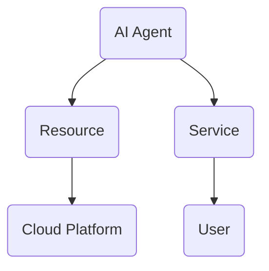
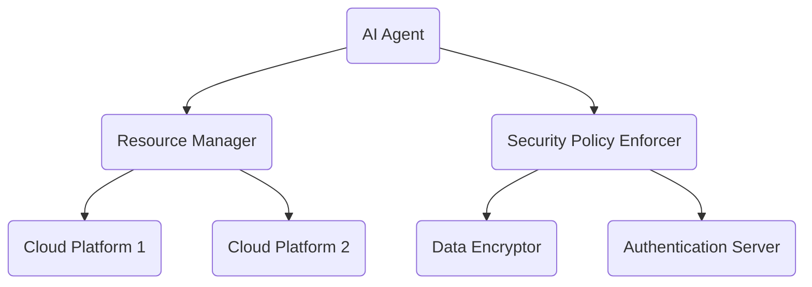
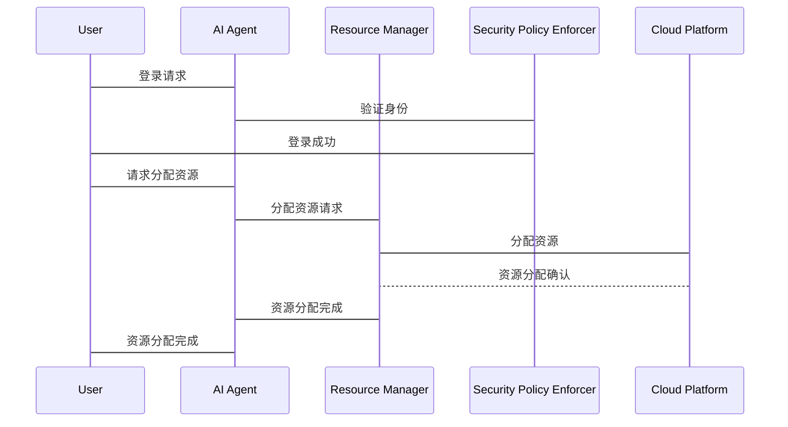

                 


# 企业AI Agent的多云环境安全策略

> 关键词：AI Agent，多云环境，安全策略，数据保护，访问控制，加密算法

> 摘要：随着企业智能化转型的推进，AI Agent在多云环境中的应用日益广泛。然而，多云环境的复杂性使得AI Agent面临诸多安全挑战。本文从AI Agent的核心概念出发，分析多云环境中的安全威胁，并提出相应的安全策略框架。通过算法原理、系统架构设计和项目实战的详细讲解，为企业的AI Agent多云安全策略提供参考。

---

## 第一部分: 企业AI Agent的多云环境安全策略概述

### 第1章: 企业AI Agent与多云环境概述

#### 1.1 企业AI Agent的基本概念

##### 1.1.1 AI Agent的定义与特点

AI Agent（人工智能代理）是一种能够感知环境、自主决策并执行任务的智能体。它具备以下特点：
- **自主性**：能够在没有外部干预的情况下独立运作。
- **反应性**：能够实时感知环境变化并做出反应。
- **目标导向性**：通过设定目标来指导行为和决策。

##### 1.1.2 企业级AI Agent的应用场景

企业级AI Agent广泛应用于以下场景：
- **智能客服**：通过自然语言处理技术为用户提供个性化服务。
- **自动化运维**：用于系统的监控、故障排查和自动修复。
- **供应链管理**：优化供应链流程，提高效率。

##### 1.1.3 多云环境的定义与特点

多云环境是指企业同时使用多个云服务提供商（如AWS、Azure、阿里云等）构建 IT 基础设施的环境。其特点包括：
- **资源弹性扩展**：可以根据需求灵活调整资源。
- **高可用性**：通过多云部署避免单点故障。
- **成本优化**：利用不同云服务提供商的价格优势降低成本。

#### 1.2 多云环境中的AI Agent部署

##### 1.2.1 多云环境的优势与挑战

多云环境的优势：
- **避免供应商锁定**：通过使用多个云服务提供商，降低对单一供应商的依赖。
- **资源优化**：可以根据业务需求选择最优的云服务。

多云环境的挑战：
- **复杂性**：多云环境的管理复杂性增加，需要协调多个云平台的资源和安全策略。
- **数据一致性**：跨云平台的数据同步和一致性管理难度较大。

##### 1.2.2 AI Agent在多云环境中的角色

AI Agent在多云环境中扮演着关键角色：
- **资源调度**：根据业务需求动态分配资源。
- **故障恢复**：在出现故障时快速切换到备用资源。
- **智能决策**：基于实时数据做出最优决策。

##### 1.2.3 多云环境下AI Agent的安全需求

在多云环境中，AI Agent的安全需求包括：
- **数据保护**：确保数据在传输和存储过程中的安全性。
- **访问控制**：严格控制对AI Agent的访问权限。
- **身份认证**：确保只有授权用户或系统可以访问AI Agent。

#### 1.3 本章小结

本章从AI Agent的基本概念出发，介绍了多云环境的定义、特点以及AI Agent在多云环境中的部署和安全需求。为后续章节的深入分析奠定了基础。

---

## 第二部分: AI Agent与多云环境的核心概念

### 第2章: AI Agent与多云环境的核心概念分析

#### 2.1 AI Agent的核心概念

##### 2.1.1 AI Agent的组成与功能

AI Agent的组成包括：
- **感知模块**：负责感知环境信息。
- **决策模块**：基于感知信息做出决策。
- **执行模块**：执行决策结果。

##### 2.1.2 企业级AI Agent的决策机制

AI Agent的决策机制包括：
- **基于规则的决策**：根据预定义的规则进行决策。
- **基于模型的决策**：利用机器学习模型进行预测和决策。

##### 2.1.3 AI Agent的通信协议

AI Agent常用的通信协议包括：
- **HTTP/HTTPS**：用于Web服务之间的通信。
- **MQTT**：用于物联网设备之间的通信。

#### 2.2 多云环境的核心概念

##### 2.2.1 多云环境的架构模型

多云环境的架构模型包括：
- **分布式架构**：数据和资源分散在多个云平台上。
- **混合架构**：结合公有云和私有云的混合部署模式。

##### 2.2.2 多云环境的资源分配策略

多云环境的资源分配策略包括：
- **负载均衡**：将流量均匀分配到多个云平台。
- **弹性伸缩**：根据负载自动调整资源。

##### 2.2.3 多云环境的安全挑战

多云环境的安全挑战包括：
- **数据隔离**：跨云平台的数据隔离和访问控制。
- **身份认证**：跨云平台的身份认证和授权。

#### 2.3 AI Agent与多云环境的交互关系

##### 2.3.1 AI Agent在多云环境中的角色模型

AI Agent在多云环境中的角色模型包括：
- **资源调度器**：负责资源的分配和调度。
- **故障恢复器**：负责故障检测和恢复。

##### 2.3.2 多云环境下AI Agent的实体关系图

以下是多云环境下AI Agent的实体关系图（使用Mermaid）：



##### 2.3.3 AI Agent与多云环境的核心概念对比表格

以下是AI Agent与多云环境的核心概念对比表格：

| 概念 | AI Agent | 多云环境 |
|------|----------|----------|
| 定义 | 人工智能代理，能够感知环境、自主决策并执行任务。 | 多个云服务提供商构建的IT基础设施环境。 |
| 功能 | 数据处理、决策、执行。 | 资源分配、负载均衡、故障恢复。 |
| 安全需求 | 数据保护、访问控制、身份认证。 | 数据隔离、身份认证、访问控制。 |

#### 2.4 本章小结

本章深入分析了AI Agent与多云环境的核心概念，包括AI Agent的组成与功能、多云环境的架构模型以及两者在多云环境中的交互关系。通过对比分析，明确了AI Agent在多云环境中的角色和安全需求。

---

## 第三部分: 多云环境下的AI Agent安全策略框架

### 第3章: 多云环境下AI Agent的安全威胁分析

#### 3.1 多云环境中的主要威胁

##### 3.1.1 数据泄露

数据泄露是多云环境中的主要威胁之一。由于数据分布在多个云平台上，如果任一云平台的安全措施不足，可能导致数据泄露。

##### 3.1.2 跨云攻击

跨云攻击是指攻击者利用多云环境中的漏洞，跨越多个云平台发起攻击。

##### 3.1.3 身份认证攻击

身份认证攻击是指攻击者通过伪造身份或窃取身份信息，非法访问AI Agent或云平台资源。

#### 3.2 多云环境下AI Agent的安全威胁来源

##### 3.2.1 云平台漏洞

云平台自身的安全漏洞可能导致AI Agent面临安全威胁。

##### 3.2.2 第三方服务攻击

第三方服务提供商可能成为攻击目标，从而影响AI Agent的安全。

##### 3.2.3 内部威胁

内部员工的恶意行为也可能对AI Agent的安全构成威胁。

#### 3.3 AI Agent在多云环境中的安全风险

##### 3.3.1 数据一致性风险

跨云平台的数据一致性管理困难，可能导致数据不一致。

##### 3.3.2 资源访问风险

AI Agent可能面临未经授权的资源访问，导致数据泄露或服务中断。

##### 3.3.3 网络攻击风险

AI Agent可能成为网络攻击的目标，导致服务中断或数据丢失。

---

## 第四部分: 多云环境下AI Agent的安全策略框架

### 第4章: 多云环境下AI Agent的安全策略框架

#### 4.1 安全策略框架的设计原则

##### 4.1.1 分层设计

安全策略框架应采用分层设计，包括数据层、应用层和网络层。

##### 4.1.2 可扩展性

安全策略框架应具备良好的可扩展性，能够适应多云环境的变化。

##### 4.1.3 可管理性

安全策略框架应具备良好的可管理性，方便企业进行安全管理和策略调整。

#### 4.2 多云环境下AI Agent的安全策略框架

##### 4.2.1 数据保护策略

数据保护策略包括：
- **数据加密**：在传输和存储过程中对数据进行加密。
- **数据备份**：定期备份数据，防止数据丢失。
- **数据隔离**：在多云环境中实现数据的逻辑隔离。

##### 4.2.2 访问控制策略

访问控制策略包括：
- **基于角色的访问控制（RBAC）**：根据用户角色分配权限。
- **最小权限原则**：确保用户只拥有完成任务所需的最小权限。
- **多因素认证（MFA）**：通过多种身份验证方式提高安全性。

##### 4.2.3 身份认证策略

身份认证策略包括：
- **单点登录（SSO）**：用户通过一次登录即可访问多个云平台。
- **联合身份认证**：通过身份 Federation 实现跨云平台的身份认证。
- **密钥管理**：对敏感信息进行加密存储和管理。

#### 4.3 本章小结

本章提出了多云环境下AI Agent的安全策略框架，包括数据保护策略、访问控制策略和身份认证策略。这些策略能够有效降低多云环境中AI Agent面临的安全风险。

---

## 第五部分: 多云环境下AI Agent的安全策略实现

### 第5章: 多云环境下AI Agent的安全策略实现

#### 5.1 数据保护策略的实现

##### 5.1.1 数据加密算法

常用的数据加密算法包括：
- **AES加密**：高级加密标准，用于对称加密。
- **RSA加密**：基于公钥密码体制的加密算法。
- **哈希函数**：如SHA-256，用于数据完整性验证。

##### 5.1.2 数据备份与恢复策略

数据备份与恢复策略包括：
- **定期备份**：每天进行数据备份。
- **增量备份**：仅备份自上次备份以来发生变化的数据。
- **灾难恢复**：制定灾难恢复计划，确保在发生重大事故时能够快速恢复数据。

##### 5.1.3 数据隔离策略

数据隔离策略包括：
- **虚拟专用网络（VPN）**：通过VPN实现数据的逻辑隔离。
- **网络分段**：将网络划分为多个子网，限制跨子网的通信。

#### 5.2 访问控制策略的实现

##### 5.2.1 基于角色的访问控制（RBAC）

基于角色的访问控制（RBAC）实现步骤：
1. **定义角色**：根据企业组织结构定义不同的角色（如管理员、普通用户）。
2. **分配权限**：为每个角色分配相应的权限。
3. **身份验证**：用户登录时需要进行身份验证。
4. **权限检查**：在用户执行操作时，检查其角色是否具备相应权限。

##### 5.2.2 最小权限原则

最小权限原则的实现步骤：
1. **分析业务需求**：明确每个用户或角色需要执行的操作。
2. **授予最小权限**：只授予完成任务所需的最小权限。
3. **定期审查**：定期审查权限分配，确保权限最小化。

##### 5.2.3 多因素认证（MFA）

多因素认证（MFA）的实现步骤：
1. **选择认证方式**：如短信验证码、OTP令牌、生物识别等。
2. **配置MFA**：在系统中配置多种认证方式。
3. **强制MFA登录**：要求用户在登录时使用至少两种认证方式。

#### 5.3 身份认证策略的实现

##### 5.3.1 单点登录（SSO）

单点登录（SSO）的实现步骤：
1. **选择SSO协议**：如OAuth 2.0、SAML等。
2. **配置SSO服务器**：部署SSO服务器并配置与各个云平台的集成。
3. **用户身份验证**：用户通过SSO服务器进行一次登录即可访问多个云平台。

##### 5.3.2 联合身份认证

联合身份认证的实现步骤：
1. **配置Federation**：使用SAML、OpenID Connect等协议实现身份 Federation。
2. **颁发令牌**：通过Federation协议颁发访问令牌。
3. **跨云平台认证**：用户使用颁发的令牌访问其他云平台。

##### 5.3.3 密钥管理策略

密钥管理策略的实现步骤：
1. **生成密钥**：使用安全的密钥生成算法生成密钥对。
2. **存储密钥**：将私钥安全地存储在加密的存储设备中。
3. **密钥分发**：通过安全的通道分发公钥。
4. **密钥轮转**：定期更换密钥以降低密钥泄露风险。

---

## 第六部分: 多云环境下AI Agent的安全策略实现

### 第6章: 多云环境下AI Agent的安全策略实现

#### 6.1 系统架构设计

##### 6.1.1 系统架构概述

多云环境下AI Agent的系统架构包括：
- **AI Agent实例**：运行在多个云平台上的AI Agent实例。
- **资源管理模块**：负责资源的分配和调度。
- **安全策略模块**：负责实施数据保护、访问控制和身份认证策略。

##### 6.1.2 系统功能设计

系统功能设计包括：
- **资源调度功能**：根据负载情况动态分配资源。
- **故障恢复功能**：检测故障并自动切换到备用资源。
- **安全策略执行功能**：实施数据保护、访问控制和身份认证策略。

##### 6.1.3 系统架构图

以下是多云环境下AI Agent的系统架构图（使用Mermaid）：



#### 6.2 接口和交互设计

##### 6.2.1 API接口设计

API接口设计包括：
- **RESTful API**：用于资源管理模块与AI Agent实例之间的通信。
- **GraphQL API**：用于复杂查询和数据操作。

##### 6.2.2 交互流程设计

交互流程设计包括：
1. **用户登录**：用户通过MFA登录系统。
2. **资源分配**：资源管理模块根据负载情况分配资源。
3. **故障恢复**：当检测到故障时，资源管理模块切换到备用资源。
4. **安全策略执行**：安全策略模块实施数据保护、访问控制和身份认证策略。

##### 6.2.3 交互序列图

以下是用户登录和资源分配的交互序列图（使用Mermaid）：



#### 6.3 本章小结

本章详细描述了多云环境下AI Agent的安全策略实现，包括系统架构设计、接口和交互设计。通过API接口和序列图的详细设计，明确了系统的实现流程和交互逻辑。

---

## 第七部分: 项目实战与最佳实践

### 第7章: 项目实战与最佳实践

#### 7.1 项目实战

##### 7.1.1 项目背景

某企业希望通过部署AI Agent优化其多云环境下的资源管理。

##### 7.1.2 项目目标

项目的主目标是实现以下功能：
- **资源动态分配**：根据负载情况动态分配资源。
- **故障自动恢复**：检测故障并自动切换到备用资源。
- **数据保护**：确保数据在传输和存储过程中的安全性。

##### 7.1.3 项目实施步骤

项目实施步骤包括：
1. **环境准备**：安装必要的开发工具和云平台 SDK。
2. **资源管理模块开发**：开发资源管理模块，实现资源的动态分配和故障恢复。
3. **安全策略模块开发**：开发安全策略模块，实现数据保护、访问控制和身份认证。
4. **系统集成与测试**：将资源管理模块和安全策略模块集成到AI Agent中，并进行系统测试。

##### 7.1.4 核心代码实现

以下是资源管理模块的核心代码示例：

```python
class ResourceManager:
    def __init__(self):
        self.cloud_platforms = []
        self.available_resources = {}

    def allocate_resource(self, resource_type, quantity):
        # 根据负载情况选择最优云平台
        for platform in self.cloud_platforms:
            if platform.has_available_resource(resource_type, quantity):
                platform.allocate(resource_type, quantity)
                self.available_resources[platform.id] = platform.get_available_resource(resource_type)
                return True
        return False

    def deallocate_resource(self, resource_type, quantity):
        for platform in self.cloud_platforms:
            if platform.has_resource(resource_type, quantity):
                platform.deallocate(resource_type, quantity)
                self.available_resources[platform.id] = platform.get_available_resource(resource_type)
                return True
        return False
```

##### 7.1.5 项目测试与优化

项目测试与优化包括：
- **功能测试**：测试资源分配和故障恢复功能。
- **性能测试**：测试系统在高负载情况下的性能表现。
- **安全测试**：测试系统的安全性，确保数据保护和访问控制策略有效。

#### 7.2 最佳实践

##### 7.2.1 安全策略实施

建议企业在实施AI Agent的多云环境安全策略时：
- **定期审查安全策略**：确保安全策略与业务需求保持一致。
- **及时更新安全补丁**：及时修复系统中的安全漏洞。
- **进行安全培训**：对员工进行安全培训，提高安全意识。

##### 7.2.2 系统监控与日志管理

建议企业在系统监控与日志管理方面：
- **实时监控系统状态**：实时监控AI Agent和云平台的运行状态。
- **日志分析**：通过日志分析发现潜在的安全威胁。
- **异常事件告警**：及时告警异常事件，减少安全风险。

##### 7.2.3 与第三方服务的集成

建议企业在与第三方服务集成时：
- **选择可信的第三方服务提供商**：确保第三方服务提供商具备良好的安全记录。
- **签订数据保护协议**：明确数据保护责任和义务。
- **定期评估第三方服务的安全性**：定期评估第三方服务的安全性，确保符合企业安全策略。

#### 7.3 本章小结

本章通过项目实战展示了多云环境下AI Agent的安全策略实现过程，并提出了最佳实践建议。这些最佳实践能够帮助企业在实际应用中更好地实施和维护多云环境下的AI Agent安全策略。

---

## 第八部分: 总结与展望

### 第8章: 总结与展望

#### 8.1 总结

本文从AI Agent的基本概念出发，分析了多云环境中的安全威胁，并提出了相应的安全策略框架。通过详细的系统架构设计和项目实战，明确了多云环境下AI Agent的安全策略实现过程。最后，本文提出了最佳实践建议，帮助企业更好地实施和维护多云环境下的AI Agent安全策略。

#### 8.2 展望

未来，随着多云环境的不断发展，AI Agent的安全策略将面临更多的挑战和机遇。建议企业在以下方面进行进一步研究和探索：
- **智能化安全策略**：通过机器学习技术实现安全策略的动态调整。
- **零信任架构**：在多云环境中实施零信任架构，进一步提高安全性。
- **边缘计算与AI Agent**：探索AI Agent在边缘计算环境中的安全策略。

---

## 作者

作者：AI天才研究院（AI Genius Institute） & 禅与计算机程序设计艺术（Zen And The Art of Computer Programming）

