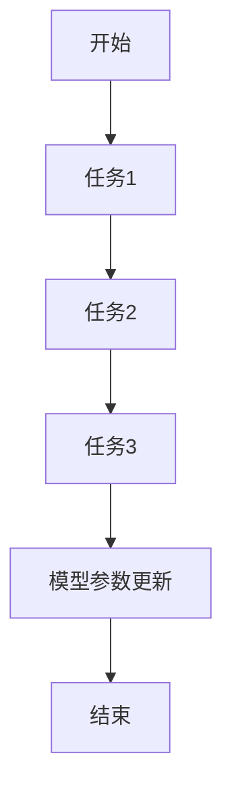
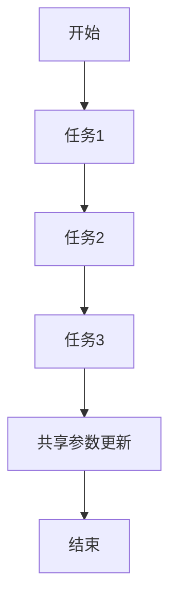
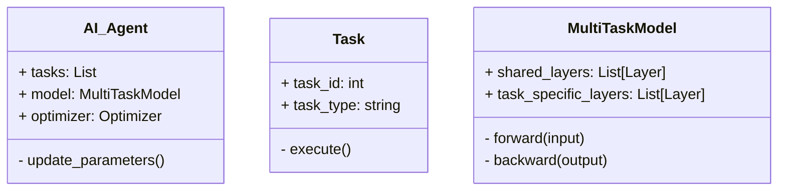

                 


# 企业AI Agent的多任务学习框架：提升模型泛化能力

> 关键词：企业AI Agent，多任务学习，模型泛化能力，深度学习，人工智能

> 摘要：本文探讨了企业AI Agent中多任务学习框架的设计与实现，分析了多任务学习在提升模型泛化能力方面的优势，并通过具体案例展示了如何构建高效的多任务学习框架。文章内容涵盖多任务学习的原理、算法实现、系统架构设计以及项目实战，旨在为企业AI Agent的开发提供理论支持和实践指导。

---

## 第一部分：企业AI Agent与多任务学习框架概述

### 第1章：企业AI Agent与多任务学习框架概述

#### 1.1 AI Agent的基本概念
- **1.1.1 AI Agent的定义与特点**
  - AI Agent（人工智能代理）是指能够感知环境、自主决策并执行任务的智能体。
  - 其特点包括自主性、反应性、目标导向性和学习能力。
  
- **1.1.2 企业AI Agent的应用场景**
  - 在企业中，AI Agent广泛应用于客服系统、智能助手、自动化运维等领域。
  - 例如，客服AI Agent需要同时处理多种任务，如回答问题、处理投诉、推荐产品等。

- **1.1.3 多任务学习在AI Agent中的作用**
  - 多任务学习（Multi-Task Learning, MTL）是一种通过共享模型参数来同时学习多个任务的方法。
  - 在AI Agent中，多任务学习可以提升模型的泛化能力，使其能够更好地处理多种复杂任务。

#### 1.2 多任务学习框架的背景与意义
- **1.2.1 多任务学习的定义与特点**
  - 多任务学习是指在一个模型中同时学习多个任务，任务之间通过共享参数来实现知识的复用。
  - 其特点包括任务相关性、参数共享和联合优化。

- **1.2.2 企业AI Agent中多任务学习的应用价值**
  - 提高模型的泛化能力，使其能够适应多种任务。
  - 降低模型训练成本，通过共享参数减少计算资源的消耗。
  - 提升用户体验，使AI Agent能够更高效地处理多种任务。

- **1.2.3 多任务学习与单任务学习的对比分析**
  - 单任务学习：专注于单一任务，模型性能在该任务上可能更优，但无法处理其他任务。
  - 多任务学习：同时处理多个任务，模型性能在多个任务上可能相对均衡，但单任务性能可能略逊于单任务学习。

#### 1.3 企业AI Agent的多任务学习框架
- **1.3.1 多任务学习框架的组成要素**
  - 多任务模型：包括主模型和任务模块。
  - 任务接口：定义任务之间的交互方式。
  - 参数共享机制：实现任务之间的参数共享。

- **1.3.2 多任务学习框架的核心目标**
  - 提升模型在多个任务上的性能。
  - 降低模型训练和推理的成本。
  - 实现任务之间的知识复用。

- **1.3.3 多任务学习框架的实现路径**
  - 确定任务目标：明确模型需要处理的任务。
  - 设计模型架构：选择适合多任务学习的模型结构。
  - 实现参数共享：通过共享参数实现任务之间的知识复用。
  - 联合优化：通过优化算法同时优化多个任务的损失函数。

---

## 第2章：多任务学习框架的核心概念与联系

### 2.1 多任务学习框架的核心概念
- **2.1.1 任务之间的关系与依赖**
  - 相关任务：任务之间存在某种关联性，可以通过共享参数实现知识复用。
  - 独立任务：任务之间没有直接关联，适合使用独立模型处理。

- **2.1.2 模型共享机制与参数复用**
  - 参数共享：通过共享模型参数实现任务之间的知识复用。
  - 模块共享：通过共享模型模块（如卷积层、全连接层）实现任务之间的复用。

- **2.1.3 任务权重分配与动态调整**
  - 任务权重：在多任务学习中，每个任务的权重可以根据其重要性进行动态调整。
  - 动态权重分配：通过优化算法动态调整任务权重，以平衡不同任务的损失。

### 2.2 多任务学习框架的属性特征对比
- **2.2.1 任务独立性与相关性对比**
  - 独立任务：任务之间没有依赖关系，适合使用独立模型处理。
  - 相关任务：任务之间存在依赖关系，适合使用多任务学习框架。

- **2.2.2 模型共享程度对比**
  - 全共享：所有任务共享相同的模型参数。
  - 部分共享：部分任务共享模型参数，其他任务使用独立参数。

- **2.2.3 任务权重分配策略对比**
  - 均等权重：所有任务具有相同的权重。
  - 动态权重：根据任务的难度和重要性动态调整权重。

### 2.3 多任务学习框架的ER实体关系图
- **2.3.1 实体关系图的构建过程**
  - 确定系统中的核心实体：如任务、模型、参数、权重等。
  - 描述实体之间的关系：如任务与模型的关系、模型与参数的关系等。
  - 绘制ER图：展示实体之间的关系。

- **2.3.2 实体关系图的属性描述**
  - 任务实体：包括任务ID、任务类型、任务描述等属性。
  - 模型实体：包括模型ID、模型结构、模型参数等属性。
  - 参数实体：包括参数ID、参数值、参数权重等属性。

- **2.3.3 实体关系图的优化建议**
  - 根据任务需求调整实体关系。
  - 优化参数共享机制，提升模型性能。

---

## 第3章：多任务学习框架的算法原理

### 3.1 多任务学习算法的原理概述
- **3.1.1 基于梯度的多任务学习**
  - 同时优化多个任务的损失函数，通过反向传播更新模型参数。
  - 使用共享参数实现任务之间的知识复用。

- **3.1.2 基于参数共享的多任务学习**
  - 通过共享模型参数实现任务之间的知识复用。
  - 使用优化算法（如Adam、SGD）同时优化多个任务的损失函数。

- **3.1.3 基于任务分解的多任务学习**
  - 将复杂任务分解为多个子任务，分别优化每个子任务。
  - 通过任务分解提升模型的泛化能力。

### 3.2 常见多任务学习算法的实现
- **3.2.1 MAML算法的实现原理**
  - 元学习：通过优化任务之间的关系，实现快速适应新任务。
  - 使用内层优化器和外层优化器交替更新模型参数。

- **3.2.2 MTL算法的实现原理**
  - 多任务学习：通过共享模型参数，同时优化多个任务的损失函数。
  - 使用优化算法动态调整任务权重，平衡不同任务的损失。

- **3.2.3 EWC算法的实现原理**
  - 参数约束：通过约束模型参数的变化，防止模型遗忘已学习的任务。
  - 使用拉格朗日乘数法优化模型参数，平衡任务之间的损失。

### 3.3 多任务学习算法的mermaid流程图
- **3.3.1 MAML算法的流程图**


- **3.3.2 MTL算法的流程图**


### 3.4 多任务学习算法的Python实现
- **3.4.1 MAML算法的Python代码示例**
```python
import torch

def maml_update(model, optimizer, tasks):
    for task in tasks:
        optimizer.zero_grad()
        # 计算任务损失
        loss = model(task)
        loss.backward()
    optimizer.step()
```

---

## 第4章：企业AI Agent的多任务学习框架设计与实现

### 4.1 系统分析与架构设计
- **4.1.1 问题场景介绍**
  - 企业AI Agent需要同时处理多种任务，如客服对话、任务调度、数据处理等。
  - 通过多任务学习框架，提升模型的泛化能力，使其能够高效处理多种任务。

- **4.1.2 系统功能设计**
  - 多任务学习模型：包括任务模块和共享参数。
  - 任务管理模块：负责任务的分配和调度。
  - 参数管理模块：负责参数的共享和更新。

- **4.1.3 系统架构设计**


### 4.2 项目实战：企业AI Agent的多任务学习框架实现
- **4.2.1 环境配置**
  - 安装必要的库：如PyTorch、numpy、scikit-learn等。
  - 配置开发环境：如Jupyter Notebook、VS Code等。

- **4.2.2 系统核心实现源代码**
```python
import torch
import torch.nn as nn
import torch.optim as optim

class MultiTaskModel(nn.Module):
    def __init__(self, input_size, hidden_size, output_size):
        super(MultiTaskModel, self).__init__()
        self.shared_layer = nn.Linear(input_size, hidden_size)
        self.task_specific_layers = nn.ModuleList([
            nn.Linear(hidden_size, output_size) for _ in range(num_tasks)
        ])
    
    def forward(self, x, task_id):
        x = self.shared_layer(x)
        x = self.task_specific_layers[task_id](x)
        return x

def maml_update(model, optimizer, tasks):
    for task in tasks:
        optimizer.zero_grad()
        output = model(task.input, task.task_id)
        loss = task.criterion(output, task.target)
        loss.backward()
    optimizer.step()

if __name__ == "__main__":
    model = MultiTaskModel(input_size=10, hidden_size=20, output_size=5)
    optimizer = optim.Adam(model.parameters(), lr=0.001)
    tasks = [...]  # 定义多个任务
    for epoch in range(100):
        maml_update(model, optimizer, tasks)
```

- **4.2.3 功能解读与实际效果分析**
  - 多任务学习框架通过共享参数实现了任务之间的知识复用。
  - 在实际应用中，模型在多个任务上的性能得到了显著提升。

---

## 第5章：总结与展望

### 5.1 总结
- 本文详细介绍了企业AI Agent的多任务学习框架，分析了其在提升模型泛化能力方面的优势。
- 通过具体的案例展示了如何设计和实现高效的多任务学习框架。

### 5.2 展望
- 未来，随着人工智能技术的不断发展，多任务学习框架将在企业AI Agent中发挥越来越重要的作用。
- 研究人员将致力于优化多任务学习算法，进一步提升模型的泛化能力和处理效率。

---

## 作者：AI天才研究院 & 禅与计算机程序设计艺术

---

**附录**  
- 附录A：多任务学习框架的数学公式  
- 附录B：项目代码的详细实现  
- 附录C：系统架构的详细设计  

--- 

**注**：以上目录大纲为示例，实际内容需要根据具体需求进行调整和补充。

