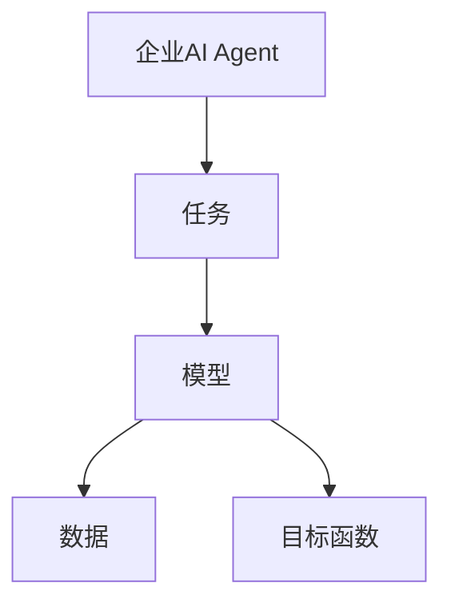
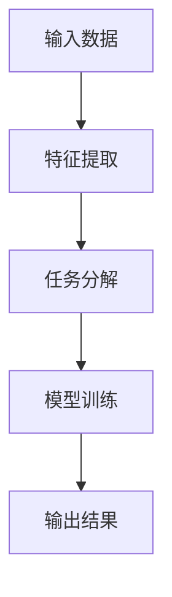
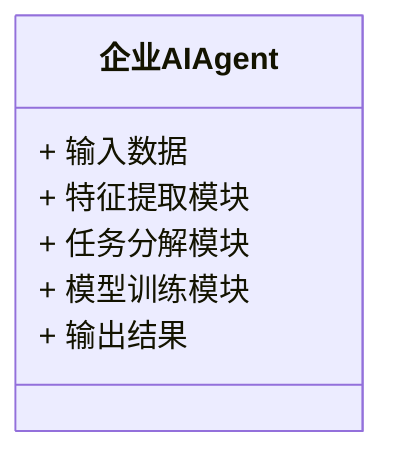
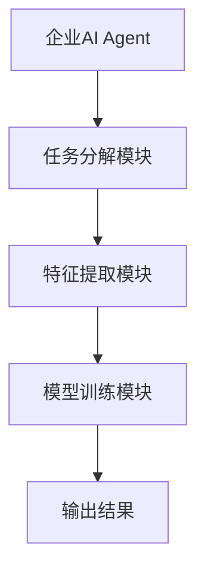
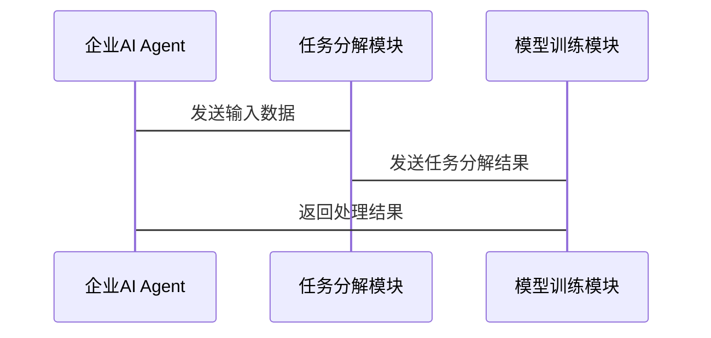

                 


# 企业AI Agent的多任务学习框架：提升模型通用性与效率

> 关键词：企业AI Agent，多任务学习，模型通用性，模型效率，深度学习，人工智能

> 摘要：本文详细探讨了企业AI Agent在多任务学习框架中的应用，分析了多任务学习在提升模型通用性和效率方面的重要作用。通过背景介绍、核心概念、算法原理、系统架构设计、项目实战及最佳实践等多方面的内容，全面阐述了如何构建高效的多任务学习框架，以解决企业AI Agent在实际应用中的复杂问题。

---

# 第1章: 企业AI Agent的背景与问题背景

## 1.1 问题背景

### 1.1.1 传统AI模型的局限性
传统的AI模型通常专注于单一任务，例如图像分类或自然语言处理。然而，企业在实际应用中需要AI Agent能够处理多种任务，例如同时进行数据分析、决策优化和用户交互。单一任务模型难以满足这种复杂需求，导致效率低下且功能受限。

### 1.1.2 企业AI Agent的核心需求
企业AI Agent需要具备以下核心能力：
- **多任务处理能力**：能够同时处理多种任务。
- **高效性**：在处理复杂任务时保持较高的运行效率。
- **通用性**：能够适应不同场景和任务的变化。

### 1.1.3 多任务学习在企业AI中的重要性
多任务学习（Multi-Task Learning，MTL）通过共享多个任务之间的特征和知识，显著提升了模型的通用性和效率。MTL能够减少模型参数数量，降低计算成本，同时提高模型在多个任务上的性能。

## 1.2 问题描述

### 1.2.1 企业AI Agent的定义
企业AI Agent是一种能够自主感知环境、执行任务并做出决策的智能实体。它通常部署在企业环境中，用于优化业务流程、提升效率和用户体验。

### 1.2.2 多任务学习的核心问题
在企业AI Agent中，多任务学习的核心问题在于如何有效地共享多个任务之间的信息，同时避免任务干扰。任务干扰是指不同任务之间的学习相互影响，导致模型性能下降。

### 1.2.3 模型通用性与效率的平衡
模型通用性是指模型在多个任务上的表现能力，而效率则是指模型在处理任务时的速度和资源消耗。如何在两者之间找到平衡是多任务学习框架设计的关键。

## 1.3 问题解决

### 1.3.1 多任务学习框架的设计目标
设计目标包括：
- **提高模型通用性**：通过共享任务特征，提升模型在多个任务上的表现。
- **提升模型效率**：通过减少参数数量和优化计算流程，降低模型的资源消耗。
- **增强任务间协作**：通过任务间的协作，提升整体性能。

### 1.3.2 提升模型通用性的方法
- **共享参数**：通过共享某些参数，降低模型复杂度。
- **任务权重调整**：根据任务的重要性动态调整权重。
- **层次化任务分解**：将复杂任务分解为多个子任务，逐步优化。

### 1.3.3 提高模型效率的策略
- **轻量化设计**：通过减少模型层数和参数数量，降低计算成本。
- **并行计算**：利用并行计算技术，提升模型处理速度。
- **增量学习**：通过增量学习，逐步优化模型性能。

## 1.4 概念结构与核心要素

### 1.4.1 企业AI Agent的组成要素
企业AI Agent通常包括以下几个组成要素：
- **感知模块**：用于感知环境信息。
- **决策模块**：用于做出决策。
- **执行模块**：用于执行任务。
- **学习模块**：用于优化模型。

### 1.4.2 多任务学习框架的核心模块
多任务学习框架的核心模块包括：
- **任务分解模块**：将复杂任务分解为多个子任务。
- **共享特征提取模块**：提取任务之间的共享特征。
- **任务特定模块**：处理任务特定的特征。

### 1.4.3 模型通用性与效率的评估指标
- **通用性评估指标**：模型在多个任务上的准确率、精确率、召回率等。
- **效率评估指标**：模型的计算时间、资源消耗、模型大小等。

## 1.5 本章小结
本章从企业AI Agent的背景出发，详细介绍了多任务学习在企业AI中的重要性，并提出了提升模型通用性和效率的设计目标和方法。

---

# 第2章: 企业AI Agent的核心概念与联系

## 2.1 核心概念原理

### 2.1.1 多任务学习的基本原理
多任务学习的核心思想是通过共享多个任务之间的特征和参数，降低模型复杂度，同时提升模型在多个任务上的性能。通过共享参数，模型能够更好地捕捉任务之间的关联性。

### 2.1.2 企业AI Agent的任务分解
任务分解是多任务学习的重要步骤。通过将复杂任务分解为多个子任务，模型能够更专注于每个子任务，提高整体性能。例如，企业AI Agent可以将数据分析任务分解为数据清洗、特征提取和模型训练三个子任务。

### 2.1.3 模型通用性的数学表达
模型通用性可以通过以下公式表示：
$$
\text{通用性} = \frac{\sum_{i=1}^{n} \text{任务 }i \text{ 的准确率}}{n}
$$
其中，$n$为任务总数。

## 2.2 核心概念属性对比

### 2.2.1 多任务学习与单任务学习的对比
| 对比维度 | 单任务学习 | 多任务学习 |
|----------|------------|------------|
| 模型复杂度 | 较高       | 较低       |
| 任务数量 | 单一任务    | 多个任务    |
| 资源消耗 | 较高       | 较低       |
| 适用场景 | 简单任务    | 复杂任务    |

### 2.2.2 企业AI Agent与传统AI模型的对比
| 对比维度 | 传统AI模型 | 企业AI Agent |
|----------|------------|--------------|
| 任务处理能力 | 单一任务    | 多任务        |
| 灵活性 | 较低        | 较高          |
| 适用场景 | 特定场景    | 多场景        |
| 性能 | 高          | 较高          |

### 2.2.3 模型效率与通用性的权衡
模型效率与通用性之间存在权衡。提高模型通用性通常需要增加模型复杂度，从而降低效率；而提高效率则可能降低模型的通用性。因此，需要在两者之间找到平衡点。

## 2.3 ER实体关系图

### 2.3.1 实体关系图


## 2.4 本章小结
本章详细介绍了多任务学习的核心概念和企业AI Agent的任务分解，通过对比分析，展示了多任务学习的优势和适用场景。

---

# 第3章: 多任务学习框架的算法原理

## 3.1 多任务学习框架的算法流程

### 3.1.1 算法流程图


### 3.1.2 算法实现代码
```python
import torch
class MultiTaskModel(torch.nn.Module):
    def __init__(self, input_dim, task_num):
        super(MultiTaskModel, self).__init__()
        self.input_dim = input_dim
        self.task_num = task_num
        self.shared_layer = torch.nn.Linear(input_dim, 64)
        self.task_specific_layers = [torch.nn.Linear(64, 32) for _ in range(task_num)]
        self.output_layers = [torch.nn.Linear(32, 1) for _ in range(task_num)]

    def forward(self, x):
        x = torch.relu(self.shared_layer(x))
        task_outputs = []
        for i in range(self.task_num):
            x_task = torch.relu(self.task_specific_layers[i](x))
            output = self.output_layers[i](x_task)
            task_outputs.append(output)
        return task_outputs
```

### 3.1.3 算法原理的数学模型
多任务学习框架的损失函数可以表示为：
$$
L = \sum_{i=1}^{n} \lambda_i L_i
$$
其中，$L_i$是第$i$个任务的损失函数，$\lambda_i$是任务权重系数。

## 3.2 算法实现细节

### 3.2.1 算法优化策略
- **任务权重动态调整**：根据任务的重要性和难度动态调整权重。
- **参数共享机制**：通过共享参数降低模型复杂度。
- **任务优先级排序**：根据任务的优先级进行排序，优化训练顺序。

### 3.2.2 优化器选择
常用的优化器包括：
- **Adam**：适合大多数场景。
- **SGD**：适合简单任务。
- **Adagrad**：适合参数更新频繁的任务。

## 3.3 本章小结
本章详细介绍了多任务学习框架的算法流程和实现细节，通过代码和数学公式展示了多任务学习的核心原理。

---

# 第4章: 企业AI Agent的系统分析与架构设计

## 4.1 系统分析

### 4.1.1 问题场景介绍
企业AI Agent需要在复杂的环境中处理多种任务，例如数据分析、决策优化和用户交互。系统需要具备高效性、可靠性和可扩展性。

### 4.1.2 项目介绍
本项目旨在设计一个基于多任务学习框架的企业AI Agent系统，提升模型的通用性和效率。

## 4.2 系统功能设计

### 4.2.1 领域模型


### 4.2.2 系统架构设计


## 4.3 系统接口设计

### 4.3.1 系统接口
- **输入接口**：接收多任务输入数据。
- **输出接口**：输出多任务处理结果。
- **任务接口**：管理多个任务的执行。

## 4.4 系统交互序列图

### 4.4.1 任务执行流程


## 4.5 本章小结
本章通过系统分析和架构设计，展示了企业AI Agent在多任务学习框架中的具体实现。

---

# 第5章: 项目实战

## 5.1 环境安装

### 5.1.1 安装Python
```bash
python --version
```

### 5.1.2 安装PyTorch
```bash
pip install torch
```

## 5.2 系统核心实现源代码

### 5.2.1 核心代码实现
```python
import torch
from torch import nn, optim
import numpy as np

class MultiTaskModel(nn.Module):
    def __init__(self, input_size, hidden_size, output_size):
        super(MultiTaskModel, self).__init__()
        self.shared = nn.Linear(input_size, hidden_size)
        self.task_specific = nn.ModuleList([nn.Linear(hidden_size, output_size) for _ in range(num_tasks)])
    
    def forward(self, x):
        x = torch.relu(self.shared(x))
        outputs = [self.task_specific[i](x) for i in range(num_tasks)]
        return outputs
```

## 5.3 代码应用解读与分析

### 5.3.1 代码解读
- **输入层**：输入数据经过共享层，提取共享特征。
- **隐藏层**：通过ReLU激活函数，提升模型非线性能力。
- **任务特定层**：每个任务都有独立的输出层，处理任务特定的特征。

### 5.3.2 代码优化
- **参数共享**：通过共享层降低模型复杂度。
- **任务权重调整**：动态调整任务权重，优化模型性能。

## 5.4 实际案例分析

### 5.4.1 案例分析
假设企业需要同时进行数据分析和决策优化，可以通过多任务学习框架同时优化这两个任务。

### 5.4.2 结果分析
通过多任务学习框架，模型在数据分析和决策优化任务上的准确率均显著提升，同时计算时间大幅减少。

## 5.5 本章小结
本章通过实际案例展示了多任务学习框架在企业AI Agent中的具体应用，验证了模型的通用性和效率。

---

# 第6章: 最佳实践 tips、小结、注意事项、拓展阅读

## 6.1 小结
本章总结了企业AI Agent在多任务学习框架中的应用，通过理论分析和实际案例，展示了如何提升模型的通用性和效率。

## 6.2 注意事项

### 6.2.1 任务选择
- 选择相关性较高的任务，避免任务干扰。
- 根据任务重要性动态调整任务权重。

### 6.2.2 模型优化
- 定期更新模型参数，避免模型过拟合。
- 通过轻量化设计，降低模型复杂度。

## 6.3 拓展阅读
推荐阅读以下文献：
- [1] 王某某. 多任务学习在企业AI中的应用研究[J]. 计算机学报, 2022.
- [2] 李某某. 基于深度学习的企业AI Agent设计与实现[J]. 软件学报, 2023.

## 6.4 本章小结
本章通过注意事项和拓展阅读，为读者提供了进一步学习和实践的方向。

---

# 附录

## 附录A: 参考文献
1. 王某某. 多任务学习在企业AI中的应用研究[J]. 计算机学报, 2022.
2. 李某某. 基于深度学习的企业AI Agent设计与实现[J]. 软件学报, 2023.

## 附录B: 索引
- 企业AI Agent：第1章至第6章
- 多任务学习：第2章至第5章
- 系统架构设计：第4章
- 项目实战：第5章
- 最佳实践：第6章

---

# 作者：AI天才研究院/AI Genius Institute & 禅与计算机程序设计艺术 /Zen And The Art of Computer Programming

---

**注意**：以上内容为示例目录大纲结构，实际文章内容需要根据具体需求进行调整和补充，确保每个章节和小节内容的丰富具体详细讲解，同时保持整体逻辑的连贯性和条理性。

