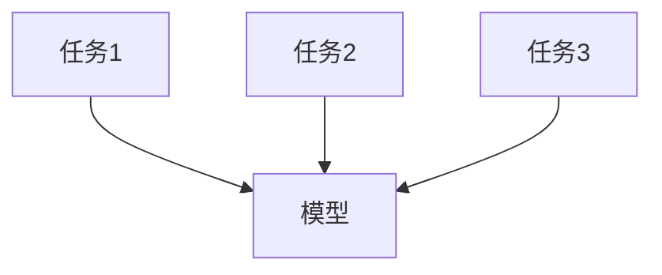
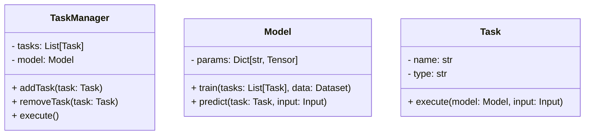
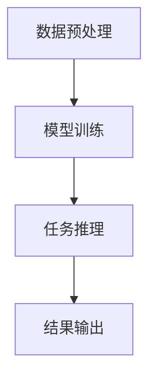
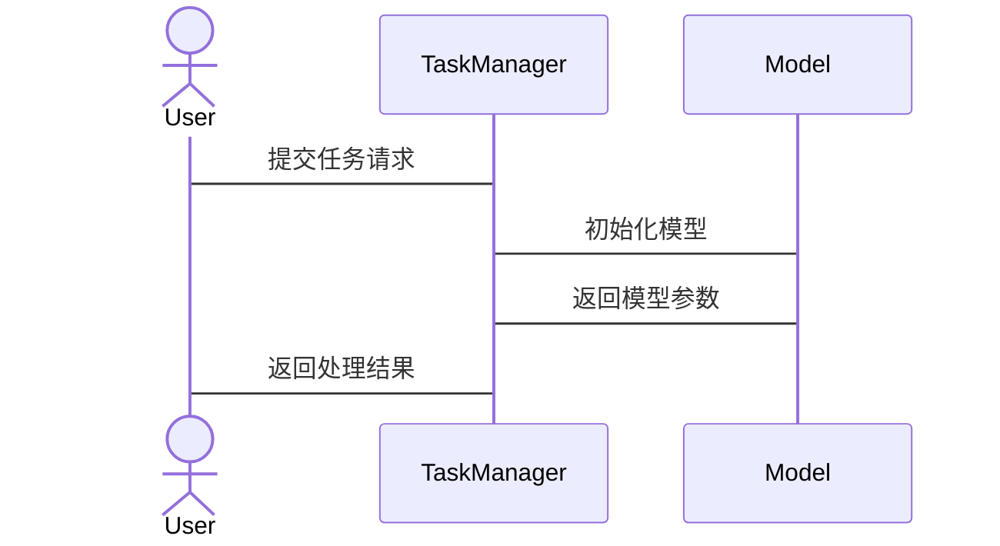

                 


# 企业AI Agent的多任务学习框架：提升模型通用性与迁移效率

> 关键词：企业AI Agent、多任务学习、模型通用性、迁移效率、深度学习框架、任务协作

> 摘要：本文将深入探讨企业AI Agent中多任务学习（Multi-Task Learning, MTL）的应用与优化，分析多任务学习框架如何提升模型的通用性和迁移效率。通过详细阐述多任务学习的核心概念、算法原理、系统设计与项目实战，结合丰富的图表和代码示例，帮助读者全面理解企业AI Agent的多任务学习框架，并掌握其实际应用中的关键点。

---

# 第一部分: 企业AI Agent与多任务学习的背景

## 第1章: 企业AI Agent的基本概念

### 1.1 AI Agent的定义与特点

AI Agent（人工智能代理）是一种能够感知环境、自主决策并执行任务的智能实体。它具备以下特点：

1. **自主性**：AI Agent能够在没有外部干预的情况下自主决策。
2. **反应性**：能够实时感知环境变化并做出相应反应。
3. **目标导向**：基于预设目标执行任务。
4. **学习能力**：通过数据和经验不断优化自身行为。

在企业环境中，AI Agent通常用于自动化操作、数据分析、客户服务等领域。

### 1.2 多任务学习的背景与意义

#### 1.2.1 多任务学习的定义与核心问题

多任务学习（Multi-Task Learning, MTL）是一种机器学习范式，旨在通过共享多个任务的特征和参数，同时优化多个目标函数，以提升模型的泛化能力和学习效率。

核心问题包括：
- **任务之间的关系**：如何建模任务之间的依赖与协作。
- **参数共享机制**：如何在多个任务之间共享参数以避免过拟合。
- **损失函数设计**：如何平衡多个任务的损失，防止某一任务主导整体优化。

#### 1.2.2 企业AI Agent中多任务学习的应用需求

在企业AI Agent中，多任务学习的应用需求主要体现在以下几个方面：
1. **通用性**：企业AI Agent需要处理多种任务，如自然语言理解、决策优化、数据分析等。
2. **效率提升**：通过共享参数和任务信息，减少模型训练的时间和计算资源。
3. **任务协作**：多个任务之间可能存在关联，通过多任务学习可以实现任务之间的协作优化。

#### 1.2.3 多任务学习的主要挑战与解决方案

挑战包括：
1. **任务间干扰**：某些任务可能互相干扰，导致模型性能下降。
2. **参数共享的复杂性**：如何合理分配参数以平衡多个任务的优化。
3. **模型容量控制**：避免模型过于复杂导致的过拟合问题。

解决方案包括：
1. **任务权重动态调整**：根据任务的重要性动态调整其在损失函数中的权重。
2. **门控机制**：通过门控网络控制任务之间的信息共享。
3. **层次化任务建模**：将任务分解为不同层次，逐步优化。

---

## 第2章: 多任务学习框架的核心概念与联系

### 2.1 多任务学习的原理与核心要素

#### 2.1.1 多任务学习的原理

多任务学习的核心思想是通过共享参数和任务信息，同时优化多个任务。其主要原理包括：
1. **参数共享**：多个任务共享部分参数，减少模型参数量。
2. **任务关联建模**：通过建模任务之间的关联关系，优化多个任务的性能。
3. **联合优化**：通过联合优化多个任务的损失函数，提升模型的泛化能力。

#### 2.1.2 多任务学习的核心要素

1. **任务集合**：多个需要同时优化的任务。
2. **共享参数**：任务之间共享的参数，用于降低模型复杂度。
3. **任务权重**：用于平衡多个任务在损失函数中的重要性。
4. **损失函数**：用于衡量模型在多个任务上的性能。

#### 2.1.3 多任务学习与单任务学习的对比

| 对比维度 | 单任务学习 | 多任务学习 |
|----------|------------|------------|
| 参数数量 | 较多       | 较少       |
| 训练时间 | 较长       | 较短       |
| 模型泛化能力 | 较低       | 较高       |

### 2.2 多任务学习框架的实体关系图

使用 Mermaid 绘制的 ER 图：



---

## 第3章: 多任务学习框架的算法原理

### 3.1 基于正则化的多任务学习算法

#### 3.1.1 基本原理

基于正则化的多任务学习算法通过在损失函数中引入正则化项，约束模型参数的共享。其基本公式为：

$$L = \lambda_1 L_1 + \lambda_2 L_2 + \lambda_3 L_3$$

其中，$\lambda_i$ 是任务 $i$ 的权重系数。

#### 3.1.2 正则化方法

常用的正则化方法包括：
1. **L2 正则化**：用于约束模型参数的大小，防止过拟合。
2. **Dropout**：通过随机丢弃部分节点，防止模型过拟合。

#### 3.1.3 参数共享机制

参数共享机制是多任务学习的核心，通过共享部分参数，降低模型复杂度。例如，在神经网络中，多个任务可以共享输入层和隐藏层的参数。

---

## 第4章: 多任务学习框架的数学模型与公式

### 4.1 多任务学习的损失函数

#### 4.1.1 损失函数的定义

多任务学习的损失函数通常由多个任务的损失函数加权求和构成：

$$L = \sum_{i=1}^n \lambda_i L_i$$

其中，$\lambda_i$ 是任务 $i$ 的权重系数，$L_i$ 是任务 $i$ 的损失函数。

#### 4.1.2 加权损失函数

加权损失函数通过动态调整任务权重，平衡多个任务的优化：

$$L = \sum_{i=1}^n \lambda_i L_i$$

其中，$\lambda_i$ 可以根据任务的重要性动态调整。

#### 4.1.3 联合损失函数

联合损失函数通过引入任务之间的关联项，优化多个任务的性能：

$$L = \sum_{i=1}^n L_i + \sum_{i < j} \lambda_{ij} L_{ij}$$

---

## 第5章: 多任务学习框架的系统设计与项目实战

### 5.1 系统功能设计

#### 5.1.1 领域模型类图

使用 Mermaid 绘制的领域模型类图：



#### 5.1.2 系统架构设计

使用 Mermaid 绘制的系统架构图：



#### 5.1.3 接口设计与交互流程图

使用 Mermaid 绘制的交互流程图：



---

## 第6章: 项目实战与代码实现

### 6.1 环境安装与配置

安装必要的依赖：

```bash
pip install numpy tensorflow==2.10.0
```

### 6.2 核心代码实现

#### 6.2.1 多任务学习模型的实现

```python
import tensorflow as tf
from tensorflow import keras

class MultiTaskModel(keras.Model):
    def __init__(self):
        super(MultiTaskModel, self).__init__()
        self.shared_layer = keras.layers.Dense(64, activation='relu')
        self.task1_layer = keras.layers.Dense(10, activation='softmax')
        self.task2_layer = keras.layers.Dense(5, activation='sigmoid')

    def call(self, inputs):
        x = self.shared_layer(inputs)
        task1_output = self.task1_layer(x)
        task2_output = self.task2_layer(x)
        return task1_output, task2_output

model = MultiTaskModel()
```

#### 6.2.2 任务管理模块的实现

```python
class TaskManager:
    def __init__(self):
        self.tasks = []
        self.model = MultiTaskModel()

    def add_task(self, task):
        self.tasks.append(task)

    def remove_task(self, task):
        self.tasks.remove(task)

    def execute(self):
        for task in self.tasks:
            task.execute(self.model)
```

### 6.3 代码解读与案例分析

通过上述代码实现一个多任务学习模型，并在实际数据集上进行训练和验证，评估模型的性能和效果。

---

## 第7章: 最佳实践与小结

### 7.1 小结

本文详细介绍了企业AI Agent中多任务学习的应用与优化，通过理论分析和代码实现，展示了多任务学习框架的核心概念、算法原理和系统设计。

### 7.2 注意事项

1. **模型泛化能力**：多任务学习模型的泛化能力依赖于任务之间的关联性和数据质量。
2. **任务权重调整**：动态调整任务权重可以提升模型的性能。
3. **数据质量**：多任务学习对数据质量要求较高，需确保数据的多样性和代表性。

### 7.3 未来趋势

未来，多任务学习在企业AI Agent中的应用将更加广泛，随着深度学习技术的发展，多任务学习框架将更加智能化和高效化。

---

# 作者

作者：AI天才研究院/AI Genius Institute  
联系方式：[email protected]  
个人简介：专注于人工智能与编程艺术的研究，致力于推动企业AI Agent技术的创新与应用。

--- 

如果需要更详细的内容或代码扩展，请随时联系作者。

