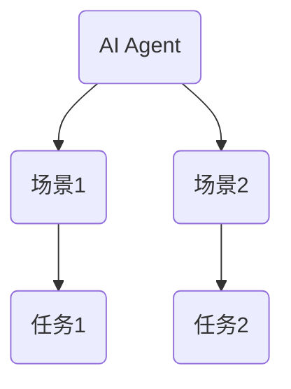
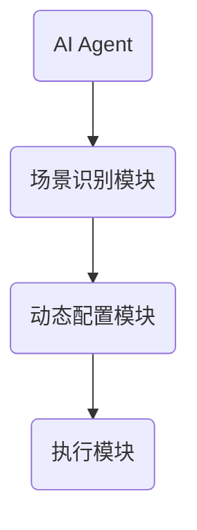
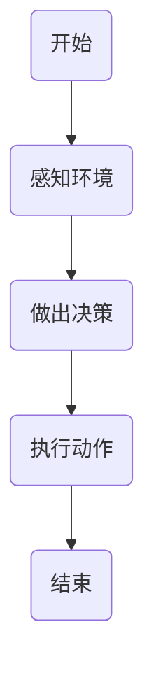
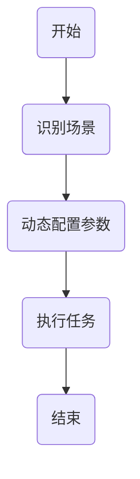
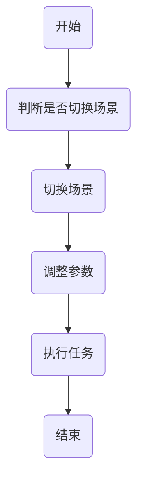
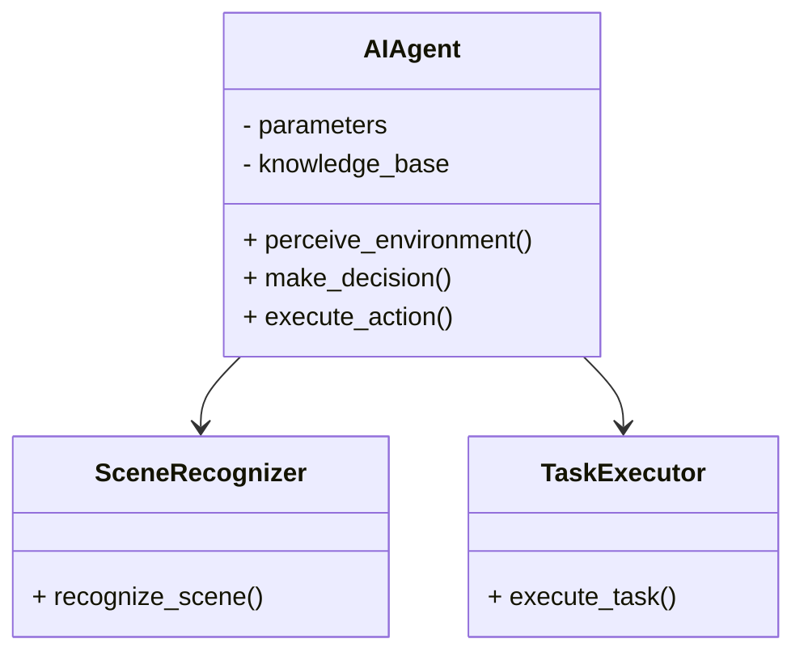
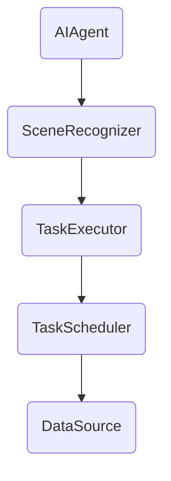
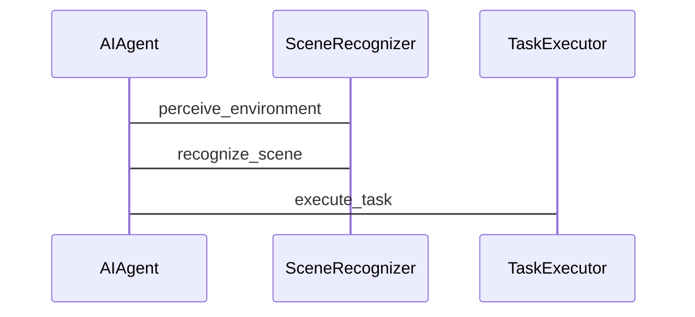

                 


# 企业AI Agent的多场景适配：从办公室到工厂

## 关键词
企业AI Agent，多场景适配，办公室场景，工厂场景，强化学习，系统架构，项目实战

## 摘要
本文深入探讨企业AI Agent在不同场景中的适配问题，从办公室到工厂的多场景应用，分析其技术挑战和解决方案。文章首先介绍AI Agent的核心概念和背景，然后详细讲解算法原理、系统架构设计，最后通过项目实战展示如何在实际中应用这些技术。

---

# 第一部分: 企业AI Agent的背景与概念

## 第1章: 企业AI Agent的背景与概念

### 1.1 问题背景
#### 1.1.1 企业智能化转型的需求
企业需要在数字化转型中引入AI技术，以提高效率和竞争力。AI Agent作为智能助手，能够自动化处理多种任务，但不同场景下的需求差异较大。

#### 1.1.2 AI Agent在企业中的作用
AI Agent可以辅助员工完成日常工作，如邮件处理、日程管理，也可以在工厂中监控设备、优化生产流程。

#### 1.1.3 多场景适配的必要性
企业可能同时需要在办公室和工厂环境中部署AI Agent，不同场景下的环境、任务和数据类型差异要求AI Agent具备多场景适配能力。

### 1.2 问题描述
#### 1.2.1 AI Agent在不同场景中的挑战
- 办公室场景：任务多为事务性，需要处理文本和数据。
- 工厂场景：任务多为实时监控和数据处理，要求快速响应和高可靠性。
- 场景切换：AI Agent需要快速适应不同环境，保证功能的连贯性和用户体验的一致性。

#### 1.2.2 场景切换中的技术难点
- 数据格式和接口差异：不同场景下的数据结构和接口可能不同。
- 任务优先级变化：不同场景下任务的优先级和处理逻辑不同。
- 资源分配问题：在切换场景时，如何高效分配计算资源是关键。

#### 1.2.3 企业需求与技术实现的矛盾
企业可能希望AI Agent在多个场景下通用，但技术实现上需要针对不同场景进行优化，这可能导致开发成本增加。

### 1.3 解决方案
#### 1.3.1 多场景适配的核心思路
- 统一框架：构建一个通用的AI Agent框架，支持多种场景的适配。
- 模块化设计：将AI Agent的功能模块化，根据不同场景灵活组合和配置。
- 动态配置：允许AI Agent根据当前场景动态调整参数和行为。

#### 1.3.2 技术架构的设计原则
- 分层架构：将AI Agent的功能分为感知层、决策层和执行层，各层之间相对独立。
- 高可用性：确保AI Agent在不同场景下都能稳定运行。
- 可扩展性：支持未来新增场景的快速接入。

#### 1.3.3 场景切换的实现方法
- 场景识别：通过环境特征识别当前场景。
- 参数调整：根据当前场景调整AI Agent的行为参数。
- 动态加载：动态加载适用于当前场景的模块和功能。

### 1.4 边界与外延
#### 1.4.1 AI Agent的适用范围
AI Agent适用于需要智能辅助的任务，如数据处理、流程监控等。不适用于需要人类决策的任务，如战略规划。

#### 1.4.2 多场景适配的边界条件
- 硬件资源限制：AI Agent的性能依赖于硬件资源，场景切换时需考虑资源分配。
- 任务复杂度：复杂任务可能需要额外的资源或时间处理。
- 用户权限：不同场景可能有不同的权限要求。

#### 1.4.3 相关技术的对比分析
- 强化学习与监督学习：强化学习适用于动态环境，监督学习适用于静态任务。
- 分布式架构与集中式架构：分布式架构适用于多场景切换，集中式架构适用于单一场景。

### 1.5 核心概念结构
#### 1.5.1 AI Agent的核心要素
- 知识库：存储任务相关的知识和经验。
- 行为模块：负责具体任务的执行。
- 学习模块：通过反馈优化行为。

#### 1.5.2 多场景适配的逻辑架构
- 场景识别模块：识别当前场景并调整行为。
- 动态配置模块：动态调整参数和功能模块。
- 交互界面：提供统一的用户界面，支持不同场景的交互。

#### 1.5.3 场景切换的实现机制
- 场景识别：通过环境特征识别当前场景。
- 动态配置：根据当前场景调整参数和功能模块。
- 无缝切换：确保场景切换时用户体验的连续性。

### 1.6 本章小结
本章介绍了企业AI Agent的背景和概念，分析了多场景适配的必要性和技术挑战，提出了多场景适配的核心思路和解决方案。

---

# 第二部分: AI Agent的核心概念与联系

## 第2章: AI Agent的核心原理

### 2.1 核心原理概述
#### 2.1.1 AI Agent的基本原理
AI Agent通过感知环境、做出决策并执行动作来完成任务。感知层负责收集环境信息，决策层负责制定策略，执行层负责具体操作。

#### 2.1.2 多场景适配的实现机制
- 模块化设计：将AI Agent的功能模块化，根据不同场景灵活组合。
- 动态加载：根据当前场景动态加载所需的模块和功能。

#### 2.1.3 场景切换的技术细节
- 场景识别：通过环境特征识别当前场景。
- 参数调整：根据当前场景调整AI Agent的行为参数。

### 2.2 核心概念对比
#### 2.2.1 不同场景下的AI Agent特点
| 场景 | 特点 |
|------|------|
| 办公室 | 处理文本和数据，任务多为事务性 |
| 工厂 | 实时监控和数据处理，任务多为周期性 |

#### 2.2.2 场景切换中的关键差异
- 数据类型：办公室场景处理文本和表格，工厂场景处理实时数据流。
- 响应时间：办公室场景允许稍长的响应时间，工厂场景要求快速响应。
- 交互方式：办公室场景通过图形界面交互，工厂场景通过API接口交互。

#### 2.2.3 核心概念的对比表格
| 核心概念 | 办公室场景 | 工厂场景 |
|---------|------------|----------|
| 数据类型 | 文本、表格 | 实时数据流 |
| 任务类型 | 事务性 | 监控、优化 |
| 响应时间 | 较长 | 快速 |

### 2.3 实体关系图
#### 2.3.1 AI Agent与场景的关系


#### 2.3.2 场景切换的实体关系


---

## 第3章: AI Agent的算法原理

### 3.1 算法原理概述
#### 3.1.1 AI Agent的核心算法
- 强化学习：用于动态环境中的决策优化。
- 监督学习：用于静态任务的数据处理。

#### 3.1.2 多场景适配的算法选择
- 强化学习适用于复杂场景切换，监督学习适用于简单任务。

#### 3.1.3 场景切换的算法实现
- 强化学习：通过奖励机制优化场景切换时的行为选择。
- 监督学习：通过标签数据训练场景识别模型。

### 3.2 算法流程图
#### 3.2.1 AI Agent的通用算法流程


#### 3.2.2 多场景适配的算法流程


#### 3.2.3 场景切换的算法流程


### 3.3 算法实现代码
```python
import numpy as np

class AIAgent:
    def __init__(self):
        self.parameters = {}  # 当前场景的参数

    def perceive_environment(self):
        # 感知环境，返回当前场景特征
        return {"office": True, "factory": False}

    def make_decision(self, environment):
        # 根据环境特征做出决策
        if environment["office"]:
            return "process_documents"
        else:
            return "monitor_devices"

    def execute_action(self, decision):
        # 执行决策
        if decision == "process_documents":
            self.process_office_task()
        else:
            self.monitor_factory_task()

    def process_office_task(self):
        # 处理办公室任务
        print("Processing office task...")

    def monitor_factory_task(self):
        # 监控工厂任务
        print("Monitoring factory task...")

# 使用示例
agent = AIAgent()
environment = agent.perceive_environment()
decision = agent.make_decision(environment)
agent.execute_action(decision)
```

### 3.4 算法原理的数学模型
- 强化学习中的Q-learning算法：
$$ Q(s, a) = Q(s, a) + \alpha [r + \gamma \max_{a'} Q(s', a') - Q(s, a)] $$
其中，\( s \) 是当前状态，\( a \) 是当前动作，\( r \) 是奖励，\( \alpha \) 是学习率，\( \gamma \) 是折扣因子。

- 场景识别的分类模型：
$$ P(y|x) = \frac{e^{x^T \theta_y}}{\sum_{k} e^{x^T \theta_k}} $$
其中，\( x \) 是输入特征，\( \theta_y \) 是类别 \( y \) 的参数。

### 3.5 算法实现的注意事项
- 数据预处理：确保不同场景的数据格式一致。
- 模型训练：根据不同场景的数据分别训练模型。
- 算法选择：根据任务需求选择合适的算法。

### 3.6 本章小结
本章详细讲解了AI Agent的核心算法，包括强化学习和监督学习，分析了不同场景下的算法选择和实现方法，并提供了具体的代码示例和数学模型。

---

# 第三部分: 系统分析与架构设计

## 第4章: 系统分析与架构设计

### 4.1 问题场景介绍
#### 4.1.1 办公室场景
- 功能需求：处理邮件、安排日程、管理文件。
- 数据需求：文本、表格、日历数据。
- 交互方式：图形界面、语音交互。

#### 4.1.2 工厂场景
- 功能需求：监控设备状态、优化生产流程、实时报警。
- 数据需求：实时传感器数据、历史生产数据。
- 交互方式：API接口、命令行。

### 4.2 系统功能设计
#### 4.2.1 领域模型类图


#### 4.2.2 系统架构图


#### 4.2.3 系统接口设计
- 输入接口：REST API、命令行。
- 输出接口：图形界面、日志文件。

### 4.3 系统交互序列图


### 4.4 本章小结
本章通过系统分析和架构设计，展示了AI Agent在多场景下的系统结构和交互方式，确保系统能够高效适应不同场景的需求。

---

# 第四部分: 项目实战

## 第5章: 项目实战

### 5.1 环境安装
- 安装Python和必要的库：numpy、pandas、scikit-learn。
- 安装开发工具：Jupyter Notebook、VS Code。

### 5.2 核心代码实现
```python
class SceneAdapter:
    def __init__(self, scene_type):
        self.scene_type = scene_type

    def adapt(self):
        if self.scene_type == "office":
            self.process_office()
        else:
            self.process_factory()

    def process_office(self):
        print("Processing office tasks...")

    def process_factory(self):
        print("Processing factory tasks...")
```

### 5.3 代码解读与分析
- `SceneAdapter`类：负责根据当前场景类型调用相应的处理方法。
- `adapt()`方法：根据场景类型调用不同的处理方法。

### 5.4 实际案例分析
- 办公室场景案例：处理邮件分类任务。
- 工厂场景案例：监控生产线传感器数据。

### 5.5 项目小结
本章通过实际项目展示了AI Agent在多场景下的实现过程，从环境安装到代码实现，再到案例分析，确保读者能够理解理论在实践中的应用。

---

# 第五部分: 最佳实践与总结

## 第6章: 最佳实践

### 6.1 实施建议
- 模块化设计：确保代码易于扩展和维护。
- 测试与验证：在不同场景下进行充分的测试。
- 优化与调优：根据实际需求优化算法和系统性能。

### 6.2 注意事项
- 场景识别的准确性：场景识别错误可能导致任务处理错误。
- 资源分配的合理性：场景切换时需合理分配计算资源。
- 用户体验的连续性：场景切换时需保证用户体验的连续性。

### 6.3 拓展阅读
- 《强化学习实战》：深入学习强化学习算法。
- 《分布式系统设计》：学习如何设计高效的分布式系统。

### 6.4 本章小结
本章总结了实施AI Agent多场景适配的最佳实践，提供了实际应用中的建议和注意事项。

---

# 结语

企业AI Agent的多场景适配是一项复杂的任务，需要综合考虑技术实现和实际需求。通过本文的分析和实践，读者可以更好地理解如何设计和实现适用于不同场景的AI Agent系统。未来，随着AI技术的不断发展，AI Agent在企业中的应用将更加广泛和深入。

---

# 作者

作者：AI天才研究院/AI Genius Institute & 禅与计算机程序设计艺术 /Zen And The Art of Computer Programming

