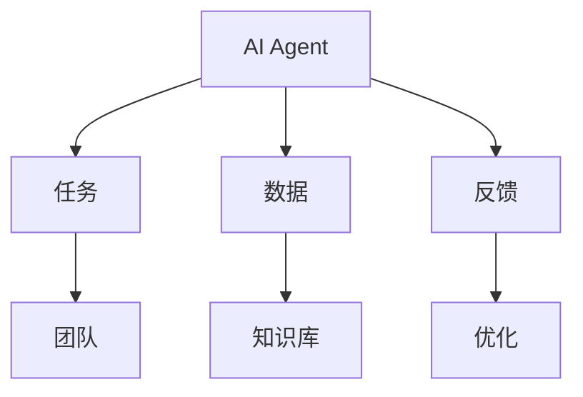
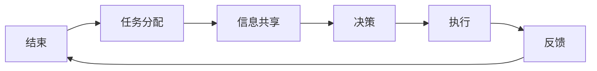
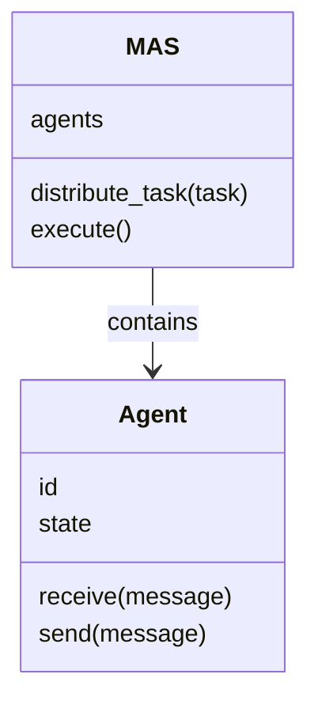
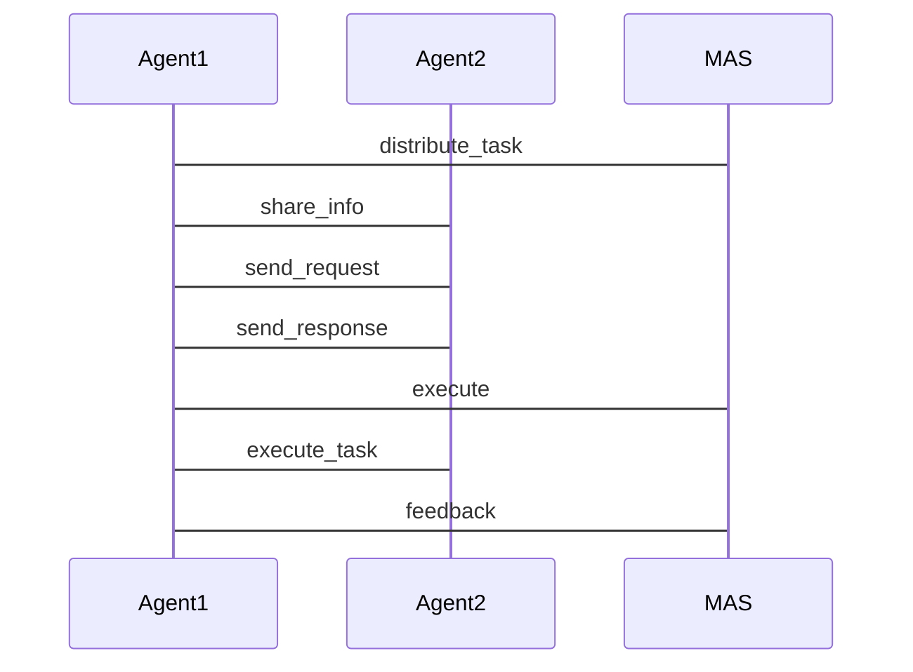

                 


# 企业AI Agent的多智能体系统在团队协作优化中的应用

> 关键词：企业协作、AI Agent、多智能体系统、团队优化、分布式协作

> 摘要：随着人工智能技术的快速发展，AI Agent（智能体）在企业团队协作中的应用日益广泛。本文深入探讨了多智能体系统在企业协作优化中的应用，从理论基础到实际案例，全面解析了如何通过AI Agent提升团队协作效率。文章首先介绍了AI Agent和多智能体系统的基本概念，然后分析了其在团队协作中的应用场景和优势，接着详细讲解了分布式协作算法和强化学习算法的原理与实现，最后通过实际案例展示了如何将这些算法应用于企业协作优化，并提出了相关的最佳实践建议。

---

## 第1章: 企业AI Agent的背景与概念

### 1.1 问题背景

#### 1.1.1 传统团队协作的挑战
在传统的团队协作中，团队成员之间的沟通和协调往往依赖于人工操作，效率较低且容易出现信息孤岛。例如，项目进度跟踪、任务分配和资源协调等问题常常导致协作效率低下，甚至影响项目进度。

#### 1.1.2 AI技术对企业协作的潜在价值
人工智能技术的快速发展为企业协作提供了新的可能性。AI Agent可以通过自动化的方式处理信息，实时协调团队成员的任务，优化资源分配，从而提高协作效率。

#### 1.1.3 多智能体系统在企业协作中的应用前景
多智能体系统（Multi-Agent System, MAS）通过多个智能体的协作，可以实现复杂的任务分配和资源协调。在企业协作中，每个智能体可以代表一个团队成员或部门，通过智能体之间的协作实现整体目标。

### 1.2 问题描述

#### 1.2.1 团队协作中的主要问题
- 信息不对称：团队成员可能无法及时获取所需的信息，导致决策失误。
- 资源冲突：多个团队成员可能争夺相同的资源，导致资源分配不均。
- 协作低效：任务分配和进度跟踪缺乏自动化支持，容易出现延误。

#### 1.2.2 多智能体系统如何解决这些问题
多智能体系统通过分布式协作和自主决策，能够实时协调团队成员的任务，优化资源分配，减少信息不对称，提高协作效率。

#### 1.2.3 企业协作优化的目标与边界
企业协作优化的目标是通过多智能体系统的协作，实现任务高效分配、资源合理利用和团队整体绩效的提升。其边界包括团队内部协作，不涉及外部合作伙伴或其他外部系统。

### 1.3 问题解决与边界

#### 1.3.1 多智能体系统的核心解决思路
通过多个智能体的协作，实现任务分配、信息共享和资源协调，从而优化团队协作效率。

#### 1.3.2 问题的边界与适用场景
多智能体系统适用于需要高度协调和协作的任务场景，例如项目管理、资源分配和实时任务调度。

#### 1.3.3 解决方案的优缺点分析
- 优点：提高协作效率，减少人为错误，实现自动化决策。
- 缺点：系统复杂性较高，需要较高的技术投入。

### 1.4 概念结构与核心要素

#### 1.4.1 AI Agent的基本构成
AI Agent由感知模块、决策模块和执行模块组成，能够根据环境信息自主决策并执行任务。

#### 1.4.2 多智能体系统的组成要素
多智能体系统包括多个智能体、通信机制和协作协议，智能体之间通过通信机制进行信息共享和协作。

#### 1.4.3 系统的核心属性与功能
- 分布式协作：智能体之间通过分布式方式协作完成任务。
- 自主决策：智能体能够自主决策并执行任务。
- 动态适应：系统能够根据环境变化动态调整协作策略。

---

## 第2章: 多智能体系统的核心概念与联系

### 2.1 核心概念原理

#### 2.1.1 AI Agent的基本原理
AI Agent通过感知环境信息，利用内部知识库和推理机制，做出决策并执行任务。

#### 2.1.2 多智能体系统的协作机制
多智能体系统通过通信机制和协作协议，实现智能体之间的信息共享和任务分配。

#### 2.1.3 分布式决策与任务分配
分布式决策通过多个智能体协作完成任务分配，避免了集中式决策的单点故障问题。

### 2.2 概念属性特征对比

| 概念 | 特性 | 说明 |
|------|------|------|
| AI Agent | 独立性 | 能够自主决策 |
| 多智能体系统 | 分布式协作 | 智能体之间协作完成任务 |
| 单智能体系统 | 集中式决策 | 依赖中心决策单元 |

### 2.3 ER实体关系图



---

## 第3章: 多智能体系统的算法原理

### 3.1 分布式协作算法

#### 3.1.1 分布式协作的基本原理
分布式协作算法通过多个智能体协作完成任务分配和资源协调。

#### 3.1.2 多智能体系统中的通信机制
智能体之间通过消息传递机制进行通信，共享信息并协调任务。

#### 3.1.3 分布式决策算法的实现
分布式决策算法通过局部信息做出全局决策，避免了集中式决策的高延迟问题。

### 3.2 强化学习算法

#### 3.2.1 强化学习的基本概念
强化学习通过智能体与环境的交互，学习最优策略以最大化累计奖励。

#### 3.2.2 多智能体强化学习的挑战
多智能体强化学习需要解决智能体之间的协作与竞争问题，以及全局目标的优化。

#### 3.2.3 实际应用中的优化策略
通过经验共享和策略协作，提高多智能体系统的整体性能。

### 3.3 算法流程图



### 3.4 算法实现代码

```python
import random

class Agent:
    def __init__(self, id):
        self.id = id
        self.state = 0

    def receive(self, message):
        self.state = message

    def send(self, message):
        return message

class MAS:
    def __init__(self, agents):
        self.agents = agents

    def distribute_task(self, task):
        for agent in self.agents:
            agent.receive(task)

    def execute(self):
        for agent in self.agents:
            result = agent.send(agent.state)
            print(f"Agent {agent.id} executes task {result}")

if __name__ == "__main__":
    agents = [Agent(1), Agent(2), Agent(3)]
    mas = MAS(agents)
    mas.distribute_task("task")
    mas.execute()
```

### 3.5 数学模型与公式

$$ V(s) = \max_{a} \left( r + V(s') \right) $$

其中：
- $V(s)$ 表示状态 $s$ 的价值函数。
- $r$ 表示奖励。
- $s'$ 表示下一步的状态。

---

## 第4章: 系统分析与架构设计方案

### 4.1 问题场景介绍

#### 4.1.1 项目进度跟踪
通过多智能体系统实时跟踪项目进度，协调任务分配。

#### 4.1.2 资源分配优化
通过智能体协作优化资源分配，避免资源冲突。

### 4.2 系统功能设计

#### 4.2.1 领域模型


### 4.3 系统架构设计


### 4.4 系统接口设计

#### 4.4.1 智能体接口
```python
class AgentInterface:
    def receive(self, message):
        pass

    def send(self):
        pass
```

#### 4.4.2 系统接口
```python
class MASInterface:
    def distribute_task(self, task):
        pass

    def execute(self):
        pass
```

### 4.5 系统交互流程图



---

## 第5章: 项目实战

### 5.1 环境安装

```bash
pip install numpy matplotlib
```

### 5.2 核心代码实现

```python
import numpy as np

class Agent:
    def __init__(self, id):
        self.id = id
        self.state = np.random.randn()

    def receive(self, message):
        self.state = message

    def send(self):
        return self.state

class MAS:
    def __init__(self, agents):
        self.agents = agents

    def distribute_task(self, task):
        for agent in self.agents:
            agent.receive(task)

    def execute(self):
        results = [agent.send() for agent in self.agents]
        return results

if __name__ == "__main__":
    agents = [Agent(1), Agent(2), Agent(3)]
    mas = MAS(agents)
    mas.distribute_task("task")
    results = mas.execute()
    print(results)
```

### 5.3 代码解读与分析

- `Agent` 类：表示一个智能体，具有接收和发送消息的功能。
- `MAS` 类：表示多智能体系统，负责任务分配和执行。

### 5.4 实际案例分析

#### 5.4.1 案例背景
在一个三人项目团队中，任务分配和进度跟踪是主要挑战。

#### 5.4.2 系统实现
通过MAS系统分配任务，实时跟踪进度。

#### 5.4.3 结果分析
系统能够高效分配任务，减少资源冲突，提高协作效率。

### 5.5 项目小结

- 通过MAS系统实现了高效的团队协作。
- 代码实现简单易懂，具有良好的扩展性。

---

## 第6章: 最佳实践

### 6.1 小结

- 多智能体系统通过分布式协作和自主决策，显著提高了团队协作效率。
- 实际应用中需要考虑系统复杂性和技术投入。

### 6.2 注意事项

- 系统设计时要注意智能体之间的通信机制。
- 实际应用中需要结合具体场景进行优化。

### 6.3 拓展阅读

- 推荐阅读《Multi-Agent Systems》和《Reinforcement Learning》相关书籍。

---

## 作者

作者：AI天才研究院 & 禅与计算机程序设计艺术

---

希望这篇文章能够为读者提供关于企业AI Agent多智能体系统在团队协作优化中的应用的清晰思路和实践指导。

