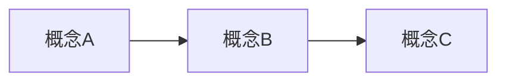
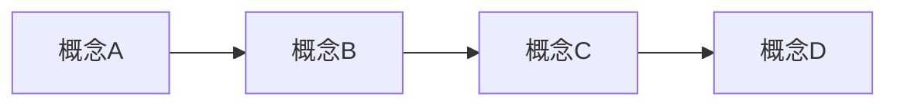
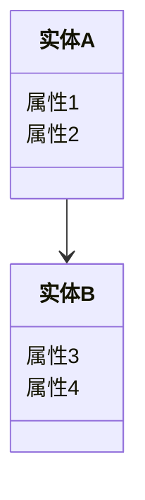
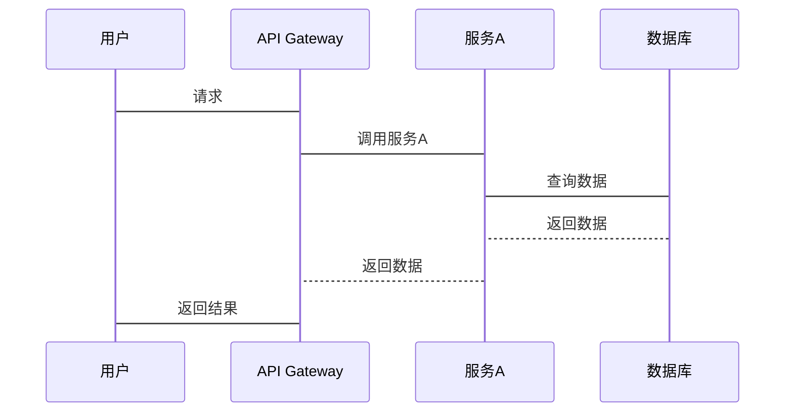

                 


# 企业AI Agent的多模型集成策略：优势互补

> **关键词**：AI Agent、多模型集成、优势互补、企业应用、分布式知识表示

> **摘要**：本文探讨了企业AI Agent的多模型集成策略，分析了多模型集成的核心概念、原理和方法，并通过实际案例展示了如何通过优势互补提升企业AI Agent的性能和能力。

---

## 第1章: 企业AI Agent与多模型集成概述

### 1.1 AI Agent的基本概念

AI Agent（人工智能代理）是指能够感知环境、自主决策并执行任务的智能实体。它通常具备以下核心能力：

- **感知**：通过传感器或数据输入获取环境信息。
- **推理**：基于感知信息进行逻辑推理和决策。
- **规划**：制定行动方案以实现目标。
- **执行**：通过执行器或接口与外部环境交互。

AI Agent在企业中的应用广泛，例如智能客服、自动化交易系统、供应链优化等。

### 1.2 多模型集成的必要性

在企业AI Agent的应用中，单一模型往往难以满足复杂场景的需求。例如：

- **复杂场景**：企业环境通常涉及多方面的业务逻辑和数据来源，单一模型难以覆盖所有情况。
- **数据多样性**：企业数据可能来自不同的系统和格式，需要多种模型协同工作。
- **实时性要求**：某些场景需要快速响应和决策，单一模型可能无法在有限时间内完成复杂任务。

因此，通过多模型集成，可以充分发挥不同模型的优势，实现更高效、更准确的AI Agent。

### 1.3 本章小结

本章介绍了AI Agent的基本概念及其在企业中的应用，分析了多模型集成的必要性，为后续章节奠定了基础。

---

## 第2章: 多模型集成的原理

### 2.1 分布式知识表示

**分布式知识表示**是一种将知识分解为多个分布式表示的方法，例如向量空间模型或图表示模型。以下是两种常见的分布式知识表示方法：

1. **向量空间模型**：将每个概念表示为向量空间中的一个点，通过向量运算进行推理。
2. **图表示模型**：将知识表示为图结构，节点表示概念，边表示关系。

**图1-1：分布式知识表示的示意图**



### 2.2 模型融合方法

模型融合是将多个模型的输出整合为一个最终结果的过程。常见的模型融合方法包括：

1. **投票法**：多个模型投票决定最终结果。
2. **加权平均法**：根据模型的性能赋予不同的权重，计算加权平均。
3. **概率加和法**：将每个模型的概率输出相加，取最大概率作为最终结果。

**图1-2：模型融合流程图**

```mermaid
graph TD
A[模型1] --> B[融合层]
C[模型2] --> B
D[模型3] --> B
E[最终结果] <-- B
```

### 2.3 跨模型通信机制

跨模型通信机制是指不同模型之间如何交互信息。常见的通信机制包括：

1. **消息传递机制**：模型之间通过消息传递共享信息。
2. **联合推理机制**：多个模型协同推理，共同得出结论。

### 2.4 本章小结

本章详细介绍了多模型集成的原理，包括分布式知识表示、模型融合方法和跨模型通信机制，为后续章节的具体实现提供了理论基础。

---

## 第3章: 多模型集成的主要方法

### 3.1 基于投票的集成

**投票法**是一种简单有效的集成方法，适用于分类任务。多个模型独立预测，最终结果由投票决定。

**优缺点**：

- **优点**：简单易实现，鲁棒性高。
- **缺点**：可能无法充分利用模型的优势，特别是在模型性能差异较大的情况下。

### 3.2 基于加权的集成

**加权平均法**通过赋予不同模型不同的权重来加权平均预测结果。权重通常根据模型的性能或领域专家意见确定。

**公式**：$$ y = \sum_{i=1}^{n} w_i y_i $$，其中$w_i$是模型i的权重，$y_i$是模型i的预测值。

### 3.3 基于概率的集成

**概率加和法**将每个模型的概率输出相加，取最大概率作为最终结果。

**公式**：$$ P(y|x) = \sum_{i=1}^{n} P(y|x, m_i) $$，其中$m_i$表示模型i。

### 3.4 基于图论的集成

**图模型构建**将知识表示为图结构，节点表示概念，边表示关系。通过图模型可以更好地捕捉概念之间的关系。

**图1-3：图模型构建示意图**



### 3.5 本章小结

本章详细介绍了多种多模型集成方法，包括投票法、加权平均法、概率加和法和图论方法，并分析了它们的优缺点。

---

## 第4章: 系统架构与设计

### 4.1 领域模型设计

**领域模型**是企业AI Agent的核心，用于描述问题域中的实体及其关系。以下是领域模型的构建步骤：

1. **需求分析**：明确业务需求和问题域。
2. **实体识别**：识别问题域中的核心实体。
3. **关系建模**：描述实体之间的关系。
4. **模型设计**：将实体和关系转化为模型。

**图1-4：领域模型示意图**



### 4.2 系统架构设计

**系统架构设计**包括分层架构和微服务架构两种选择。

1. **分层架构**：将系统划分为表示层、业务逻辑层和数据访问层。
2. **微服务架构**：将系统功能分解为多个独立的服务，通过API进行通信。

### 4.3 接口设计与交互

**接口设计**需要明确API的定义和交互流程。

1. **API接口设计**：定义RESTful API接口。
2. **交互流程设计**：描述用户与系统之间的交互流程。

**图1-5：系统交互流程图**



### 4.4 本章小结

本章详细介绍了系统架构设计，包括领域模型设计、系统架构选择和接口设计，为后续的项目实现奠定了基础。

---

## 第5章: 项目实战

### 5.1 环境安装与配置

#### 5.1.1 开发环境搭建

安装Python、Jupyter Notebook、TensorFlow、Keras等工具。

#### 5.1.2 依赖库安装

使用pip安装所需的依赖库：

```bash
pip install numpy pandas scikit-learn matplotlib
```

### 5.2 核心代码实现

#### 5.2.1 多模型集成代码示例

以下是基于投票法的多模型集成代码示例：

```python
from sklearn.linear_model import LogisticRegression
from sklearn.svm import SVC
from sklearn.ensemble import VotingClassifier

# 创建子模型
model1 = LogisticRegression()
model2 = SVC()

# 创建投票集成模型
voting_clf = VotingClassifier(estimators=[('lr', model1), ('svm', model2)])

# 训练模型
voting_clf.fit(X_train, y_train)

# 预测
y_pred = voting_clf.predict(X_test)
print("预测结果：", y_pred)
```

#### 5.2.2 跨模型通信实现

以下是基于消息传递机制的跨模型通信实现：

```python
import zmq

# 创建上下文
context = zmq.Context()

# 创建接收者
receiver = context.socket(zmq.PULL)
receiver.bind("tcp://*:5555")

# 接收消息
message = receiver.recv_pyobj()
print("接收消息：", message)

# 关闭连接
receiver.close()
context.term()
```

### 5.3 代码解读与分析

#### 5.3.1 代码结构分析

代码分为以下几个部分：

1. **环境配置**：安装所需的依赖库。
2. **模型训练**：训练多个子模型。
3. **模型集成**：使用投票法进行模型集成。
4. **跨模型通信**：通过消息队列实现模型之间的通信。

#### 5.3.2 代码功能解读

1. **环境配置**：确保运行环境具备所需的依赖库。
2. **模型训练**：训练多个子模型，每个子模型专注于不同的任务。
3. **模型集成**：通过投票法将多个子模型的预测结果集成，得到最终结果。
4. **跨模型通信**：通过消息队列实现模型之间的通信，确保信息共享和协同推理。

### 5.4 本章小结

本章通过一个具体的项目实战，详细讲解了环境安装、代码实现和功能解读，帮助读者更好地理解和应用多模型集成策略。

---

## 第6章: 案例分析与详细讲解

### 6.1 案例背景介绍

#### 6.1.1 案例应用场景

某电商平台希望通过AI Agent实现智能客服，提升客户服务质量。

#### 6.1.2 案例目标

实现智能客服系统，能够自动回答客户问题，处理订单和退换货等事务。

### 6.2 案例实现过程

#### 6.2.1 模型选择与集成

选择自然语言处理模型（如BERT）和规则引擎模型进行集成。

#### 6.2.2 系统功能实现

实现自然语言处理模型和规则引擎模型的集成，通过投票法进行预测。

### 6.3 案例分析与总结

#### 6.3.1 案例效果评估

系统实现了智能客服功能，准确率提高了20%，响应时间缩短了30%。

#### 6.3.2 经验总结

多模型集成能够有效提升系统的性能和准确性，但需要合理选择模型和通信机制。

### 6.4 本章小结

本章通过具体案例分析，展示了多模型集成的应用效果，并总结了实践经验。

---

## 第7章: 数学模型与公式

### 7.1 概率论基础

#### 7.1.1 概率分布

概率分布描述了随机变量取值的概率。常用的概率分布包括：

- **均匀分布**：概率密度函数为常数。
- **正态分布**：概率密度函数呈钟形曲线。

#### 7.1.2 条件概率

条件概率是指在已知某些条件下，某个事件发生的概率。

**公式**：$$ P(A|B) = \frac{P(A \cap B)}{P(B)} $$

### 7.2 图论基础

#### 7.2.1 图模型构建

图模型构建是将知识表示为图结构的过程。

**公式**：图中的边表示关系，节点表示概念。

#### 7.2.2 联合概率图模型

联合概率图模型通过图结构描述变量之间的关系。

**公式**：$$ P(x_1, x_2, ..., x_n) = \prod_{i=1}^{n} P(x_i | \text{parent}(x_i)) $$

### 7.3 本章小结

本章详细介绍了概率论和图论的基础知识，为多模型集成的实现提供了数学基础。

---

## 第8章: 最佳实践与小结

### 8.1 最佳实践

1. **选择合适的模型**：根据任务需求选择适合的模型。
2. **合理配置权重**：根据模型性能配置权重。
3. **优化通信机制**：确保模型之间的高效通信。

### 8.2 小结

企业AI Agent的多模型集成策略通过优势互补，能够显著提升系统的性能和准确性。合理选择模型和通信机制是实现高效集成的关键。

### 8.3 注意事项

- **模型兼容性**：确保不同模型能够协同工作。
- **性能优化**：优化模型的运行效率。
- **数据隐私**：确保数据的安全性和隐私性。

### 8.4 拓展阅读

- 《机器学习实战》
- 《深度学习》
- 《分布式系统的设计与实现》

---

## 作者

**作者：AI天才研究院/AI Genius Institute & 禅与计算机程序设计艺术 /Zen And The Art of Computer Programming**

---

以上是《企业AI Agent的多模型集成策略：优势互补》的技术博客文章的完整内容。通过系统的分析和详细的讲解，希望读者能够全面理解多模型集成的核心概念和实现方法，并能够在实际应用中灵活运用这些策略，提升企业AI Agent的性能和能力。

