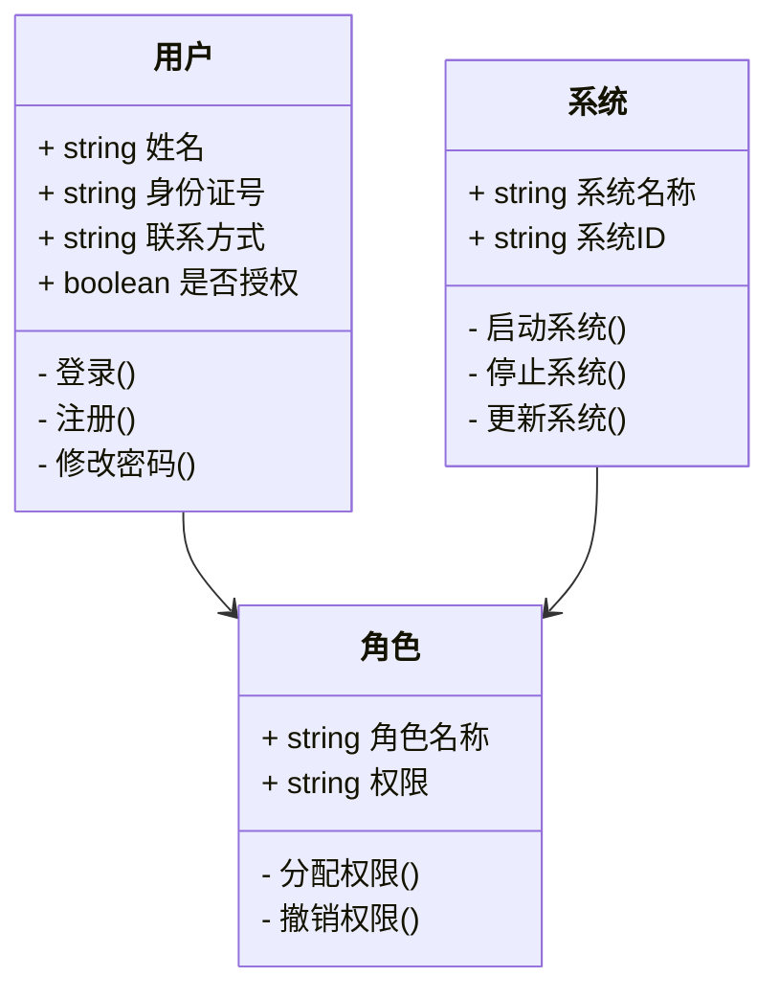
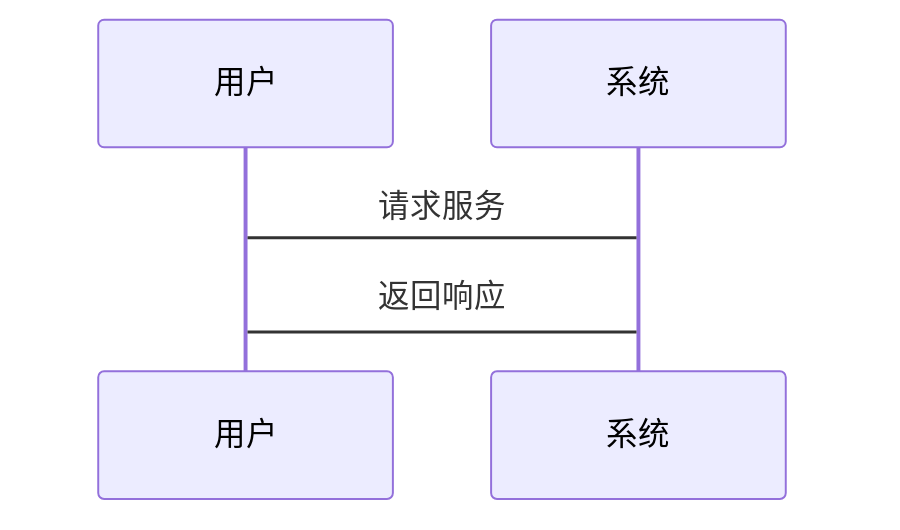

                 


# 企业AI Agent的多维安全防护体系设计与实现

> **关键词**：企业AI Agent，多维安全防护，知识图谱，算法安全，系统架构设计  
> 
> **摘要**：随着人工智能技术的快速发展，企业AI Agent在智能化转型中的应用越来越广泛。然而，AI Agent面临的多维度安全威胁也日益复杂。本文从企业AI Agent的核心概念出发，详细阐述了多维安全防护体系的设计与实现，包括算法原理、系统架构设计、安全分析案例等内容。通过本文的分析，读者可以全面了解企业AI Agent的多维安全防护体系，并掌握其实现方法。

---

## 第一部分: 企业AI Agent的多维安全防护体系概述

### 第1章: 企业AI Agent的背景与概念

#### 1.1 AI Agent的基本概念
- **1.1.1 AI Agent的定义**  
  AI Agent（人工智能代理）是指能够感知环境、自主决策并执行任务的智能实体。它能够通过传感器获取信息，利用推理能力解决问题，并通过执行器与环境交互。

- **1.1.2 AI Agent的核心特征**  
  - 智能性：具备学习、推理和自适应能力。  
  - 自主性：能够在没有外部干预的情况下独立运行。  
  - 反应性：能够实时感知环境并做出响应。  
  - 社会性：能够与其他系统或人类进行协作与通信。

- **1.1.3 企业AI Agent的应用场景**  
  - 智能客服：通过自然语言处理技术为用户提供支持。  
  - 智能监控：实时监控企业运营数据并发出警报。  
  - 智能决策：基于大数据分析为企业提供决策支持。

#### 1.2 企业AI Agent的背景与问题背景
- **1.2.1 企业智能化转型的需求**  
  随着数字化转型的推进，企业需要通过智能化技术提高效率、降低成本并增强竞争力。

- **1.2.2 AI Agent在企业中的问题与挑战**  
  - 数据安全：企业敏感数据可能被恶意攻击或泄露。  
  - 算法漏洞：AI Agent的决策可能受到算法偏差或攻击的影响。  
  - 系统复杂性：多系统协同工作可能导致安全风险叠加。

- **1.2.3 多维安全防护的必要性**  
  为了应对上述问题，企业需要构建一个多维安全防护体系，从数据、算法、系统和人员等多个维度进行全面防护。

#### 1.3 多维安全防护体系的定义与目标
- **1.3.1 多维安全防护的核心概念**  
  多维安全防护体系是指从多个维度（如数据、算法、系统、人员）出发，构建全面的安全防护机制，以应对企业AI Agent面临的各种安全威胁。

- **1.3.2 多维安全防护的目标与边界**  
  - 目标：保护企业AI Agent的核心功能和数据安全，防止恶意攻击和数据泄露。  
  - 边界：明确多维安全防护的范围，避免过度防护或防护不足。

- **1.3.3 多维安全防护的外延与内涵**  
  - 外延：多维安全防护体系涵盖企业AI Agent的全生命周期，包括设计、开发、部署和维护。  
  - 内涵：通过多层次、多维度的安全策略，实现对企业AI Agent的全面保护。

#### 1.4 本章小结  
本章介绍了企业AI Agent的基本概念、背景与问题背景，以及多维安全防护体系的定义与目标。通过这些内容，读者可以理解企业AI Agent面临的多维度安全威胁，以及构建多维安全防护体系的必要性。

---

## 第二部分: 企业AI Agent的多维安全防护体系核心概念与联系

### 第2章: 多维安全防护体系的核心概念

#### 2.1 多维安全防护体系的原理
- **2.1.1 多维安全防护的基本原理**  
  多维安全防护体系通过整合多个维度的安全策略，形成多层次的安全防线，以应对各种安全威胁。

- **2.1.2 多维安全防护的关键要素**  
  - 数据安全：保护企业的敏感数据不被泄露或篡改。  
  - 算法安全：防止AI Agent的算法被攻击或滥用。  
  - 系统安全：确保企业AI Agent的运行环境安全可靠。  
  - 人员安全：通过培训和管理，减少人为因素导致的安全风险。

- **2.1.3 多维安全防护的实现机制**  
  - 数据加密：对敏感数据进行加密存储和传输。  
  - 算法加固：通过冗余设计和容错机制提高算法的鲁棒性。  
  - 系统隔离：通过虚拟化技术实现系统的物理隔离。  
  - 人员培训：定期进行安全培训，提高员工的安全意识。

#### 2.2 多维安全防护体系的核心要素
- **2.2.1 数据安全**  
  数据安全是多维安全防护体系的核心要素之一。通过数据加密、访问控制等技术，保护企业的敏感数据不被未经授权的用户访问。

- **2.2.2 算法安全**  
  算法安全是防止AI Agent的决策过程被恶意干扰的关键。通过算法加固和异常检测技术，提高算法的抗攻击能力。

- **2.2.3 系统安全**  
  系统安全是确保企业AI Agent的运行环境安全可靠的基础。通过漏洞扫描、入侵检测等技术，防止系统被攻击或破坏。

- **2.2.4 人员安全**  
  人员安全是减少人为因素导致的安全风险的重要手段。通过安全培训和行为规范，提高员工的安全意识和行为规范。

#### 2.3 多维安全防护体系的ER实体关系图
- **2.3.1 实体关系图的构建**  
  通过ER图（实体关系图）可以清晰地展示多维安全防护体系中各要素之间的关系。

```mermaid
erDiagram
    actor 用户 {
        string 姓名
        string 身份证号
    }
    role 角色 {
        string 角色名称
        string 权限
    }
    system 系统 {
        string 系统名称
        string 系统ID
    }
    user 用户 --> role 角色
    system 系统 --> role 角色
```

- **2.3.2 实体关系图的分析**  
  上图展示了用户、角色和系统之间的关系。用户通过角色获得相应的权限，并通过系统实现权限的执行。

#### 2.4 本章小结  
本章详细阐述了多维安全防护体系的核心概念和关键要素，并通过ER图展示了各要素之间的关系。读者可以通过这些内容理解多维安全防护体系的整体架构。

---

## 第三部分: 企业AI Agent的多维安全防护体系算法原理

### 第3章: 基于知识图谱的安全分析算法

#### 3.1 知识图谱构建算法
- **3.1.1 知识图谱构建的基本流程**  
  知识图谱的构建通常包括数据获取、数据清洗、实体识别、关系抽取和知识融合等步骤。

- **3.1.2 知识图谱构建的关键算法**  
  - 实体识别：基于自然语言处理技术，识别文本中的实体。  
  - 关系抽取：基于规则或机器学习算法，抽取实体之间的关系。  
  - 知识融合：将多个数据源中的知识进行融合，消除冗余和冲突。

- **3.1.3 知识图谱构建的实现步骤**  
  1. 数据获取：从多种数据源获取数据。  
  2. 数据清洗：去除噪声数据，确保数据质量。  
  3. 实体识别：识别文本中的实体并建立索引。  
  4. 关系抽取：提取实体之间的关系并建立关系图。  
  5. 知识融合：将多个数据源的知识进行融合，形成统一的知识图谱。

#### 3.2 基于知识图谱的安全分析算法
- **3.2.1 基于知识图谱的异常检测算法**  
  - 算法原理：通过分析知识图谱中的异常模式，识别潜在的安全威胁。  
  - 实现步骤：1. 构建知识图谱；2. 检测异常模式；3. 提出安全警报。

- **3.2.2 基于知识图谱的威胁分析算法**  
  - 算法原理：通过分析知识图谱中的威胁关系，识别潜在的安全威胁。  
  - 实现步骤：1. 构建知识图谱；2. 分析威胁关系；3. 提供威胁分析报告。

- **3.2.3 基于知识图谱的漏洞挖掘算法**  
  - 算法原理：通过分析知识图谱中的漏洞信息，识别潜在的安全漏洞。  
  - 实现步骤：1. 构建知识图谱；2. 挖掘漏洞信息；3. 提供漏洞修复建议。

#### 3.3 算法实现的Python代码示例
- **3.3.1 知识图谱构建代码示例**  
  ```python
  # 知识图谱构建代码示例
  import networkx as nx

  G = nx.Graph()
  G.add_nodes_from(["A", "B", "C"])
  G.add_edges_from([("A", "B"), ("B", "C")])
  print(G.nodes())
  ```

- **3.3.2 安全分析算法代码示例**  
  ```python
  # 基于知识图谱的安全分析算法
  import networkx as nx

  def detect_anomalies(G):
      # 实现异常检测算法
      pass

  G = nx.Graph()
  G.add_nodes_from(["A", "B", "C"])
  G.add_edges_from([("A", "B"), ("B", "C")])
  detect_anomalies(G)
  ```

- **3.3.3 算法实现的详细解读**  
  上面的代码示例展示了知识图谱构建和安全分析算法的基本实现。通过这些代码，读者可以理解算法的基本原理和实现步骤。

#### 3.4 本章小结  
本章详细介绍了基于知识图谱的安全分析算法，包括知识图谱的构建和安全分析算法的实现。通过这些内容，读者可以理解多维安全防护体系中的算法实现部分。

---

## 第四部分: 企业AI Agent的多维安全防护体系系统分析与架构设计

### 第4章: 系统分析与架构设计方案

#### 4.1 系统分析
- **4.1.1 问题场景介绍**  
  在企业AI Agent的多维安全防护体系中，常见的问题包括数据泄露、算法漏洞、系统攻击等。

- **4.1.2 系统功能需求分析**  
  - 数据安全：实现数据的加密存储和传输，防止数据泄露。  
  - 算法安全：通过算法加固技术，防止算法被攻击或滥用。  
  - 系统安全：确保系统运行环境的安全性，防止系统攻击。  
  - 人员安全：通过安全培训和行为规范，减少人为因素导致的安全风险。

- **4.1.3 系统性能需求分析**  
  - 响应时间：系统需要在合理时间内完成安全防护任务。  
  - 处理能力：系统需要能够处理大量的数据和请求。  
  - 可扩展性：系统需要具备良好的扩展性，能够适应业务发展的需求。

#### 4.2 系统架构设计
- **4.2.1 系统功能设计（领域模型类图）**  
  下图展示了系统的功能模块及其之间的关系。



- **4.2.2 系统架构设计（架构图）**  
  下图展示了系统的整体架构设计。


- **4.2.3 系统接口设计**  
  系统接口设计包括API接口的设计和实现，确保系统之间的通信安全可靠。

- **4.2.4 系统交互设计（序列图）**  
  下图展示了系统交互的序列图。



#### 4.3 本章小结  
本章详细分析了企业AI Agent的多维安全防护体系的系统架构设计，包括系统功能设计、架构设计、接口设计和交互设计。通过这些内容，读者可以理解系统的整体架构和实现方法。

---

## 第五部分: 企业AI Agent的多维安全防护体系项目实战

### 第5章: 项目实战

#### 5.1 环境安装
- **5.1.1 系统要求**  
  - 操作系统：建议使用Linux或Windows 10及以上版本。  
  - 内存：建议至少8GB内存。  
  - 硬盘空间：建议至少50GB可用空间。

- **5.1.2 软件安装**  
  - Python：建议安装Python 3.8及以上版本。  
  - 网络工具：安装必要的网络工具，如curl、wget等。  
  - 数据库：安装MySQL或PostgreSQL等数据库管理系统。

#### 5.2 系统核心实现源代码
- **5.2.1 数据安全模块**  
  ```python
  # 数据安全模块代码示例
  import hashlib

  def encrypt_data(data):
      return hashlib.sha256(data.encode()).hexdigest()

  # 示例：加密敏感数据
  encrypted_data = encrypt_data("Sensitive Data")
  print(encrypted_data)
  ```

- **5.2.2 算法安全模块**  
  ```python
  # 算法安全模块代码示例
  import numpy as np

  def robust_algorithm(data):
      # 实现鲁棒算法
      return np.mean(data)

  # 示例：鲁棒算法实现
  result = robust_algorithm([1, 2, 3, 4, 5])
  print(result)
  ```

- **5.2.3 系统安全模块**  
  ```python
  # 系统安全模块代码示例
  import logging

  def log_system_activity(message):
      logging.basicConfig(level=logging.INFO)
      logging.info(message)

  # 示例：记录系统活动
  log_system_activity("System started")
  ```

#### 5.3 代码应用解读与分析
- **5.3.1 数据安全模块解读**  
  上面的代码示例展示了如何通过哈希算法对敏感数据进行加密存储，确保数据的安全性。

- **5.3.2 算法安全模块解读**  
  上面的代码示例展示了如何通过鲁棒算法提高算法的安全性，防止算法被攻击或滥用。

- **5.3.3 系统安全模块解读**  
  上面的代码示例展示了如何通过日志记录系统活动，确保系统的安全性和可追溯性。

#### 5.4 实际案例分析和详细讲解剖析
- **5.4.1 案例背景**  
  某企业AI Agent系统面临数据泄露的风险，通过多维安全防护体系的设计与实现，成功保护了企业的敏感数据。

- **5.4.2 案例分析**  
  通过实际案例分析，展示了多维安全防护体系在企业中的应用效果和实际价值。

#### 5.5 本章小结  
本章通过项目实战的方式，详细展示了企业AI Agent的多维安全防护体系的实现过程，包括环境安装、核心代码实现、案例分析等内容。通过这些内容，读者可以掌握多维安全防护体系的实际应用方法。

---

## 第六部分: 企业AI Agent的多维安全防护体系总结与展望

### 第6章: 总结与展望

#### 6.1 最佳实践 tips
- 数据安全：定期进行数据备份和加密，确保数据的安全性。  
- 算法安全：通过冗余设计和容错机制提高算法的鲁棒性。  
- 系统安全：定期进行系统更新和漏洞扫描，确保系统的安全性。  
- 人员安全：通过安全培训和行为规范，提高员工的安全意识。

#### 6.2 小结
通过本文的分析，读者可以全面了解企业AI Agent的多维安全防护体系的设计与实现。从核心概念到算法原理，从系统架构设计到项目实战，本文为读者提供了全面的知识体系。

#### 6.3 注意事项
- 在实际应用中，需要根据企业的实际情况进行调整和优化。  
- 系统的安全防护需要持续进行，确保系统的安全性。  
- 在实现过程中，需要充分考虑系统的可扩展性和可维护性。

#### 6.4 拓展阅读
- 《网络安全技术及应用》  
- 《人工智能安全与伦理》  
- 《系统架构设计与实现》

---

## 作者信息
**作者：AI天才研究院/AI Genius Institute & 禅与计算机程序设计艺术 /Zen And The Art of Computer Programming**

