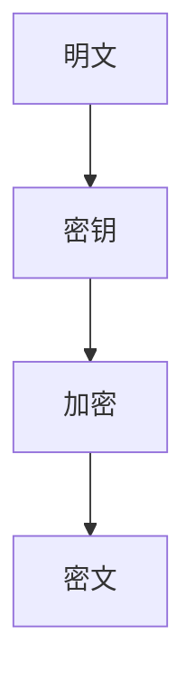
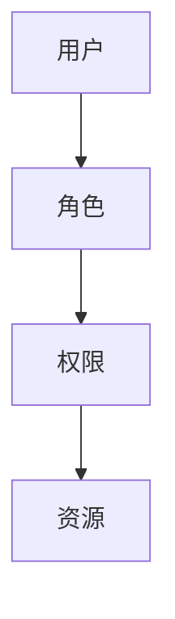
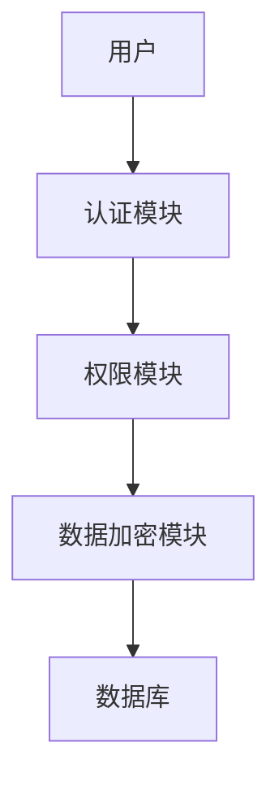

                 


# 企业AI Agent的多维安全防护：数据加密与访问控制

> **关键词**：企业AI Agent、数据加密、访问控制、多维安全防护、AI安全、数据安全

> **摘要**：  
> 本文从企业AI Agent的核心功能出发，系统阐述了数据加密与访问控制在多维安全防护中的重要性。通过分析数据加密算法的原理与实现，深入探讨了访问控制机制的设计与优化。结合实际案例，详细讲解了如何在企业AI Agent系统中构建多层次的安全防护体系，确保数据的机密性、完整性和可用性。

---

# 第一部分: 企业AI Agent与多维安全防护背景

## 1. 企业AI Agent的基本概念与应用场景

### 1.1 AI Agent的定义与特点  
人工智能代理（AI Agent）是指能够感知环境、自主决策并执行任务的智能实体。它具备以下特点：  
- **自主性**：能够在没有外部干预的情况下独立执行任务。  
- **反应性**：能够实时感知环境变化并做出响应。  
- **目标导向性**：以特定目标为导向，优化决策过程。  
- **学习能力**：通过数据学习和优化算法，不断提升执行效率和准确性。  

### 1.2 企业AI Agent的应用场景  
企业在以下场景中广泛应用AI Agent：  
- **智能客服**：通过自然语言处理技术为用户提供24/7的智能支持。  
- **供应链管理**：AI Agent实时监控供应链数据，优化库存管理和物流调度。  
- **风险评估**：AI Agent通过分析企业内外部数据，预测潜在风险并提出应对策略。  
- **智能决策支持**：基于数据分析，为管理层提供实时的决策支持。  

---

## 2. 数据加密与访问控制的重要性

### 2.1 数据加密的基本原理  
数据加密是通过算法对数据进行编码，确保只有授权方能够解码还原原始数据。常见的加密方法包括：  
- **对称加密**：加密和解密使用相同的密钥（如AES）。  
- **非对称加密**：加密和解密使用不同的密钥（如RSA）。  

### 2.2 访问控制的必要性  
访问控制是指通过策略和机制限制对资源的访问权限，确保只有授权用户能够访问特定资源。常见访问控制模型包括：  
- **基于角色的访问控制（RBAC）**：根据用户角色分配权限。  
- **基于属性的访问控制（ABAC）**：根据用户属性和环境条件动态分配权限。  

### 2.3 企业AI Agent中的数据安全挑战  
企业在使用AI Agent时面临以下数据安全挑战：  
- **数据泄露风险**：未经授权的用户可能窃取敏感数据。  
- **数据完整性破坏**：恶意攻击可能导致数据被篡改。  
- **数据可用性受限**：由于权限管理不当，合法用户可能无法访问所需数据。  

---

## 3. 多维安全防护的背景与意义

### 3.1 多维安全防护的定义  
多维安全防护是指从多个维度（如网络层、应用层、数据层）构建安全防护体系，确保系统的安全性。  

### 3.2 企业AI Agent中多维安全防护的必要性  
随着企业对AI Agent的依赖增加，单一的安全防护措施已难以应对复杂的网络安全威胁。多维安全防护通过多层次、多角度的防护策略，显著提升了系统的安全性。  

### 3.3 多维安全防护的核心目标与实现路径  
- **核心目标**：保护数据的机密性、完整性和可用性。  
- **实现路径**：  
  - 数据层：使用加密算法保护数据。  
  - 应用层：通过访问控制限制用户权限。  
  - 网络层：部署防火墙、入侵检测系统等网络安全设备。  

---

# 第二部分: 核心概念与联系

## 4. 数据加密与访问控制的核心概念

### 4.1 数据加密原理  
数据加密通过算法对数据进行编码，确保数据在传输和存储过程中不被未经授权的第三方窃取或篡改。  

#### 4.1.1 对称加密与非对称加密的对比  
| 属性           | 对称加密         | 非对称加密       |  
|----------------|------------------|------------------|  
| 密钥数量       | 1                | 2                |  
| 加密速度       | 快               | 较慢             |  
| 适用场景       | 适合大数据量加密 | 适合数字签名等场景 |  

#### 4.1.2 AES加密算法的工作流程  


### 4.2 访问控制机制  
访问控制通过策略和机制限制对资源的访问权限，确保只有授权用户能够访问特定资源。  

#### 4.2.1 RBAC模型的核心要素  
- **用户**：需要访问资源的主体。  
- **角色**：用户在系统中的职责或权限集合。  
- **权限**：用户或角色被允许执行的操作。  
- **资源**：需要被访问的资源。  

#### 4.2.2 RBAC模型的流程图  


### 4.3 数据加密与访问控制的协同机制  
数据加密和访问控制协同工作，确保数据的安全性。  
- **加密**：保护数据的机密性。  
- **访问控制**：确保只有授权用户能够访问数据。  

---

## 5. 数据加密与访问控制的数学模型

### 5.1 AES加密的数学模型  
AES加密过程可以表示为：  
$$ f_{key}(plaintext) = ciphertext $$  
其中，$key$ 是加密密钥，$plaintext$ 是明文，$ciphertext$ 是密文。  

### 5.2 RBAC模型的数学表达  
RBAC模型可以通过以下公式表示：  
$$ permission(user, resource) = true \quad \text{当} \quad role(user) \subseteq role(resource) $$  

---

# 第三部分: 系统分析与架构设计

## 6. 企业AI Agent系统的设计与实现

### 6.1 系统功能设计  
- **用户管理**：包括用户注册、登录、权限分配等。  
- **数据加密**：对敏感数据进行加密存储和传输。  
- **访问控制**：基于角色的访问控制策略。  

### 6.2 系统架构设计  


### 6.3 系统交互流程  
```mermaid
sequenceDiagram
    participant 用户
    participant 认证模块
    participant 权限模块
    participant 数据加密模块
    participant 数据库
    
    用户->>认证模块: 请求访问
    說明：认证模块验证用户身份
    說明：用户身份验证通过
    說明：用户访问权限模块
    說明：权限模块分配权限
    說明：用户访问数据加密模块
    說明：数据加密模块对数据进行加密
    說明：数据加密模块将数据存储到数据库
```

---

## 7. 项目实战：企业AI Agent系统的实现

### 7.1 环境安装  
- **操作系统**：Linux Ubuntu 20.04  
- **开发工具**：Python 3.8、Django框架  
- **数据库**：MySQL 8.0  

### 7.2 核心代码实现  
```python
# 数据加密模块
class AESCipher:
    def __init__(self, key):
        self.key = key

    def encrypt(self, plaintext):
        # 加密逻辑
        return ciphertext

    def decrypt(self, ciphertext):
        # 解密逻辑
        return plaintext

# 访问控制模块
class RoleBasedAccessControl:
    def __init__(self):
        self.role_permissions = {}

    def add_role(self, role, permissions):
        self.role_permissions[role] = permissions

    def has_permission(self, user, resource):
        # 获取用户角色
        role = self.get_role(user)
        # 获取角色权限
        permissions = self.role_permissions.get(role, [])
        # 判断权限
        return resource in permissions
```

---

## 8. 最佳实践与注意事项

### 8.1 小结  
企业AI Agent的多维安全防护需要从数据加密和访问控制两个方面入手，通过协同机制确保数据的安全性。  

### 8.2 注意事项  
- **密钥管理**：确保加密密钥的安全性，避免密钥泄露。  
- **权限管理**：严格控制用户的访问权限，避免越权访问。  
- **日志审计**：记录所有访问日志，便于后续审计和问题排查。  

### 8.3 拓展阅读  
- 《网络安全：数据加密与访问控制的艺术》  
- 《企业AI Agent的安全防护实践》  

---

# 作者  
**作者：AI天才研究院 & 禅与计算机程序设计艺术**

