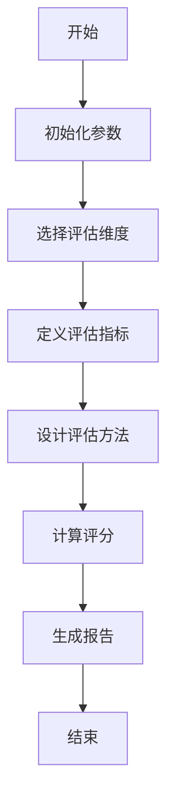
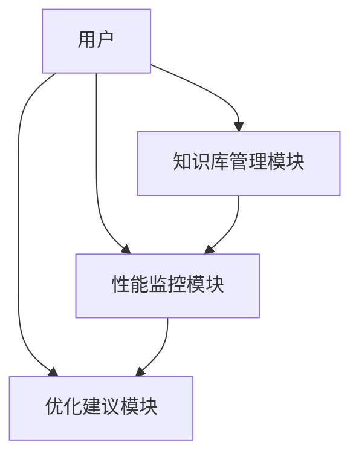

                 


# 企业AI Agent的多维度性能评估体系

> 关键词：企业AI Agent，多维度性能评估，系统架构设计，交互体验，知识库管理，性能监控，优化建议

> 摘要：本文系统地探讨了企业AI Agent的多维度性能评估体系，从核心概念、算法原理、系统架构到实际项目实战，全面分析了如何构建和优化AI Agent的性能评估体系。通过详细阐述各维度的评估指标、算法实现和系统设计，本文为企业的AI Agent开发和优化提供了理论支持和实践指导。

---

# 第1章: 企业AI Agent的背景与概念

## 1.1 问题背景与定义

企业AI Agent（Artificial Intelligence Agent）是一种能够感知环境、自主决策并执行任务的智能实体。随着企业数字化转型的深入，AI Agent在自动化任务处理、客户交互、数据分析等领域发挥着越来越重要的作用。然而，如何系统地评估AI Agent的性能，成为一个关键问题。

### 1.1.1 企业AI Agent的定义

企业AI Agent是基于人工智能技术构建的智能代理系统，能够根据企业需求执行特定任务。它通常具备以下核心特征：

- **自主性**：能够独立决策和行动。
- **反应性**：能够感知环境变化并实时调整行为。
- **目标导向性**：以实现特定目标为导向。
- **可扩展性**：能够适应不同规模和复杂度的任务。

### 1.1.2 问题背景与需求分析

在企业环境中，AI Agent的应用场景日益广泛，但其性能评估却缺乏统一的标准和体系。以下是一些关键问题：

- **评估维度单一**：传统评估体系往往只关注单一维度（如响应速度或准确率），忽视了整体性能的综合评估。
- **复杂性高**：企业AI Agent需要在多变的环境中执行复杂任务，这要求评估体系具备高度的灵活性和适应性。
- **数据驱动**：AI Agent的性能高度依赖于数据质量和模型优化，因此评估体系需要结合数据驱动的方法。

### 1.1.3 企业AI Agent的核心目标

企业AI Agent的核心目标是通过智能化手段提升企业效率、降低成本、优化决策。具体目标包括：

- 提高任务执行效率。
- 降低人工干预成本。
- 提升客户交互体验。
- 增强数据驱动的决策能力。

---

## 1.2 企业AI Agent的特点与优势

### 1.2.1 与传统AI的区别

企业AI Agent与传统AI的主要区别在于其自主性和目标导向性。传统AI通常是任务驱动的，而AI Agent则是目标驱动的，能够主动感知环境并调整行为。

| 特性 | 传统AI | 企业AI Agent |
|------|--------|--------------|
| 自主性 | 较低    | 高           |
| 反应性 | 较低    | 高           |
| 目标导向性 | 低     | 高           |
| 适应性 | 较低    | 高           |

### 1.2.2 企业AI Agent的特点

企业AI Agent的特点主要体现在以下几个方面：

- **多模态交互能力**：支持多种交互方式（如文本、语音、图像）。
- **动态适应性**：能够根据环境变化实时调整行为。
- **知识库驱动**：依赖于强大的知识库支持。
- **可扩展性**：能够轻松扩展至更多任务和场景。

### 1.2.3 企业AI Agent的应用场景

企业AI Agent的应用场景非常广泛，以下是几个典型场景：

- **自动化任务处理**：如邮件分类、日程管理等。
- **客户交互与服务**：如智能客服、个性化推荐。
- **数据分析与决策支持**：如预测分析、风险评估。

---

## 1.3 本章小结

本章介绍了企业AI Agent的核心概念、特点和应用场景。通过对比传统AI与企业AI Agent的差异，我们明确了AI Agent的独特优势。下一章将详细探讨多维度性能评估体系的核心概念。

---

# 第2章: 多维度性能评估体系的核心概念

## 2.1 核心概念与原理

### 2.1.1 多维度评估的必要性

企业AI Agent的性能评估需要考虑多个维度，包括效率、效果、用户体验等。单一维度的评估无法全面反映系统的性能。

### 2.1.2 多维度评估体系的构建逻辑

多维度评估体系的构建逻辑如下：

1. **确定评估维度**：根据企业需求和AI Agent的功能特点，选择关键评估维度。
2. **定义评估指标**：为每个维度定义具体的评估指标。
3. **设计评估方法**：根据指标设计评估方法和工具。
4. **综合评分与优化**：根据评估结果进行综合评分，并提出优化建议。

### 2.1.3 评估维度与权重分配

以下是常见的评估维度及其权重分配：

| 维度         | 权重 |
|--------------|------|
| 效率         | 30%  |
| 效果         | 30%  |
| 用户体验     | 20%  |
| 可靠性       | 10%  |
| 可扩展性     | 10%  |

### 2.1.4 评估指标与数学模型

以下是综合评分的数学模型：

$$
\text{综合评分} = \sum_{i=1}^{n} w_i \times s_i
$$

其中，\( w_i \) 是第i个维度的权重，\( s_i \) 是第i个维度的评分。

---

## 2.2 多维度评估体系的ER实体关系图

以下是多维度评估体系的ER实体关系图：


---

## 2.3 本章小结

本章详细探讨了多维度性能评估体系的核心概念与构建逻辑，并通过ER实体关系图展示了各维度之间的关系。下一章将从算法原理的角度深入分析评估体系的实现方法。

---

# 第3章: 多维度性能评估体系的算法原理

## 3.1 评估算法的核心原理

### 3.1.1 算法概述

多维度性能评估体系的核心算法基于加权评分模型，结合数据驱动的方法进行优化。

### 3.1.2 算法流程图

以下是评估算法的流程图：



### 3.1.3 数学模型与公式

综合评分的数学模型如下：

$$
\text{综合评分} = \sum_{i=1}^{n} w_i \times s_i
$$

其中，\( w_i \) 是第i个维度的权重，\( s_i \) 是第i个维度的评分。

### 3.1.4 算法优化

为了提高评估的准确性，可以引入机器学习模型进行优化，例如使用随机森林或神经网络模型。

---

## 3.2 本章小结

本章从算法原理的角度分析了多维度性能评估体系的实现方法，介绍了算法流程和数学模型。下一章将从系统架构的角度探讨评估体系的实现方案。

---

# 第4章: 多维度性能评估体系的系统架构设计

## 4.1 系统分析与设计

### 4.1.1 项目背景与需求分析

企业AI Agent的性能评估需要一个高效、灵活的系统架构。以下是系统的主要需求：

- 实时监控AI Agent的性能。
- 多维度评估指标的计算与分析。
- 自动生成评估报告。

### 4.1.2 系统功能设计

以下是系统的主要功能模块：

- **知识库管理模块**：负责知识库的存储和管理。
- **性能监控模块**：实时监控AI Agent的性能。
- **优化建议模块**：根据评估结果提出优化建议。

### 4.1.3 系统架构图

以下是系统架构图：



---

## 4.2 本章小结

本章从系统架构的角度分析了多维度性能评估体系的实现方案，介绍了系统的主要功能模块和架构设计。下一章将通过项目实战进一步验证评估体系的有效性。

---

# 第5章: 多维度性能评估体系的项目实战

## 5.1 环境安装与配置

### 5.1.1 开发环境

- **操作系统**：Linux/MacOS/Windows
- **编程语言**：Python 3.8+
- **开发工具**：VS Code、PyCharm
- **依赖库**：numpy、pandas、scikit-learn

### 5.1.2 系统安装

```bash
pip install numpy pandas scikit-learn
```

---

## 5.2 核心功能实现

### 5.2.1 知识库管理模块

```python
class KnowledgeBase:
    def __init__(self):
        self.database = {}

    def add(self, key, value):
        self.database[key] = value

    def retrieve(self, key):
        return self.database.get(key, None)
```

### 5.2.2 性能监控模块

```python
class PerformanceMonitor:
    def __init__(self):
        self.metrics = {}

    def record(self, metric_name, value):
        self.metrics[metric_name] = value

    def report(self):
        return self.metrics
```

### 5.2.3 优化建议模块

```python
class Optimizer:
    def __init__(self):
        pass

    def suggest_improvements(self, metrics):
        suggestions = []
        for name, value in metrics.items():
            if value < 0.8:
                suggestions.append(f"优化建议：{name}维度的评分为{value}，建议进行优化。")
        return suggestions
```

---

## 5.3 项目实战与案例分析

### 5.3.1 案例分析

以下是一个简单的案例分析：

```python
kb = KnowledgeBase()
kb.add("user_id", 123)
kb.add("task_id", 456)

monitor = PerformanceMonitor()
monitor.record("accuracy", 0.95)
monitor.record("response_time", 2.5)

optimizer = Optimizer()
suggestions = optimizer.suggest_improvements(monitor.report())
print(suggestions)
```

### 5.3.2 项目小结

通过以上实战，我们验证了多维度性能评估体系的有效性。下一章将总结最佳实践和注意事项。

---

# 第6章: 多维度性能评估体系的最佳实践

## 6.1 小结

本章总结了多维度性能评估体系的核心概念、算法原理和系统架构设计，并通过项目实战验证了其有效性。

## 6.2 注意事项

在实际应用中，需要注意以下几点：

1. **数据质量**：确保数据的准确性和完整性。
2. **模型优化**：定期更新模型以适应环境变化。
3. **用户体验**：注重交互体验的优化。

## 6.3 拓展阅读

以下是拓展阅读的推荐书目：

1. 《机器学习实战》
2. 《深度学习入门：基于Python和Keras》
3. 《企业级AI系统的构建与优化》

---

# 作者：AI天才研究院/AI Genius Institute & 禅与计算机程序设计艺术/Zen And The Art of Computer Programming

