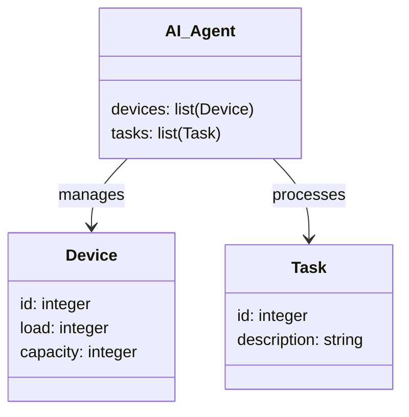
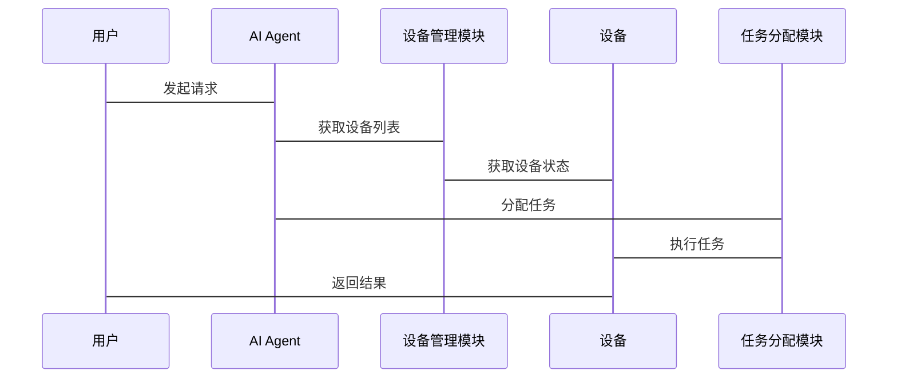

                 


# 企业AI Agent的多设备支持策略：PC到IoT的全覆盖

---

> **关键词**: 企业AI Agent, 多设备支持, PC, IoT, 人工智能, 设备集成

> **摘要**: 本文深入探讨了企业在实现AI Agent多设备支持策略时的关键问题，从PC端到物联网设备的全覆盖策略，分析了AI Agent的核心概念、算法原理、系统架构、项目实战及最佳实践，为企业在多设备环境下的AI Agent应用提供了全面的技术指导。

---

# 1. 企业AI Agent的背景与概念

## 1.1 AI Agent的基本概念

### 1.1.1 AI Agent的定义与特点

AI Agent（人工智能代理）是一种能够感知环境、自主决策并执行任务的智能实体。它通过传感器获取信息，利用算法进行分析和决策，并通过执行器与环境交互。AI Agent的特点包括自主性、反应性、目标导向和学习能力。

### 1.1.2 企业AI Agent的应用场景

企业AI Agent广泛应用于智能客服、自动化办公、设备监控、数据分析等领域。例如，在智能客服中，AI Agent可以自动处理客户咨询和问题解决；在设备监控中，AI Agent可以实时分析设备状态并预测维护需求。

### 1.1.3 多设备支持的必要性

随着企业数字化转型的深入，设备种类和数量急剧增加。AI Agent需要能够支持从PC到物联网设备（IoT）的多种设备，以满足企业全场景的需求。

---

## 1.2 多设备环境下的AI Agent

### 1.2.1 多设备环境的定义

多设备环境是指包含多种设备类型和数量的计算环境，包括PC、手机、传感器、智能家居设备等。这些设备通过网络互联，形成一个复杂的生态系统。

### 1.2.2 PC到IoT设备的演进

从PC到IoT设备的演进过程中，AI Agent需要适应设备性能差异、网络环境变化以及用户交互方式的多样化。例如，PC端AI Agent可能需要处理复杂的计算任务，而IoT设备上的AI Agent则需要低功耗和实时响应。

### 1.2.3 多设备支持的挑战与机遇

多设备支持的挑战包括设备异构性、网络延迟、数据同步等问题。然而，这也为企业提供了跨设备协同工作的机遇，例如智能家居中的设备联动和工业物联网中的实时监控。

---

## 1.3 企业AI Agent的多设备支持策略

### 1.3.1 策略的核心目标

企业AI Agent的多设备支持策略旨在实现设备间的无缝协同，确保AI Agent在各种设备上的高效运行，并为用户提供一致的体验。

### 1.3.2 策略的实施步骤

1. **设备兼容性分析**: 确定不同设备的硬件和软件能力，制定适配策略。
2. **通信协议设计**: 设计统一的通信协议，确保设备间的高效交互。
3. **任务分配机制**: 建立动态任务分配机制，优化设备资源利用率。
4. **用户体验优化**: 确保用户在不同设备上的操作体验一致。

### 1.3.3 策略的成功案例

例如，某企业通过AI Agent实现了PC、手机和IoT设备的协同工作，显著提升了工作效率和用户体验。

---

## 1.4 本章小结

本章介绍了企业AI Agent的基本概念、应用场景以及多设备支持的必要性。通过分析多设备环境的特点，提出了企业AI Agent的多设备支持策略，为后续章节的深入探讨奠定了基础。

---

# 2. AI Agent的核心概念与联系

## 2.1 AI Agent的核心概念

### 2.1.1 AI Agent的定义与分类

AI Agent可以分为简单反射型、基于模型的反射型、目标驱动型和效用驱动型。不同类型的AI Agent适用于不同的应用场景。

### 2.1.2 多设备支持的核心要素

多设备支持的核心要素包括设备识别、数据同步、任务分配和设备协同。这些要素共同确保AI Agent在多设备环境中的高效运行。

### 2.1.3 AI Agent与多设备环境的关系

AI Agent通过感知和控制多设备环境，实现设备间的协同工作。多设备环境为AI Agent提供了丰富的交互场景和数据来源。

---

## 2.2 多设备环境下的实体关系

### 2.2.1 实体关系图的构建

通过构建实体关系图，明确了AI Agent、设备、用户和环境之间的关系。例如，AI Agent可以连接到多个设备，并为用户提供服务。

### 2.2.2 设备与AI Agent的关系

设备与AI Agent之间的关系可以是设备驱动型或AI Agent驱动型。设备驱动型AI Agent依赖设备的硬件能力，而AI Agent驱动型则通过软件实现设备控制。

### 2.2.3 用户与设备的关系

用户通过设备与AI Agent交互，设备作为用户与AI Agent的桥梁，提供输入和输出接口。

---

## 2.3 多设备环境下的AI Agent算法原理

### 2.3.1 算法原理的简要介绍

AI Agent在多设备环境中的算法原理包括感知、决策和执行三个阶段。感知阶段通过传感器获取数据，决策阶段通过算法进行分析和选择，执行阶段通过执行器完成操作。

### 2.3.2 算法原理的详细分析

以下是AI Agent的算法流程：

1. **感知环境**: 通过传感器获取设备状态和用户需求。
2. **分析数据**: 利用机器学习算法分析数据，识别模式和趋势。
3. **决策制定**: 根据分析结果制定任务分配和设备协同策略。
4. **执行操作**: 通过执行器完成决策操作。

### 2.3.3 算法原理的数学模型

以下是AI Agent决策算法的数学模型：

$$
\text{决策} = \argmax_{a} \sum_{i=1}^{n} w_i x_i
$$

其中，\(w_i\)是权重，\(x_i\)是输入特征。

---

## 2.4 本章小结

本章详细介绍了AI Agent的核心概念、多设备环境下的实体关系以及算法原理。通过数学模型和流程图的展示，为后续章节的系统设计奠定了理论基础。

---

# 3. 多设备环境下AI Agent的算法原理

## 3.1 算法原理概述

### 3.1.1 算法的基本原理

AI Agent在多设备环境中的算法基于分布式计算和协同工作。通过分布式计算，AI Agent能够高效地处理来自多个设备的数据。

### 3.1.2 算法的核心思想

AI Agent通过任务分配算法实现设备间的协同。任务分配算法根据设备的能力和当前负载，动态分配任务以优化整体性能。

### 3.1.3 算法的实现步骤

1. **设备识别与分类**: 识别设备类型和能力。
2. **任务分配**: 根据设备负载和能力分配任务。
3. **设备协同**: 设备间通过通信协议协同完成任务。

---

## 3.2 算法的详细分析

### 3.2.1 算法的输入输出

- **输入**: 设备列表、任务列表。
- **输出**: 任务分配结果。

### 3.2.2 算法的中间过程

以下是任务分配算法的伪代码：

```python
def distribute_tasks(devices, tasks):
    for device in devices:
        load = device.load
        capacity = device.capacity
        if load < capacity:
            assign task to device
```

### 3.2.3 算法的优化方法

通过负载均衡算法优化任务分配，确保设备的高效利用。例如，使用轮询算法或基于权重的分配算法。

---

## 3.3 算法的数学模型与公式

### 3.3.1 数学模型的建立

以下是任务分配的优化模型：

$$
\text{Minimize} \sum_{i=1}^{n} (t_i - a_i)^2
$$

其中，\(t_i\)是任务的期望完成时间，\(a_i\)是实际完成时间。

### 3.3.2 数学公式的推导

通过求解上述优化模型，可以得到最优的任务分配方案。

---

## 3.4 算法的实现与代码示例

### 3.4.1 算法的Python实现

以下是任务分配算法的Python代码示例：

```python
class Device:
    def __init__(self, id, load, capacity):
        self.id = id
        self.load = load
        self.capacity = capacity

def distribute_tasks(devices, tasks):
    for device in devices:
        if device.load < device.capacity:
            # Assign task to device
            pass
```

### 3.4.2 代码的详细解读

上述代码定义了设备类和任务分配函数。任务分配函数遍历所有设备，根据设备的负载和容量动态分配任务。

---

## 3.5 本章小结

本章详细分析了多设备环境下AI Agent的算法原理，包括任务分配算法、设备协同机制和数学模型。通过代码示例和公式推导，帮助读者深入理解算法实现。

---

# 4. 多设备环境下AI Agent的系统架构设计

## 4.1 系统分析与需求分析

### 4.1.1 系统功能需求

系统需要实现设备识别、任务分配、设备协同和用户交互功能。

### 4.1.2 系统性能需求

系统需要支持高并发、低延迟和高可用性。

---

## 4.2 系统功能设计

### 4.2.1 领域模型设计

以下是领域模型的Mermaid类图：



### 4.2.2 系统架构设计

以下是系统架构的Mermaid图：

```mermaid
client
   |---> HTTP请求
    `-> AI Agent
    |---> 设备管理模块
    |---> 任务分配模块
    `-> 用户交互模块
```

### 4.2.3 系统接口设计

系统接口包括设备注册接口、任务分配接口和用户交互接口。

### 4.2.4 系统交互流程

以下是系统交互流程的Mermaid序列图：



---

## 4.3 本章小结

本章通过系统分析和架构设计，明确了AI Agent在多设备环境中的系统架构和交互流程。通过类图和序列图的展示，帮助读者理解系统的整体结构。

---

# 5. 多设备环境下AI Agent的项目实战

## 5.1 项目背景介绍

### 5.1.1 项目目标

实现一个支持多设备的AI Agent系统，能够动态分配任务并协同完成。

### 5.1.2 项目需求

支持PC、手机和IoT设备，实现设备识别、任务分配和设备协同功能。

---

## 5.2 系统核心实现

### 5.2.1 环境搭建

安装必要的库和工具，例如Python、Flask、MQTT等。

### 5.2.2 核心功能实现

以下是任务分配模块的Python代码示例：

```python
import mqtt

def on_message(client, userdata, message):
    # 处理消息
    pass

client = mqtt.Client()
client.on_message = on_message
client.connect("localhost", 1883)
client.subscribe("tasks")
client.loop_start()
```

### 5.2.3 代码实现与解读

上述代码展示了MQTT协议的使用，用于设备间的消息通信。

---

## 5.3 项目部署与测试

### 5.3.1 系统部署

在多设备环境中部署AI Agent系统，确保设备间的通信和任务分配正常。

### 5.3.2 系统测试

进行功能测试、性能测试和用户体验测试，确保系统稳定性和用户体验。

---

## 5.4 实际案例分析

### 5.4.1 案例背景

某企业部署了AI Agent系统，支持PC、手机和智能家居设备。

### 5.4.2 案例分析

通过AI Agent系统，企业实现了设备间的协同工作，提升了效率和用户体验。

---

## 5.5 本章小结

本章通过项目实战，详细展示了AI Agent在多设备环境中的实现过程。通过代码示例和案例分析，帮助读者掌握系统的实际应用。

---

# 6. 多设备环境下AI Agent的最佳实践

## 6.1 最佳实践建议

### 6.1.1 设备兼容性

确保AI Agent支持多种设备类型，包括PC、手机和IoT设备。

### 6.1.2 网络优化

优化设备间的通信协议，降低网络延迟和数据丢失。

### 6.1.3 安全管理

加强设备和数据的安全管理，防止未经授权的访问。

---

## 6.2 小结与总结

### 6.2.1 小结

本章总结了AI Agent在多设备环境中的最佳实践，包括设备兼容性、网络优化和安全管理。

### 6.2.2 总结

通过本文的深入探讨，读者可以全面了解企业AI Agent的多设备支持策略，并掌握实际应用中的关键点。

---

## 6.3 注意事项

### 6.3.1 设备兼容性问题

确保AI Agent能够适应不同设备的硬件和软件能力。

### 6.3.2 数据同步问题

制定有效的数据同步机制，避免数据冲突和不一致。

### 6.3.3 安全问题

加强设备和数据的安全管理，防止数据泄露和设备被攻击。

---

## 6.4 拓展阅读

### 6.4.1 推荐书籍

1. 《人工智能：一种现代的方法》
2. 《分布式系统：概念与设计》

### 6.4.2 推荐博客

1. [AI Agent技术博客](https://example.com)
2. [IoT技术博客](https://example.com)

---

# 作者

作者：AI天才研究院/AI Genius Institute & 禅与计算机程序设计艺术 /Zen And The Art of Computer Programming

