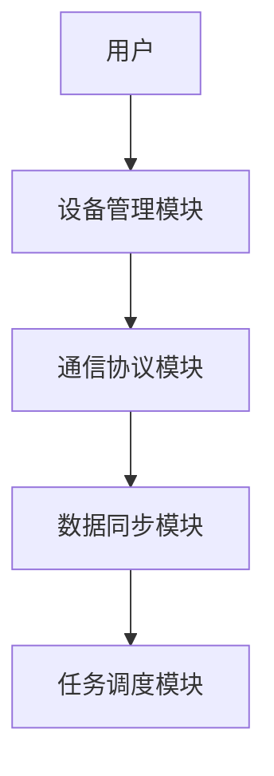
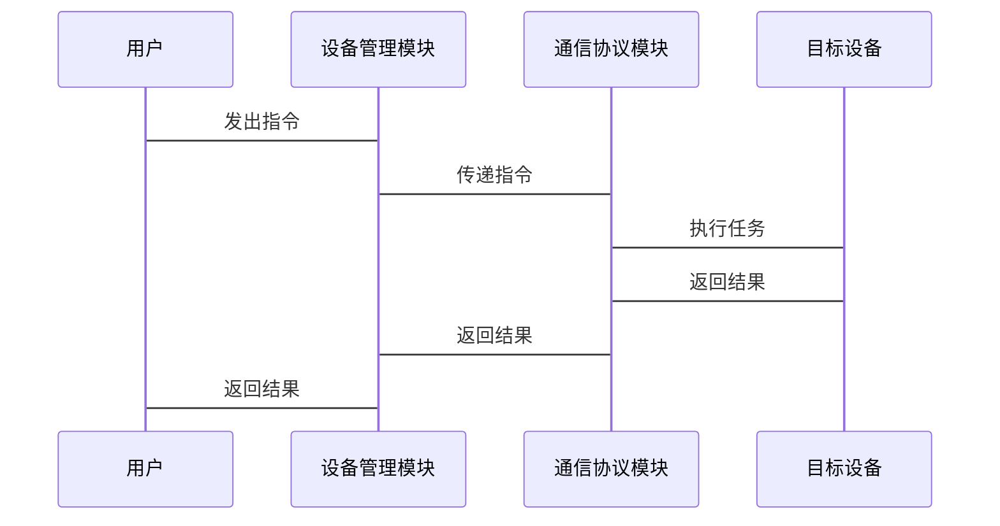

                 


# 企业AI Agent的多设备支持：PC、移动端到IoT设备

**关键词**：AI Agent, 多设备支持, IoT设备, 企业智能化, 跨设备协作

**摘要**：  
随着企业智能化转型的深入，AI Agent（人工智能代理）在多设备环境中的应用变得越来越重要。本文详细探讨了AI Agent在PC、移动端和IoT设备上的支持，从核心概念、技术基础到算法原理、系统架构设计，再到项目实战和优化与扩展，全面分析了AI Agent在多设备环境中的实现与应用。通过实际案例和代码示例，本文为读者提供了从理论到实践的完整指南，帮助企业在多设备环境下更好地部署和管理AI Agent。

---

## 第1章: 企业AI Agent的背景与问题背景

### 1.1 问题背景与问题描述

#### 1.1.1 企业智能化转型的需求
企业智能化转型是当前科技发展的主要趋势之一。随着人工智能技术的快速发展，企业希望通过智能化工具提升效率、降低成本，并增强客户体验。AI Agent作为一种能够自主执行任务的智能代理，成为企业实现智能化转型的重要工具。

#### 1.1.2 AI Agent在企业中的应用场景
AI Agent在企业中的应用场景广泛，包括智能客服、智能助手、设备管理、数据分析等。例如，在智能客服场景中，AI Agent可以自动处理客户的咨询和投诉，提升服务效率；在设备管理场景中，AI Agent可以实时监控设备状态，预测并解决潜在问题。

#### 1.1.3 多设备支持的必要性
在现代企业环境中，设备种类繁多，包括PC、手机、平板、IoT设备等。AI Agent需要能够支持多种设备，实现跨设备协作，才能满足企业的多样化需求。例如，在智能家居场景中，AI Agent需要能够同时控制智能灯泡、智能音箱和智能门锁等设备。

### 1.2 问题解决与边界

#### 1.2.1 AI Agent如何解决多设备协作问题
AI Agent通过跨设备协作机制，实现设备间的无缝通信与数据共享。例如，当用户在手机上发出指令时，AI Agent可以通过云平台将指令传递到PC或IoT设备上执行。

#### 1.2.2 多设备支持的边界与外延
多设备支持的边界在于设备间的通信协议和数据格式的统一。外延则包括设备的兼容性测试、性能优化和安全性保障。

#### 1.2.3 核心要素与组成结构
AI Agent的多设备支持系统由以下几个核心要素组成：
1. 设备管理模块：负责设备的注册、认证和管理。
2. 通信协议模块：实现设备间的通信与数据交换。
3. 数据同步模块：保证设备间数据的一致性。
4. 任务调度模块：根据设备状态和任务需求，动态分配任务。

### 1.3 核心概念与联系

#### 1.3.1 AI Agent的定义与属性特征对比表格

| **属性**       | **定义**                                                                 |
|-----------------|--------------------------------------------------------------------------|
| 定义            | AI Agent是一种能够自主执行任务的智能代理，能够根据环境信息做出决策并执行操作。 |
| 任务驱动        | AI Agent通过接收任务指令并执行任务，实现目标。                     |
| 跨设备协作      | AI Agent能够与多种设备协作，实现跨设备的任务执行。                 |
| 自主性          | AI Agent能够自主决策，无需人工干预。                                 |

#### 1.3.2 ER实体关系图架构的 Mermaid 流程图

```mermaid
er
    entity 设备 {
        key 设备ID
        属性 设备类型
        属性 设备状态
    }
    entity 用户 {
        key 用户ID
        属性 用户名
        关系 对应的设备 (n:1)
    }
    entity 任务 {
        key 任务ID
        属性 任务类型
        属性 任务状态
        关系 执行设备 (n:1)
    }
    设备 --> 用户: 用户拥有设备
    设备 --> 任务: 设备执行任务
```

---

## 第2章: AI Agent的核心概念与体系结构

### 2.1 AI Agent的定义与体系结构

#### 2.1.1 AI Agent的定义
AI Agent是一种能够感知环境、自主决策并执行任务的智能代理。它通过与用户或其他系统的交互，完成特定的目标。

#### 2.1.2 AI Agent的体系结构
AI Agent的体系结构通常包括以下几个部分：
1. 感知层：负责感知环境信息，例如通过传感器或API获取数据。
2. 决策层：根据感知到的信息，通过算法做出决策。
3. 执行层：根据决策结果，执行相应的操作。

#### 2.1.3 AI Agent与传统智能终端的区别
| **属性**       | **AI Agent**         | **传统智能终端**       |
|-----------------|----------------------|-------------------------|
| 自主性          | 高                   | 低                     |
| 任务驱动        | 是                   | 否                     |
| 跨设备协作      | 是                   | 否                     |
| 智能性          | 高                   | 低                     |

### 2.2 跨设备协作的机制

#### 2.2.1 跨设备协作的核心原理
AI Agent通过设备间的通信协议和数据共享，实现跨设备协作。例如，当用户在手机上发出指令时，AI Agent可以通过云平台将指令传递到PC或IoT设备上执行。

#### 2.2.2 设备间通信协议
设备间通信协议是实现跨设备协作的关键。常用的通信协议包括HTTP、WebSocket、MQTT等。

#### 2.2.3 数据同步与一致性保障
为了保证设备间数据的一致性，AI Agent需要实现数据同步机制。例如，通过区块链技术实现设备间的数据同步和一致性保障。

---

## 第3章: AI Agent的技术基础

### 3.1 自然语言处理技术

#### 3.1.1 NLP的核心技术
自然语言处理技术是AI Agent实现人机交互的核心技术。常用的NLP技术包括分词、句法分析、情感分析等。

#### 3.1.2 NLP在AI Agent中的应用
在AI Agent中，NLP技术主要用于实现语音识别、语义理解和对话生成。例如，用户通过语音指令控制设备，AI Agent通过NLP技术解析指令并执行相应的操作。

### 3.2 知识图谱与推理引擎

#### 3.2.1 知识图谱的构建
知识图谱是AI Agent实现智能决策的基础。通过构建知识图谱，AI Agent能够理解和推理复杂的语义信息。

#### 3.2.2 推理引擎的工作原理
推理引擎通过基于知识图谱的推理算法，实现智能决策。常用的推理算法包括逻辑推理、概率推理等。

---

## 第4章: AI Agent的算法原理

### 4.1 对话生成算法

#### 4.1.1 对话生成算法的原理
对话生成算法是AI Agent实现人机交互的核心算法。常用的对话生成算法包括基于规则的算法、统计模型和深度学习模型。

#### 4.1.2 对话生成算法的实现步骤

1. **输入处理**：接收用户的输入，例如语音或文本指令。
2. **语义理解**：通过NLP技术解析用户的意图。
3. **生成响应**：根据用户的意图，生成相应的回复。
4. **输出响应**：将回复返回给用户。

#### 4.1.3 对话生成算法的代码示例

```python
import numpy as np
from tensorflow.keras.models import Model
from tensorflow.keras.layers import Input, LSTM, Dense

# 输入数据
input_sequence = Input(shape=(None, input_dim))
# 编码器
encoder_lstm = LSTM(units=hidden_size, return_sequences=True, return_state=True)
encoder_outputs, encoder_states = encoder_lstm(input_sequence)
# 解码器
decoder_lstm = LSTM(units=hidden_size, return_sequences=True, return_state=True)
decoder_outputs, _, _ = decoder_lstm(decoder_input, initial_state=encoder_states)
# 输出层
dense_layer = Dense(output_dim, activation='softmax')
output = dense_layer(decoder_outputs)
# 模型定义
model = Model(inputs=[input_sequence, decoder_input], outputs=output)
model.compile(...)
```

#### 4.1.4 对话生成算法的数学模型和公式
对话生成算法的数学模型通常基于概率论和深度学习。例如，序列到序列模型的损失函数可以表示为：

$$
\text{loss} = -\sum_{t=1}^{T} \log P(y_t | y_{<t}, x)
$$

其中，$y_t$是生成的输出，$x$是输入，$T$是序列长度。

---

## 第5章: AI Agent的系统架构设计

### 5.1 问题场景介绍

#### 5.1.1 系统介绍
AI Agent的多设备支持系统由设备管理模块、通信协议模块、数据同步模块和任务调度模块组成。

#### 5.1.2 系统功能设计
系统功能包括设备注册、设备认证、设备通信、数据同步和任务调度。

### 5.2 系统架构设计

#### 5.2.1 系统架构图


#### 5.2.2 系统架构设计的详细描述
系统架构设计包括以下几个部分：
1. 设备管理模块：负责设备的注册、认证和管理。
2. 通信协议模块：实现设备间的通信与数据交换。
3. 数据同步模块：保证设备间数据的一致性。
4. 任务调度模块：根据设备状态和任务需求，动态分配任务。

### 5.3 接口设计与交互流程

#### 5.3.1 系统接口设计
系统接口包括设备注册接口、设备通信接口、数据同步接口和任务调度接口。

#### 5.3.2 交互流程
1. 用户发出指令，设备管理模块接收指令。
2. 设备管理模块通过通信协议模块将指令传递到目标设备。
3. 目标设备执行任务并返回结果。
4. 数据同步模块同步设备间的数据。

#### 5.3.3 交互流程的详细描述


---

## 第6章: AI Agent的项目实战

### 6.1 环境配置

#### 6.1.1 开发环境配置
开发环境包括Python、TensorFlow、Keras等工具。

#### 6.1.2 依赖库安装
安装必要的依赖库，例如numpy、tensorflow、keras等。

### 6.2 核心代码实现

#### 6.2.1 设备管理模块的实现
```python
class DeviceManager:
    def __init__(self):
        self.devices = {}

    def register_device(self, device_id, device_type):
        self.devices[device_id] = device_type

    def get_device_type(self, device_id):
        return self.devices.get(device_id, None)
```

#### 6.2.2 通信协议模块的实现
```python
class CommunicationProtocol:
    def __init__(self):
        self.protocols = {'HTTP': HTTPProtocol(), 'WebSocket': WebSocketProtocol()}

    def send_command(self, device_id, command):
        protocol = self.protocols.get(protocol_type, None)
        if protocol:
            protocol.send(device_id, command)
```

#### 6.2.3 数据同步模块的实现
```python
class DataSynchronizer:
    def __init__(self):
        self.data = {}

    def synchronize_data(self, device_id, data):
        self.data[device_id] = data

    def get_data(self, device_id):
        return self.data.get(device_id, None)
```

#### 6.2.4 任务调度模块的实现
```python
class TaskScheduler:
    def __init__(self):
        self.tasks = []

    def schedule_task(self, device_id, task):
        self.tasks.append((device_id, task))

    def execute_task(self, device_id):
        for task in self.tasks:
            if task.device_id == device_id:
                execute_task(task)
```

### 6.3 功能实现与案例分析

#### 6.3.1 功能实现
AI Agent的多设备支持系统实现了设备注册、设备通信、数据同步和任务调度功能。

#### 6.3.2 案例分析
以智能家居场景为例，AI Agent可以通过设备管理模块注册智能灯泡、智能音箱和智能门锁等设备，并通过通信协议模块实现设备间的通信与协作。

### 6.4 项目总结与经验分享

#### 6.4.1 项目总结
通过本项目，我们实现了AI Agent的多设备支持系统，验证了跨设备协作的可行性。

#### 6.4.2 经验分享
在项目实施过程中，需要注意设备间的通信协议统一和数据同步的实现。

---

## 第7章: AI Agent的优化与扩展

### 7.1 性能优化

#### 7.1.1 设备间通信的优化
通过优化通信协议和减少数据传输量，可以提高设备间的通信效率。

#### 7.1.2 数据同步的优化
通过采用分布式锁机制，可以保证设备间数据的一致性。

### 7.2 设备协同与扩展

#### 7.2.1 新设备的接入
通过设备管理模块，可以方便地接入新的设备类型。

#### 7.2.2 设备协同的实现
通过改进通信协议和任务调度算法，可以提高设备间的协同效率。

### 7.3 安全性与可靠性

#### 7.3.1 安全性的保障
通过加密通信和身份认证，可以保障设备间的通信安全。

#### 7.3.2 系统的可靠性
通过冗余设计和故障容错机制，可以提高系统的可靠性。

### 7.4 拓展阅读与深入学习

#### 7.4.1 相关技术
建议深入学习多设备协作、边缘计算和分布式系统等相关技术。

#### 7.4.2 未来发展方向
未来，AI Agent的多设备支持将更加智能化和自动化。

---

## 第8章: 总结与展望

### 8.1 总结

#### 8.1.1 核心内容回顾
本文详细探讨了AI Agent在多设备环境中的实现与应用，包括核心概念、技术基础、算法原理、系统架构设计、项目实战和优化与扩展。

#### 8.1.2 关键点总结
AI Agent的多设备支持需要实现设备间的通信与协作，同时需要考虑设备的兼容性、数据同步和安全性等问题。

### 8.2 未来展望

#### 8.2.1 未来的技术趋势
随着人工智能和物联网技术的不断发展，AI Agent的多设备支持将更加智能化和自动化。

#### 8.2.2 可能的研究方向
未来的研究方向包括多设备协作的优化、设备间的智能协同和边缘计算的应用等。

---

## 作者：AI天才研究院/AI Genius Institute & 禅与计算机程序设计艺术 /Zen And The Art of Computer Programming

---

**摘要**：本文详细探讨了AI Agent在多设备环境中的实现与应用，包括核心概念、技术基础、算法原理、系统架构设计、项目实战和优化与扩展。通过实际案例和代码示例，本文为读者提供了从理论到实践的完整指南，帮助企业在多设备环境下更好地部署和管理AI Agent。

