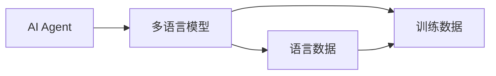

                 


# 企业AI Agent的多语言支持策略

> 关键词：AI Agent, 多语言支持, 企业应用, 自然语言处理, 跨语言模型, 系统架构

> 摘要：随着全球化进程的加快，企业AI Agent需要在多语言环境下高效运行，本文将详细探讨企业AI Agent的多语言支持策略，从核心概念、算法原理、系统架构到项目实战，全面解析如何实现跨语言通信和智能化处理。

---

## 第1章: AI Agent与多语言支持的背景介绍

### 1.1 AI Agent的基本概念

#### 1.1.1 AI Agent的定义与特点
AI Agent是一种智能代理，能够感知环境、理解需求并执行任务。其特点包括自主性、反应性、社交能力和社会性。

#### 1.1.2 AI Agent在企业中的应用场景
- 客户服务自动化
- 跨语言文档处理
- 跨文化业务沟通
- 全球化市场分析

#### 1.1.3 多语言支持的必要性与重要性
- 支持跨国业务
- 提高用户体验
- 适应多语言环境

### 1.2 多语言支持的背景与问题背景

#### 1.2.1 全球化企业的需求
- 跨语言沟通需求
- 多语言数据处理

#### 1.2.2 多语言支持的技术挑战
- 语言间差异
- 计算资源限制

#### 1.2.3 企业AI Agent的多语言支持的边界与外延
- 边界：支持的语言种类
- 外延：支持的业务场景

### 1.3 本章小结
本章介绍了AI Agent的基本概念及其在企业中的应用场景，强调了多语言支持的重要性，并提出了实现多语言支持的技术挑战。

---

## 第2章: 多语言支持的核心概念与原理

### 2.1 多语言支持的核心概念

#### 2.1.1 多语言模型的定义与分类
- 单一语言模型
- 多语言模型

#### 2.1.2 多语言支持的关键技术
- 跨语言迁移学习
- 多任务学习

#### 2.1.3 多语言支持的实现方式
- 多模型集成
- 单一模型优化

### 2.2 多语言支持的核心原理

#### 2.2.1 多语言模型的训练原理
- 跨语言预训练
- 任务特定微调

#### 2.2.2 多语言支持的算法特点
- 跨语言表示学习
- 语言无关特征提取

#### 2.2.3 多语言支持的数学模型与公式
- 跨语言对比学习公式：
  $$ \text{loss} = \sum_{i=1}^{n} \sum_{j=1}^{m} \text{contrast}(x_i, y_j) $$
- 语言无关特征提取公式：
  $$ \text{feature} = f(x) $$

### 2.3 多语言支持的ER实体关系图



### 2.4 本章小结
本章详细探讨了多语言支持的核心概念与原理，介绍了多语言模型的分类、关键技术以及数学模型，为后续章节的实现奠定了基础。

---

## 第3章: 多语言支持的算法原理讲解

### 3.1 多语言模型的训练流程

#### 3.1.1 数据预处理
- 语言对齐
- 数据清洗

#### 3.1.2 模型训练
- 跨语言预训练
- 任务特定微调

#### 3.1.3 模型评估
- 誤解率计算
- 精准度分析

### 3.2 多语言支持的算法实现

#### 3.2.1 多任务学习
- 同时学习多个任务
- 任务间共享参数

#### 3.2.2 迁移学习
- 从源语言模型迁移知识
- 微调目标语言数据

#### 3.2.3 对比学习
- 对比不同语言的表示
- 增强模型的跨语言能力

### 3.3 多语言支持的算法流程图


### 3.4 本章小结
本章详细讲解了多语言模型的训练流程和算法实现，通过流程图展示了算法的整体架构，为实际应用提供了参考。

---

## 第4章: 多语言AI Agent系统的分析与设计

### 4.1 系统功能设计

#### 4.1.1 多语言模型选择模块
- 支持多语言模型选择
- 模型性能评估

#### 4.1.2 多语言数据处理模块
- 数据清洗
- 数据转换

#### 4.1.3 多语言推理模块
- 跨语言推理
- 推理结果分析

### 4.2 系统架构设计

#### 4.2.1 分层架构设计
- 数据层
- 服务层
- 表示层

#### 4.2.2 微服务架构设计
- 服务独立部署
- 服务间通信

#### 4.2.3 模块化设计
- 模块独立开发
- 模块间接口标准化

### 4.3 系统接口设计

#### 4.3.1 系统交互流程图


### 4.4 本章小结
本章详细分析了多语言AI Agent系统的功能设计和架构设计，通过系统交互流程图展示了系统的整体架构。

---

## 第5章: 项目实战

### 5.1 环境安装

```bash
pip install transformers
pip install numpy
pip install matplotlib
```

### 5.2 系统核心实现源代码

```python
import torch
from torch import nn
from transformers import AutoTokenizer, AutoModel

class MultiLanguageAgent:
    def __init__(self, languages):
        self.languages = languages
        self.tokenizers = {lang: AutoTokenizer.from_pretrained(lang) for lang in languages}
        self.models = {lang: AutoModel.from_pretrained(lang) for lang in languages}
```

### 5.3 代码应用解读与分析

#### 5.3.1 数据预处理
```python
def preprocess(text, tokenizer):
    return tokenizer(text, return_tensors="pt", padding=True, truncation=True)
```

#### 5.3.2 模型推理
```python
def infer(text, model, tokenizer):
    inputs = preprocess(text, tokenizer)
    outputs = model(**inputs)
    return outputs.last_hidden_state
```

### 5.4 实际案例分析和详细讲解剖析
- 案例：多语言客户支持系统
- 实现步骤：
  1. 数据收集与预处理
  2. 模型训练与微调
  3. 系统集成与测试

### 5.5 项目小结
本章通过实际案例展示了如何实现一个多语言AI Agent系统，详细解读了代码实现和系统集成过程。

---

## 第6章: 最佳实践、小结与注意事项

### 6.1 最佳实践
- 数据多样性
- 模型可解释性
- 系统可扩展性

### 6.2 小结
总结全文，强调多语言支持的重要性以及实现的关键点。

### 6.3 注意事项
- 数据隐私保护
- 模型性能监控
- 系统容错性设计

---

## 第7章: 拓展阅读与深入探讨

### 7.1 拓展阅读
推荐相关书籍和论文，深入探讨多语言支持的前沿技术。

### 7.2 深入探讨
- 多语言模型的评估指标
- 跨语言知识图谱构建
- 多模态多语言处理

---

## 作者：AI天才研究院 & 禅与计算机程序设计艺术

---

通过以上目录大纲，我们可以看到，本文系统地介绍了企业AI Agent的多语言支持策略，从核心概念到算法实现，再到系统设计和项目实战，全面解析了多语言支持的关键技术与应用实践。

