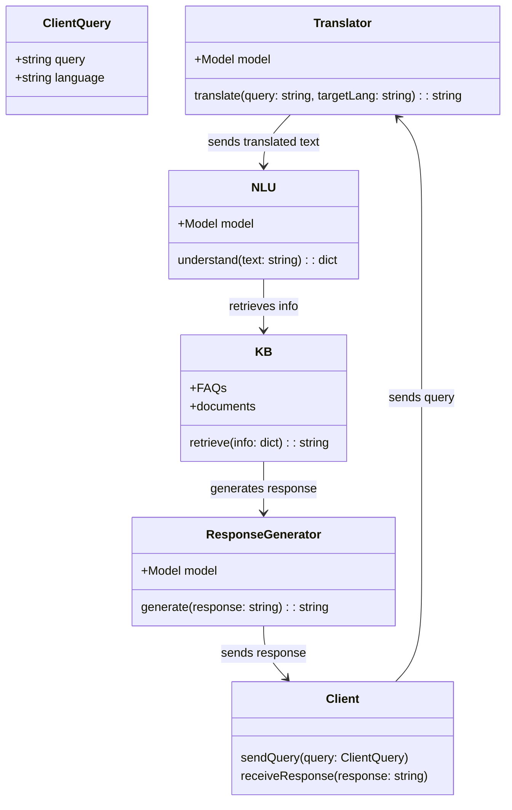
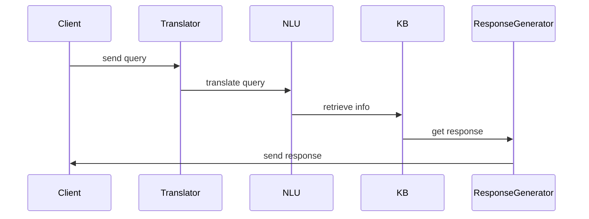

                 


# 企业AI Agent的多语言支持：跨国业务助手

**关键词**：企业AI Agent、多语言支持、跨国业务、自然语言处理、机器翻译、跨语言对话系统

**摘要**：随着全球化的发展，企业在全球范围内的业务扩展对AI Agent的多语言支持提出了更高的要求。本文详细探讨了企业AI Agent在多语言环境下的实现技术，分析了跨语言信息处理的核心挑战，并提供了实际应用中的解决方案。文章从自然语言处理基础、多语言模型的选择与集成、系统架构设计等方面展开，结合实际案例，为企业构建支持跨国业务的AI Agent提供了系统的指导和实践参考。

---

# 企业AI Agent的多语言支持：跨国业务助手

## 第一部分：企业AI Agent的多语言支持概述

### 第1章：企业AI Agent与多语言支持概述

#### 1.1 什么是企业AI Agent
企业AI Agent（Artificial Intelligence Agent）是一种智能助手，用于辅助企业完成各种任务，如客户服务、信息检索、流程自动化等。AI Agent能够理解用户需求，执行复杂操作，并以自然语言与用户交互。

##### 1.1.1 AI Agent的基本概念
- **定义**：AI Agent是一个智能实体，能够感知环境、执行任务并进行自主决策。
- **核心功能**：包括信息检索、任务执行、用户交互、数据处理等。

##### 1.1.2 企业AI Agent的核心功能
- **客户支持**：通过多语言对话解决客户问题。
- **信息处理**：分析多语言文档，提取关键信息。
- **流程自动化**：跨语言协调企业内部流程。

##### 1.1.3 多语言支持的重要性
- **全球市场覆盖**：支持多种语言，服务全球客户。
- **跨国协作**：支持不同语言的团队协作。
- **提升用户体验**：为用户提供母语化的服务体验。

#### 1.2 跨国业务中的语言挑战
跨国业务涉及多种语言和文化差异，给AI Agent带来了诸多挑战。

##### 1.2.1 跨国业务的复杂性
- **多语言环境**：客户可能使用多种语言进行沟通。
- **文化差异**：不同语言背后的文化差异影响沟通效果。

##### 1.2.2 多语言支持的必要性
- **提升效率**：减少因语言障碍导致的沟通错误。
- **增强客户满意度**：提供母语化服务提升客户体验。
- **扩大市场覆盖**：支持多种语言可以开拓更多市场。

##### 1.2.3 语言障碍对企业效率的影响
- **信息误解**：语言障碍可能导致信息传递错误。
- **沟通延迟**：语言不通导致沟通效率降低。
- **客户流失**：无法提供多语言支持可能导致客户流失。

#### 1.3 企业AI Agent的多语言支持场景
AI Agent在跨国业务中的多语言支持场景多样。

##### 1.3.1 客户服务中的多语言对话
- **实时翻译**：AI Agent实时翻译客户语言，提供准确回复。
- **多语言知识库**：支持多种语言的知识库，确保回答准确性。

##### 1.3.2 跨境贸易中的文档处理
- **多语言文档分析**：AI Agent能够理解并处理多种语言的合同、订单等文档。
- **跨语言信息提取**：从不同语言的文档中提取关键信息。

##### 1.3.3 跨文化沟通中的语言适配
- **文化敏感性**：AI Agent需理解不同语言背后的文化差异。
- **语言风格调整**：根据目标语言调整沟通风格，如正式或非正式语气。

#### 1.4 本章小结
本章介绍了企业AI Agent的基本概念及其在多语言环境下的重要性，分析了跨国业务中的语言挑战，并列举了AI Agent在多语言支持中的应用场景。

---

## 第二部分：多语言支持的核心技术

### 第2章：自然语言处理基础

#### 2.1 自然语言处理概述
自然语言处理（NLP）是实现AI Agent多语言支持的核心技术。

##### 2.1.1 NLP的基本概念
- **定义**：NLP是研究计算机如何处理人类语言的科学。
- **核心任务**：包括文本分类、实体识别、句法分析、语义理解等。

##### 2.1.2 NLP的核心任务
- **文本处理**：如分词、句法分析。
- **信息提取**：如实体识别、关系抽取。
- **文本生成**：如机器翻译、文本摘要。

##### 2.1.3 NLP在企业中的应用
- **客户服务**：通过NLP技术处理客户咨询。
- **文档处理**：分析多语言文档提取关键信息。
- **内部沟通**：支持内部团队的跨语言协作。

#### 2.2 多语言NLP的挑战
多语言NLP在技术和资源上面临诸多挑战。

##### 2.2.1 不同语言的语法规则差异
- **语言多样性**：不同语言的语法规则差异大，增加了模型训练的复杂性。
- **数据稀缺性**：某些语言的数据量有限，影响模型性能。

##### 2.2.2 跨语言信息处理的复杂性
- **术语一致性**：跨语言术语的一致性处理。
- **文化差异**：不同语言背后的文化差异影响信息处理。

##### 2.2.3 多语言模型的训练难度
- **计算资源需求**：多语言模型需要大量的计算资源。
- **模型泛化能力**：如何在多种语言上实现良好的泛化能力。

#### 2.3 多语言NLP的技术进展
近年来，多语言NLP技术取得了显著进展。

##### 2.3.1 多语言模型的发展历程
- **早期研究**：专注于单一语言的NLP任务。
- **跨语言研究**：逐渐关注跨语言信息处理。
- **多语言模型的兴起**：如XLM、mBert等模型的出现。

##### 2.3.2 当前主流的多语言NLP框架
- **开源框架**：如Hugging Face的Transformers库。
- **主流模型**：如XLM、mBert、sentence-BERT等。

##### 2.3.3 多语言模型的评估指标
- **BLEU**：用于机器翻译的评估。
- **ACC**：用于分类任务的准确率评估。
- **F1分数**：用于实体识别等任务的评估。

#### 2.4 本章小结
本章介绍了自然语言处理的基本概念及其在企业AI Agent中的应用，分析了多语言NLP的挑战，并总结了当前的技术进展。

---

### 第3章：跨语言信息处理技术

#### 3.1 机器翻译技术
机器翻译是实现跨语言信息处理的关键技术。

##### 3.1.1 机器翻译的基本原理
- **定义**：将一种语言的文本转换为另一种语言的文本。
- **核心技术**：如神经机器翻译（NMT）。

##### 3.1.2 统计机器翻译与神经机器翻译的对比
| 对比维度      | 统计机器翻译（SMT） | 神经机器翻译（NMT） |
|---------------|---------------------|----------------------|
| 基础          | 统计模型，依赖双语语料库 | 神经网络模型，端到端训练 |
| 效率           | 较低，依赖词典和规则 | 较高，自动优化翻译质量 |
| 精度           | 受限于统计模型的假设 | 更准确，能够捕捉上下文信息 |

##### 3.1.3 机器翻译在企业中的应用
- **客户服务**：实时翻译客户咨询。
- **文档处理**：自动翻译多语言文档。
- **内部沟通**：支持团队内部的跨语言协作。

#### 3.2 跨语言文本理解
跨语言文本理解是实现多语言AI Agent的核心技术。

##### 3.2.1 跨语言文本分析的基本概念
- **定义**：在多种语言环境下分析和理解文本内容。
- **核心技术**：如跨语言实体识别、跨语言情感分析。

##### 3.2.2 基于多语言模型的文本理解
- **多语言模型**：如mBert，可以在多种语言上同时训练，实现跨语言理解。
- **优势**：无需为每种语言单独训练模型，节省资源。

##### 3.2.3 跨语言文本摘要技术
- **技术原理**：将多语言文本进行摘要，提取关键信息。
- **应用**：用于处理多语言文档，提取核心内容。

#### 3.3 跨语言对话系统
跨语言对话系统是实现多语言AI Agent的重要组成部分。

##### 3.3.1 跨语言对话系统的构建
- **核心技术**：结合机器翻译和自然语言理解，实现跨语言对话。
- **挑战**：对话上下文的保持，语言风格的匹配。

##### 3.3.2 对话历史的跨语言记忆
- **技术实现**：将对话历史存储为跨语言的向量表示，方便后续对话处理。
- **优势**：保持对话的连贯性，提高对话质量。

##### 3.3.3 跨语言对话的实时性挑战
- **实时翻译**：需要快速响应，对计算能力要求高。
- **上下文理解**：需要准确理解跨语言对话的上下文。

#### 3.4 本章小结
本章详细介绍了机器翻译、跨语言文本理解和对话系统的技术实现，分析了其在企业AI Agent中的应用。

---

### 第4章：多语言AI Agent的架构设计

#### 4.1 多语言AI Agent的系统架构
多语言AI Agent的系统架构需要模块化设计，确保各模块高效协作。

##### 4.1.1 模块化设计原则
- **模块划分**：将系统划分为输入处理、翻译模块、理解模块、输出模块等。
- **模块接口**：定义清晰的模块接口，确保模块间高效通信。

##### 4.1.2 多语言处理模块的划分
- **输入处理模块**：接收多语言输入，进行初步处理。
- **翻译模块**：将输入翻译为目标语言。
- **理解模块**：对翻译后的文本进行语义理解。
- **输出模块**：生成目标语言的输出。

##### 4.1.3 系统的可扩展性设计
- **模块化设计**：便于新增语言支持。
- **接口标准化**：确保新增模块与现有系统兼容。

#### 4.2 多语言模型的选择与集成
选择合适的多语言模型并进行集成是系统设计的关键。

##### 4.2.1 基于开源模型的二次开发
- **开源模型**：如Hugging Face的Transformers库。
- **二次开发**：根据企业需求进行定制化开发。

##### 4.2.2 多语言模型的训练与优化
- **数据预处理**：清洗和标注多语言数据。
- **模型微调**：在企业特定数据上进行微调，提升性能。

##### 4.2.3 模型的轻量化部署
- **模型压缩**：减少模型大小，提升推理速度。
- **边缘计算支持**：部署在边缘设备上，降低延迟。

#### 4.3 跨语言数据的处理与管理
跨语言数据的处理与管理是系统设计的重要部分。

##### 4.3.1 多语言数据的采集与清洗
- **数据来源**：收集多语言文本数据。
- **数据清洗**：去除噪音数据，确保数据质量。

##### 4.3.2 跨语言数据的标注与存储
- **数据标注**：对数据进行标注，如情感标签、实体标签。
- **数据存储**：使用数据库或大数据平台进行存储。

##### 4.3.3 数据安全与隐私保护
- **数据加密**：确保数据传输和存储的安全性。
- **隐私保护**：遵守数据隐私保护法规，如GDPR。

#### 4.4 本章小结
本章讨论了多语言AI Agent的系统架构设计，包括模块划分、模型选择与集成、数据处理与管理等内容。

---

## 第三部分：系统分析与架构设计方案

### 第5章：系统分析与架构设计

#### 5.1 问题场景介绍
跨国业务中，企业需要处理多语言客户咨询、多语言文档处理等任务。

#### 5.2 项目介绍
本项目旨在构建一个支持多语言的AI Agent系统，满足跨国业务需求。

#### 5.3 系统功能设计
##### 5.3.1 领域模型设计
- **客户咨询模块**：支持多语言对话，实时翻译客户咨询。
- **文档处理模块**：支持多语言文档分析，提取关键信息。
- **知识库管理模块**：维护多语言知识库，确保回答准确性。

##### 5.3.2 领域模型Mermaid类图


#### 5.4 系统架构设计
##### 5.4.1 系统架构Mermaid架构图


#### 5.5 系统接口设计
##### 5.5.1 系统接口
- **Translator API**：提供翻译服务。
- **NLU API**：提供语义理解服务。
- **KB API**：提供知识库查询服务。

#### 5.6 系统交互Mermaid序列图


#### 5.7 本章小结
本章详细描述了系统的功能设计、架构设计和接口设计，为后续的系统实现奠定了基础。

---

## 第四部分：项目实战

### 第6章：项目实战

#### 6.1 环境安装
##### 6.1.1 安装Python
```bash
python --version
pip install --upgrade pip
```
##### 6.1.2 安装依赖库
```bash
pip install transformers torch
```

#### 6.2 系统核心实现
##### 6.2.1 翻译模块实现
```python
from transformers import AutoTokenizer, AutoModelForTranslation

class Translator:
    def __init__(self, model_name):
        self.tokenizer = AutoTokenizer.from_pretrained(model_name)
        self.model = AutoModelForTranslation.from_pretrained(model_name)

    def translate(self, text, target_lang):
        inputs = self.tokenizer(text, return_tensors="pt")
        outputs = self.model.generate(inputs["input_ids"], max_length=50, forced_bos_token_id=self.tokenizer.get_command("translate").id)
        return self.tokenizer.decode(outputs[0], skip_special_tokens=True)
```

##### 6.2.2 自然语言理解模块实现
```python
from transformers import AutoTokenizer, AutoModelForNLU

class NLU:
    def __init__(self, model_name):
        self.tokenizer = AutoTokenizer.from_pretrained(model_name)
        self.model = AutoModelForNLU.from_pretrained(model_name)

    def understand(self, text):
        inputs = self.tokenizer(text, return_tensors="pt")
        outputs = self.model(inputs)
        return outputs
```

#### 6.3 代码应用解读与分析
##### 6.3.1 翻译模块解读
- **模型选择**：使用预训练的翻译模型。
- **输入处理**：将输入文本转换为模型可接受的格式。
- **输出生成**：生成翻译结果并返回。

##### 6.3.2 自然语言理解模块解读
- **模型选择**：使用预训练的NLU模型。
- **输入处理**：将输入文本转换为模型可接受的格式。
- **输出生成**：生成语义理解结果并返回。

#### 6.4 实际案例分析
##### 6.4.1 客户咨询案例
- **输入**：客户发送多语言咨询。
- **处理流程**：翻译、理解、生成回复。
- **输出**：生成目标语言的回复。

##### 6.4.2 文档处理案例
- **输入**：多语言文档。
- **处理流程**：翻译、理解、提取关键信息。
- **输出**：生成目标语言的关键信息。

#### 6.5 项目小结
本章通过实际案例展示了多语言AI Agent的实现过程，包括环境安装、核心模块实现和实际应用案例。

---

## 第五部分：总结与展望

### 第7章：总结与展望

#### 7.1 最佳实践Tips
- **选择合适的模型**：根据需求选择适合的多语言模型。
- **数据处理**：确保数据质量，进行充分的预处理。
- **系统优化**：优化系统架构，提升性能。

#### 7.2 小结
本文详细探讨了企业AI Agent的多语言支持技术，从理论到实践，为企业构建支持跨国业务的AI Agent提供了系统的指导。

#### 7.3 注意事项
- **数据隐私**：遵守数据隐私保护法规。
- **系统维护**：定期更新模型和数据，确保系统性能。

#### 7.4 拓展阅读
- **多语言模型研究**：深入研究多语言模型的训练和优化。
- **跨文化沟通**：研究如何在AI Agent中实现更精准的跨文化沟通。

---

## 作者信息

作者：AI天才研究院（AI Genius Institute） & 禅与计算机程序设计艺术（Zen And The Art of Computer Programming）

---

本文通过系统地分析企业AI Agent的多语言支持技术，结合实际案例和系统设计，为企业在跨国业务中的智能化转型提供了理论支持和实践指导。希望本文能够为相关领域的技术人员和企业决策者提供有价值的参考。

