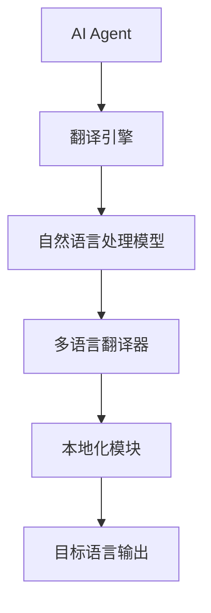

                 


# 企业AI Agent的多语言翻译与本地化功能实现

> 关键词：AI Agent, 多语言翻译, 本地化功能, 自然语言处理, 机器学习, 企业应用, 系统架构

> 摘要：本文深入探讨了企业AI Agent实现多语言翻译与本地化功能的关键技术与实现方案。首先，从背景和问题描述出发，阐述了AI Agent在企业中的重要性及其在全球化背景下的多语言需求。接着，分析了多语言翻译和本地化的核心概念及其相互关系。然后，详细讲解了基于神经机器翻译和自然语言处理的算法原理，并通过数学模型和公式进行了详细推导。最后，通过系统分析与架构设计，给出了具体的实现方案，并结合实际案例进行了代码实现与功能演示，总结了最佳实践与未来发展建议。

---

## 第一部分: 背景介绍

### 第1章: 问题背景与核心概念

#### 1.1 问题背景

- **企业全球化发展的挑战**：随着企业在全球市场的扩展，跨语言交流的需求日益增加。传统的翻译工具和人工翻译效率低下，难以满足企业对快速响应和精准翻译的需求。
- **多语言沟通的必要性**：在跨国企业中，员工可能使用多种语言进行沟通，如何实现高效、准确的多语言翻译成为关键问题。
- **AI Agent在企业中的角色**：AI Agent作为企业智能助手，能够实时处理多语言翻译请求，提高工作效率，降低沟通成本。

#### 1.2 问题描述

- **多语言翻译的痛点**：传统翻译工具存在延迟高、准确率低的问题，且无法结合上下文进行语境理解。
- **本地化需求的复杂性**：本地化不仅需要语言转换，还需考虑文化差异、格式调整等，增加了实现的复杂性。
- **AI Agent在多语言翻译中的应用场景**：例如客服支持、会议记录、跨部门协作等场景，AI Agent能够实时提供多语言支持，提升用户体验。

#### 1.3 问题解决与边界

- **AI Agent如何实现多语言翻译**：通过集成神经机器翻译模型和自然语言处理技术，实现跨语言实时翻译。
- **本地化功能的实现边界**：本地化不仅包括语言翻译，还包括文化适配、格式调整等，需明确功能的实现范围。
- **核心概念的结构与要素**：AI Agent、翻译引擎、本地化模块、上下文理解机制等。

---

## 第二部分: 核心概念与联系

### 第2章: 核心概念与联系

#### 2.1 AI Agent的核心原理

- **AI Agent的基本概念**：AI Agent是一种智能体，能够感知环境、执行任务并做出决策。
- **多语言翻译的实现机制**：通过自然语言处理和机器学习模型，实现多种语言的自动翻译。
- **本地化功能的实现流程**：包括文本分析、文化适配、格式调整等步骤。

#### 2.2 核心概念对比表

| 比较维度       | AI Agent         | 多语言翻译       | 本地化功能       |
|----------------|------------------|------------------|------------------|
| 核心任务       | 执行智能任务     | 转换语言         | 文化适配与调整   |
| 技术基础       | 机器学习、NLP    | 神经机器翻译     | 文本处理、文化规则|
| 应用场景       | 客服、会议记录    | 跨语言沟通       | 软件界面适配     |
| 复杂度         | 高               | 高               | 高               |

#### 2.3 ER实体关系图



---

## 第三部分: 算法原理与数学模型

### 第3章: 神经机器翻译算法

#### 3.1 编码器-解码器模型

- **编码器结构**：将源语言文本映射到一个向量空间。
  $$ e_i = \text{Encoder}(x_i) $$
- **解码器结构**：根据编码器输出生成目标语言文本。
  $$ o_j = \text{Decoder}(e_i, y_{j-1}) $$

#### 3.2 注意力机制

- **注意力权重计算**：
  $$ \alpha_{ij} = \frac{\exp(\text{score}(e_i, f_j))}{\sum_{k} \exp(\text{score}(e_i, f_k))} $$
- **上下文向量计算**：
  $$ c_j = \sum_{i=1}^{n} \alpha_{ij} e_i $$

#### 3.3 本地化处理算法

- **文本分析与标记化**：将文本分解为可处理的标记，并识别文化相关元素。
- **文化适配算法**：根据目标文化调整内容，例如日期格式、货币单位等。
- **语言风格调整**：根据上下文调整语气和风格，例如正式与非正式语言的切换。

---

## 第四部分: 系统分析与架构设计

### 第4章: 系统架构与设计

#### 4.1 项目背景

- **项目目标**：开发一个支持多语言翻译和本地化的AI Agent系统，提升企业跨语言沟通效率。

#### 4.2 系统功能设计

- **领域模型类图**：
  ```mermaid
  classDiagram
      class AI-Agent {
          - translation_engine
          - localization_module
          - context_understanding
      }
      class Translation-Engine {
          - nlp_model
          - translator
      }
      class Localization-Module {
          - culture_adapter
          - style_adjuster
      }
      AI-Agent --> Translation-Engine
      AI-Agent --> Localization-Module
  ```

- **系统架构图**：
  ```mermaid
  architecture
      客户端 <--API--> AI-Agent
      AI-Agent <--内部调用--> Translation-Engine
      Translation-Engine <--内部调用--> NLP-Model
      AI-Agent <--内部调用--> Localization-Module
  ```

#### 4.3 接口设计与交互流程

- **API接口设计**：
  ```http
  POST /translate
  {
      "source_lang": "en",
      "target_lang": "zh",
      "text": "Hello, how are you?"
  }
  ```
- **交互流程图**：
  ```mermaid
  sequenceDiagram
      客户端 -> AI-Agent: 发送翻译请求
      AI-Agent -> Translation-Engine: 调用翻译引擎
      Translation-Engine -> NLP-Model: 进行翻译处理
      NLP-Model -> AI-Agent: 返回翻译结果
      AI-Agent -> Localization-Module: 调用本地化模块
      Localization-Module -> AI-Agent: 返回最终结果
      AI-Agent -> 客户端: 发送本地化后的内容
  ```

---

## 第五部分: 项目实战

### 第5章: 实践与案例分析

#### 5.1 环境安装

- **安装Python环境**：`python --version`
- **安装依赖库**：`pip install numpy tensorflow transformers`

#### 5.2 核心代码实现

- **翻译引擎代码示例**：
  ```python
  def translate(source_lang, target_lang, text):
      # 调用翻译模型
      model = load_model(source_lang, target_lang)
      translated = model(text)
      return translated
  ```

- **本地化模块代码示例**：
  ```python
  def localize(target_lang, text):
      # 文化适配与风格调整
      adapter = get_adapter(target_lang)
      localized = adapter(text)
      return localized
  ```

#### 5.3 实际案例分析

- **案例背景**：一家跨国企业需要将英文的会议记录翻译成中文，并调整日期格式和货币单位。
- **实现步骤**：
  1. 调用翻译引擎将英文记录翻译成中文。
  2. 使用本地化模块调整日期格式从MM/DD/YYYY到YYYY-MM-DD。
  3. 将货币单位从美元调整为人民币。

---

## 第六部分: 最佳实践与总结

### 第6章: 最佳实践与总结

#### 6.1 最佳实践

- **模型选择**：选择适合业务需求的翻译模型，例如针对特定领域的优化模型。
- **数据处理**：确保训练数据的多样性和质量，避免数据偏见。
- **性能优化**：通过并行计算和缓存机制提升翻译效率。

#### 6.2 小结

- 本文详细讲解了企业AI Agent实现多语言翻译与本地化功能的关键技术与实现方案。
- 从算法原理到系统架构，再到项目实战，全面覆盖了实现过程中的关键点。

#### 6.3 注意事项

- 在实际应用中，需注意数据安全和隐私保护。
- 定期更新翻译模型和本地化规则，以应对语言和文化的变化。

#### 6.4 拓展阅读

- 推荐阅读《神经机器翻译实战》和《自然语言处理入门》等书籍，深入了解相关技术。

---

## 作者：AI天才研究院/AI Genius Institute & 禅与计算机程序设计艺术 /Zen And The Art of Computer Programming

