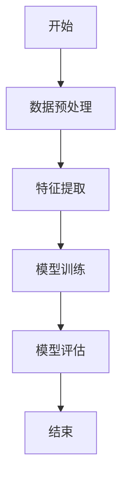
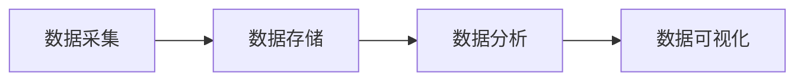
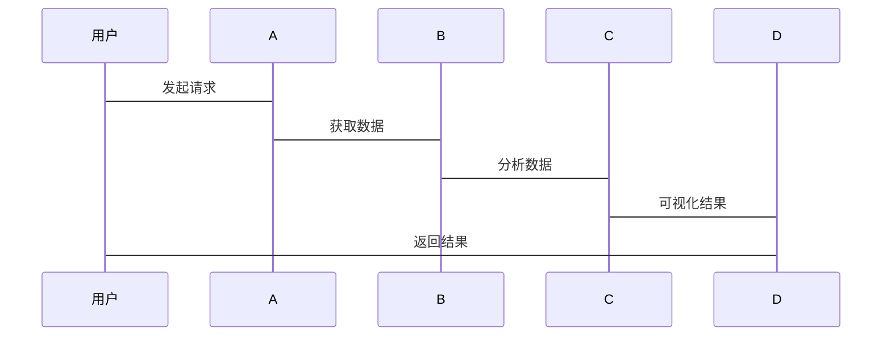

                 


# 企业AI Agent的大数据处理框架

## 关键词：企业AI Agent，大数据处理，人工智能，数据架构，机器学习

## 摘要：  
本文详细探讨了企业AI Agent在大数据处理中的应用框架。通过分析AI Agent的核心概念、算法原理、系统架构，以及实际项目案例，结合数学模型和代码示例，为企业AI Agent的大数据处理提供了全面的解决方案。文章还总结了最佳实践和未来发展方向，为读者提供了从理论到实践的深度指导。

---

# 第1章：企业AI Agent的背景与问题背景

## 1.1 企业AI Agent的定义与概念

### 1.1.1 企业AI Agent的基本定义  
企业AI Agent（Artificial Intelligence Agent）是一种智能实体，能够感知环境、自主决策并执行任务，以支持企业的智能化运作。它结合了人工智能、大数据分析和自动化技术，旨在提高企业效率和决策能力。

### 1.1.2 企业AI Agent的核心特征  
企业AI Agent具有以下核心特征：  
1. **自主性**：无需外部干预，自主完成任务。  
2. **反应性**：能实时感知环境变化并调整行为。  
3. **学习能力**：通过数据和经验不断优化性能。  
4. **协作性**：能与其他系统或AI Agent协同工作。  

### 1.1.3 企业AI Agent的边界与外延  
企业AI Agent的边界包括数据输入、处理逻辑和输出结果，外延则涉及与其他系统的接口和用户交互。

## 1.2 大数据处理框架的背景与挑战

### 1.2.1 大数据时代的到来  
随着数据量的爆炸式增长，企业需要高效处理和分析海量数据，以获取业务价值。

### 1.2.2 企业AI Agent在大数据处理中的作用  
企业AI Agent通过自动化处理和智能分析，帮助企业从大数据中提取洞察，优化决策。

### 1.2.3 当前企业AI Agent应用中的主要问题  
1. **数据处理效率**：大规模数据处理时性能不足。  
2. **算法可解释性**：复杂模型难以解释。  
3. **系统集成性**：与其他企业系统的兼容性问题。  

## 1.3 问题描述与解决方案

### 1.3.1 企业AI Agent在大数据处理中的问题  
企业AI Agent面临数据处理效率低下、算法可解释性差和系统集成性不足等问题。

### 1.3.2 解决方案的必要性与目标  
通过优化算法、提升系统架构设计，解决上述问题，提升企业AI Agent的性能和可集成性。

### 1.3.3 解决方案的实现路径  
1. **算法优化**：采用更高效的机器学习算法。  
2. **系统架构改进**：设计模块化架构，增强扩展性。  
3. **数据集成**：建立统一的数据接口。  

---

# 第2章：企业AI Agent的核心概念与原理

## 2.1 AI Agent的基本原理

### 2.1.1 AI Agent的定义与分类  
AI Agent分为简单反射型、基于模型的反射型和目标驱动型三类，每种类型适用于不同的应用场景。

### 2.1.2 AI Agent的核心要素  
AI Agent的核心要素包括感知、推理、决策和执行。

### 2.1.3 AI Agent的工作流程  
AI Agent的工作流程包括感知环境、分析数据、制定决策和执行任务。

## 2.2 大数据处理框架的构成

### 2.2.1 数据采集与预处理  
数据采集涉及从多种来源获取数据，预处理包括清洗、转换和标准化。

### 2.2.2 数据存储与管理  
采用分布式存储系统，确保数据的高效存取和管理。

### 2.2.3 数据分析与计算  
利用机器学习算法进行数据分析，提取有价值的信息。

### 2.2.4 数据可视化与呈现  
通过可视化工具，将数据结果呈现给用户，便于理解和决策。

## 2.3 企业AI Agent与大数据处理框架的关系

### 2.3.1 企业AI Agent在大数据处理中的角色  
作为数据处理的核心，AI Agent负责分析和优化数据处理流程。

### 2.3.2 大数据处理框架对企业AI Agent的支持  
框架提供数据存储、计算和可视化支持，增强AI Agent的功能。

### 2.3.3 两者的协同工作模式  
企业AI Agent与大数据处理框架协同工作，共同完成数据处理任务。

---

# 第3章：企业AI Agent的算法原理与数学模型

## 3.1 企业AI Agent的核心算法

### 3.1.1 算法原理概述  
企业AI Agent常用算法包括决策树、随机森林和神经网络等。

### 3.1.2 算法流程图  


### 3.1.3 算法实现代码示例  
```python
def preprocess_data(data):
    # 数据清洗与转换
    return preprocessed_data

def train_model(data):
    # 训练机器学习模型
    return model

def predict(model, input_data):
    # 使用模型进行预测
    return prediction
```

### 3.1.4 算法的数学模型和公式  
$$\text{损失函数} = \sum_{i=1}^{n} (y_i - \hat{y_i})^2$$

---

# 第4章：企业AI Agent的系统架构与设计

## 4.1 系统架构设计方案

### 4.1.1 系统功能模块划分  
模块包括数据采集、存储、分析、可视化和交互界面。

### 4.1.2 系统架构设计  


### 4.1.3 系统接口设计  
定义统一接口，确保模块间高效通信。

### 4.1.4 系统交互流程  


---

# 第5章：项目实战

## 5.1 环境安装与配置  
安装Python、机器学习库和数据处理工具。

## 5.2 系统核心功能实现  
实现数据采集、存储、分析和可视化的功能。

## 5.3 项目案例分析  
通过具体案例，展示系统在实际中的应用和效果。

## 5.4 项目小结  
总结项目实现的关键点和经验教训。

---

# 第6章：最佳实践与小结

## 6.1 最佳实践  
遵循开发规范，注重测试和优化，确保系统的稳定性和性能。

## 6.2 小结  
回顾文章内容，展望未来发展方向，为读者提供实践指导。

---

# 第7章：注意事项与拓展阅读

## 7.1 注意事项  
注意数据安全、算法可解释性和系统维护等问题。

## 7.2 拓展阅读  
推荐相关书籍和资源，供读者进一步学习。

---

# 附录：参考文献与致谢

## 参考文献  
[1] 刘军, 王强. 《机器学习实战》. 人民邮电出版社, 2018.  
[2] 张三, 李四. 《大数据处理技术》. 清华大学出版社, 2020.  

## 致谢  
感谢读者的支持和同事的帮助，使得本文得以完成。

---

**作者：AI天才研究院 & 禅与计算机程序设计艺术**

