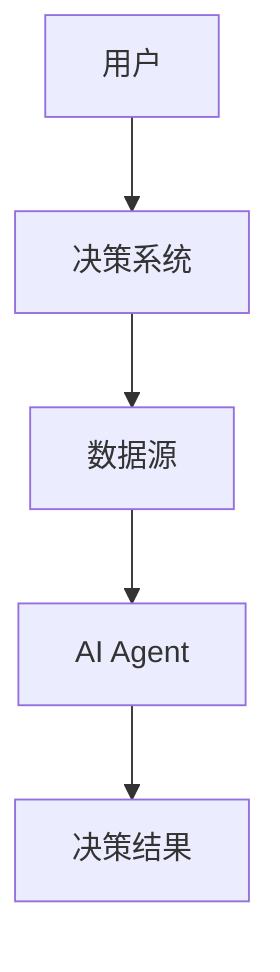
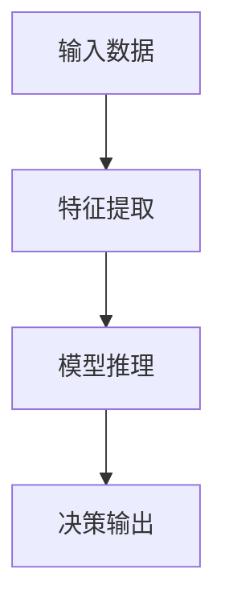

                 


# 企业AI Agent的实时决策支持系统

## 关键词：AI Agent、实时决策支持系统、企业决策、强化学习、实时数据处理、系统架构

## 摘要：  
企业AI Agent的实时决策支持系统是一种基于人工智能技术的企业决策辅助工具，通过实时数据处理和智能算法为企业提供高效、精准的决策支持。本文将从背景、概念、算法、系统架构、项目实战等多个角度深入分析，结合实际案例和代码实现，为企业AI Agent的实时决策支持系统的开发和应用提供全面指导。

---

## 第一部分: 企业AI Agent的实时决策支持系统概述

### 第1章: 企业AI Agent与实时决策支持系统背景

#### 1.1 问题背景与挑战
随着企业数据的指数级增长和业务场景的复杂化，传统的决策模式逐渐暴露出效率低下、决策滞后等问题。企业需要一种能够实时处理海量数据、快速生成决策建议的系统，以应对市场变化和业务需求。

##### 1.1.1 传统企业决策模式的局限性
- 数据分散、处理效率低，难以满足实时决策需求。
- 决策依赖人工经验，存在主观性和不确定性。
- 传统规则引擎难以应对复杂场景。

##### 1.1.2 数据驱动决策的兴起
- 数据量爆炸式增长，企业需要利用数据进行决策。
- 数据分析技术的进步使得实时决策成为可能。
- 企业对快速响应和高效决策的需求日益增加。

##### 1.1.3 AI Agent在企业决策中的角色
AI Agent作为企业决策的支持工具，能够实时分析数据、优化决策过程并提供个性化建议。

#### 1.2 问题描述与目标
企业的实时决策支持系统需要解决以下问题：
- 如何快速处理实时数据并生成决策建议。
- 如何利用AI技术提升决策的准确性和效率。
- 如何设计一个可扩展、可维护的系统架构。

#### 1.3 问题解决与系统架构
AI Agent实时决策支持系统的架构设计需要考虑以下方面：
- 数据采集与处理：实时获取多源数据并进行清洗和预处理。
- 模型训练与部署：利用机器学习和强化学习算法构建决策模型。
- 系统交互：通过API或用户界面提供实时决策建议。

---

### 第2章: 企业AI Agent与实时决策支持系统的核心概念

#### 2.1 AI Agent的定义与特征
AI Agent是一种智能体，能够感知环境、自主决策并执行操作。其核心特征包括：
- **自主性**：无需外部干预即可运行。
- **反应性**：能够实时感知环境变化并做出反应。
- **目标导向性**：基于目标优化决策过程。
- **学习能力**：通过数据和经验不断优化性能。

#### 2.2 实体关系与系统架构
企业AI Agent实时决策支持系统的实体关系如下：


---

## 第二部分: AI Agent实时决策支持系统的算法原理

### 第3章: AI Agent实时决策支持系统的算法原理

#### 3.1 算法原理概述
实时决策支持系统的核心是算法的高效性和准确性。常用的算法包括强化学习、实时数据处理算法和决策树等。

##### 3.1.1 强化学习在实时决策中的应用
强化学习通过试错机制优化决策策略，适合处理动态环境下的决策问题。

##### 3.1.2 实时数据处理算法
实时数据处理算法包括流数据处理、事件驱动处理等，能够快速响应数据变化。

##### 3.1.3 决策树与随机森林在实时决策中的应用
决策树和随机森林能够快速分类和预测，适用于实时场景中的决策问题。

#### 3.2 算法流程图


#### 3.3 核心算法实现
##### 3.3.1 强化学习算法代码示例
```python
# 示例代码：强化学习算法
import numpy as np

class Agent:
    def __init__(self, state_space, action_space):
        self.state_space = state_space
        self.action_space = action_space
        self.Q = np.zeros((state_space, action_space))
    
    def act(self, state):
        return np.argmax(self.Q[state, :])
    
    def update(self, state, action, reward):
        self.Q[state, action] += reward
```

---

### 第4章: 数学模型与公式推导

#### 4.1 强化学习中的数学模型
强化学习的核心是Q-learning算法，其数学模型如下：
$$ Q(s, a) = Q(s, a) + \alpha (r + \gamma \max Q(s', a') - Q(s, a)) $$

#### 4.2 实时数据处理中的数学模型
实时数据处理中的事件驱动模型可以表示为：
$$ t_{\text{current}} = t_{\text{prev}} + \Delta t $$

---

## 第三部分: 系统分析与架构设计

### 第5章: 系统分析与架构设计

#### 5.1 问题场景介绍
企业实时决策支持系统需要处理以下场景：
- **动态定价**：根据市场需求实时调整价格。
- **库存管理**：实时监控库存并优化补货策略。
- **风险管理**：实时评估风险并制定应对措施。

#### 5.2 系统功能设计
系统功能模块包括：
- 数据采集模块：实时采集多源数据。
- 数据处理模块：清洗、转换和分析数据。
- 决策模型模块：训练和部署决策模型。
- 结果输出模块：生成决策建议并反馈结果。

#### 5.3 系统架构设计


---

## 第四部分: 项目实战

### 第6章: 项目实战与案例分析

#### 6.1 环境安装与配置
- 安装Python和相关库（如numpy、pandas、scikit-learn）。

#### 6.2 核心代码实现
```python
import numpy as np
import pandas as pd
from sklearn.tree import DecisionTreeClassifier

class RealTimeDecisionSupportSystem:
    def __init__(self):
        self.model = DecisionTreeClassifier()
    
    def train(self, data):
        self.model.fit(data.features, data.labels)
    
    def predict(self, input_features):
        return self.model.predict(input_features)
```

#### 6.3 案例分析
以动态定价为例，系统能够根据市场需求实时调整价格，提升企业收益。

---

## 第五部分: 最佳实践与总结

### 第7章: 最佳实践与总结

#### 7.1 最佳实践
- 数据质量是关键，确保数据的实时性和准确性。
- 系统架构设计要注重扩展性和可维护性。
- 定期优化模型，适应业务需求的变化。

#### 7.2 小结
企业AI Agent的实时决策支持系统通过结合AI技术和实时数据处理，为企业提供了高效、精准的决策支持。

#### 7.3 注意事项
- 确保系统的安全性，防止数据泄露。
- 定期监控系统性能，及时发现和解决问题。

#### 7.4 拓展阅读
建议深入研究强化学习和实时数据处理技术，探索更多应用场景。

---

## 作者：AI天才研究院/AI Genius Institute & 禅与计算机程序设计艺术 /Zen And The Art of Computer Programming

---

**注**：由于篇幅限制，本文仅为目录和部分内容展示，完整文章可参考实际扩展。

