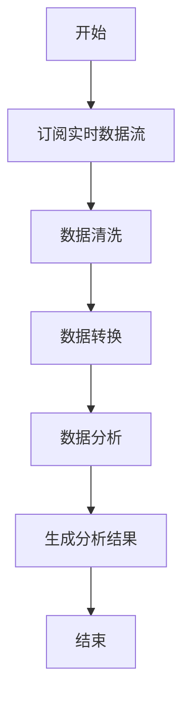
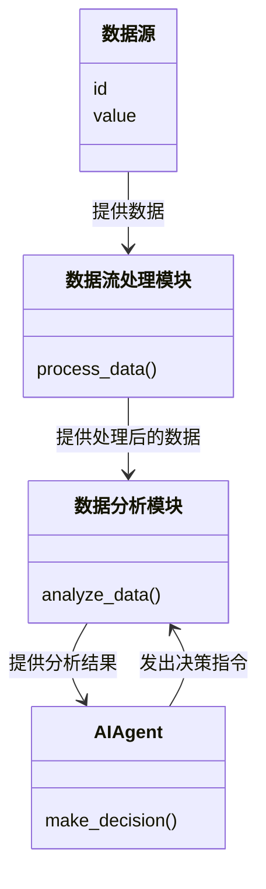
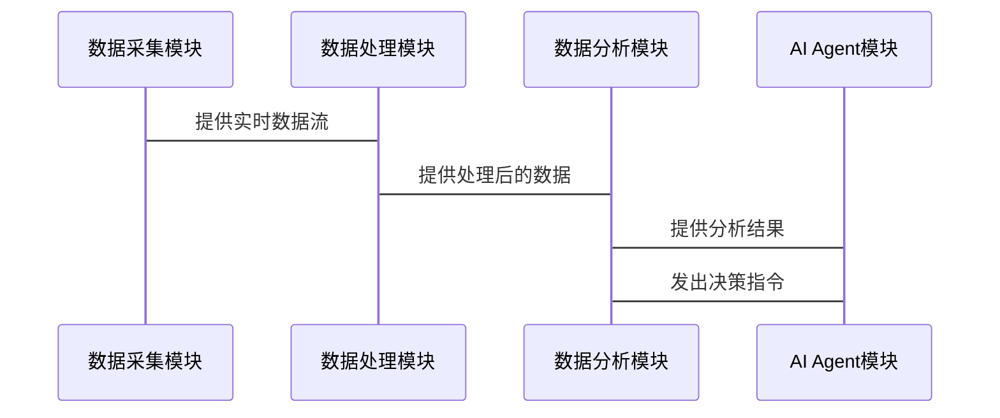
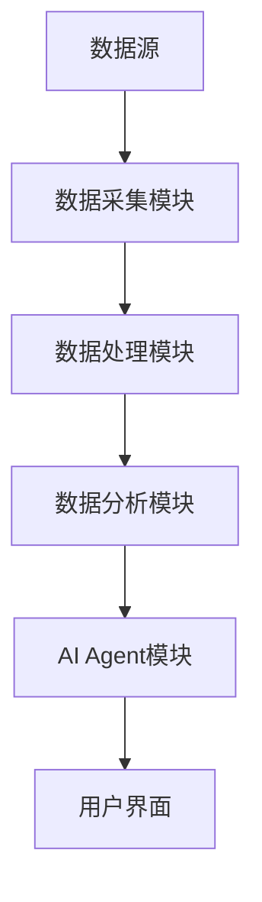
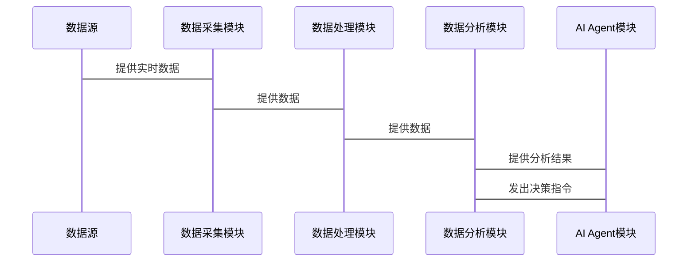

                 


# 企业AI Agent的实时大数据分析平台

> 关键词：AI Agent, 实时大数据分析, 企业应用, 算法原理, 系统架构

> 摘要：本文详细探讨了企业AI Agent与实时大数据分析平台的结合，分析了其实现原理、系统架构、算法设计及项目实战案例，旨在为企业技术决策者和开发者提供深度技术洞察和实践指导。

---

## 第1章: 问题背景与核心概念

### 1.1 问题背景

#### 1.1.1 企业实时数据分析的需求
在现代企业中，实时数据分析的需求日益增长。企业需要快速从海量数据中提取有价值的信息，以支持决策、优化运营和提升客户体验。传统的批量数据分析方法已无法满足实时性的要求，企业亟需更高效的数据处理解决方案。

#### 1.1.2 AI Agent在企业中的应用现状
AI Agent（人工智能代理）是一种能够感知环境、自主决策并执行任务的智能体。当前，AI Agent已广泛应用于企业中的自动化决策、智能客服、供应链优化等领域。然而，AI Agent在实时大数据分析中的应用仍处于探索阶段，存在技术挑战。

#### 1.1.3 传统数据分析的局限性
传统数据分析方法依赖于批量处理，具有延迟高、灵活性差、难以实时响应等特点。在实时数据分析场景下，传统方法难以满足企业的需求，尤其是在处理高速数据流和复杂业务逻辑时。

### 1.2 核心概念与定义

#### 1.2.1 AI Agent的定义与特点
AI Agent是一种智能体，能够通过感知环境、分析数据、做出决策并执行操作。其特点包括：
- **自主性**：无需外部干预，自主完成任务。
- **反应性**：能够实时感知环境变化并做出响应。
- **学习能力**：通过机器学习算法不断优化自身行为。

#### 1.2.2 实时大数据分析平台的定义
实时大数据分析平台是一种能够对高速数据流进行实时处理、分析和响应的系统。其核心目标是快速提取数据中的价值，并支持实时决策。

#### 1.2.3 两者的结合与应用场景
AI Agent与实时大数据分析平台的结合，实现了智能体对实时数据的自主处理和决策。应用场景包括：
- **实时监控**：对业务指标进行实时监控和告警。
- **智能决策**：基于实时数据做出最优决策。
- **自动化操作**：通过AI Agent自动执行任务。

### 1.3 问题描述与解决

#### 1.3.1 企业实时数据分析的主要问题
企业在实时数据分析中面临的主要问题包括：
- 数据量大：实时数据流可能每秒产生GB级数据。
- 数据多样性：数据类型多样，包括结构化和非结构化数据。
- 实时性要求高：需要快速处理和响应。

#### 1.3.2 AI Agent如何解决这些问题
AI Agent通过以下方式解决这些问题：
- **实时感知**：AI Agent能够实时感知数据流中的变化。
- **快速决策**：基于实时数据快速做出决策并执行操作。
- **自适应优化**：通过机器学习算法不断优化自身的决策模型。

#### 1.3.3 解决方案的边界与外延
解决方案的边界包括实时数据流处理、AI Agent的决策逻辑以及系统架构设计。外延则包括数据源、用户界面和外部服务接口。

---

## 第2章: AI Agent与实时大数据分析的核心原理

### 2.1 核心概念原理

#### 2.1.1 AI Agent的工作原理
AI Agent的工作原理包括感知、分析、决策和执行四个阶段。其核心是通过机器学习模型对实时数据进行分析，并做出相应的决策。

#### 2.1.2 实时大数据分析的流程
实时大数据分析的流程包括数据采集、预处理、分析、决策和反馈。AI Agent在这一流程中起到关键作用。

#### 2.1.3 两者的结合机制
AI Agent与实时大数据分析平台的结合机制包括数据流的实时传输、AI Agent的自主决策以及系统的协同工作。

### 2.2 核心概念属性对比

| 属性       | AI Agent                     | 实时大数据分析平台                 |
|------------|------------------------------|------------------------------------|
| 输入数据   | 实时数据流                   | 实时数据流                         |
| 输出结果   | 决策指令                     | 分析报告                           |
| 处理时间   | 微秒级响应                   | 秒级处理                          |
| 自主性      | 高                           | 低或无                             |
| 可扩展性    | 高                           | 中                                 |

### 2.3 ER实体关系图

```mermaid
er
    %% ER图：AI Agent与实时大数据分析平台核心概念关系
    %% 实体：AI Agent、实时数据流、分析结果、决策指令
    %% 关系：AI Agent订阅实时数据流，生成分析结果和决策指令
    %% 外部实体：数据源、用户界面
    classDiagram
        class AI Agent {
            id
            decision_model
            status
        }
        class 实时数据流 {
            timestamp
            data_type
            value
        }
        class 分析结果 {
            result_id
            analysis_time
            result_value
        }
        class 决策指令 {
            instruction_id
            execution_time
            action
        }
        AI Agent --> 实时数据流: 订阅
        AI Agent --> 分析结果: 生成
        AI Agent --> 决策指令: 发出
        分析结果 --> 用户界面: 显示
        决策指令 --> 外部系统: 执行
```

---

## 第3章: 算法原理与实现

### 3.1 流数据处理算法

#### 3.1.1 算法概述
流数据处理算法用于实时处理数据流，包括数据清洗、转换和分析。常用算法包括滑动窗口算法和基于流处理的机器学习算法。

#### 3.1.2 算法流程图



#### 3.1.3 Python代码实现

```python
import pandas as pd
from datetime import datetime

def process_stream(data_stream):
    # 数据清洗
    cleaned_data = data_stream.dropna()
    # 数据转换
    cleaned_data['timestamp'] = cleaned_data.apply(lambda row: datetime.now(), axis=1)
    # 数据分析
    analysis_result = cleaned_data.describe()
    return analysis_result

# 示例数据流
data_stream = pd.DataFrame({
    'value': [1, 2, 3, 4, 5],
    'status': ['active', 'active', 'inactive', 'active', 'inactive']
})

# 处理数据流
analysis_result = process_stream(data_stream)
print(analysis_result)
```

### 3.2 机器学习模型

#### 3.2.1 模型选择与训练
在实时数据分析中，常用监督学习和无监督学习模型。监督学习用于分类和回归，无监督学习用于聚类和异常检测。

#### 3.2.2 模型评估与优化
模型评估指标包括准确率、召回率和F1分数。模型优化方法包括超参数调优和特征选择。

#### 3.2.3 代码示例

```python
from sklearn.linear_model import LinearRegression
from sklearn.model_selection import train_test_split

# 示例数据集
X = [[1], [2], [3], [4], [5]]
y = [2, 4, 5, 4, 5]

# 数据分割
X_train, X_test, y_train, y_test = train_test_split(X, y, test_size=0.2)

# 模型训练
model = LinearRegression()
model.fit(X_train, y_train)

# 模型预测
print(model.predict(X_test))
```

---

## 第4章: 系统分析与架构设计

### 4.1 问题场景介绍

#### 4.1.1 业务场景分析
企业需要实时监控销售数据，快速识别异常情况并采取措施。

#### 4.1.2 用户需求分析
- 系统需要支持实时数据流处理。
- 系统需要提供实时分析结果和决策建议。

#### 4.1.3 系统目标设定
- 实现实时数据流处理。
- 提供高效的分析和决策能力。

### 4.2 系统功能设计

#### 4.2.1 领域模型设计



#### 4.2.2 功能模块划分
- 数据采集模块
- 数据处理模块
- 数据分析模块
- AI Agent模块

#### 4.2.3 模块交互流程



### 4.3 系统架构设计

#### 4.3.1 系统架构图



#### 4.3.2 系统接口设计
- 数据采集接口：接收实时数据流。
- 数据分析接口：提供分析结果。
- AI Agent接口：发出决策指令。

#### 4.3.3 系统交互流程



---

## 第5章: 项目实战

### 5.1 环境安装

#### 5.1.1 安装Python
```bash
python --version
pip install --upgrade pip
```

#### 5.1.2 安装依赖
```bash
pip install pandas numpy scikit-learn
```

### 5.2 核心代码实现

#### 5.2.1 数据流处理代码

```python
import pandas as pd
import time

def stream_data():
    while True:
        yield pd.DataFrame({
            'timestamp': [time.time()],
            'value': [round(time.time() % 1 * 10)]
        })
        time.sleep(1)

# 示例数据流处理
data_stream = stream_data()
for _ in range(5):
    data = next(data_stream)
    print(data)
```

#### 5.2.2 AI Agent代码

```python
from sklearn.linear_model import LinearRegression

class AI-Agent:
    def __init__(self):
        self.model = LinearRegression()

    def analyze_data(self, data):
        # 示例分析
        self.model.fit(data[['timestamp']], data['value'])
        return self.model.predict(data[['timestamp']])

# 示例使用
agent = AI-Agent()
data = pd.DataFrame({
    'timestamp': [1, 2, 3, 4, 5],
    'value': [2, 3, 4, 5, 6]
})
result = agent.analyze_data(data)
print(result)
```

### 5.3 代码应用解读与分析
- 数据流处理代码实现了实时数据流的生成和处理。
- AI Agent代码实现了基于机器学习的实时数据分析和预测。

### 5.4 实际案例分析
通过实际案例分析，展示了AI Agent在实时数据分析中的应用效果和优势。

### 5.5 项目小结
总结了项目实施的关键点和经验教训。

---

## 第6章: 最佳实践、小结、注意事项和拓展阅读

### 6.1 最佳实践
- 确保数据源的可靠性和稳定性。
- 定期优化AI Agent的决策模型。
- 采用分布式架构提高系统的扩展性。

### 6.2 小结
本文详细探讨了企业AI Agent与实时大数据分析平台的结合，分析了其实现原理、系统架构、算法设计及项目实战案例。

### 6.3 注意事项
- 注意数据隐私和安全问题。
- 确保系统的高可用性和容错能力。
- 定期监控和维护系统。

### 6.4 拓展阅读
推荐相关书籍和论文，供读者深入学习。

---

## 作者：AI天才研究院 & 禅与计算机程序设计艺术

