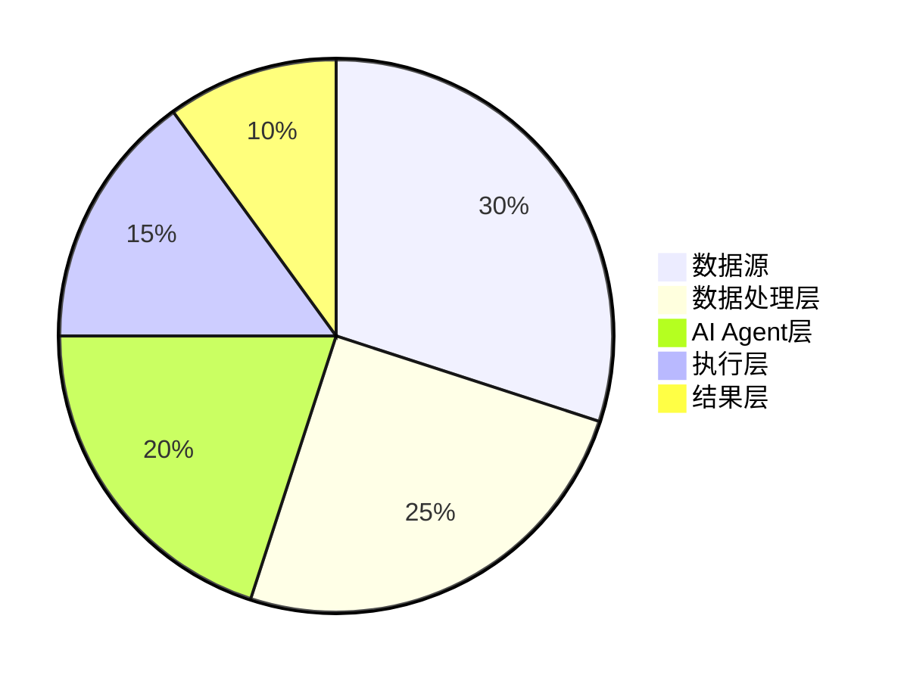

                 


# 企业AI Agent的实时大数据处理架构

> 关键词：AI Agent, 实时大数据, 系统架构, 算法原理, 项目实战

> 摘要：本文详细探讨了企业AI Agent在实时大数据处理中的架构设计，涵盖核心概念、算法原理、系统架构、项目实战及优化建议，旨在为企业技术架构师和开发人员提供深度指导。

---

## 第一部分: 背景与概述

### 第1章: 企业AI Agent与实时大数据处理概述

#### 1.1 问题背景与描述

在现代企业环境中，实时数据分析的需求日益增长。企业需要快速处理大量数据，以支持决策、优化运营和提升客户体验。AI Agent（人工智能代理）作为自动化处理和决策的关键技术，能够有效应对这些挑战。然而，实时大数据处理涉及复杂的技术和架构问题，需要深入了解AI Agent的工作原理和实时数据处理的机制。

#### 1.2 核心概念与定义

- **AI Agent**：AI Agent是一种智能实体，能够感知环境、执行任务并自主决策。它通过传感器获取数据，利用推理引擎进行分析，并通过执行器采取行动。
- **实时大数据处理**：实时大数据处理是指在数据生成的同时对其进行处理和分析，以实现快速响应和决策。

#### 1.3 应用场景与挑战

AI Agent在实时大数据处理中的应用场景包括实时监控、异常检测、动态优化等。然而，这些应用面临数据量大、处理速度快、算法复杂性高等挑战，需要设计高效的架构和优化算法。

#### 1.4 技术发展与趋势

随着AI技术的不断进步和大数据处理技术的成熟，AI Agent在实时数据处理中的应用将更加广泛。未来，AI Agent将更加智能化和自动化，能够处理更复杂的数据流和应用场景。

---

## 第二部分: 核心概念与原理

### 第2章: AI Agent与实时大数据处理的核心原理

#### 2.1 核心概念与原理

- **AI Agent的工作原理**：AI Agent通过感知环境、推理分析和自主决策来执行任务。它能够实时处理数据，快速做出反应。
- **实时大数据处理的机制**：实时大数据处理需要高效的数据流处理算法和快速响应机制，确保数据的及时处理和分析。

#### 2.2 核心概念对比表

| 对比维度       | AI Agent | 传统数据处理 |
|----------------|----------|--------------|
| 数据处理速度   | 实时     | 批处理       |
| 决策能力       | 智能化    | 规则化       |
| 自主性         | 高       | 低           |

#### 2.3 ER实体关系图

```mermaid
er
  actor: 用户
  agent: AI Agent
  data_stream: 数据流
  action: 行动
  result: 处理结果
  actor --> agent: 发起请求
  agent --> data_stream: 处理数据
  agent --> action: 执行行动
  action --> result: 产生结果
  agent --> result: 返回结果
```

---

## 第三部分: 算法原理与数学模型

### 第3章: 实时数据处理的算法原理

#### 3.1 数据流处理算法

- **数据流的实时处理流程**：数据流进入系统后，首先进行预处理，然后进行特征提取，最后进行模型推理。
- **数据流的分类与处理方法**：根据数据类型和业务需求，采用不同的处理方法，如流数据处理、批量处理等。

#### 3.2 AI Agent的算法优化

- **基于反馈的优化算法**：通过反馈机制优化AI Agent的行为，提高处理效率和准确性。
- **分布式计算优化**：利用分布式计算技术，提高数据处理能力和扩展性。

#### 3.3 数学模型与公式

数据流处理模型：$$D(t) = D(t-1) + \Delta D$$

反馈机制公式：$$F = \alpha \cdot R + (1-\alpha) \cdot F_{prev}$$

---

## 第四部分: 系统架构设计

### 第4章: 系统架构设计

#### 4.1 问题场景介绍

企业需要实时处理大量的数据流，支持多个业务场景，如实时监控、异常检测等。AI Agent需要与多个系统模块交互，确保数据的实时处理和快速响应。

#### 4.2 系统功能设计

- **领域模型**：定义系统的功能模块和交互关系，如数据采集、数据处理、决策引擎等。
- **系统架构图**：展示系统的整体架构，包括数据源、数据处理层、AI Agent层、执行层和结果层。



#### 4.3 系统接口设计

- **API接口**：定义系统的输入输出接口，如数据采集接口、决策引擎接口等。
- **交互流程**：描述系统的交互流程，从数据采集到处理再到执行。

---

## 第五部分: 项目实战

### 第5章: 项目实战

#### 5.1 环境配置

- **技术栈**：选择合适的技术栈，如Python、TensorFlow、Kafka等。
- **工具安装**：安装必要的工具和库，确保环境配置正确。

#### 5.2 核心代码实现

```python
def process_data实时大数据处理函数：
    for data in数据流：
        处理数据并推送给AI Agent
```

#### 5.3 代码应用解读与分析

解释代码的功能和实现细节，说明如何实现实时数据处理和AI Agent的交互。

#### 5.4 实际案例分析和详细讲解剖析

通过具体案例，如实时销售数据分析，详细分析如何应用AI Agent进行实时数据处理，包括数据采集、处理、决策和执行。

---

## 第六部分: 总结与展望

### 第6章: 总结与展望

#### 6.1 最佳实践 tips

- **性能调优**：优化算法和架构设计，提高处理效率。
- **系统扩展**：设计可扩展的架构，支持业务增长。
- **安全性**：确保数据安全和系统安全。

#### 6.2 小结

企业AI Agent在实时大数据处理中的应用前景广阔，通过优化算法和架构设计，可以实现高效、智能的实时数据处理。

#### 6.3 注意事项

- 数据隐私和安全问题需要重点关注。
- 系统的稳定性和可靠性是关键。

#### 6.4 拓展阅读

建议读者进一步阅读相关领域的书籍和论文，深入理解AI Agent和实时大数据处理的技术细节。

---

作者：AI天才研究院 & 禅与计算机程序设计艺术

---

通过以上结构，文章详细探讨了企业AI Agent在实时大数据处理中的架构设计，从理论到实践，全面解析了核心概念、算法原理、系统架构和项目实战，为企业技术架构师和开发人员提供了深度指导。

