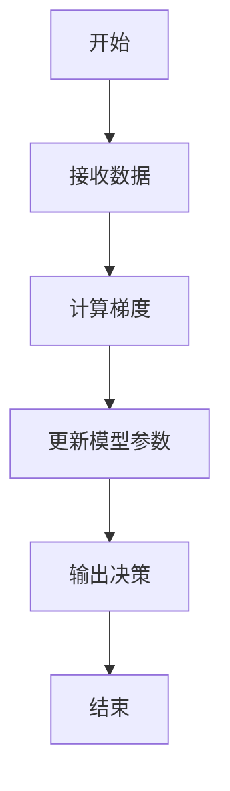
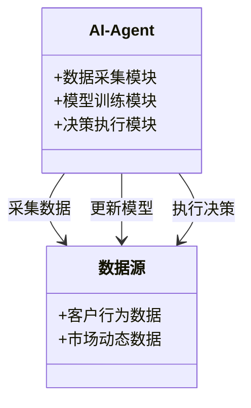
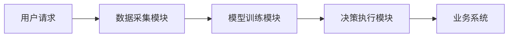

                 


# 企业AI Agent的实时学习能力：持续优化业务流程

> 关键词：企业AI Agent，实时学习能力，业务流程优化，在线学习算法，增量学习，动态更新

> 摘要：本文将深入探讨企业AI Agent的实时学习能力，分析其在业务流程优化中的应用。通过详细讲解核心概念、算法原理、系统架构设计以及项目实战，帮助读者理解并掌握如何利用AI Agent实时学习能力提升企业效率。

---

## 第一部分: 企业AI Agent的背景与概念

### 第1章: 企业AI Agent的背景与概念

#### 1.1 企业AI Agent的定义与特点

##### 1.1.1 什么是企业AI Agent
企业AI Agent（Artificial Intelligence Agent）是一种能够感知环境、执行任务并动态优化行为的智能系统。它结合了机器学习、自然语言处理和自动化技术，能够在企业环境中自主决策和执行。

##### 1.1.2 企业AI Agent的核心特点
- **自主性**：能够在没有人工干预的情况下自主决策。
- **反应性**：能够实时感知环境变化并快速响应。
- **学习能力**：通过实时学习不断提升自身的决策能力和效率。
- **适应性**：能够根据环境变化动态调整策略。

##### 1.1.3 企业AI Agent与传统AI的区别
| 特性           | 传统AI                 | 企业AI Agent           |
|----------------|-----------------------|------------------------|
| 决策能力       | 基于规则或预设模型     | 具备自主决策能力       |
| 学习能力       | 通常需要离线训练       | 支持在线学习和动态更新   |
| 环境适应性     | 适应性有限             | 具备高适应性             |

#### 1.2 企业AI Agent的实时学习能力

##### 1.2.1 实时学习的定义
实时学习是指AI Agent在运行过程中，能够实时接收新的数据并动态更新其模型或策略，以适应环境变化的能力。

##### 1.2.2 实时学习的重要性
实时学习能够使企业AI Agent在动态变化的环境中保持高效运作，快速响应客户需求，优化业务流程。

##### 1.2.3 实时学习与业务流程优化的关系
实时学习能力是企业AI Agent优化业务流程的核心驱动力。通过实时学习，AI Agent能够不断调整策略，提升流程效率，降低运营成本。

---

### 第2章: 企业AI Agent的实时学习能力背景

#### 2.1 企业业务流程优化的挑战

##### 2.1.1 传统业务流程的痛点
传统业务流程通常依赖于固定规则和人工操作，存在效率低下、响应速度慢、难以适应市场变化等问题。

##### 2.1.2 AI技术在业务流程优化中的作用
AI技术能够通过自动化、智能化的方式优化业务流程，提升效率和客户满意度。

##### 2.1.3 实时学习能力的必要性
在动态变化的商业环境中，企业需要快速响应市场变化，实时学习能力是企业AI Agent持续优化业务流程的关键。

#### 2.2 企业AI Agent的应用场景

##### 2.2.1 客户服务与支持
通过实时学习，企业AI Agent能够快速理解客户需求，提供个性化的服务解决方案。

##### 2.2.2 供应链管理
实时学习能力能够帮助AI Agent动态优化供应链策略，提升库存管理和物流效率。

##### 2.2.3 财务与风险管理
企业AI Agent能够实时分析财务数据和市场变化，帮助企业在财务和风险管理方面做出更明智的决策。

---

## 第二部分: 企业AI Agent的核心概念与原理

### 第3章: 企业AI Agent的核心概念

#### 3.1 企业AI Agent的组成模块

##### 3.1.1 数据采集模块
数据采集模块负责实时收集企业内外部数据，包括客户行为数据、市场动态数据等。

##### 3.1.2 模型训练模块
模型训练模块负责基于实时数据动态更新AI Agent的模型，确保其决策能力不断提升。

##### 3.1.3 决策执行模块
决策执行模块负责根据模型输出的决策结果，执行具体的业务操作。

#### 3.2 实时学习的核心机制

##### 3.2.1 在线学习算法
在线学习算法是一种能够在数据流中实时更新模型的算法，适合企业AI Agent的实时学习需求。

##### 3.2.2 模型更新策略
模型更新策略是指在实时学习过程中，如何选择和更新模型以保证最优性能。

##### 3.2.3 数据流处理机制
数据流处理机制是指如何高效处理实时数据流，确保数据的实时性和准确性。

---

### 第4章: 企业AI Agent的实时学习能力原理

#### 4.1 实时学习的基本原理

##### 4.1.1 数据流的实时处理
数据流处理是实时学习的基础，需要高效处理和分析实时数据。

##### 4.1.2 模型的动态更新
模型动态更新是实时学习的核心，确保模型能够适应环境变化。

##### 4.1.3 决策的实时反馈
实时反馈是实时学习的重要组成部分，能够帮助模型不断优化决策。

#### 4.2 实时学习的关键算法

##### 4.2.1 增量学习算法
增量学习算法是一种基于实时数据流逐步更新模型的算法，适用于企业AI Agent的实时学习需求。

##### 4.2.2 随机梯度下降算法
随机梯度下降算法是一种高效的在线学习算法，能够在大规模数据集上快速更新模型。

##### 4.2.3 联合学习算法
联合学习算法是一种结合多个数据源进行实时学习的算法，能够提升模型的泛化能力。

---

## 第三部分: 企业AI Agent的算法原理与数学模型

### 第5章: 实时学习算法的数学模型

#### 5.1 在线学习算法的数学表达

##### 5.1.1 增量梯度下降算法
$$ \theta_{t+1} = \theta_t - \eta (\nabla f_t) $$
其中，$\theta_t$ 表示第 $t$ 步的模型参数，$\eta$ 表示学习率，$\nabla f_t$ 表示第 $t$ 步的梯度。

##### 5.1.2 随机梯度下降算法
$$ \theta_{t+1} = \theta_t - \eta (\nabla f_i) $$
其中，$f_i$ 表示第 $i$ 个样本的目标函数梯度。

#### 5.2 实时学习算法的流程图



#### 5.3 实时学习算法的Python实现示例

```python
import numpy as np

def online_learning_algorithm(data_stream, learning_rate=0.1):
    theta = np.zeros((1, 1))
    for x, y in data_stream:
        x = x.reshape(1, 1)
        y = y.reshape(1, 1)
        gradient = 2 * (theta.dot(x.T) - y) * x
        theta = theta - learning_rate * gradient
        yield theta

# 示例数据流
data_stream = [(np.array([1]), np.array([2])) for _ in range(10)]
# 迭代更新模型
for theta in online_learning_algorithm(data_stream):
    print(f"模型参数: {theta}")
```

---

### 第6章: 企业AI Agent的系统架构设计

#### 6.1 系统功能设计

##### 6.1.1 领域模型设计



#### 6.2 系统架构设计



---

## 第四部分: 项目实战与案例分析

### 第7章: 项目实战

#### 7.1 环境安装

```bash
pip install numpy scikit-learn matplotlib
```

#### 7.2 核心实现

```python
import numpy as np
from sklearn.linear_model import SGDRegressor

class RealTimeLearningAgent:
    def __init__(self, learning_rate=0.1):
        self.model = SGDRegressor(learning_rate=learning_rate, max_iter=1)
        self.X = []
        self.y = []

    def update_model(self, X, y):
        self.X.append(X)
        self.y.append(y)
        self.model.partial_fit(self.X, self.y)

    def predict(self, X):
        return self.model.predict(X)
```

#### 7.3 案例分析

##### 7.3.1 客户服务优化
通过实时学习，企业AI Agent能够快速理解客户需求，提供个性化的客户服务解决方案，提升客户满意度。

##### 7.3.2 供应链管理优化
实时学习能力能够帮助AI Agent动态优化供应链策略，提升库存管理和物流效率。

---

## 第五部分: 总结与展望

### 第8章: 总结与展望

#### 8.1 最佳实践 tips
- 定期更新模型，确保实时学习能力的有效性。
- 合理选择算法，根据业务需求选择合适的在线学习算法。

#### 8.2 小结
企业AI Agent的实时学习能力是持续优化业务流程的关键。通过实时学习，企业能够快速适应市场变化，提升效率和客户满意度。

#### 8.3 注意事项
- 数据质量对实时学习能力至关重要。
- 模型更新频率需要根据业务需求灵活调整。

#### 8.4 拓展阅读
- 《在线学习算法：理论与实践》
- 《企业AI Agent：从入门到精通》

---

# 作者：AI天才研究院 & 禅与计算机程序设计艺术

---

以上是文章的完整目录和内容框架，按照要求详细讲解了企业AI Agent的实时学习能力，包括背景、核心概念、算法原理、系统架构设计以及项目实战等内容。

