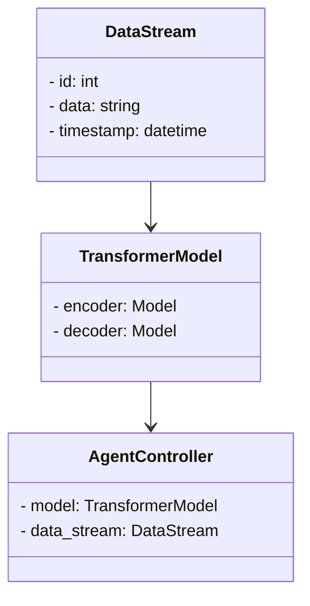
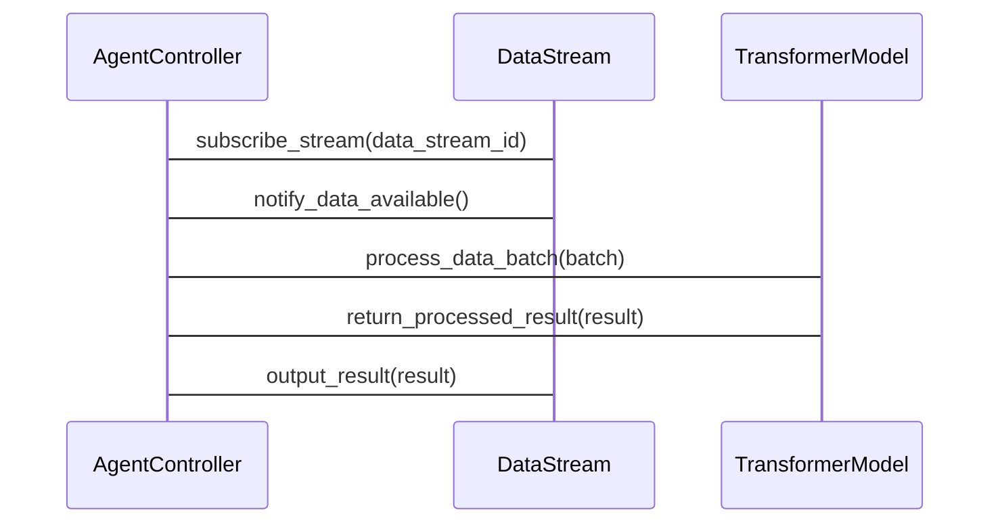

                 


# 企业AI Agent的实时数据流处理架构

## 关键词：企业AI Agent，实时数据流处理，流数据处理，Transformer算法，分布式系统，系统架构设计

## 摘要：  
本文详细探讨了企业AI Agent在实时数据流处理中的架构设计与实现。通过分析实时数据流处理的核心技术，结合企业AI Agent的需求特点，提出了一种基于Transformer算法的分布式实时数据流处理架构。本文从背景介绍、核心概念、算法原理、系统架构到项目实战，全面解析了企业AI Agent实时数据流处理的实现过程，并通过具体案例展示了该架构的实际应用效果。

---

# 第一部分: 企业AI Agent与实时数据流处理概述

## 第1章: 企业AI Agent与实时数据流处理概述

### 1.1 问题背景与目标
#### 1.1.1 企业AI Agent的核心问题背景
随着企业数字化转型的深入推进，实时数据流处理已成为企业智能化运营的关键技术。企业AI Agent需要实时感知环境、处理动态数据并做出决策，这要求其具备高效的实时数据流处理能力。

#### 1.1.2 实时数据流处理的必要性
在企业运营中，实时数据流处理能够帮助AI Agent快速响应业务需求，提升决策效率。例如，在金融交易、智能制造等领域，实时数据流处理是实现自动化决策的核心技术。

#### 1.1.3 问题解决的核心目标
- 实现企业AI Agent对实时数据流的高效处理。
- 保证数据处理的实时性、准确性和可靠性。
- 提供可扩展、可维护的架构设计。

### 1.2 核心概念与定义
#### 1.2.1 企业AI Agent的定义与特征
企业AI Agent是一种能够感知环境、自主决策并执行任务的智能系统，其核心特征包括：
- **自主性**：能够自主决策。
- **反应性**：能够实时感知环境变化。
- **协作性**：能够与人或其他系统协作。

#### 1.2.2 实时数据流处理的定义与特点
实时数据流处理是指对连续不断的数据流进行实时分析和处理的过程，其特点包括：
- **实时性**：数据到达后立即处理。
- **连续性**：处理过程不间断。
- **动态性**：数据流具有动态变化。

#### 1.2.3 两者的结合与应用场景
企业AI Agent与实时数据流处理的结合主要应用于以下场景：
- **金融交易**：实时监控市场数据，快速做出交易决策。
- **智能制造**：实时监控生产过程，优化生产流程。
- **舆情分析**：实时监测社交媒体数据，分析企业声誉。

### 1.3 技术挑战与解决方案
#### 1.3.1 实时数据流处理的技术挑战
- **数据量大**：实时数据流通常具有高吞吐量。
- **数据多样性**：数据来源多样，格式复杂。
- **处理延迟**：要求在极短时间内完成数据处理。

#### 1.3.2 企业AI Agent的实现难点
- **实时性保障**：需要确保AI Agent能够实时感知并处理数据。
- **系统稳定性**：要求系统具备高可用性和容错能力。
- **扩展性设计**：需要支持业务规模的动态扩展。

#### 1.3.3 综合解决方案的概述
结合企业AI Agent的需求和实时数据流处理的特点，本文提出了一种基于Transformer算法的分布式实时数据流处理架构，该架构能够有效解决上述技术挑战。

### 1.4 本章小结
本章介绍了企业AI Agent和实时数据流处理的基本概念，分析了两者结合的应用场景和技术挑战，并提出了本文的核心解决方案——基于Transformer算法的分布式实时数据流处理架构。

---

# 第二部分: 流数据处理技术基础

## 第2章: 流数据处理的核心原理

### 2.1 流数据处理的基本原理
#### 2.1.1 流数据的定义与特征
流数据是指以连续、实时的方式生成并传输的数据，其特征包括：
- **实时性**：数据随时间推移不断生成。
- **无边性**：数据流没有明确的结束标志。
- **动态性**：数据的内容和模式可能随时间变化。

#### 2.1.2 流数据处理的基本流程
流数据处理的基本流程包括：
1. **数据采集**：从各种数据源实时采集数据。
2. **数据预处理**：对数据进行清洗、转换等处理。
3. **数据分析**：对数据进行实时分析，提取有价值的信息。
4. **结果输出**：将分析结果输出到目标系统或存储。

#### 2.1.3 流数据处理的分类与对比
流数据处理可以分为以下几类：
- **基于时间窗口的处理**：按固定时间窗口处理数据。
- **基于事件驱动的处理**：按事件的发生顺序处理数据。
- **基于状态的处理**：维护数据处理的状态，支持复杂逻辑。

### 2.2 流数据处理的关键技术
#### 2.2.1 分布式流处理框架
分布式流处理框架是实现大规模实时数据流处理的核心技术。常见的分布式流处理框架包括：
- **Apache Kafka**：高效的分布式流数据传输系统。
- **Apache Flink**：支持流数据处理的分布式计算框架。
- **Apache Storm**：实时流数据处理框架。

#### 2.2.2 流数据的实时分析技术
实时分析技术是流数据处理的核心，包括：
- **事件时间与处理时间**：区分数据生成时间和处理时间。
- **窗口操作**：对数据流中的特定窗口进行聚合操作。
- **联机分析**：支持实时的查询和分析。

#### 2.2.3 流数据的存储与管理
流数据的存储与管理需要考虑以下方面：
- **存储介质选择**：选择适合实时数据流的存储介质，如内存数据库或分布式文件系统。
- **数据分区策略**：根据数据特征进行分区，提高查询效率。
- **数据保留策略**：制定数据保留策略，避免存储过载。

### 2.3 流数据处理的挑战与优化
#### 2.3.1 流数据处理的性能瓶颈
- **高吞吐量**：需要处理大量的数据流。
- **低延迟**：要求快速响应和处理。
- **资源利用率**：需要高效利用计算资源。

#### 2.3.2 数据一致性与可靠性保障
- **数据一致性**：确保数据处理过程中的数据一致性。
- **容错机制**：设计容错机制，保证系统可靠性。
- **分布式事务**：支持分布式环境下的事务处理。

#### 2.3.3 流数据处理的优化策略
- **并行处理**：利用分布式计算资源，提高处理效率。
- **负载均衡**：动态分配任务，避免资源瓶颈。
- **缓存优化**：利用缓存技术，减少重复计算。

### 2.4 本章小结
本章详细介绍了流数据处理的核心原理、关键技术以及面临的挑战，为后续的企业AI Agent的实时数据流处理架构设计奠定了基础。

---

# 第三部分: 企业AI Agent的核心算法与实现

## 第3章: 基于Transformer的实时数据流处理算法

### 3.1 Transformer算法原理
#### 3.1.1 Transformer的结构与特点
Transformer是一种基于注意力机制的深度学习模型，其核心结构包括编码器和解码器。编码器负责将输入序列转换为上下文表示，解码器负责根据编码器的输出生成目标序列。

#### 3.1.2 Self-Attention机制的数学公式
Self-Attention机制的数学公式如下：
$$
\text{Attention}(Q,K,V) = \text{softmax}\left(\frac{QK^T}{\sqrt{d_k}}\right)V
$$

其中，$Q$ 是查询向量，$K$ 是键向量，$V$ 是值向量，$d_k$ 是键向量的维度。

#### 3.1.3 多头注意力机制的实现细节
多头注意力机制通过并行处理多个注意力头，提高了模型的表达能力。具体实现如下：
1. 将查询、键和值向量分成多个子向量。
2. 对每个子向量计算注意力权重。
3. 将结果拼接起来，得到最终的注意力输出。

### 3.2 基于流数据的Transformer优化
#### 3.2.1 流数据下的在线学习策略
在流数据环境下，Transformer模型需要支持在线学习，即模型能够实时更新参数以适应数据流的变化。

#### 3.2.2 分布式环境下的并行处理
在分布式环境下，可以将Transformer模型的计算任务分配到多个计算节点上，利用并行计算提高处理效率。

#### 3.2.3 模型压缩与轻量化技术
为了减少计算资源消耗，可以对Transformer模型进行压缩和轻量化处理，例如剪枝、知识蒸馏等技术。

### 3.3 实时数据流处理的算法实现
#### 3.3.1 算法实现的伪代码示例
以下是一个基于Transformer的实时数据流处理算法的伪代码示例：
```python
def process_stream(data_stream):
    for batch in data_stream:
        encoded = encoder(batch)
        decoded = decoder(encoded)
        output(decoded)
```

#### 3.3.2 算法优化与实现细节
- **数据预处理**：对数据流进行清洗和标准化处理。
- **模型训练**：使用流数据进行在线训练，更新模型参数。
- **结果输出**：将处理结果实时输出到目标系统。

### 3.4 本章小结
本章详细介绍了基于Transformer的实时数据流处理算法，分析了其在企业AI Agent中的应用，并提出了相应的优化策略。

---

# 第四部分: 企业AI Agent的系统架构与设计

## 第4章: 企业AI Agent的系统架构设计

### 4.1 系统功能设计
#### 4.1.1 领域模型设计
以下是领域模型的Mermaid类图：


#### 4.1.2 系统架构设计
以下是系统架构的Mermaid架构图：
```mermaid
--- architecture ---
title System Architecture
Gitpod
    participant AgentController as "AI Agent Controller"
    participant TransformerModel as "Transformer Model"
    participant DataStream as "Data Stream"
    AgentController -> DataStream: "Subscribe to data stream"
    DataStream -> TransformerModel: "Process data batch"
    TransformerModel -> AgentController: "Return processed result"
```

#### 4.1.3 系统接口设计
系统接口设计包括：
- 数据订阅接口：`subscribe_stream(data_stream_id)`
- 数据处理接口：`process_data_batch(batch)`
- 结果输出接口：`output_result(result)`

#### 4.1.4 系统交互流程
以下是系统交互的Mermaid序列图：


### 4.2 系统实现与优化
#### 4.2.1 系统实现的细节
- **数据流订阅**：通过消息队列实现数据流的订阅和发布。
- **数据处理**：利用分布式计算框架并行处理数据流。
- **结果输出**：将处理结果输出到目标系统或存储。

#### 4.2.2 系统优化策略
- **负载均衡**：动态分配数据处理任务，避免资源瓶颈。
- **容错机制**：设计容错机制，保证系统可靠性。
- **扩展性设计**：支持业务规模的动态扩展。

### 4.3 本章小结
本章详细介绍了企业AI Agent的系统架构设计，包括功能设计、架构设计、接口设计和交互流程，并提出了相应的优化策略。

---

# 第五部分: 项目实战与案例分析

## 第5章: 项目实战与案例分析

### 5.1 项目环境与工具安装
#### 5.1.1 环境配置
- **操作系统**：Linux/Windows/MacOS
- **编程语言**：Python 3.8+
- **依赖库安装**：`pip install apache-flink apache-kafka`

### 5.2 系统核心实现
#### 5.2.1 Transformer模型实现
以下是Transformer模型的Python实现代码：
```python
import tensorflow as tf
from tensorflow import keras

class Transformer(keras.Model):
    def __init__(self, vocab_size, embedding_dim=256, num_heads=8, FFN_units=512):
        super(Transformer, self).__init__()
        self.embedding = keras.layers.Embedding(vocab_size, embedding_dim)
        self.transformer_layer = TransformerLayer(embedding_dim, num_heads, FFN_units)

    def call(self, x, training=False):
        x = self.embedding(x)
        x = self.transformer_layer(x, training=training)
        return x
```

#### 5.2.2 数据流处理实现
以下是数据流处理的Python代码：
```python
from apache_flink importDataStream

class AgentController:
    def __init__(self, model):
        self.model = model
        self.data_stream = DataStream()

    def process_data(self):
        for batch in self.data_stream.read_batches():
            processed_batch = self.model.process_batch(batch)
            self.output_result(processed_batch)
```

### 5.3 项目实战与案例分析
#### 5.3.1 项目实战
以下是一个基于Transformer的实时数据流处理系统的实现案例：
1. **数据源**：从Kafka主题中读取实时数据流。
2. **数据处理**：使用Flink进行流数据处理，调用Transformer模型进行分析。
3. **结果输出**：将处理结果输出到目标系统或存储。

#### 5.3.2 案例分析
以金融交易实时监控为例：
- **数据源**：从交易系统获取实时交易数据。
- **数据处理**：使用Transformer模型分析交易数据，识别异常交易。
- **结果输出**：将异常交易信息实时通知到监控系统。

### 5.4 项目小结
本章通过具体项目实战，详细展示了企业AI Agent实时数据流处理系统的实现过程，并通过案例分析验证了该架构的有效性。

---

# 第六部分: 总结与展望

## 第6章: 总结与展望

### 6.1 核心内容总结
本文详细探讨了企业AI Agent的实时数据流处理架构，提出了基于Transformer算法的分布式实时数据流处理方案，并通过具体案例展示了该架构的实际应用效果。

### 6.2 未来研究方向
未来的研究方向包括：
- **更高效的实时数据处理算法**：探索更高效的流数据处理算法，如基于Transformer的变体模型。
- **更智能的AI Agent设计**：研究更智能的AI Agent设计，提升其决策能力和自适应能力。
- **更高效的系统架构优化**：进一步优化系统架构，提升系统的扩展性和性能。

### 6.3 本章小结
本文总结了企业AI Agent实时数据流处理架构的核心内容，并展望了未来的研究方向。

---

# 附录

## 附录A: 参考文献
1. Transformer论文：[Attention Is All You Need](https://arxiv.org/abs/1706.03798)
2. Apache Flink官方文档：[Flink Documentation](https://ci.apache.org/projects/flink.html)
3. Apache Kafka官方文档：[Kafka Documentation](https://kafka.apache.org/documentation)

## 附录B: 开源工具与库
1. Apache Flink：[Flink GitHub](https://github.com/apache/flink)
2. Apache Kafka：[Kafka GitHub](https://github.com/apache/kafka)
3. TensorFlow：[TensorFlow GitHub](https://github.com/tensorflow/tensorflow)

---

# 作者

作者：AI天才研究院/AI Genius Institute & 禅与计算机程序设计艺术 /Zen And The Art of Computer Programming

