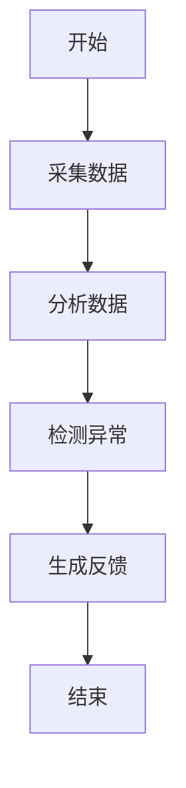
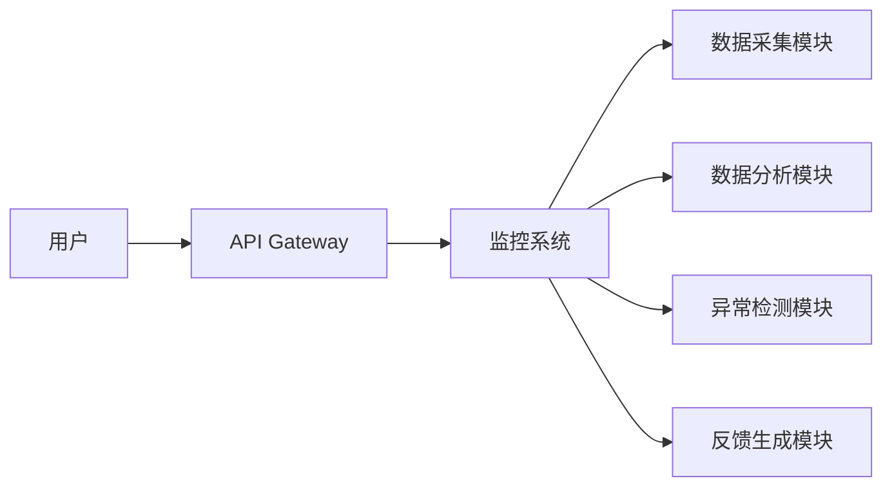
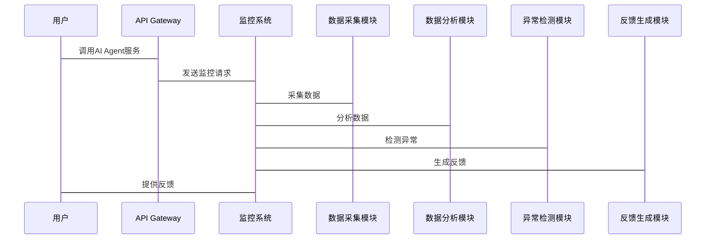

                 


# 企业AI Agent的实时监控系统

## 关键词
- 企业AI Agent
- 实时监控系统
- 系统架构设计
- 算法原理
- 项目实战

## 摘要
本文探讨了企业AI Agent的实时监控系统的设计与实现，从背景分析到系统架构，再到项目实战，详细阐述了构建实时监控系统的关键步骤和技术要点。文章内容包括核心概念解析、算法原理、系统架构设计、项目实现案例等，旨在为企业AI Agent的实时监控提供系统化的解决方案。

---

# 企业AI Agent的实时监控系统

## 第1章：企业AI Agent的实时监控系统概述

### 1.1 问题背景
在企业AI Agent的应用中，实时监控是确保系统稳定运行的关键。AI Agent负责执行复杂的任务，如数据处理、决策支持和自动化操作。然而，这些任务的执行过程中可能会出现性能波动、错误处理不当、资源分配不合理等问题，这些问题可能导致系统崩溃或服务质量下降。因此，实时监控系统的引入变得尤为重要。

### 1.2 问题描述
实时监控的目标是及时发现和解决AI Agent运行中的问题，包括性能瓶颈、错误处理、资源利用率等。当前监控系统主要依赖日志分析和基本指标监控，但难以覆盖AI Agent的动态行为和复杂场景。因此，我们需要一种专门针对AI Agent的实时监控系统，能够提供更全面的监控能力。

### 1.3 问题解决
实时监控系统通过收集和分析AI Agent的运行数据，提供实时反馈和自动化的解决方案。通过监控，企业可以快速定位问题，减少停机时间，提高系统的稳定性和可靠性。

### 1.4 核心概念
- **AI Agent**：具备自主决策和执行能力的智能体，能够根据环境信息做出决策并执行操作。
- **实时监控系统**：能够实时收集、分析和反馈AI Agent运行状态的系统，用于快速发现和解决问题。

---

## 第2章：核心概念与联系

### 2.1 AI Agent与实时监控的关系
AI Agent的运行依赖实时监控系统来保证其稳定性和高效性。实时监控系统通过收集AI Agent的运行数据，提供实时反馈，帮助优化AI Agent的行为。

### 2.2 核心概念的特征对比
| 特征       | AI Agent                     | 实时监控系统               |
|------------|------------------------------|-----------------------------|
| 核心功能    | 执行任务、自主决策            | 数据采集、分析、反馈       |
| 数据来源    | 系统日志、API调用、任务结果   | 性能指标、日志、网络流量   |
| 依赖性      | 依赖实时监控数据             | 依赖AI Agent的运行数据     |

### 2.3 ER实体关系图
```mermaid
er
  actor(AI Agent, -)
  actor(监控系统, -)
  relation(拥有, one, one)
```

---

## 第3章：算法原理

### 3.1 算法概述
实时监控系统的算法主要包括数据采集、数据分析和反馈生成三个部分。数据采集负责收集AI Agent的运行数据，数据分析对数据进行处理和异常检测，反馈生成则根据分析结果生成相应的解决方案。

### 3.2 算法流程图


### 3.3 Python代码实现
```python
def monitor_ai_agent(agent_id):
    import time
    import logging
    import requests

    while True:
        try:
            # 采集数据
            response = requests.get(f"http://localhost:8000/agent/{agent_id}/metrics")
            metrics = response.json()

            # 分析数据
            if metrics['CPU_usage'] > 90:
                logging.warning(f"AI Agent {agent_id} CPU usage exceeds 90%")

            if metrics['error_rate'] > 0.05:
                logging.error(f"AI Agent {agent_id} error rate exceeds 5%")

            time.sleep(1)

        except requests.exceptions.RequestException as e:
            logging.error(f"Failed to fetch metrics for AI Agent {agent_id}: {e}")
            time.sleep(5)

        except Exception as e:
            logging.error(f"Unexpected error monitoring AI Agent {agent_id}: {e}")
            time.sleep(10)
```

### 3.4 数学模型与公式
实时监控系统的核心算法基于异常检测模型。常用的异常检测方法包括：
$$
\text{异常概率} = \frac{\text{异常次数}}{\text{总次数}}
$$
当异常概率超过预设阈值时，系统触发警报。

---

## 第4章：系统分析与架构设计

### 4.1 问题场景介绍
AI Agent在运行过程中可能会遇到以下问题：
1. 性能瓶颈：CPU、内存使用率过高。
2. 错误率升高：API调用失败或任务执行失败。
3. 响应延迟：用户请求处理时间过长。

实时监控系统需要能够实时采集上述指标，并提供解决方案。

### 4.2 系统功能设计
系统功能模块包括：
- 数据采集模块：负责采集AI Agent的运行数据。
- 数据分析模块：对采集的数据进行处理和分析。
- 异常检测模块：根据分析结果检测异常。
- 反馈生成模块：生成相应的反馈信息。

### 4.3 系统架构设计


### 4.4 系统接口设计
- 数据采集接口：`GET /agent/{id}/metrics`
- 异常检测接口：`POST /monitor/check`
- 反馈生成接口：`POST /monitor/feedback`

### 4.5 系统交互图


---

## 第5章：项目实战

### 5.1 环境安装
1. 安装Python和必要的库：
   ```bash
   pip install requests
   pip install mermaid
   ```
2. 安装监控系统：
   ```bash
   git clone https://github.com/your-repo/monitor-system.git
   cd monitor-system
   pip install -r requirements.txt
   ```

### 5.2 核心实现
```python
import requests
import logging
import time

def monitor_ai_agent(agent_id):
    while True:
        try:
            response = requests.get(f"http://localhost:8000/agent/{agent_id}/metrics")
            metrics = response.json()

            # 检查CPU使用率
            if metrics['CPU_usage'] > 90:
                logging.warning(f"AI Agent {agent_id} CPU usage exceeds 90%")

            # 检查错误率
            if metrics['error_rate'] > 0.05:
                logging.error(f"AI Agent {agent_id} error rate exceeds 5%")

            time.sleep(1)

        except requests.exceptions.RequestException as e:
            logging.error(f"Failed to fetch metrics for AI Agent {agent_id}: {e}")
            time.sleep(5)

        except Exception as e:
            logging.error(f"Unexpected error monitoring AI Agent {agent_id}: {e}")
            time.sleep(10)
```

### 5.3 案例分析
假设我们有一个AI Agent负责处理用户请求，实时监控系统能够检测到其CPU使用率过高，并自动触发资源扩展。通过分析错误率，系统还能发现API调用失败的比率升高，并提供优化建议。

---

## 第6章：总结与最佳实践

### 6.1 最佳实践
- 定期检查系统日志，及时发现潜在问题。
- 配置合理的阈值，避免误报或漏报。
- 确保监控系统的高可用性，避免成为单点故障。

### 6.2 小结
本文详细探讨了企业AI Agent的实时监控系统的设计与实现，从背景分析到系统架构，再到项目实战，为企业的实时监控提供了系统化的解决方案。

### 6.3 注意事项
- 监控系统的性能优化需要持续关注。
- 确保数据隐私和安全，避免敏感信息泄露。
- 定期更新监控指标，适应AI Agent的动态需求。

### 6.4 拓展阅读
- 《设计模式》：学习系统设计的基本原则。
- 《监控的艺术》：深入了解监控系统的设计与优化。
- 官方文档：实时监控系统的实现细节。

---

# 作者：AI天才研究院 & 禅与计算机程序设计艺术

