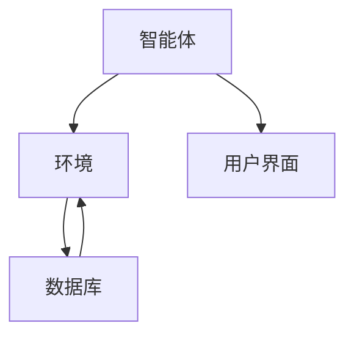

                 

# 企业AI Agent的强化学习在供应链优化中的端到端应用

> 关键词：AI Agent, 强化学习, 供应链优化, 端到端应用, 数学建模, 系统架构, 项目实战

> 摘要：本文将详细探讨企业AI Agent在供应链优化中的强化学习应用，从基本概念到算法实现，再到系统设计和项目实战，系统性地分析如何利用强化学习提升供应链优化的效率和效果。

---

# 第一部分: 企业AI Agent的强化学习基础

## 第1章: 强化学习与AI Agent概述

### 1.1 强化学习的基本概念

#### 1.1.1 强化学习的定义
强化学习（Reinforcement Learning, RL）是一种机器学习范式，通过智能体与环境的交互，学习最优策略以最大化累积奖励。其核心在于通过试错和经验积累，优化决策过程。

#### 1.1.2 强化学习的核心要素
- **状态（State）**：环境中的当前情况，如库存水平、订单需求等。
- **动作（Action）**：智能体采取的行动，如增加订单量、调整生产计划等。
- **奖励（Reward）**：对动作的反馈，衡量行动的好坏，如成本降低、利润增加等。
- **策略（Policy）**：智能体选择动作的规则，目标是找到最优策略。

#### 1.1.3 AI Agent的基本概念
AI Agent是一种智能实体，能够感知环境并采取行动以实现目标。它可以分为反应式和基于模型的类型，广泛应用于自动化决策系统。

### 1.2 强化学习与AI Agent的关系

#### 1.2.1 强化学习在AI Agent中的作用
强化学习为AI Agent提供了一种动态优化决策的能力，使其能够在复杂环境中自适应调整策略。

#### 1.2.2 AI Agent的分类与特点
- **反应式AI Agent**：基于当前感知做出决策。
- **基于模型的AI Agent**：利用环境模型进行规划和决策。
- **强化学习型AI Agent**：通过与环境互动学习最优策略。

#### 1.2.3 强化学习与传统机器学习的对比
| 特性 | 强化学习 | 传统机器学习 |
|------|----------|---------------|
| 数据来源 | 环境互动 | 标记数据集     |
| 决策方式 | 自主决策 | 分类/回归      |
| 环境反馈 | 奖励/惩罚 | 标签           |
| 应用场景 | 动态优化 | 静态分析       |

### 1.3 供应链优化的背景与挑战

#### 1.3.1 供应链优化的基本概念
供应链优化是指通过科学的方法和模型，优化供应链各环节的资源配置，降低运营成本，提高效率。

#### 1.3.2 供应链优化中的常见问题
- **库存积压**：过多库存占用资金，增加成本。
- **供应延迟**：供应商交货不及时，影响生产。
- **需求预测**：需求波动大，预测不准确。

#### 1.3.3 强化学习在供应链优化中的应用潜力
强化学习能够处理复杂的动态环境，适合解决供应链中的多目标优化问题，如库存控制、路径规划等。

---

## 第2章: 强化学习算法原理

### 2.1 强化学习的核心算法

#### 2.1.1 Q-Learning算法

Q-Learning是一种经典的强化学习算法，通过更新Q表（Q-table）来学习最优策略。其核心公式为：

$$ Q(s, a) \leftarrow Q(s, a) + \alpha [r + \gamma \max Q(s', a') - Q(s, a)] $$

其中：
- \( \alpha \)：学习率
- \( \gamma \)：折扣因子
- \( r \)：奖励

#### 2.1.2 Deep Q-Networks (DQN)算法

DQN通过深度神经网络近似Q值函数，解决高维状态空间问题。其网络结构包括编码层、隐藏层和输出层。

#### 2.1.3 Policy Gradient方法

策略梯度法直接优化策略参数，通过梯度上升更新参数：

$$ \theta \leftarrow \theta + \alpha \nabla_\theta J(\theta) $$

### 2.2 强化学习的数学模型

#### 2.2.1 状态、动作、奖励的定义

状态表示当前环境的输入，动作是智能体的选择，奖励是对动作的反馈。

#### 2.2.2 Q-Learning的数学公式

Q值更新公式：

$$ Q(s, a) = Q(s, a) + \alpha [r + \gamma \max Q(s', a') - Q(s, a)] $$

#### 2.2.3 策略梯度法的数学推导

策略梯度的目标函数为：

$$ J(\theta) = \mathbb{E}[R] $$

梯度计算：

$$ \nabla J(\theta) = \mathbb{E}[\nabla \log \pi_\theta(a|s) \cdot Q(s, a)] $$

### 2.3 强化学习的算法优化

#### 2.3.1 算法收敛性分析

DQN通过经验回放和目标网络加速收敛，策略梯度法通过基线估计降低方差。

#### 2.3.2 算法加速技巧

使用经验回放和优先级回放，减少样本偏差。

#### 2.3.3 算法的可扩展性

通过分布式训练和模型剪枝提升算法的扩展性。

---

## 第3章: 供应链优化的强化学习建模

### 3.1 供应链优化问题的抽象

#### 3.1.1 供应链优化的基本问题

库存管理、生产计划、物流调度等。

#### 3.1.2 强化学习在供应链优化中的应用场景

库存优化、需求预测、路径规划。

#### 3.1.3 供应链优化的数学建模

建立数学模型，定义状态、动作、奖励。

### 3.2 强化学习在供应链优化中的状态表示

#### 3.2.1 状态空间的定义

库存水平、订单需求、生产进度等。

#### 3.2.2 动作空间的设计

调整订单量、改变生产速度等。

#### 3.2.3 奖励函数的构建

成本降低、利润增加等。

### 3.3 强化学习在供应链优化中的挑战

#### 3.3.1 状态空间的复杂性

高维状态空间增加计算复杂度。

#### 3.3.2 动作空间的多样性

多动作选择增加优化难度。

#### 3.3.3 奖励函数的设计难度

合理设计奖励函数是关键。

---

## 第4章: AI Agent在供应链优化中的应用

### 4.1 AI Agent的分类与应用

#### 4.1.1 反应式AI Agent

实时响应环境变化，适用于库存监控。

#### 4.1.2 基于模型的AI Agent

利用环境模型进行规划，适用于生产计划。

#### 4.1.3 强化学习型AI Agent

通过与环境互动学习最优策略，适用于动态优化。

### 4.2 供应链优化中的具体案例

#### 4.2.1 库存优化案例

利用强化学习优化库存水平，减少缺货和过剩。

#### 4.2.2 需求预测案例

通过强化学习模型预测需求波动，提高准确性。

#### 4.2.3 物流调度案例

优化物流路径，降低运输成本。

### 4.3 强化学习在供应链优化中的优势

#### 4.3.1 动态适应性

适应环境变化，实时优化决策。

#### 4.3.2 多目标优化

同时优化多个目标，如成本、效率、服务。

#### 4.3.3 高效性

通过强化学习算法，快速找到最优解。

---

## 第5章: 系统架构与实现

### 5.1 系统架构设计

#### 5.1.1 系统组成

智能体、环境、接口、数据库。

#### 5.1.2 系统交互流程

智能体与环境互动，更新策略。

### 5.2 系统架构图

### 5.3 系统接口设计

API接口定义：

- `get_state()`：获取当前状态。
- `take_action(action)`：执行动作。
- `get_reward()`：获取奖励。

### 5.4 系统实现

#### 5.4.1 环境实现

模拟供应链环境，定义状态、动作和奖励。

#### 5.4.2 智能体实现

实现强化学习算法，训练策略。

#### 5.4.3 系统集成

将智能体与供应链系统集成，实时优化。

---

## 第6章: 项目实战

### 6.1 环境安装

安装Python、TensorFlow、Keras等依赖。

### 6.2 核心实现

实现强化学习算法，训练模型。

### 6.3 案例分析

分析具体案例，优化供应链。

### 6.4 应用效果

展示优化结果，分析改进。

### 6.5 项目小结

总结经验，提出改进建议。

---

## 第7章: 最佳实践与小结

### 7.1 最佳实践

- 合理设计状态和动作空间。
- 选择合适的算法和参数。
- 持续优化模型和策略。

### 7.2 小结

本文详细介绍了强化学习在供应链优化中的应用，从理论到实践，系统性地分析了AI Agent的实现和优化。

### 7.3 注意事项

- 确保数据质量和实时性。
- 定期更新模型和策略。
- 注意算法的可扩展性和稳定性。

### 7.4 拓展阅读

推荐相关书籍和论文，进一步深入学习。

---

# 作者

作者：AI天才研究院/AI Genius Institute & 禅与计算机程序设计艺术/Zen And The Art of Computer Programming

