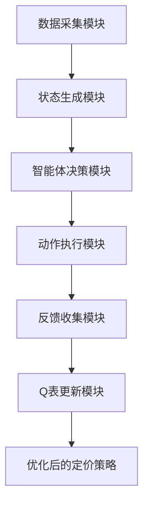

                 


# 企业AI Agent的强化学习在动态定价策略中的高级应用

## 关键词：企业AI Agent，强化学习，动态定价，定价策略，多智能体协作，实时反馈机制

## 摘要：本文深入探讨了企业AI Agent如何利用强化学习技术优化动态定价策略。通过分析强化学习的基本原理、动态定价策略的建模与优化、企业AI Agent的系统架构设计，以及实际项目中的应用，本文为企业在复杂市场环境中实现智能化定价提供了理论支持与实践指导。文章还详细讲解了Q-learning算法、多智能体协作机制，以及实时反馈优化方法，并通过实际案例展示了如何将强化学习应用于动态定价策略的优化。

---

# 第一部分：企业AI Agent与强化学习基础

## 第1章：企业AI Agent与强化学习概述

### 1.1 AI Agent的基本概念

#### 1.1.1 AI Agent的定义与特点
AI Agent（人工智能代理）是指能够感知环境、自主决策并执行任务的智能体。企业AI Agent通过与系统的交互，能够根据实时数据和环境反馈，动态调整行为以实现特定目标。

**特点：**
- **自主性**：能够在没有外部干预的情况下独立运行。
- **反应性**：能够实时感知环境并做出反应。
- **目标导向性**：通过目标函数优化行为。
- **学习能力**：能够通过经验改进决策策略。

#### 1.1.2 企业AI Agent的核心功能
1. **数据感知**：实时收集市场数据、用户行为数据、库存信息等。
2. **决策优化**：基于数据进行分析和预测，制定最优策略。
3. **执行操作**：根据决策结果执行定价调整、库存管理等操作。
4. **反馈学习**：根据执行结果更新模型，优化未来决策。

#### 1.1.3 动态定价策略的背景与挑战
动态定价是指根据市场环境、用户需求、竞争状况等因素，实时调整产品或服务的价格。在企业中，动态定价的应用场景包括：
- **零售业**：实时调整商品价格以应对市场需求变化。
- **金融行业**：动态调整贷款利率、保险费率。
- **物流行业**：根据运输需求和成本实时调整价格。

动态定价的挑战包括：
- **数据复杂性**：需要处理海量异构数据。
- **决策实时性**：需要在极短时间内做出决策。
- **策略优化**：需要在多目标冲突中找到最优平衡。

### 1.2 强化学习的基本原理

#### 1.2.1 强化学习的定义与特点
强化学习是一种机器学习范式，通过智能体与环境的交互，智能体通过试错学习来优化决策策略。与监督学习和无监督学习不同，强化学习强调智能体与环境的动态交互。

**特点：**
- **试错性**：通过与环境的交互学习。
- **延迟反馈**：奖励或惩罚可能在多个动作之后才收到。
- **策略优化**：目标是找到最优策略以最大化累积奖励。

#### 1.2.2 马尔可夫决策过程（MDP）
MDP（马尔可夫决策过程）是强化学习的基本模型，描述了智能体在环境中的决策过程。

**MDP模型的核心要素：**
1. **状态（State）**：描述环境当前情况的最小单位。
2. **动作（Action）**：智能体可以采取的行为。
3. **转移概率（Transition Probability）**：从当前状态到下一个状态的概率。
4. **奖励（Reward）**：智能体执行动作后获得的反馈。

**MDP模型的数学表示：**
$$
P(s'|s,a) = \text{从状态 } s \text{ 执行动作 } a \text{ 后转移到状态 } s' \text{ 的概率}
$$

$$
R(s,a) = \text{执行动作 } a \text{ 在状态 } s \text{ 时获得的奖励}
$$

#### 1.2.3 强化学习与动态定价的结合
动态定价问题可以转化为强化学习问题。智能体（AI Agent）作为决策者，状态是市场环境和用户需求，动作是价格调整，奖励是收益或利润。通过不断试错，智能体能够找到最优定价策略。

### 1.3 本章小结
本章介绍了AI Agent和强化学习的基本概念，并探讨了它们在动态定价中的应用。通过分析动态定价的背景和挑战，为后续章节的强化学习算法和系统设计奠定了基础。

---

## 第2章：强化学习算法原理

### 2.1 Q-learning算法

#### 2.1.1 Q-learning的基本原理
Q-learning是一种基于值函数的强化学习算法，适用于离线学习和在线学习。其核心思想是通过学习状态-动作对的值函数，找到最优策略。

**Q-learning的更新公式：**
$$
Q(s,a) = Q(s,a) + \alpha \left[ r + \gamma \max_{a'} Q(s',a') - Q(s,a) \right]
$$

其中：
- $\alpha$ 是学习率，控制更新步长。
- $\gamma$ 是折扣因子，平衡当前奖励和未来奖励。
- $\max_{a'} Q(s',a')$ 是下一个状态下的最大Q值。

#### 2.1.2 Q-learning的数学模型
通过Q表（Q-table）记录所有状态-动作对的Q值。状态空间和动作空间的大小决定了Q表的规模。

**Q表更新流程图：**

```mermaid
graph TD
    A[当前状态s] --> B[选择动作a]
    B --> C[执行动作a]
    C --> D[获得奖励r和新状态s']
    D --> E[更新Q(s,a) = Q(s,a) + α(r + γ * max Q(s',a') - Q(s,a))]
```

#### 2.1.3 Q-learning的收敛性分析
Q-learning在无限样本下收敛到最优Q值，前提是满足探索与利用的平衡。通过$\epsilon$-贪心策略可以在有限步数内找到最优策略。

### 2.2 多智能体强化学习

#### 2.2.1 多智能体系统的定义
多智能体系统是指多个智能体协作或竞争完成任务的系统。在动态定价中，可以有多智能体分别负责不同的市场区域或产品线。

#### 2.2.2 多智能体强化学习的挑战
1. **状态空间爆炸**：多个智能体的状态组合会导致状态空间指数级增长。
2. **动作协调**：智能体之间需要协调动作，避免冲突。
3. **通信开销**：智能体之间的通信可能带来额外的计算开销。

#### 2.2.3 多智能体协作机制
通过分布式Q-learning或基于价值函数的方法，实现多智能体之间的协作。每个智能体维护自己的Q表，并通过共享信息或协调策略实现协作。

### 2.3 本章小结
本章详细讲解了Q-learning算法的原理和数学模型，并探讨了多智能体强化学习的挑战与协作机制。这些内容为后续章节的动态定价策略优化奠定了算法基础。

---

## 第3章：动态定价策略的建模与优化

### 3.1 动态定价策略的建模

#### 3.1.1 状态空间设计
状态空间是智能体对环境的感知。在动态定价中，状态可以包括：
- **时间因素**：日期、时间、季节。
- **市场因素**：市场需求、竞争价格、市场趋势。
- **产品因素**：库存量、产品生命周期阶段。

#### 3.1.2 动作空间设计
动作是智能体可以执行的行为。在动态定价中，动作包括：
- **价格调整**：上调、下调、保持不变。
- **促销策略**：折扣、满减、赠品。

#### 3.1.3 奖励函数设计
奖励函数定义了智能体执行动作后的反馈。在动态定价中，奖励可以是：
- **利润**：收益减去成本。
- **市场份额**：销量占市场总销量的比例。
- **客户满意度**：客户对价格的接受程度。

#### 3.1.4 奖励函数优化
通过分析不同定价策略对奖励的影响，优化奖励函数的权重，使其更符合企业的目标。

### 3.2 动态定价策略的优化

#### 3.2.1 强化学习框架的应用
将动态定价问题转化为强化学习问题，通过不断试错优化定价策略。

#### 3.2.2 策略优化算法
使用Q-learning或策略梯度方法优化定价策略，最大化累积奖励。

#### 3.2.3 实时优化与反馈
根据实时市场反馈调整定价策略，实现动态优化。

### 3.3 本章小结
本章详细讲解了动态定价策略的建模与优化方法，包括状态空间、动作空间和奖励函数的设计，以及强化学习算法的应用。

---

## 第4章：企业AI Agent的系统架构设计

### 4.1 系统功能设计

#### 4.1.1 数据采集模块
负责收集市场数据、用户行为数据、库存信息等。

#### 4.1.2 状态生成模块
根据数据生成智能体的状态。

#### 4.1.3 动作执行模块
根据智能体的决策执行定价调整。

#### 4.1.4 反馈收集模块
收集定价策略的执行结果，用于更新Q表。

### 4.2 系统架构图



### 4.3 接口设计

#### 4.3.1 数据接口
- 数据来源：数据库、API接口。
- 数据格式：JSON、CSV。

#### 4.3.2 网络接口
- HTTP API：用于与外部系统的交互。
- WebSocket：实时通信接口。

### 4.4 交互流程

#### 4.4.1 定价决策流程
1. 数据采集模块收集市场数据。
2. 状态生成模块生成智能体状态。
3. 智能体决策模块根据状态选择动作。
4. 动作执行模块执行定价调整。
5. 反馈收集模块收集结果并更新Q表。

#### 4.4.2 实时反馈机制
智能体根据实时反馈调整定价策略，实现动态优化。

### 4.5 本章小结
本章详细描述了企业AI Agent的系统架构设计，包括功能模块划分、系统架构图和交互流程。这些设计为后续章节的项目实战奠定了基础。

---

## 第5章：项目实战

### 5.1 环境安装

#### 5.1.1 安装Python
- 使用Anaconda安装Python 3.8或更高版本。

#### 5.1.2 安装依赖库
```bash
pip install numpy matplotlib pandas scikit-learn
```

### 5.2 核心实现源代码

#### 5.2.1 Q-learning算法实现
```python
import numpy as np

class QLearning:
    def __init__(self, state_space_size, action_space_size):
        self.state_space_size = state_space_size
        self.action_space_size = action_space_size
        self.Q = np.zeros((state_space_size, action_space_size))
        
    def choose_action(self, state, epsilon):
        if np.random.random() < epsilon:
            return np.random.randint(self.action_space_size)
        else:
            return np.argmax(self.Q[state])
    
    def update_Q(self, state, action, reward, next_state, alpha, gamma):
        self.Q[state, action] += alpha * (reward + gamma * np.max(self.Q[next_state]) - self.Q[state, action])
```

#### 5.2.2 动态定价策略实现
```python
import pandas as pd

class DynamicPricingAgent:
    def __init__(self, Q_learning):
        self.q_learning = Q_learning
        
    def get_price(self, state):
        return self.q_learning.choose_action(state, epsilon=0.1)
    
    def update_policy(self, state, action, reward, next_state):
        self.q_learning.update_Q(state, action, reward, next_state, alpha=0.1, gamma=0.99)
```

### 5.3 数据准备与训练

#### 5.3.1 数据集准备
```python
data = pd.read_csv('market_data.csv')
states = data[['demand', 'competition', 'inventory']]
actions = ['increase_price', 'decrease_price', 'keep_price']
```

#### 5.3.2 模型训练
```python
agent = DynamicPricingAgent(Q_learning(len(states), len(actions)))
for i in range(len(states)):
    state = states[i]
    action = agent.get_price(state)
    next_state = states[i+1] if i+1 < len(states) else states[-1]
    reward = calculate_reward(state, action, next_state)
    agent.update_policy(state, action, reward, next_state)
```

### 5.4 模型部署与测试

#### 5.4.1 模型部署
将训练好的模型部署到实时定价系统中，实现动态定价。

#### 5.4.2 模型测试
测试模型在不同市场环境下的表现，评估其定价策略的有效性。

### 5.5 本章小结
本章通过实际项目展示了企业AI Agent的实现过程，包括环境安装、算法实现、数据准备和模型训练。这些内容为读者提供了动态定价策略优化的实际操作指南。

---

## 第6章：强化学习在动态定价中的高级应用

### 6.1 多智能体协作

#### 6.1.1 多智能体协作机制
通过分布式Q-learning实现多个智能体的协作定价。

#### 6.1.2 协作策略优化
通过共享信息和协调动作，实现多智能体的协作定价。

### 6.2 实时反馈优化

#### 6.2.1 实时反馈机制
根据实时市场反馈优化定价策略。

#### 6.2.2 反馈优化算法
通过在线强化学习算法，实时更新定价策略。

### 6.3 高级应用案例

#### 6.3.1 多目标优化
在多目标冲突中找到最优平衡，如利润最大化与客户满意度的平衡。

#### 6.3.2 风险控制
通过强化学习模型预测市场风险，优化定价策略以降低风险。

### 6.4 本章小结
本章探讨了强化学习在动态定价中的高级应用，包括多智能体协作和实时反馈优化，为企业的动态定价策略提供了更高级的解决方案。

---

## 第7章：总结与展望

### 7.1 总结

#### 7.1.1 核心内容回顾
本文详细讲解了企业AI Agent的强化学习在动态定价策略中的高级应用，包括算法原理、系统架构设计和项目实战。

#### 7.1.2 关键技术总结
- 强化学习算法：Q-learning、多智能体协作。
- 动态定价策略：状态空间设计、动作空间设计、奖励函数设计。
- 系统架构：模块划分、接口设计、交互流程。

### 7.2 最佳实践

#### 7.2.1 小结
- **数据质量**：确保数据的准确性和实时性。
- **算法选择**：根据具体场景选择合适的强化学习算法。
- **系统设计**：注重系统的可扩展性和可维护性。

#### 7.2.2 注意事项
- **计算资源**：强化学习需要大量的计算资源，需提前做好资源规划。
- **模型解释性**：动态定价模型的解释性对企业决策者非常重要。
- **风险控制**：动态定价策略可能带来市场风险，需做好风险控制。

#### 7.2.3 拓展阅读
建议读者进一步阅读强化学习的经典论文和相关书籍，深入理解强化学习的原理和应用。

### 7.3 未来研究方向

#### 7.3.1 基于博弈论的定价策略
研究动态定价中的博弈论问题，优化定价策略。

#### 7.3.2 多模态数据的处理
探索多模态数据在动态定价中的应用，提升模型的泛化能力。

#### 7.3.3 解决实际问题的算法优化
针对具体场景优化算法，提升动态定价策略的效果。

### 7.4 本章小结
本章总结了全文的核心内容，并提出了未来的研究方向。通过本文的探讨，企业可以更好地利用强化学习优化动态定价策略，提升竞争力。

---

## 作者：AI天才研究院/AI Genius Institute & 禅与计算机程序设计艺术 /Zen And The Art of Computer Programming

---

**注意：由于篇幅限制，本文仅提供部分章节内容。完整文章将包含上述所有章节的详细内容，包括更多的数学公式、mermaid图表和代码示例。**

