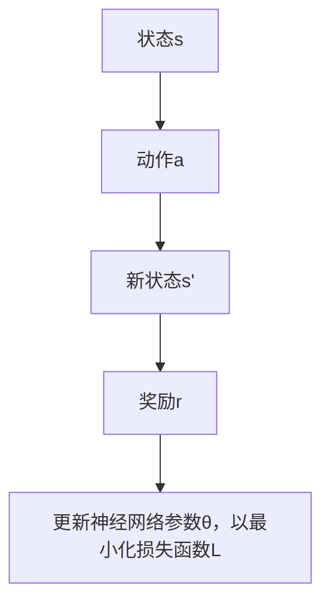
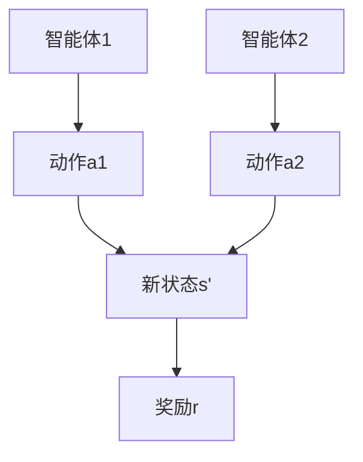
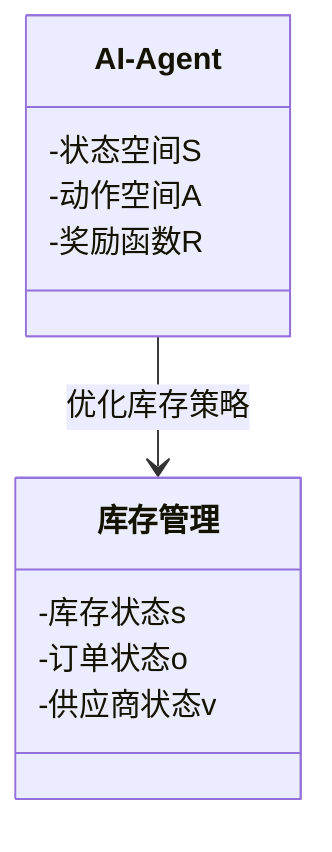
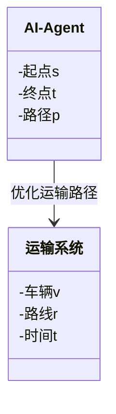
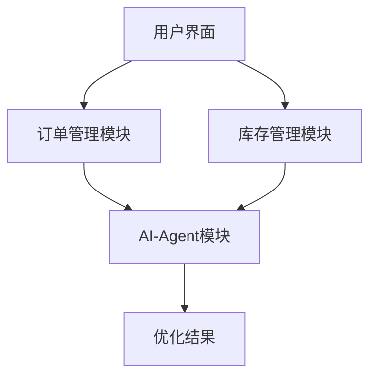

                 


# 企业AI Agent的强化学习在复杂供应链优化中的应用

## 关键词：AI Agent, 强化学习, 供应链优化, 复杂系统, 企业应用

## 摘要：  
本文探讨了AI Agent与强化学习在复杂供应链优化中的应用，详细分析了强化学习算法的原理及其在供应链优化中的优势，结合实际场景设计了AI Agent的系统架构，并通过案例分析展示了强化学习在库存管理、订单调度和运输路径优化中的应用。本文还提供了系统设计与实现的具体步骤，为读者提供了一套完整的解决方案。

---

# 第一部分: AI Agent与强化学习基础

## 第1章: AI Agent的基本概念

### 1.1 AI Agent的定义与特点

AI Agent（人工智能代理）是指能够感知环境、自主决策并采取行动的智能体。其核心特点包括：

- **自主性**：能够在没有外部干预的情况下独立运行。
- **反应性**：能够实时感知环境并做出响应。
- **目标导向性**：具有明确的目标，能够采取行动以实现目标。
- **学习能力**：能够通过经验改进自身的决策能力。

AI Agent在供应链优化中的应用主要体现在自动化决策、实时优化和风险预测等方面。

### 1.2 强化学习的基本原理

强化学习是一种机器学习范式，通过智能体与环境的交互来最大化累积奖励。其核心概念包括：

- **状态（State）**：智能体所处的环境状况。
- **动作（Action）**：智能体根据当前状态做出的决策。
- **奖励（Reward）**：智能体采取某个动作后所获得的反馈。

强化学习的目标是通过不断试错，找到能够最大化累积奖励的策略。

### 1.3 AI Agent与强化学习的结合

AI Agent通过强化学习技术，能够更好地适应复杂动态的供应链环境。强化学习为AI Agent提供了自主决策和优化的能力，而AI Agent则为强化学习提供了实际应用场景和数据支持。

---

## 第2章: 强化学习算法原理

### 2.1 Q-Learning算法

Q-Learning是一种经典的强化学习算法，适用于单智能体场景。其核心思想是通过构建Q值表来记录每个状态-动作对的最优价值。

#### Q-Learning算法流程（Mermaid图）

```mermaid
graph TD
A[状态s] --> B[动作a]
B --> C[新状态s']
C --> D[奖励r]
D --> E(Q(s,a) = max(Q(s,a), r + γ * max(Q(s',a')))
```

其中，γ是折扣因子，用于平衡当前奖励和未来奖励的重要性。

### 2.2 Deep Q-Learning算法

Deep Q-Learning通过深度神经网络近似Q值函数，能够处理高维状态空间和动作空间。其核心流程如下：

#### Deep Q-Learning算法流程（Mermaid图）



损失函数通常采用均方误差形式：

$$ L = \mathbb{E}[(Q(s,a) - (r + \gamma \max Q(s',a')))^2] $$

### 2.3 多智能体强化学习

多智能体强化学习涉及多个智能体协同或竞争完成任务。其挑战在于如何处理智能体之间的协作与竞争关系。一种常用方法是采用分布式策略，每个智能体独立优化自身策略，同时通过共享参数或通信机制实现协作。

#### 多智能体强化学习架构（Mermaid图）



---

## 第3章: AI Agent在供应链优化中的应用

### 3.1 库存管理优化

库存管理是供应链优化的核心问题之一。通过AI Agent和强化学习，可以实现动态库存调整，降低库存成本。

#### 库存管理优化模型（Mermaid类图）



### 3.2 订单调度优化

订单调度优化的目标是通过合理分配资源，提高供应链的效率。AI Agent可以通过强化学习算法，实现订单优先级的动态调整。

#### 订单调度优化流程（Mermaid序列图）

```mermaid
sequenceDiagram
参与者 AI-Agent
参与者 订单系统
AI-Agent -> 订单系统: 获取订单状态
订单系统 -> AI-Agent: 返回可用资源
AI-Agent -> 订单系统: 发出调度指令
订单系统 -> AI-Agent: 返回执行结果
```

### 3.3 运输路径优化

运输路径优化是供应链优化的重要组成部分。通过强化学习，AI Agent可以实时调整运输路线，减少运输成本。

#### 运输路径优化模型（Mermaid类图）



---

## 第4章: 系统分析与架构设计

### 4.1 系统需求分析

供应链优化系统的核心需求包括：

1. **实时性**：能够快速响应供应链中的变化。
2. **准确性**：保证优化结果的准确性。
3. **可扩展性**：能够适应不同规模的供应链。

### 4.2 系统架构设计

#### 系统架构（Mermaid架构图）



#### 系统交互流程（Mermaid序列图）

```mermaid
sequenceDiagram
参与者 用户
参与者 订单管理模块
参与者 库存管理模块
参与者 AI-Agent模块
用户 -> 订单管理模块: 提交订单
订单管理模块 -> AI-Agent模块: 请求优化
AI-Agent模块 --> 库存管理模块: 获取库存状态
库存管理模块 --> AI-Agent模块: 返回可用库存
AI-Agent模块 --> 订单管理模块: 返回优化结果
订单管理模块 -> 用户: 显示结果
```

---

## 第5章: 项目实战

### 5.1 环境安装与配置

```bash
pip install numpy
pip install gym
pip install tensorflow
```

### 5.2 核心代码实现

#### Q-Learning算法实现

```python
import numpy as np

class QLearning:
    def __init__(self, state_space, action_space, gamma=0.99):
        self.state_space = state_space
        self.action_space = action_space
        self.gamma = gamma
        self.q_table = np.zeros((state_space, action_space))
    
    def choose_action(self, state, epsilon=0.1):
        if np.random.random() < epsilon:
            return np.random.randint(self.action_space)
        else:
            return np.argmax(self.q_table[state])
    
    def learn(self, state, action, reward, next_state):
        self.q_table[state, action] = reward + self.gamma * np.max(self.q_table[next_state])
```

#### 库存管理优化实现

```python
from q_learning import QLearning

class InventoryManager:
    def __init__(self, state_size, action_size):
        self.agent = QLearning(state_size, action_size)
    
    def optimize_inventory(self, state):
        action = self.agent.choose_action(state)
        return action
```

### 5.3 案例分析与结果解读

#### 库存管理优化案例

假设库存状态为 `[current_stock, demand, lead_time]`，动作为空调库存水平。通过训练Q-Learning算法，AI Agent能够找到最优库存水平，降低缺货率和库存成本。

#### 运输路径优化案例

假设运输系统中有多个车辆和路线，AI Agent通过强化学习算法，实时调整运输路线，减少运输成本和时间。

### 5.4 最佳实践与注意事项

- **数据质量**：强化学习的效果依赖于数据的质量，确保数据的准确性和完整性。
- **训练时间**：复杂的供应链优化问题需要较长的训练时间，建议采用分布式计算。
- **模型调优**：根据实际场景调整算法参数，如学习率和折扣因子。

---

## 第6章: 总结与展望

### 6.1 总结

本文详细探讨了AI Agent与强化学习在复杂供应链优化中的应用，分析了强化学习算法的原理，设计了系统的架构，并通过实际案例展示了算法的实现与效果。

### 6.2 未来展望

随着AI技术的不断发展，AI Agent在供应链优化中的应用将更加广泛。未来的研究方向包括：

1. **多智能体协同优化**：研究多个AI Agent协同优化供应链的问题。
2. **实时优化技术**：探索更高效的强化学习算法，实现供应链的实时优化。
3. **边缘计算结合**：将AI Agent部署在边缘设备上，进一步提高优化效率。

---

## 作者信息

作者：AI天才研究院/AI Genius Institute & 禅与计算机程序设计艺术 /Zen And The Art of Computer Programming

---

本文通过系统地分析和实践，展示了AI Agent与强化学习在复杂供应链优化中的巨大潜力，为企业的供应链优化提供了一种新的思路和方法。

