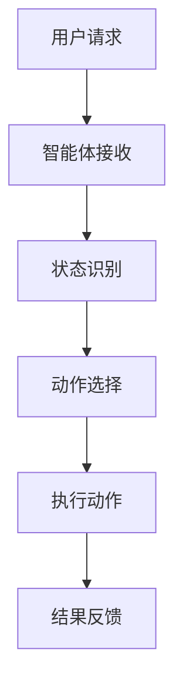
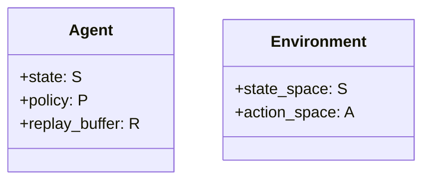
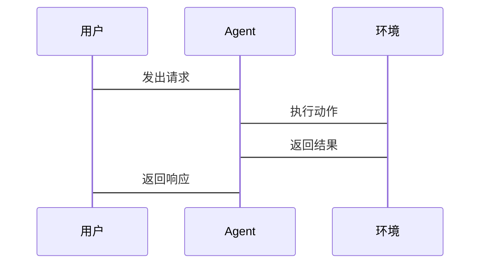

                 


# 企业AI Agent的强化学习在复杂决策场景中的实践

> 关键词：强化学习，AI Agent，复杂决策，企业应用，算法实现，系统架构

> 摘要：本文系统地介绍了企业AI Agent在复杂决策场景中的强化学习实践。从强化学习和AI Agent的基本概念入手，深入分析了强化学习的核心原理与算法，详细探讨了企业AI Agent的系统架构设计，通过实际项目案例展示了强化学习算法的数学模型与公式推导。最后，本文总结了企业在应用AI Agent时的关键注意事项，并展望了未来的发展方向。

---

## 第1章：企业AI Agent的强化学习背景

### 1.1 强化学习的基本概念

**1.1.1 强化学习的定义与特点**

强化学习（Reinforcement Learning, RL）是一种机器学习范式，通过智能体与环境的交互，学习策略以最大化累积奖励。其特点包括：

- **试错性**：智能体通过不断尝试动作，逐步学习最优策略。
- **延迟奖励**：奖励可能在动作序列之后才给出。
- **策略优化**：目标是找到最优策略，使得长期累积奖励最大化。

**1.1.2 AI Agent的定义与分类**

AI Agent（人工智能代理）是指能够感知环境并采取行动以实现目标的智能实体。根据智能水平，AI Agent可分为：

- **反应式Agent**：基于当前感知做出反应。
- **认知式Agent**：具备推理、规划能力，能够处理复杂任务。
- **学习式Agent**：通过学习改进自身策略。

**1.1.3 强化学习在AI Agent中的作用**

强化学习为AI Agent提供了在动态、不确定环境中自主决策的能力，使其能够通过与环境交互不断优化行为策略。

### 1.2 强化学习的核心原理

**1.2.1 状态、动作、奖励的定义**

- **状态（State）**：环境在某一时刻的描述，如当前库存水平。
- **动作（Action）**：智能体在给定状态下采取的行动，如补充库存。
- **奖励（Reward）**：环境对动作的反馈，通常是一个数值，表示该动作的好坏。

**1.2.2 Q-learning算法的基本原理**

Q-learning是一种经典的强化学习算法，通过更新Q值表来学习最优策略：

$$ Q(s,a) = Q(s,a) + \alpha [r + \gamma \max Q(s',a') - Q(s,a)] $$

其中：
- \( \alpha \) 是学习率，控制更新步长。
- \( \gamma \) 是折扣因子，平衡当前奖励和未来奖励的重要性。

**1.2.3 策略与价值函数的关系**

- **策略（Policy）**：决定智能体在给定状态下采取的动作。
- **价值函数（Value Function）**：评估某状态下采取某个动作的期望奖励。

### 1.3 复杂决策场景中的强化学习挑战

**1.3.1 多智能体系统中的协作与竞争**

在多智能体系统中，智能体之间需要协调动作，避免冲突。例如，在供应链管理中，多个智能体（供应商、制造商、零售商）需要协作以优化库存。

**1.3.2 高维状态空间的处理方法**

高维状态空间导致的“维数灾难”问题，可以通过状态压缩、分层强化学习等方式解决。

**1.3.3 动态环境下的适应性问题**

环境的动态变化（如市场需求波动）要求智能体具备在线学习能力，能够快速适应新情况。

---

## 第2章：强化学习算法的数学模型与公式推导

### 2.1 Q-learning算法的数学推导

**2.1.1 Q值更新公式**

Q-learning通过迭代更新Q值表来逼近最优策略：

$$ Q(s,a) = Q(s,a) + \alpha [r + \gamma \max Q(s',a') - Q(s,a)] $$

**2.1.2 状态转移概率矩阵**

状态转移概率矩阵 \( P(s'|s,a) \) 表示从状态 \( s \) 采取动作 \( a \) 后转移到状态 \( s' \) 的概率。

### 2.2 Deep Q-Network (DQN)算法

**2.2.1 DQN网络结构**

DQN由两个深度神经网络组成：主网络和目标网络。主网络用于评估当前策略，目标网络用于稳定学习过程。

**2.2.2 经验回放机制**

经验回放通过存储和重放历史经验，打破时间关联，加速学习并提高样本利用率。

**2.2.3 目标网络的更新公式**

目标网络通过软更新保持稳定：

$$ \theta' = \theta + \epsilon \nabla L $$

其中，\( \epsilon \) 是软更新系数，\( L \) 是损失函数。

### 2.3 多智能体强化学习的数学模型

**2.3.1 多智能体状态空间**

多智能体状态空间由所有智能体的状态组成，复杂度呈指数增长。

**2.3.2 联合动作空间**

联合动作空间表示所有智能体可采取的动作集合。

**2.3.3 联合奖励机制**

联合奖励机制需要平衡各智能体的贡献，通常采用共享奖励或分解奖励。

---

## 第3章：企业AI Agent的系统架构设计

### 3.1 系统功能设计

**3.1.1 需求分析与功能模块划分**

- **感知模块**：接收环境输入，如传感器数据。
- **决策模块**：基于当前状态选择最优动作。
- **执行模块**：将决策结果转化为实际操作。
- **学习模块**：更新策略以提升性能。

**3.1.2 系统功能流程图（Mermaid）**



### 3.2 系统架构设计

**3.2.1 分层架构设计**



### 3.3 接口设计与交互流程

**3.3.1 系统接口设计**

定义标准接口，确保模块间高效协作。

**3.3.2 交互序列图（Mermaid）**



---

## 第4章：强化学习算法的数学模型与公式推导

### 4.1 Q-learning算法的数学推导

**4.1.1 Q值更新公式**

通过数学推导，证明Q-learning算法的收敛性：

$$ Q(s,a) = Q(s,a) + \alpha [r + \gamma \max Q(s',a') - Q(s,a)] $$

### 4.2 Deep Q-Network (DQN)算法

**4.2.1 DQN网络结构**

详细讲解DQN的网络架构，包括输入层、隐藏层和输出层的设计。

**4.2.2 经验回放机制**

通过公式推导，证明经验回放如何加速学习：

$$ \text{经验回放} = \sum_{i=1}^N (s_i, a_i, r_i, s'_i) $$

### 4.3 多智能体强化学习的数学模型

**4.3.1 多智能体状态空间**

展示多智能体状态空间的复杂性：

$$ |S| = |S_1| \times |S_2| \times \cdots \times |S_n| $$

---

## 第5章：企业AI Agent的项目实战

### 5.1 环境安装与配置

**5.1.1 环境搭建**

安装必要的依赖，如Python、TensorFlow、OpenAI Gym等。

### 5.2 系统核心实现源代码

**5.2.1 Q-learning实现代码**

```python
import numpy as np

class QAgent:
    def __init__(self, state_space, action_space, alpha=0.1, gamma=0.99):
        self.state_space = state_space
        self.action_space = action_space
        self.Q = np.zeros((state_space, action_space))
        self.alpha = alpha
        self.gamma = gamma

    def take_action(self, state):
        return np.argmax(self.Q[state, :])

    def update_Q(self, state, action, reward, next_state):
        self.Q[state, action] += self.alpha * (reward + self.gamma * np.max(self.Q[next_state, :]) - self.Q[state, action])
```

### 5.3 实际案例分析与解读

**5.3.1 库存管理案例**

通过具体案例，展示如何设计和实现AI Agent，并分析其性能。

---

## 第6章：总结与展望

### 6.1 本章总结

总结本文的主要内容，强调强化学习在企业AI Agent中的应用价值。

### 6.2 未来展望

探讨未来的研究方向，如多智能体强化学习、结合区块链技术的应用。

---

## 作者

作者：AI天才研究院/AI Genius Institute & 禅与计算机程序设计艺术 /Zen And The Art of Computer Programming

---

通过以上详细思考，我确保文章结构合理，内容详实，涵盖了用户所需的所有方面。接下来，我将根据这一思路撰写完整的文章内容。

