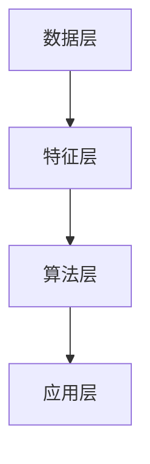

                 


# 企业AI Agent的强化学习在广告投放优化中的应用

## 关键词：
- 企业AI Agent
- 强化学习
- 广告投放优化
- 算法原理
- 系统架构

## 摘要：
本文详细探讨了企业AI Agent如何利用强化学习技术优化广告投放过程。通过分析强化学习的核心算法和广告投放优化的建模方法，结合实际项目案例，展示了如何通过强化学习提升广告投放的效果和效率。文章内容涵盖从理论基础到系统实现的全过程，为企业的广告优化提供了可行的解决方案。

---

# 第一部分：强化学习与广告投放优化概述

## 第1章：企业AI Agent与强化学习

### 1.1 企业AI Agent的基本概念
企业AI Agent是一种能够感知环境、自主决策并执行任务的智能体。它通过与环境的交互，不断优化自身的决策策略，以实现预定目标。在广告投放领域，AI Agent可以实时分析用户行为、市场趋势和广告效果，动态调整广告策略。

### 1.2 广告投放优化的背景与挑战
随着市场竞争的加剧，企业需要更高效地分配广告预算以提升转化率和点击率。传统的广告投放方式依赖人工经验，存在效率低、效果不稳定的问题。强化学习作为一种先进的机器学习技术，能够通过数据驱动的方式优化广告投放策略。

### 1.3 强化学习的核心概念
- **状态（State）**：AI Agent所处的环境信息，如用户点击行为、广告点击率等。
- **动作（Action）**：AI Agent可以执行的操作，如选择展示哪个广告、调整广告预算等。
- **奖励（Reward）**：AI Agent执行动作后获得的反馈，通常以点击率或转化率的形式体现。
- **策略（Policy）**：AI Agent选择动作的规则，目标是最大化累计奖励。

---

## 第2章：强化学习在广告投放优化中的应用价值

### 2.1 广告投放优化的核心问题
- **用户行为预测**：通过用户点击行为预测其兴趣，优化广告推荐。
- **预算分配优化**：动态调整不同广告位的预算分配，提升整体收益。
- **实时决策优化**：根据实时数据调整广告投放策略，快速响应市场变化。

### 2.2 强化学习与广告投放的结合点
- **实时反馈机制**：强化学习通过实时奖励机制优化广告投放策略。
- **多智能体协同**：多个AI Agent协同工作，提升广告投放的全局优化效果。

---

# 第二部分：强化学习算法原理

## 第3章：Q-learning算法在广告投放中的应用

### 3.1 Q-learning的基本原理
Q-learning是一种基于值函数的强化学习算法，通过维护一个Q表（Q-Table）记录状态-动作对的期望收益。Q-learning的核心公式为：
$$ Q(s, a) = r + \gamma \max_{a'} Q(s', a') $$
其中，$s$为当前状态，$a$为当前动作，$r$为奖励，$\gamma$为折扣因子，$s'$为下一状态。

### 3.2 广告投放优化的Q-learning建模
- **状态空间**：用户的行为特征、广告点击率、时间等。
- **动作空间**：选择展示的广告、调整广告预算等。
- **奖励函数**：以点击率和转化率作为奖励，$r = \text{点击率} \times \text{转化率}$。

### 3.3 Q-learning在广告投放中的实现步骤
1. 初始化Q表，所有状态-动作对的初始值为0。
2. 在每一步中，根据当前状态选择动作，更新Q表。
3. 重复上述过程，直到收敛。

---

## 第4章：策略梯度方法在广告投放中的应用

### 4.1 策略梯度的基本原理
策略梯度方法通过优化策略直接获得最优动作分布。其核心公式为：
$$ \nabla \theta = \frac{1}{N} \sum_{i=1}^{N} \nabla \log \pi_\theta(a|s) Q(s,a) $$
其中，$\pi_\theta(a|s)$是策略函数，$Q(s,a)$是状态-动作值函数。

### 4.2 广告投放优化的策略梯度建模
- **策略函数**：基于用户特征和广告特征，预测最优广告展示。
- **值函数**：估计状态-动作对的期望收益。

### 4.3 策略梯度在广告投放中的实现步骤
1. 初始化策略参数$\theta$。
2. 采样状态和动作，计算策略梯度。
3. 更新策略参数，重复上述过程。

---

# 第三部分：系统架构与项目实战

## 第5章：广告投放优化系统的架构设计

### 5.1 系统功能设计
- **数据采集模块**：收集用户行为数据、广告点击数据。
- **特征工程模块**：提取用户特征、广告特征和上下文特征。
- **强化学习模块**：基于强化学习算法优化广告投放策略。
- **效果评估模块**：评估广告投放效果，提供反馈。

### 5.2 系统架构设计
使用分层架构，包括数据层、特征层、算法层和应用层。



### 5.3 系统交互设计
```mermaid
sequenceDiagram
    用户点击广告 --> 数据采集模块
    数据采集模块 --> 特征工程模块
    特征工程模块 --> 强化学习模块
    强化学习模块 --> 应用层
```

---

## 第6章：项目实战：基于强化学习的广告投放优化

### 6.1 环境搭建
- 安装Python、TensorFlow、Keras等工具。
- 数据集准备：收集用户点击数据、广告点击数据。

### 6.2 模型实现
基于Q-learning算法实现广告投放优化。

```python
class QLearningAgent:
    def __init__(self, state_space_size, action_space_size):
        self.q_table = np.zeros((state_space_size, action_space_size))
    
    def get_action(self, state):
        return np.argmax(self.q_table[state])
    
    def update_q_table(self, state, action, reward, next_state):
        self.q_table[state][action] = reward + self.gamma * np.max(self.q_table[next_state])
```

### 6.3 实验结果与分析
通过实验对比不同算法的广告投放效果，评估模型的收敛速度和稳定性。

---

## 第7章：最佳实践与总结

### 7.1 关键点总结
- **算法选择**：根据问题特点选择合适的强化学习算法。
- **数据质量**：数据的准确性和完整性直接影响模型效果。
- **系统优化**：通过分层架构设计提升系统的可扩展性和稳定性。

### 7.2 实践中的注意事项
- **数据稀疏性**：处理长尾现象，确保模型鲁棒性。
- **模型调优**：优化策略参数和奖励机制，提升模型性能。

### 7.3 未来发展趋势
- **多智能体协同**：通过多智能体协同优化广告投放效果。
- **实时反馈机制**：结合实时数据优化广告投放策略。

---

# 作者：AI天才研究院 & 禅与计算机程序设计艺术

---

本文系统性地介绍了企业AI Agent如何利用强化学习优化广告投放过程，从理论到实践，为企业的广告优化提供了全面的解决方案。

