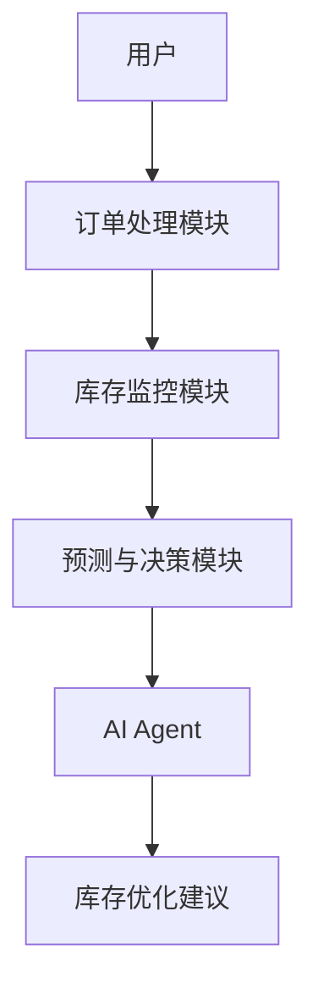

                 


# 企业AI Agent的强化学习在库存管理中的应用

## 关键词：
- AI Agent, 强化学习, 库存管理, Q-Learning, DQN, 系统架构

## 摘要：
本文探讨了AI Agent在库存管理中的强化学习应用，详细分析了Q-Learning和DQN算法，设计了库存管理系统的功能模块和架构，并通过实际案例展示了如何将强化学习应用于库存优化，最后总结了最佳实践和未来发展方向。

---

## 第1章: 强化学习与AI Agent概述

### 1.1 强化学习的基本概念
#### 1.1.1 强化学习的定义与特点
强化学习是一种机器学习范式，通过智能体与环境交互，学习如何采取最优动作以最大化累积奖励。其特点包括：环境交互、奖励驱动、策略优化和经验累积。

#### 1.1.2 AI Agent的基本概念
AI Agent是能够感知环境并采取行动以实现目标的智能实体。它通过传感器获取信息，利用推理能力做出决策，并通过执行器与环境交互。

#### 1.1.3 强化学习在AI Agent中的作用
强化学习为AI Agent提供决策策略，使其能够在动态环境中自主优化行为，实现目标。

### 1.2 库存管理中的强化学习应用
#### 1.2.1 库存管理的基本问题
库存管理涉及订单处理、库存监控和预测与决策，目标是平衡库存成本和订单成本。

#### 1.2.2 强化学习在库存管理中的优势
强化学习能够处理动态环境中的复杂决策问题，提供实时优化建议。

#### 1.2.3 AI Agent在库存管理中的角色
AI Agent通过强化学习优化库存管理策略，降低库存成本，提高订单处理效率。

---

## 第2章: 强化学习的核心算法

### 2.1 Q-Learning算法
#### 2.1.1 Q-Learning的基本原理
Q-Learning通过Q表记录状态-动作对的期望奖励，更新公式为：
$$ Q(s, a) = Q(s, a) + \alpha (r + \gamma \max Q(s', a') - Q(s, a)) $$

#### 2.1.2 Q-Learning的数学模型
Q-Learning通过状态转移和奖励函数更新Q值，实现最优策略。

#### 2.1.3 Q-Learning的实现步骤
1. 初始化Q表。
2. 环境感知获取状态。
3. 根据策略选择动作。
4. 执行动作，观察新状态和奖励。
5. 更新Q表。

### 2.2 Deep Q-Networks (DQN)
#### 2.2.1 DQN的基本原理
DQN利用深度神经网络近似Q值函数，通过经验回放和目标网络优化。

#### 2.2.2 DQN的网络结构
DQN包含输入层、隐藏层和输出层，输出层大小为动作空间大小。

#### 2.2.3 DQN在库存管理中的应用
DQN能够处理高维状态空间，适用于复杂库存管理场景。

---

## 第3章: AI Agent在库存管理中的系统架构

### 3.1 系统功能模块设计
#### 3.1.1 订单处理模块
处理客户订单，更新库存状态。

#### 3.1.2 库存监控模块
监控库存水平，触发补货请求。

#### 3.1.3 预测与决策模块
基于历史数据预测需求，优化库存策略。

### 3.2 系统架构设计


---

## 第4章: 强化学习在库存管理中的数学模型

### 4.1 马尔可夫决策过程
#### 4.1.1 状态空间
包括当前库存量、需求预测等。

#### 4.1.2 动作空间
包括补货数量、不补货等。

#### 4.1.3 奖励函数
$$ R(s, a) = \text{库存成本} + \text{订单成本} $$

### 4.2 Q-Learning的更新公式
$$ Q(s, a) = Q(s, a) + \alpha (r + \gamma \max Q(s', a') - Q(s, a)) $$

---

## 第5章: 项目实战

### 5.1 环境安装
安装Python、TensorFlow和OpenAI Gym等库。

### 5.2 系统核心实现源代码
```python
import numpy as np
import gym
from gym import spaces
from gym.utils import seeding

class InventoryEnv(gym.Env):
    def __init__(self, max_inventory=100, min_inventory=0):
        self.max_inventory = max_inventory
        self.min_inventory = min_inventory
        self.current_inventory = 50
        self.observation_space = spaces.Box(low=0, high=100, shape=(1,))
        self.action_space = spaces.Discrete(3)
        self.seed()

    def seed(self, seed=None):
        self.np_random, seed = seeding.np_random(seed)
        return seed

    def reset(self):
        self.current_inventory = 50
        return np.array([50])

    def step(self, action):
        if action == 0:
            new_inventory = self.current_inventory - 10
        elif action == 1:
            new_inventory = self.current_inventory
        elif action == 2:
            new_inventory = self.current_inventory + 10
        reward = self._calculate_reward(new_inventory)
        done = new_inventory < self.min_inventory or new_inventory > self.max_inventory
        return np.array([new_inventory]), reward, done, {}

    def _calculate_reward(self, inventory):
        if inventory < self.min_inventory or inventory > self.max_inventory:
            return -1
        else:
            return 1
```

### 5.3 实际案例分析
通过模拟库存管理场景，展示AI Agent如何优化库存策略，减少库存成本。

---

## 第6章: 总结与展望

### 6.1 总结
本文详细介绍了AI Agent在库存管理中的强化学习应用，分析了Q-Learning和DQN算法，设计了系统架构，并通过案例展示了实际应用。

### 6.2 未来发展方向
未来可以研究多智能体协作、强化学习与博弈论结合，以及实时库存优化策略。

---

## 作者：AI天才研究院/AI Genius Institute & 禅与计算机程序设计艺术 /Zen And The Art of Computer Programming

---

这篇文章通过系统化的结构，详细讲解了企业AI Agent在库存管理中的强化学习应用，从理论到实践，帮助读者全面理解相关技术和应用场景。

