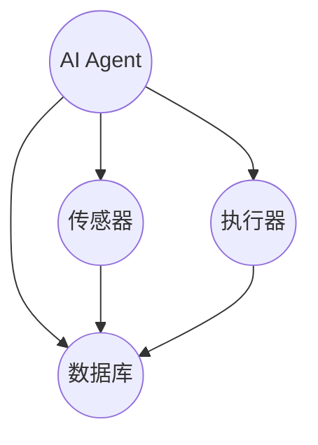

                 


# 企业AI Agent的强化学习在智能工厂生产调度中的应用

> **关键词**：AI Agent，强化学习，智能工厂，生产调度，优化算法

> **摘要**：本文探讨了企业AI Agent如何通过强化学习技术优化智能工厂的生产调度问题。文章首先介绍AI Agent和强化学习的基本概念，分析智能工厂生产调度问题的复杂性和挑战。接着，详细阐述强化学习的算法原理，包括Q-learning和Actor-Critic算法，并通过数学模型和公式推导深入讲解。然后，从系统架构设计的角度，分析智能工厂生产调度系统的整体架构，包括功能设计、模块交互和接口设计。最后，通过具体项目实战案例，展示如何将强化学习算法应用于实际生产调度问题，并探讨算法优化与扩展的可能性。本文旨在为智能工厂的生产调度问题提供一种基于强化学习的解决方案，为相关领域的研究和实践提供参考。

---

## 第一部分: 企业AI Agent的强化学习基础

### 第1章: AI Agent与强化学习概述

#### 1.1 AI Agent的基本概念

**1.1.1 AI Agent的定义与特点**

AI Agent（人工智能代理）是指能够感知环境并采取行动以实现目标的智能实体。AI Agent在智能工厂中扮演着关键角色，负责执行复杂的决策任务，优化生产流程。

- **定义**：AI Agent是一种能够自主决策、执行任务的智能系统。
- **特点**：
  - 自主性：能够独立决策。
  - 反应性：能够实时感知环境变化并做出反应。
  - 学习性：能够通过经验改进决策策略。

**1.1.2 强化学习的基本概念**

强化学习是一种机器学习范式，通过智能体与环境的交互，学习最优策略以最大化累积奖励。其核心在于通过试错过程优化决策。

- **核心要素**：
  - 状态（State）：环境的当前情况。
  - 动作（Action）：智能体采取的行动。
  - 奖励（Reward）：对智能体行为的反馈。
  - 策略（Policy）：决定动作的选择机制。

**1.1.3 智能工厂的生产调度问题背景**

智能工厂的生产调度问题涉及多任务、多资源的协调，是一个典型的NP-hard问题。传统规则-based方法难以应对动态变化和复杂场景。

- **问题描述**：智能工厂中，需要对生产任务进行合理分配，以最小化生产时间、成本或资源消耗。
- **挑战**：
  - 动态变化：生产环境中的不确定性。
  - 多目标优化：需要在多个目标之间找到平衡。
  - 复杂性：涉及多个资源和任务的协调。

#### 1.2 强化学习与生产调度的结合

**1.2.1 强化学习在调度问题中的应用**

强化学习能够通过试错过程找到最优策略，特别适合解决动态变化的调度问题。

- **应用场景**：
  - 任务分配：将生产任务分配给不同的设备或工人。
  - 资源调度：优化资源使用，减少浪费。
  - 动态调整：实时调整生产计划以应对突发情况。

**1.2.2 AI Agent在智能工厂中的角色**

AI Agent作为强化学习的核心载体，负责感知环境、执行决策并获得反馈。

- **AI Agent的功能**：
  - 感知：收集生产环境中的实时数据。
  - 决策：基于强化学习算法生成最优动作。
  - 执行：将决策转化为实际操作。

**1.2.3 生产调度问题的复杂性与挑战**

生产调度问题的复杂性主要体现在多目标优化和动态变化上。

- **多目标优化**：需要同时优化多个目标，如时间、成本、资源利用率等。
- **动态变化**：生产环境中的设备故障、订单变更等因素增加了调度的难度。

---

## 第二部分: 强化学习算法原理

### 第2章: 强化学习的核心概念与数学模型

#### 2.1 马尔可夫决策过程（MDP）

**2.1.1 状态、动作、奖励的定义**

- **状态（State）**：环境的当前情况，可以用一个向量表示。
- **动作（Action）**：智能体可以采取的行为。
- **奖励（Reward）**：智能体采取动作后的反馈，用于指导学习。

**2.1.2 策略与价值函数的数学表达**

- **策略（Policy）**：决定智能体在每个状态下采取的动作的概率分布，表示为 $\pi(a|s)$。
- **价值函数（Value Function）**：衡量一个状态或状态-动作对的优劣，包括Q值和V值。

**2.1.3 Bellman方程的数学推导**

Bellman方程描述了状态值函数与状态转移的关系：

$$ V(s) = \max_{a} [ r(s,a) + \gamma \sum_{s'} P(s'|s,a) V(s') ] $$

其中，$r(s,a)$是立即奖励，$P(s'|s,a)$是状态转移概率，$\gamma$是折扣因子。

#### 2.2 Q-learning算法

**2.2.1 Q-learning的基本原理**

Q-learning通过更新Q值表来学习最优策略，适用于离散动作空间。

- **Q值表更新**：
  $$ Q(s,a) = Q(s,a) + \alpha [ r + \gamma \max Q(s',a') - Q(s,a) ] $$
  其中，$\alpha$是学习率，$r$是立即奖励，$\gamma$是折扣因子。

**2.2.2 Q-learning在调度问题中的应用**

以机器调度为例，Q-learning可以用来优化机器的使用顺序，减少生产时间。

---

### 第3章: 深度强化学习与Actor-Critic方法

#### 3.1 深度Q网络（DQN）

**3.1.1 DQN的网络结构**

DQN使用两个深度神经网络：一个作为主网络，另一个作为目标网络。

- **主网络**：用于选择动作。
- **目标网络**：用于计算目标值。

**3.1.2 经验回放机制**

经验回放通过存储历史经验，增强学习的多样性和稳定性。

- **经验回放公式**：
  $$ \mathcal{D} = \{ (s_t, a_t, r_t, s_{t+1}) \} $$

**3.1.3 DQN在生产调度中的应用**

DQN可以用于解决复杂的调度问题，如多任务车间调度。

#### 3.2 Actor-Critic算法

**3.2.1 Actor网络与Critic网络的分工**

- **Actor网络**：负责选择动作。
- **Critic网络**：评估状态-动作对的价值。

**3.2.2 Actor-Critic的数学模型**

- **策略梯度**：通过梯度下降优化策略。
  $$ \nabla \theta \leftarrow \nabla \log \pi(a|s) [ Q(s,a) - V(s) ] $$

**3.2.3 Actor-Critic在复杂调度问题中的优势**

Actor-Critic适用于连续动作空间，能够处理更复杂的调度场景。

---

## 第三部分: 智能工厂生产调度的系统架构

### 第4章: 智能工厂生产调度系统的架构设计

#### 4.1 问题场景介绍

智能工厂的生产调度系统需要协调多设备、多任务的执行，确保生产效率最大化。

#### 4.2 系统功能设计

**4.2.1 领域模型设计**

- **类图表示**：
  ```mermaid
  classDiagram
    class Task {
      id: int
      priority: int
      duration: int
    }
    class Machine {
      id: int
      status: string
    }
    class Scheduler {
      schedule(Task, Machine)
    }
    Task <|-- Scheduler
    Machine <|-- Scheduler
  ```

#### 4.3 系统架构设计

**4.3.1 系统架构图**



---

## 第五部分: 总结与展望

### 第5章: 总结与展望

**5.1 本章总结**

本文详细探讨了企业AI Agent如何通过强化学习技术优化智能工厂的生产调度问题。从理论基础到算法实现，再到系统设计，全面分析了强化学习在智能工厂中的应用。

**5.2 未来展望**

未来的研究方向包括多智能体协作、强化学习与边缘计算的结合，以及更高效的算法设计。

---

作者：AI天才研究院 & 禅与计算机程序设计艺术

