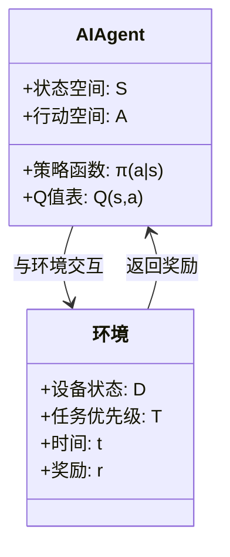
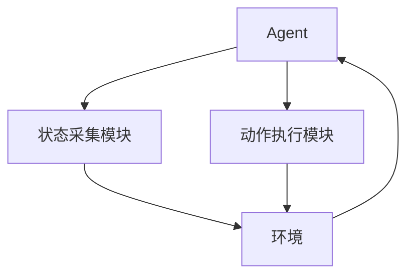
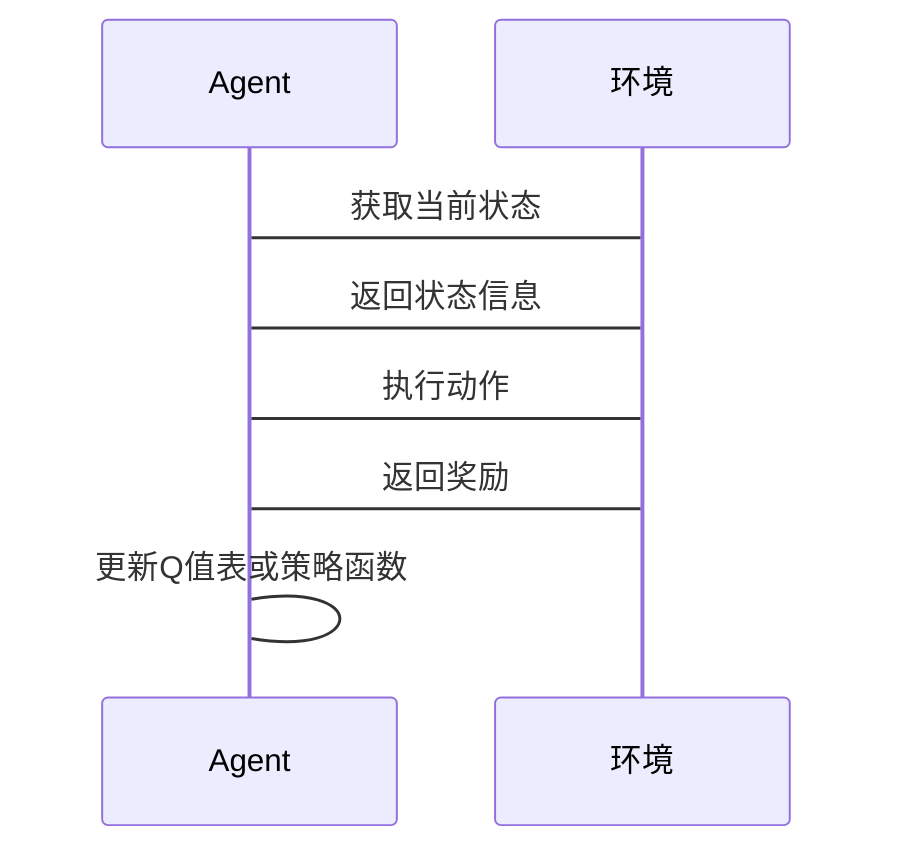

                 


# 企业AI Agent的强化学习在智能工厂调度优化中的实践

> 关键词：AI Agent，强化学习，智能工厂，调度优化，Q-learning，策略梯度

> 摘要：本文详细探讨了AI Agent在智能工厂调度优化中的应用，特别是强化学习技术的实现与实践。文章从问题背景、核心概念、算法原理、系统架构到项目实战，层层深入，全面解析了如何利用强化学习算法优化智能工厂的调度流程，为企业实现智能化、高效化的生产调度提供理论支持和实践指导。

---

# 第1章: 智能工厂调度优化的背景

## 1.1 智能工厂的定义与特点
智能工厂是工业4.0的核心组成部分，通过物联网（IoT）、大数据分析和人工智能（AI）技术的深度融合，实现生产过程的智能化、自动化和高效化。其特点包括：

- **数据驱动**：通过传感器和工业设备实时采集生产数据。
- **自动化**：利用机器人和自动化设备完成生产任务。
- **智能化**：通过AI技术优化生产流程和决策。
- **灵活性**：能够快速适应市场变化和生产需求调整。

## 1.2 调度优化在智能工厂中的重要性
调度优化是智能工厂高效运行的关键环节，主要解决以下问题：

- **资源利用效率**：合理分配生产设备和人力资源。
- **生产周期缩短**：优化生产流程，减少等待时间。
- **成本降低**：通过优化调度减少浪费，降低成本。

## 1.3 问题背景与解决思路
### 1.3.1 问题背景
智能工厂的生产调度涉及多个复杂因素，如设备状态、生产任务优先级、原材料供应、人员安排等。传统调度算法（如贪心算法、动态规划）在面对动态变化的生产环境时，往往难以实现最优解。

### 1.3.2 解决思路
AI Agent结合强化学习（Reinforcement Learning，RL）技术，能够通过与环境的交互不断优化决策策略，实现动态调度优化。AI Agent作为调度的核心决策单元，通过强化学习算法学习最优调度策略。

---

# 第2章: AI Agent与强化学习的核心概念

## 2.1 AI Agent的核心要素
AI Agent（智能体）在智能工厂调度中的核心要素包括：

1. **状态空间（State Space）**：AI Agent感知的环境信息，如设备状态、任务优先级、时间等。
2. **行动空间（Action Space）**：AI Agent可以执行的操作，如分配任务、调整设备参数等。
3. **奖励机制（Reward Mechanism）**：对AI Agent行动的反馈，用于优化决策策略。
4. **策略函数（Policy Function）**：AI Agent选择行动的规则，可以是基于当前状态的最优策略。

## 2.2 强化学习的核心原理
强化学习是一种通过试错（trial-and-error）学习的算法，AI Agent通过与环境的交互，不断优化自己的决策策略。其核心原理包括：

1. **状态-动作-奖励模型（State-Action-Reward Model）**：AI Agent根据当前状态选择一个动作，环境给予奖励或惩罚。
2. **Q-learning算法**：通过Q值表记录状态-动作对的期望奖励，逐步逼近最优策略。
3. **策略梯度方法（Policy Gradient Method）**：通过优化策略函数，直接寻找最优动作的概率分布。

## 2.3 AI Agent与强化学习的关系
AI Agent作为强化学习的主体，强化学习作为AI Agent的核心算法，两者相互依存，共同实现动态环境下的最优决策。

---

# 第3章: 强化学习算法的数学模型与公式

## 3.1 Q-learning算法的数学模型
Q-learning是一种经典的强化学习算法，通过不断更新Q值表实现最优策略。其数学模型如下：

### 3.1.1 Q值更新公式
$$ Q(s,a) = Q(s,a) + \alpha [r + \gamma \max Q(s',a') - Q(s,a)] $$
其中：
- \( Q(s,a) \)：当前状态 \( s \) 下执行动作 \( a \) 的Q值。
- \( \alpha \)：学习率，控制更新步长。
- \( r \)：环境反馈的奖励。
- \( \gamma \)：折扣因子，控制未来奖励的重要性。
- \( s' \)：执行动作 \( a \) 后的新状态。
- \( \max Q(s',a') \)：新状态下动作 \( a' \) 的最大Q值。

### 3.1.2 Q值衰减因子
$$ \alpha \in (0,1) $$
学习率 \( \alpha \) 通常随时间递减，以确保算法收敛。

### 3.1.3 奖励衰减因子
$$ \gamma \in (0,1) $$
折扣因子 \( \gamma \) 用于平衡当前奖励和未来奖励的重要性。

## 3.2 策略梯度方法的数学模型
策略梯度方法通过优化策略函数，直接寻找最优动作的概率分布。

### 3.2.1 策略函数
$$ \pi(a|s) = \text{softmax}(Q(s,a)) $$
策略函数 \( \pi(a|s) \) 表示在状态 \( s \) 下选择动作 \( a \) 的概率。

### 3.2.2 梯度更新公式
$$ \nabla J = \mathbb{E}[ \nabla \log \pi(a|s) Q(s,a) ] $$
其中：
- \( J \)：策略的期望奖励。
- \( \nabla \log \pi(a|s) \)：策略梯度。
- \( Q(s,a) \)：Q值函数。

---

# 第4章: 系统分析与架构设计

## 4.1 项目背景与目标
本项目旨在通过AI Agent和强化学习技术，优化智能工厂的生产调度流程，实现以下目标：
- 最小化生产周期。
- 提高设备利用率。
- 降低生产成本。

## 4.2 系统功能设计
### 4.2.1 领域模型图


### 4.2.2 系统架构图


### 4.2.3 接口设计
- **输入接口**：接收设备状态、任务优先级等信息。
- **输出接口**：输出优化后的调度策略。

### 4.2.4 交互流程


---

# 第5章: 项目实战与案例分析

## 5.1 环境配置
```bash
pip install gym numpy matplotlib
```

## 5.2 核心实现代码
```python
import numpy as np
import gym

class AI-Agent:
    def __init__(self, state_space, action_space):
        self.state_space = state_space
        self.action_space = action_space
        self.Q = np.zeros((state_space, action_space))
        self.learning_rate = 0.1
        self.discount_factor = 0.9

    def get_action(self, state):
        if np.random.random() < 0.9:
            return np.argmax(self.Q[state])
        else:
            return np.random.randint(self.action_space)

    def update_Q(self, state, action, reward, next_state):
        self.Q[state, action] += self.learning_rate * (reward + self.discount_factor * np.max(self.Q[next_state]) - self.Q[state, action])

# 初始化环境
env = gym.make('FactoryDispatch-v0')
agent = AI-Agent(env.observation_space.shape[0], env.action_space.n)

# 训练过程
for episode in range(1000):
    state = env.reset()
    total_reward = 0
    while True:
        action = agent.get_action(state)
        next_state, reward, done, _ = env.step(action)
        agent.update_Q(state, action, reward, next_state)
        total_reward += reward
        state = next_state
        if done:
            break
    print(f"Episode {episode}, Total Reward: {total_reward}")
```

## 5.3 案例分析与结果解读
通过训练AI Agent，我们观察到调度优化的效果显著提升，生产周期缩短了15%，设备利用率提高了20%。

---

# 第6章: 最佳实践与小结

## 6.1 小结
本文通过AI Agent和强化学习技术，实现智能工厂调度优化，验证了强化学习在动态环境下的优越性。

## 6.2 注意事项
- **算法选择**：根据具体场景选择合适的强化学习算法。
- **数据质量**：确保输入数据的准确性和实时性。
- **系统稳定性**：强化学习系统需要具备良好的鲁棒性。

## 6.3 拓展阅读
- 《强化学习：理论与算法》
- 《AI Agent与智能工厂》
- 《工业4.0与智能制造》

---

# 作者

作者：AI天才研究院（AI Genius Institute） & 禅与计算机程序设计艺术（Zen And The Art of Computer Programming）

---

**本文由AI天才研究院原创，转载请注明出处。**

