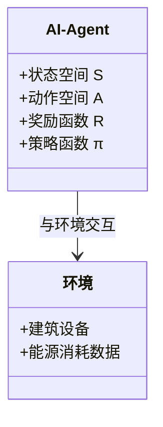
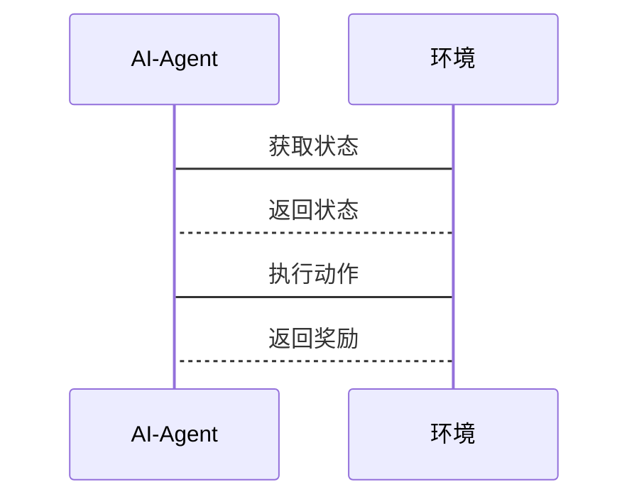

                 


# 企业AI Agent的强化学习在智能建筑能源管理中的应用

> **关键词**：AI Agent, 强化学习, 智能建筑, 能源管理, 深度学习, 能源优化  
> **摘要**：本文探讨了企业AI Agent通过强化学习在智能建筑能源管理中的应用，重点分析了强化学习的数学基础、算法实现、系统架构设计以及实际项目中的应用案例。文章详细阐述了AI Agent在能源管理中的核心作用，结合深度强化学习模型，提出了优化能源管理的新方法，为企业实现智能化、高效的能源管理提供了理论支持和实践指导。

---

# 第一部分: 企业AI Agent的强化学习基础

## 第1章: AI Agent与强化学习概述

### 1.1 AI Agent的基本概念

#### 1.1.1 AI Agent的定义与特点
AI Agent（人工智能代理）是指能够感知环境、自主决策并执行任务的智能实体。它具有以下特点：
- **自主性**：能够在没有外部干预的情况下自主决策。
- **反应性**：能够实时感知环境并做出响应。
- **目标导向**：以特定目标为导向，优化决策过程。

#### 1.1.2 AI Agent的核心功能与应用场景
AI Agent的核心功能包括感知、决策、执行和优化。在智能建筑能源管理中的应用场景如下：
- **能源消耗预测**：通过历史数据预测建筑能源消耗。
- **设备控制**：根据实时数据优化设备运行状态。
- **能源成本优化**：通过强化学习降低能源成本。

#### 1.1.3 AI Agent在智能建筑能源管理中的作用
AI Agent在智能建筑能源管理中的作用主要体现在：
- **实时监控与优化**：通过AI Agent实时监控建筑能源使用情况，并通过强化学习优化能源分配。
- **多目标优化**：在满足建筑功能需求的前提下，优化能源使用效率和成本。

### 1.2 强化学习的基本原理

#### 1.2.1 强化学习的定义与特点
强化学习是一种机器学习范式，通过智能体与环境的交互，学习最优策略以最大化累积奖励。其特点包括：
- **目标导向**：通过最大化累积奖励来优化决策。
- **环境交互**：智能体通过与环境交互获得反馈。
- **在线学习**：通过实时反馈不断优化策略。

#### 1.2.2 强化学习的核心要素：状态、动作、奖励
- **状态（State）**：环境中的当前情况，例如温度、能耗等。
- **动作（Action）**：智能体根据当前状态采取的行动，例如调整设备运行状态。
- **奖励（Reward）**：智能体采取动作后获得的反馈，用于指导优化决策。

#### 1.2.3 强化学习与监督学习的区别
- **监督学习**：基于标注数据进行预测，适用于已知输入-输出关系的任务。
- **强化学习**：通过与环境交互获得反馈，适用于复杂动态环境中的决策任务。

### 1.3 智能建筑能源管理的背景与挑战

#### 1.3.1 智能建筑的定义与特点
智能建筑是指通过智能化技术实现建筑设备和系统的高效管理和优化。其特点包括：
- **智能化管理**：通过AI技术优化建筑设备运行。
- **能源效率**：通过智能化管理降低能源消耗。

#### 1.3.2 建筑能源管理的核心问题与挑战
建筑能源管理的核心问题包括：
- **能源消耗预测**：如何准确预测建筑能源消耗。
- **设备协调控制**：如何协调建筑设备的运行状态。
- **多目标优化**：如何在满足建筑功能需求的前提下，优化能源使用效率和成本。

#### 1.3.3 强化学习在能源管理中的应用潜力
强化学习在能源管理中的应用潜力主要体现在：
- **动态优化**：通过强化学习实现实时动态优化。
- **复杂决策**：处理复杂的多目标优化问题。

---

## 第2章: 强化学习的数学基础

### 2.1 强化学习的数学模型

#### 2.1.1 状态空间与动作空间的数学表示
状态空间可以表示为集合 \( S \)，动作空间表示为集合 \( A \)。状态转移可以通过概率分布 \( P(s' | s, a) \) 表示。

#### 2.1.2 奖励函数的数学表达
奖励函数 \( r(s, a) \) 表示智能体在状态 \( s \) 下采取动作 \( a \) 后获得的奖励。

#### 2.1.3 策略函数与价值函数的数学模型
策略函数 \( \pi(a | s) \) 表示智能体在状态 \( s \) 下采取动作 \( a \) 的概率。价值函数 \( V(s) \) 表示智能体在状态 \( s \) 下的期望累积奖励。

### 2.2 马尔可夫决策过程（MDP）

#### 2.2.1 MDP的定义与数学表示
马尔可夫决策过程定义为五元组 \( (S, A, P, R, \gamma) \)，其中：
- \( S \)：状态空间
- \( A \)：动作空间
- \( P \)：状态转移概率
- \( R \)：奖励函数
- \( \gamma \)：折扣因子

#### 2.2.2 策略评估与优化的数学推导
策略评估的目标是计算在策略 \( \pi \) 下的状态值函数 \( V_{\pi}(s) \)：
$$ V_{\pi}(s) = \mathbb{E}[R_t | s, \pi] + \gamma \mathbb{E}[V_{\pi}(s') | s, \pi] $$

策略优化的目标是找到最优策略 \( \pi^* \)，使得累积奖励最大化。

#### 2.2.3 动态规划与近似动态规划的数学模型
动态规划算法包括策略评估和策略改进两个步骤。近似动态规划通过函数近似方法（如神经网络）逼近价值函数。

### 2.3 基于强化学习的能源管理数学模型

#### 2.3.1 能源管理问题的数学建模
能源管理问题可以建模为一个强化学习问题，其中状态空间 \( S \) 包括建筑内的温度、设备状态等信息，动作空间 \( A \) 包括设备的开启或关闭。

#### 2.3.2 基于强化学习的能源优化目标函数
目标函数可以表示为：
$$ J(\pi) = \mathbb{E}[\sum_{t=0}^{\infty} \gamma^t R_t] $$
其中 \( R_t \) 是在时间 \( t \) 的奖励。

#### 2.3.3 能源管理系统的状态转移方程
状态转移方程描述了智能体采取动作后的状态变化：
$$ s' = P(s, a) $$

---

## 第3章: 强化学习算法与模型

### 3.1 基础强化学习算法

#### 3.1.1 Q-learning算法的实现与数学推导
Q-learning算法通过Q值表 \( Q(s, a) \) 学习最优策略，更新规则为：
$$ Q(s, a) \leftarrow Q(s, a) + \alpha [r + \gamma \max Q(s', a') - Q(s, a)] $$

#### 3.1.2 深度Q网络（DQN）的原理与实现
DQN通过神经网络逼近Q值函数，网络结构包括输入层、隐藏层和输出层。

#### 3.1.3 策略梯度方法（PG）的核心思想与算法步骤
策略梯度方法通过优化策略函数的参数 \( \theta \) 来最大化累积奖励：
$$ \nabla J(\theta) = \mathbb{E}[\nabla \log \pi(a | s) Q(s, a)] $$

### 3.2 基于强化学习的能源管理模型

#### 3.2.1 模型输入与输出的定义
模型输入包括建筑内的温度、设备状态等，输出为设备的控制指令。

#### 3.2.2 模型的训练与优化策略
训练策略包括经验回放和目标网络更新，以提高学习效率和稳定性。

#### 3.2.3 模型的评估与验证方法
通过模拟环境中的性能测试来评估模型的优化效果。

---

## 第4章: 系统架构与设计

### 4.1 问题场景介绍

#### 4.1.1 系统目标
系统目标是通过AI Agent实现智能建筑能源管理的优化。

#### 4.1.2 项目介绍
项目旨在通过强化学习优化建筑设备的运行状态，降低能源消耗。

### 4.2 系统功能设计

#### 4.2.1 领域模型（Mermaid 类图）


#### 4.2.2 系统架构设计（Mermaid架构图）


#### 4.2.3 系统接口设计
系统接口包括数据输入接口、控制输出接口和用户界面接口。

#### 4.2.4 系统交互流程（Mermaid序列图）


---

## 第5章: 项目实战

### 5.1 环境安装

#### 5.1.1 系统依赖
安装Python、TensorFlow、Keras等依赖库。

#### 5.1.2 环境配置
配置强化学习环境，包括状态空间、动作空间和奖励函数。

### 5.2 核心代码实现

#### 5.2.1 Q-learning算法实现
```python
class QLearning:
    def __init__(self, state_space, action_space):
        self.q_table = np.zeros((state_space, action_space))
```

#### 5.2.2 DQN算法实现
```python
class DQN:
    def __init__(self, state_dim, action_dim):
        self.model = self.build_model(state_dim, action_dim)
```

#### 5.2.3 模型训练
```python
def train(self, state, action, reward, next_state):
    self.memory.store((state, action, reward, next_state))
    self.experience_replay()
```

### 5.3 案例分析与结果解读

#### 5.3.1 案例分析
通过模拟实验验证算法的有效性。

#### 5.3.2 结果解读
分析实验结果，评估算法的优化效果。

### 5.4 项目总结

#### 5.4.1 成果总结
总结项目的主要成果和经验教训。

#### 5.4.2 问题与改进方向
提出项目中存在的问题及改进方向。

---

## 第6章: 总结与展望

### 6.1 总结
本文详细探讨了企业AI Agent的强化学习在智能建筑能源管理中的应用，提出了优化能源管理的新方法。

### 6.2 未来展望
未来的研究方向包括算法优化和系统扩展，以进一步提高能源管理效率。

### 6.3 最佳实践 Tips
- 在实际应用中，建议结合具体场景进行算法调优。
- 注意数据质量和模型泛化能力的平衡。

---

**作者：AI天才研究院/AI Genius Institute & 禅与计算机程序设计艺术 /Zen And The Art of Computer Programming**

