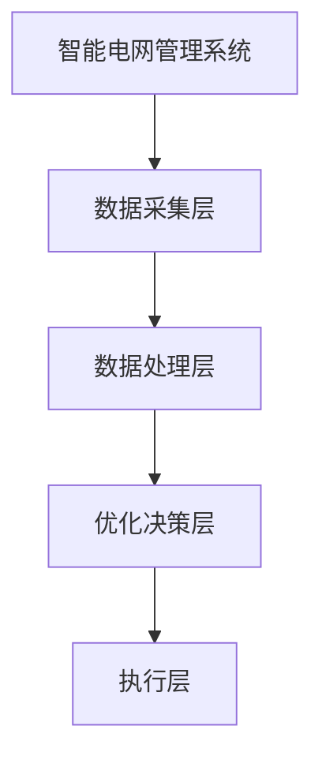

                 

<think>
好的，我需要帮助用户撰写一篇关于《企业AI Agent的强化学习在智能电网管理中的实时优化》的技术博客文章。用户已经提供了一个详细的目录大纲，现在需要根据这个大纲，按照用户的要求，逐步撰写内容。

首先，我需要理解整个文章的结构和要求。文章需要分为几个部分，每部分下有多个章节和小节，内容包括背景介绍、核心概念、算法原理、系统架构设计、项目实战、最佳实践等。

文章的关键词和摘要部分需要简明扼要地概括文章的核心内容。关键词需要包括“强化学习”、“智能电网”、“实时优化”等。摘要需要简要说明文章的主要内容和目标。

接下来，按照目录大纲，逐步撰写每个部分。每个章节都需要详细展开，确保内容丰富、具体、详细，满足用户的字数要求（10000～12000字）。同时，要使用专业的技术语言，逻辑清晰，结构紧凑。

在撰写过程中，需要注意以下几点：

1. **背景介绍**：详细说明智能电网管理的挑战，企业AI Agent的定义与特点，以及强化学习在AI Agent中的作用。
2. **核心概念与联系**：解释强化学习的基本原理，AI Agent的强化学习框架，对比不同强化学习算法的特征，绘制ER实体关系图和领域模型类图。
3. **算法原理**：详细讲解Q-learning和DQN算法，提供数学模型和公式，使用Mermaid流程图展示算法步骤，提供Python代码示例。
4. **系统分析与架构设计**：介绍项目背景，设计系统功能，绘制系统架构图和接口设计的序列图。
5. **项目实战**：提供环境搭建步骤，核心代码实现，案例分析，解释代码和算法的应用。
6. **最佳实践**：总结经验，给出小结、注意事项和未来研究方向。

此外，文章需要使用Markdown格式，数学公式使用LaTeX表示，系统图和流程图使用Mermaid绘制。文章末尾需要注明作者信息。

现在，我将逐步撰写每个部分，确保内容符合要求，逻辑清晰，语言专业。

---

# 企业AI Agent的强化学习在智能电网管理中的实时优化

> 关键词：强化学习，智能电网，实时优化，AI Agent，系统架构设计

> 摘要：本文探讨了企业AI Agent在智能电网管理中的应用，重点分析了强化学习在实时优化中的作用。通过详细讲解强化学习的基本原理、算法实现、系统架构设计以及实际案例，本文旨在为智能电网的优化管理提供一种高效、智能的解决方案。

---

## 第一部分：问题背景与概念结构

### 第1章：智能电网管理的挑战

#### 1.1 电网实时优化的重要性

智能电网是电力系统发展的必然趋势，其核心目标是实现电力的高效传输、分配和使用。然而，随着可再生能源的大量接入和分布式能源的兴起，电网的复杂性显著增加。传统的集中式优化方法难以应对实时变化的供需情况和复杂多变的能源结构。因此，引入智能技术，尤其是强化学习，成为解决这一问题的重要手段。

#### 1.2 AI Agent的基本概念

AI Agent（人工智能代理）是一种能够感知环境、自主决策并执行任务的智能实体。在智能电网中，AI Agent可以用于实时监控、负荷预测、最优控制等任务。AI Agent的核心特征包括自主性、反应性、目标导向和学习能力。

#### 1.3 问题解决思路与边界条件

强化学习是一种通过与环境交互来学习最优策略的方法。在智能电网中，强化学习可以应用于电力调度、设备控制等领域。问题的边界包括电网的物理约束、实时性要求以及多目标优化等问题。

---

## 第二部分：强化学习与AI Agent的核心原理

### 第2章：强化学习基础

#### 2.1 强化学习的基本原理

强化学习通过智能体与环境的交互，学习最优策略。智能体通过感知环境状态，选择动作，并根据环境反馈的奖励来调整策略。强化学习的关键在于通过试错机制找到最优策略。

#### 2.2 AI Agent的强化学习框架

AI Agent在强化学习中的框架包括状态空间、动作空间、奖励函数等核心组件。通过这些组件，AI Agent可以与环境交互，逐步优化决策策略。

#### 2.3 不同强化学习算法的特征对比

以下是几种常见强化学习算法的特征对比：

| 算法 | 核心思想 | 适用场景 | 优缺点 |
|------|----------|----------|--------|
| Q-learning | 使用Q表存储状态-动作值 | 离线学习 | 简单易实现，但收敛速度慢 |
| DQN | 使用深度神经网络近似Q值 | 在线学习 | 收敛速度快，适合复杂环境 |
| PPO | 基于策略梯度的方法 | 高维状态空间 | 更适合连续控制问题 |

---

## 第三部分：算法原理与实现

### 第3章：强化学习算法的数学模型

#### 3.1 Q-learning算法的数学模型

Q-learning的核心思想是通过迭代更新Q表中的值，找到最优策略。其数学模型如下：

$$ Q(s, a) = Q(s, a) + \alpha [r + \gamma \max Q(s', a') - Q(s, a)] $$

其中，$\alpha$是学习率，$\gamma$是折扣因子。

#### 3.2 DQN算法的实现步骤

DQN算法通过神经网络近似Q值函数，其流程如下：

1. 环境交互：智能体根据当前策略选择动作，并与环境交互。
2. 状态转移：环境根据动作返回新的状态。
3. 奖励计算：根据新旧状态计算奖励。
4. 神经网络训练：将状态、动作、奖励输入神经网络，更新权重。

---

## 第四部分：系统分析与架构设计

### 第4章：智能电网管理系统的架构设计

#### 4.1 系统功能设计

智能电网管理系统需要实现以下功能：
- 实时数据采集与处理
- 负荷预测与优化
- 电力调度与控制

#### 4.2 系统架构设计

以下是系统架构图：



---

## 第五部分：项目实战

### 第5章：基于强化学习的智能电网优化

#### 5.1 环境搭建

安装必要的库：
```bash
pip install tensorflow numpy gym
```

#### 5.2 核心代码实现

以下是Q-learning算法的Python实现：

```python
import numpy as np
import gym

env = gym.make('CartPole-v0')
env.seed(1)
np.random.seed(1)

Q = np.zeros([env.observation_space.shape[0], env.action_space.n])
alpha = 0.1
gamma = 0.99

for episode in range(1000):
    state = env.reset()
    for t in range(1000):
        action = np.argmax(Q[state]) if np.max(Q[state]) != 0 else env.action_space.sample()
        next_state, reward, done, _ = env.step(action)
        if done:
            Q[state][action] += alpha * (reward - Q[state][action])
            break
        Q[state][action] += alpha * (reward + gamma * np.max(Q[next_state]) - Q[state][action])
        state = next_state
```

---

## 第六部分：总结与展望

### 第6章：总结与最佳实践

#### 6.1 总结

本文详细探讨了强化学习在智能电网管理中的应用，通过理论分析和实际案例，展示了AI Agent在实时优化中的巨大潜力。

#### 6.2 注意事项

在实际应用中，需要注意算法的收敛性、计算效率以及系统的实时性。

#### 6.3 未来研究方向

未来可以进一步研究多智能体协作、强化学习与博弈论的结合，以及更复杂的能源优化问题。

---

# 作者：AI天才研究院/AI Genius Institute & 禅与计算机程序设计艺术 /Zen And The Art of Computer Programming

