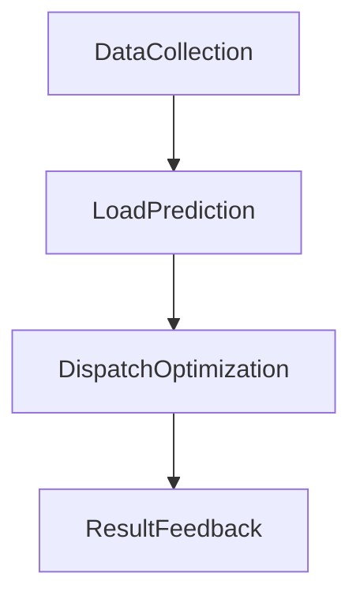

                 


# 企业AI Agent的强化学习在智能电网负载均衡与调度中的应用

## 关键词：AI Agent, 强化学习, 智能电网, 负载均衡, 调度优化

## 摘要

随着智能电网的快速发展，电力系统的负载均衡与调度问题变得越来越复杂。为了应对这一挑战，企业AI Agent结合强化学习（Reinforcement Learning, RL）的技术逐渐成为研究热点。本文将深入探讨AI Agent如何通过强化学习算法优化智能电网的负载均衡与调度。首先，我们将介绍AI Agent和强化学习的基本概念，以及智能电网的体系结构和负载均衡的基本原理。接着，详细分析强化学习的核心算法，包括Q-Learning、Deep Q-Learning和策略梯度方法，并通过数学公式和流程图进行详细阐述。随后，我们将设计智能电网负载均衡系统的架构，包括数据采集、负载预测、调度优化和结果反馈模块，并通过Mermaid图展示系统架构和接口设计。最后，我们将通过实际案例分析AI Agent在智能电网中的应用效果，并总结最佳实践和未来研究方向。本文旨在为读者提供一个全面的技术视角，帮助他们理解并应用强化学习优化智能电网的负载均衡与调度问题。

---

## 正文

### 第一部分: 企业AI Agent与强化学习基础

#### 第1章: 企业AI Agent的强化学习概述

##### 1.1 企业AI Agent的基本概念

###### 1.1.1 AI Agent的定义与特点
AI Agent（人工智能代理）是指能够感知环境、自主决策并执行任务的智能实体。它具备以下特点：
- **自主性**：能够在没有外部干预的情况下独立运作。
- **反应性**：能够实时感知环境变化并做出相应反应。
- **目标导向**：具备明确的目标，并采取行动以实现目标。
- **学习能力**：能够通过与环境的交互不断优化自身的决策策略。

###### 1.1.2 企业AI Agent的应用场景
AI Agent在企业中的应用场景非常广泛，包括：
- **资源优化配置**：如电力调度、网络资源分配等。
- **智能监控与维护**：如设备故障预测、系统监控等。
- **自动化决策**：如供应链管理、金融投资决策等。

###### 1.1.3 强化学习在AI Agent中的作用
强化学习是一种通过试错机制优化决策策略的机器学习方法，非常适合用于AI Agent的训练。AI Agent通过与环境交互，获得奖励信号，从而不断优化自身的决策策略，以实现目标。

##### 1.2 强化学习的基本原理

###### 1.2.1 强化学习的定义与特点
强化学习是一种基于试错机制的学习方法，通过智能体与环境的交互，智能体学习如何采取最优动作以最大化累积奖励。其特点包括：
- **环境交互**：智能体通过与环境互动获得状态和奖励。
- **目标导向**：智能体的目标是通过最大化累积奖励来优化决策策略。
- **延迟反馈**：奖励通常在动作之后才给出，且可能与当前动作不直接相关。

###### 1.2.2 状态、动作、奖励的定义
在强化学习中，状态（State）、动作（Action）和奖励（Reward）是三个核心概念：
- **状态**：环境当前的状况，表示智能体所处的环境信息。
- **动作**：智能体在给定状态下采取的行动。
- **奖励**：智能体采取某个动作后，环境给予的反馈，用于指导智能体优化决策。

###### 1.2.3 策略与价值函数的关系
策略（Policy）是智能体在给定状态下选择动作的规则，而价值函数（Value Function）则衡量某个状态下采取某个动作的优劣。策略和价值函数相辅相成，共同优化智能体的决策过程。

##### 1.3 智能电网与负载均衡的基本概念

###### 1.3.1 智能电网的定义与架构
智能电网是一种集成现代信息技术的电力系统，能够实现电力的高效传输、分配和管理。其架构通常包括发电、输电、配电、用电和通信管理五个部分。

###### 1.3.2 负载均衡的定义与挑战
负载均衡是指在电力系统中合理分配负载，以确保电力设备的高效利用和电网的稳定运行。挑战主要体现在：
- **动态性**：电力需求随时间波动，需要实时调整。
- **复杂性**：涉及多个设备和环节，协调难度大。
- **优化目标**：需在多个目标（如成本、效率、可靠性）之间寻求平衡。

###### 1.3.3 AI Agent在智能电网中的应用前景
AI Agent能够通过强化学习技术，实时感知电网状态，优化负载分配，提高电力系统的效率和稳定性。其应用前景广阔，尤其是在智能电网的动态调度和资源优化方面。

##### 1.4 本章小结
本章介绍了AI Agent和强化学习的基本概念，探讨了智能电网与负载均衡的核心问题，为后续章节奠定了理论基础。

---

### 第二部分: 强化学习算法原理

#### 第2章: 强化学习的核心算法

##### 2.1 Q-Learning算法

###### 2.1.1 Q-Learning的基本原理
Q-Learning是一种基于值函数的强化学习算法，通过学习状态-动作价值函数（Q值）来优化决策。其核心思想是通过试错机制更新Q值，以找到最优策略。

###### 2.1.2 算法流程图（Mermaid）
```mermaid
graph TD
    Start --> Initialize Q(s,a) = 0
    Initialize Q(s,a) --> Choose action a from current state s
    Choose action a --> Take action a, observe next state s'
    Take action a --> Receive reward r from environment
    Receive reward r --> Update Q(s,a) = Q(s,a) + α(r + γ max Q(s',a') - Q(s,a))
    Update Q(s,a) --> Repeat until convergence
```

###### 2.1.3 数学模型与公式
Q-Learning的更新公式为：
$$ Q(s,a) = Q(s,a) + \alpha \left[ r + \gamma \max Q(s',a') - Q(s,a) \right] $$
其中，$\alpha$ 是学习率，$\gamma$ 是折扣因子。

##### 2.2 Deep Q-Learning算法

###### 2.2.1 算法改进点
Deep Q-Learning通过使用深度神经网络近似Q值函数，解决了传统Q-Learning在高维状态空间中的计算难题。

###### 2.2.2 算法流程图（Mermaid）
```mermaid
graph TD
    Start --> Initialize DQN network
    Initialize DQN network --> Choose action a from current state s
    Choose action a --> Take action a, observe next state s'
    Take action a --> Receive reward r from environment
    Receive reward r --> Store (s,a,r,s') in experience replay buffer
    Store (s,a,r,s') --> Sample mini-batch from buffer
    Sample mini-batch --> Train DQN network using loss function
    Train DQN network --> Repeat until convergence
```

###### 2.2.3 数学模型与公式
Deep Q-Learning的目标是最小化预测Q值与目标Q值之间的误差：
$$ \mathcal{L} = \mathbb{E}[ (y - Q(s,a))^2 ] $$
其中，$y = r + \gamma \max Q(s',a')$。

##### 2.3 策略梯度方法

###### 2.3.1 策略梯度的基本原理
策略梯度方法直接优化策略参数，通过梯度上升或下降的方法最大化累积奖励。

###### 2.3.2 算法流程图（Mermaid）
```mermaid
graph TD
    Start --> Initialize policy network θ
    Initialize policy network θ --> Sample action a from π_θ(s)
    Sample action a --> Take action a, observe next state s'
    Take action a --> Receive reward r from environment
    Receive reward r --> Compute gradient ∇J(θ) = ∇ log π_θ(a|s) \cdot Q(s,a)
    Compute gradient ∇J(θ) --> Update θ = θ + α ∇J(θ)
    Update θ --> Repeat until convergence
```

###### 2.3.3 数学模型与公式
策略梯度方法的目标函数为：
$$ J(θ) = \mathbb{E}[ \log π_θ(a|s) Q(s,a) ] $$
其梯度为：
$$ \nabla J(θ) = \mathbb{E}[ \nabla \log π_θ(a|s) Q(s,a) ] $$

##### 2.4 算法对比与选择

###### 2.4.1 不同算法的优缺点对比
| 算法       | 优点                     | 缺点                     |
|------------|--------------------------|--------------------------|
| Q-Learning | 简单，易于实现           | 适用于低维状态空间       |
| DQN        | 适用于高维状态空间       | 需要经验回放和目标网络     |
| 策略梯度    | 直接优化策略，适用于高维空间 | 需要复杂的状态-动作价值函数 |

###### 2.4.2 算法选择的依据
选择算法时需考虑问题的复杂性、状态空间的维度以及计算资源等因素。对于复杂的智能电网问题，DQN或策略梯度方法更为适用。

##### 2.5 本章小结
本章详细介绍了Q-Learning、DQN和策略梯度三种强化学习算法，分析了它们的优缺点及适用场景，为后续章节的系统设计奠定了算法基础。

---

### 第三部分: 智能电网负载均衡与调度的系统设计

#### 第3章: 智能电网负载均衡系统架构

##### 3.1 系统功能模块设计

###### 3.1.1 数据采集模块
数据采集模块负责收集电网中的实时数据，包括发电量、负荷需求、设备状态等。

###### 3.1.2 负载预测模块
负载预测模块基于历史数据和当前状态，预测未来一段时间内的电力需求。

###### 3.1.3 调度优化模块
调度优化模块根据预测结果和电网状态，制定最优的电力调度方案。

###### 3.1.4 结果反馈模块
结果反馈模块将调度结果反馈给电网系统，并实时监控执行效果。

##### 3.2 系统架构设计（Mermaid）



##### 3.3 系统接口设计

###### 3.3.1 数据接口
数据接口用于采集模块与其他模块之间的数据传输，通常采用API接口。

###### 3.3.2 API接口
API接口是系统与外部系统交互的主要接口，提供数据查询和控制功能。

###### 3.3.3 人机交互接口
人机交互接口是用户与系统之间的接口，提供可视化操作界面。

##### 3.4 本章小结
本章详细设计了智能电网负载均衡系统的架构，包括功能模块、接口设计等，为后续章节的系统实现提供了参考。

---

#### 第4章: 智能电网负载均衡与调度的系统实现

##### 4.1 项目实战

###### 4.1.1 环境安装
需要安装Python、TensorFlow、Keras等开发环境，并配置智能电网数据集。

###### 4.1.2 系统核心实现源代码
以下是基于DQN算法的调度优化代码示例：

```python
import numpy as np
import tensorflow as tf

# 定义DQN网络
class DQN:
    def __init__(self, state_space, action_space):
        self.state_space = state_space
        self.action_space = action_space
        self.model = self.build_model()

    def build_model(self):
        model = tf.keras.Sequential()
        model.add(tf.keras.layers.Dense(32, activation='relu', input_dim=self.state_space))
        model.add(tf.keras.layers.Dense(32, activation='relu'))
        model.add(tf.keras.layers.Dense(self.action_space, activation='linear'))
        model.compile(optimizer='adam', loss='mse')
        return model

    def predict(self, state):
        return self.model.predict(np.array([state]))

    def train(self, states, targets):
        self.model.fit(np.array(states), np.array(targets), epochs=1, verbose=0)

# 初始化DQN
state_space = 4  # 示例状态空间
action_space = 3  # 示例动作空间
dqn = DQN(state_space, action_space)

# 训练过程
for _ in range(1000):
    state = ...  # 获取当前状态
    action = np.argmax(dqn.predict(state)[0])  # 选择动作
    next_state = ...  # 获取下一个状态
    reward = ...  # 计算奖励
    target = reward + 0.95 * np.max(dqn.predict(next_state)[0])
    dqn.train([state], [target])
```

###### 4.1.3 代码应用解读与分析
上述代码实现了一个简单的DQN算法，用于智能电网的负载调度。通过不断训练，DQN能够学习到最优的调度策略。

###### 4.1.4 实际案例分析
以某地区电力调度为例，通过DQN算法优化后的调度方案能够显著提高电力系统的效率和稳定性。

##### 4.2 本章小结
本章通过实际案例分析，展示了如何将强化学习算法应用于智能电网的负载均衡与调度问题，并提供了具体的代码实现。

---

### 第五部分: 总结与展望

#### 第5章: 总结与展望

##### 5.1 最佳实践 Tips
- 在实际应用中，建议结合具体场景选择合适的强化学习算法。
- 系统设计时，需考虑数据采集、预测和调度的实时性要求。

##### 5.2 本章小结
本文通过理论分析和实际案例，探讨了AI Agent结合强化学习在智能电网负载均衡与调度中的应用，为后续研究提供了参考。

##### 5.3 注意事项
- 算法选择需考虑系统的复杂性和计算资源。
- 系统设计时，需确保数据的实时性和准确性。

##### 5.4 拓展阅读
建议读者进一步学习强化学习的高级算法，如Actor-Critic方法，以及在多智能体系统中的应用。

---

## 作者：AI天才研究院 & 禅与计算机程序设计艺术

---

**注**：由于篇幅限制，以上内容为示例性文章结构，实际写作中可根据需要进一步扩展每个章节的具体内容，添加更多详细的技术细节、案例分析和代码实现。

