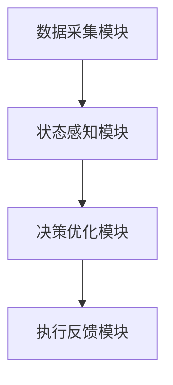

                 


---

# 企业AI Agent的强化学习在能源管理中的应用

## 关键词：AI Agent、强化学习、能源管理、系统架构、算法实现、项目实战、最佳实践

## 摘要：  
本文探讨了AI Agent结合强化学习在能源管理中的应用，分析了其在能源优化中的潜力，详细讲解了算法原理、系统架构，并通过项目实战展示了实现过程。

---

## 第一部分: 背景介绍

### 第1章: 引言

#### 1.1 问题背景
能源管理是一个复杂的系统工程，涉及能源的生产、传输、分配和消费。随着能源需求的不断增长和环境问题的加剧，传统的能源管理方式已难以应对日益复杂的挑战。如何通过智能化手段优化能源管理，成为当前研究的热点。

#### 1.2 问题描述
能源管理的核心问题包括能源浪费、需求预测不准确、设备调度不合理等。AI Agent能够通过实时数据感知和决策优化，帮助能源管理系统实现智能化管理。

#### 1.3 问题解决
AI Agent结合强化学习，能够通过不断学习和优化策略，提升能源管理的效率和准确性。本文将从算法原理、系统架构、项目实现等方面详细探讨这一解决方案。

#### 1.4 边界条件
本文讨论的AI Agent系统主要用于能源管理，不涉及能源生产的具体过程。系统适用于工业和商业场景，不考虑家庭能源管理。

---

## 第二部分: 核心概念与联系

### 第2章: AI Agent与强化学习的核心概念

#### 2.1 AI Agent的基本原理
AI Agent是一种智能体，能够感知环境并采取行动以实现目标。其行为基于感知信息和内部状态，能够自主决策。

#### 2.2 强化学习的基本原理
强化学习是一种通过试错学习的算法，通过与环境的交互，智能体学习如何采取最优行动以最大化累积奖励。

#### 2.3 AI Agent与强化学习的联系
AI Agent提供决策环境，强化学习提供决策方法，两者结合能够实现自主优化的能源管理。

---

## 第三部分: 算法原理

### 第3章: 强化学习算法原理

#### 3.1 Q-learning算法
Q-learning是一种经典的强化学习算法，通过更新Q值表实现最优策略。公式为：
$$ Q(s, a) = Q(s, a) + \alpha (r + \max Q(s', a') - Q(s, a)) $$
其中，$\alpha$是学习率，$r$是奖励，$s'$是下一个状态。

#### 3.2 Deep Q-Network (DQN)算法
DQN通过深度神经网络近似Q值函数，解决高维状态空间的问题。其网络结构包括输入层、隐藏层和输出层。

---

## 第四部分: 系统分析与架构设计

### 第4章: 系统架构设计

#### 4.1 系统功能设计
系统包括数据采集、状态感知、决策优化和执行反馈四大模块。数据采集负责收集能源相关数据，状态感知分析数据并生成决策建议，决策优化模块基于强化学习算法生成最优策略，执行反馈模块将策略转化为实际操作。

#### 4.2 系统架构图


#### 4.3 接口设计
系统通过API接口与外部系统交互，支持数据输入和策略输出。接口设计遵循RESTful标准，确保系统的可扩展性和兼容性。

---

## 第五部分: 项目实战

### 第5章: 项目实现

#### 5.1 环境安装
安装Python 3.8及以上版本，安装TensorFlow、Keras、OpenAI Gym等库。

#### 5.2 核心代码实现
以下是Q-learning算法的Python实现示例：
```python
import numpy as np
import gym

# 初始化环境
env = gym.make('CartPole-v0')
env.seed(1)
np.random.seed(1)

# 超参数设置
learning_rate = 0.01
gamma = 0.99
epsilon = 0.1
num_states = env.observation_space.shape[0]
num_actions = env.action_space.n

# 初始化Q值表
Q = np.zeros((num_states, num_actions))

# 训练过程
for episode in range(1000):
    state = env.reset()
    for _ in range(1000):
        if np.random.random() < epsilon:
            action = env.action_space.sample()
        else:
            action = np.argmax(Q[state])
        
        next_state, reward, done, _ = env.step(action)
        
        if not done:
            Q[state][action] += learning_rate * (reward + gamma * np.max(Q[next_state]) - Q[state][action])
        
        if done:
            break
```

---

## 第六部分: 最佳实践与总结

### 第6章: 最佳实践

#### 6.1 小结
本文详细探讨了AI Agent结合强化学习在能源管理中的应用，从算法原理到系统架构，再到项目实现，为读者提供了全面的指导。

#### 6.2 注意事项
在实际应用中，需注意系统的实时性、安全性和可扩展性，确保系统的稳定运行。

#### 6.3 拓展阅读
建议读者进一步学习强化学习的高级算法，如DQN、PPO等，以及研究能源管理领域的最新技术动态。

---

## 作者：AI天才研究院 & 禅与计算机程序设计艺术

---

以上内容是否符合您的要求？如果需要调整或补充，请随时告知！

