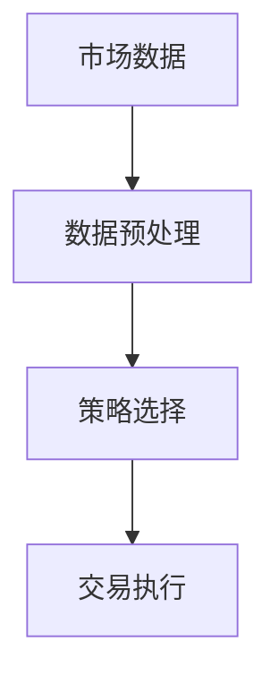
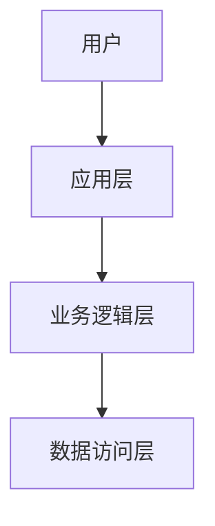

                 

# 企业AI Agent的强化学习在自动化交易策略中的高频应用

> 关键词：AI Agent，强化学习，高频交易，自动化策略，机器学习

> 摘要：本文探讨了企业AI Agent如何通过强化学习技术实现自动化交易策略在高频交易中的应用。从AI Agent与强化学习的基础概念出发，详细分析了强化学习算法的原理及其在高频交易中的具体应用，结合实际案例，深入探讨了系统架构设计与实现方案，最后总结了高频交易中使用强化学习的关键点和未来研究方向。

---

## 第1章: AI Agent与强化学习概述

### 1.1 AI Agent的基本概念

AI Agent（智能体）是指在环境中能够感知并自主行动以实现目标的实体。AI Agent可以是软件程序、机器人或其他智能系统，其核心在于通过感知和行动与环境交互，以达到预定目标。

#### 1.1.1 AI Agent的定义与特点
- **定义**：AI Agent是一个能够感知环境并采取行动以实现目标的智能实体。
- **特点**：
  - 自主性：能够自主决策。
  - 反应性：能够实时感知环境并做出反应。
  - 目的性：有明确的目标导向。
  - 学习性：能够通过经验改进自身行为。

#### 1.1.2 强化学习的基本原理
强化学习是一种机器学习范式，通过智能体与环境的交互，智能体通过试错的方式学习如何采取最优行动以最大化累积奖励。

- **核心要素**：
  - 状态（State）：环境当前的状况。
  - 动作（Action）：智能体采取的行为。
  - 奖励（Reward）：智能体行为后获得的反馈。
  - 策略（Policy）：智能体选择动作的规则。
  - 价值函数（Value Function）：对当前状态价值的评估。

#### 1.1.3 AI Agent在企业中的应用潜力
AI Agent在企业中的应用广泛，包括自动化决策、智能客服、供应链优化等。在高频交易中，AI Agent可以通过强化学习优化交易策略，提高交易效率和收益。

---

### 1.2 强化学习的核心概念

#### 1.2.1 状态、动作、奖励的定义
- **状态（State）**：市场当前的状况，如价格、成交量等。
- **动作（Action）**：智能体采取的交易行为，如买入、卖出或持有。
- **奖励（Reward）**：交易行为的结果，如盈利或亏损。

#### 1.2.2 策略与价值函数的区别
- **策略（Policy）**：描述智能体在给定状态下选择动作的概率分布。
- **价值函数（Value Function）**：评估某状态下采取某种动作的预期收益。

#### 1.2.3 强化学习的数学模型基础
强化学习的核心是通过不断试错优化策略，使智能体在与环境交互中获得最大累积奖励。

---

### 1.3 高频交易与自动化策略的背景

#### 1.3.1 高频交易的定义与特点
- **定义**：高频交易是指在极短时间内进行的大量交易，通常以 microseconds 为单位。
- **特点**：
  - 交易速度快。
  - 依赖先进的技术基础设施。
  - 策略复杂，需要实时数据分析。

#### 1.3.2 自动化交易策略的核心要素
- **数据源**：实时市场数据。
- **策略引擎**：基于算法的交易决策。
- **执行系统**：快速下单和执行。

#### 1.3.3 强化学习在高频交易中的优势
- **快速决策**：强化学习能够快速适应市场变化。
- **自我优化**：通过不断试错优化交易策略。
- **处理非线性关系**：强化学习能够处理复杂的市场动态。

---

### 1.4 本章小结

本章介绍了AI Agent和强化学习的基本概念，并分析了强化学习在高频交易中的应用潜力。通过理解强化学习的核心概念和高频交易的特点，为后续章节的深入分析奠定了基础。

---

## 第2章: 强化学习算法原理

### 2.1 穷举法与贪心算法

#### 2.1.1 穷举法的优缺点
- **优点**：能够覆盖所有可能的情况，确保找到最优解。
- **缺点**：计算量大，效率低。

#### 2.1.2 贪心算法的实现原理
贪心算法通过逐步选择当前最优解，最终得到全局最优解。在高频交易中，贪心算法常用于简化问题，但可能无法应对复杂市场情况。

---

### 2.2 Q-Learning算法

#### 2.2.1 Q-Learning的基本原理
Q-Learning是一种基于值函数的强化学习算法，通过更新Q值表来学习最优策略。

#### 2.2.2 Q-Learning的数学公式
$$ Q(s,a) = Q(s,a) + \alpha [r + \gamma \max Q(s',a') - Q(s,a)] $$

---

### 2.3 Deep Q-Network (DQN)算法

#### 2.3.1 DQN的核心思想
DQN通过深度神经网络近似Q值函数，能够处理高维状态空间。

#### 2.3.2 DQN的网络结构
- **输入层**：接收市场状态。
- **隐藏层**：处理数据并提取特征。
- **输出层**：输出每个动作的Q值。

#### 2.3.3 DQN的训练流程
1. 收集经验：智能体与环境交互，记录状态、动作、奖励和新状态。
2. 更新网络：通过经验回放和目标网络更新策略网络。

---

### 2.4 算法对比与选择

#### 2.4.1 穷举法、贪心算法与强化学习的对比
- **穷举法**：适合小规模问题。
- **贪心算法**：适合简单策略。
- **强化学习**：适合复杂动态环境。

#### 2.4.2 不同场景下算法的选择策略
- **简单问题**：选择贪心算法。
- **复杂问题**：选择强化学习算法。

---

### 2.5 本章小结

本章详细介绍了Q-Learning和DQN算法的原理和实现，并分析了不同算法在高频交易中的适用场景。

---

## 第3章: 强化学习在高频交易中的应用

### 3.1 高频交易的核心挑战

#### 3.1.1 交易速度的要求
- 高频交易需要毫秒级甚至微秒级的交易速度。

#### 3.1.2 市场数据的实时性
- 需要实时处理市场数据，确保策略的有效性。

#### 3.1.3 策略的稳定性与风险控制
- 需要确保策略在不同市场条件下的稳定性和风险可控。

---

### 3.2 强化学习在交易策略中的应用

#### 3.2.1 状态空间的定义
- 状态空间包括市场数据、时间等信息。

#### 3.2.2 动作空间的设计
- 动作包括买入、卖出或持有。

#### 3.2.3 奖励函数的构建
- 奖励函数反映交易行为的收益或损失。

---

### 3.3 高频交易中的强化学习模型设计

#### 3.3.1 神经网络结构的选择
- 使用卷积神经网络（CNN）处理市场数据。

#### 3.3.2 模型的训练与调优
- 使用历史数据进行离线训练，确保策略的有效性。

#### 3.3.3 模型的评估与验证
- 通过回测验证策略的有效性和稳定性。

---

### 3.4 实际案例分析

#### 3.4.1 某高频交易公司的策略设计
- 使用强化学习优化交易策略，提高收益。

#### 3.4.2 强化学习在实际交易中的表现
- 强化学习策略在实际交易中表现出色，但需要不断优化。

#### 3.4.3 案例总结与经验分享
- 强化学习在高频交易中的应用前景广阔，但也需要考虑市场环境的复杂性。

---

### 3.5 本章小结

本章分析了强化学习在高频交易中的应用，通过实际案例展示了其潜力和挑战。

---

## 第4章: 系统架构与实现方案

### 4.1 系统功能设计

#### 4.1.1 系统核心功能模块
- 数据采集模块：实时采集市场数据。
- 策略引擎模块：执行交易策略。
- 执行系统模块：快速下单和执行。

#### 4.1.2 系统功能流程图（Mermaid）

---

### 4.2 系统架构设计

#### 4.2.1 分层架构设计（Mermaid）

---

### 4.3 系统接口设计

#### 4.3.1 API接口定义
- 数据接口：提供市场数据API。
- 策略接口：提供策略调用API。

---

### 4.4 本章小结

本章详细设计了高频交易系统的架构，并展示了其核心模块和接口设计。

---

## 作者：AI天才研究院/AI Genius Institute & 禅与计算机程序设计艺术 /Zen And The Art of Computer Programming

---

### 总结

本文系统地探讨了企业AI Agent通过强化学习实现自动化交易策略在高频交易中的应用。从AI Agent和强化学习的基本概念出发，深入分析了强化学习算法的原理及其在高频交易中的应用，结合实际案例，详细探讨了系统架构设计与实现方案，最后总结了高频交易中使用强化学习的关键点和未来研究方向。

--- 

**注**：以上内容为《企业AI Agent的强化学习在自动化交易策略中的高频应用》的技术博客文章的大纲和部分章节内容，实际撰写时可以根据需要扩展每一部分的具体内容，确保文章逻辑清晰、内容详实、技术深度足够。

