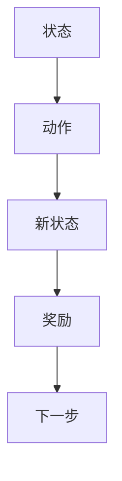
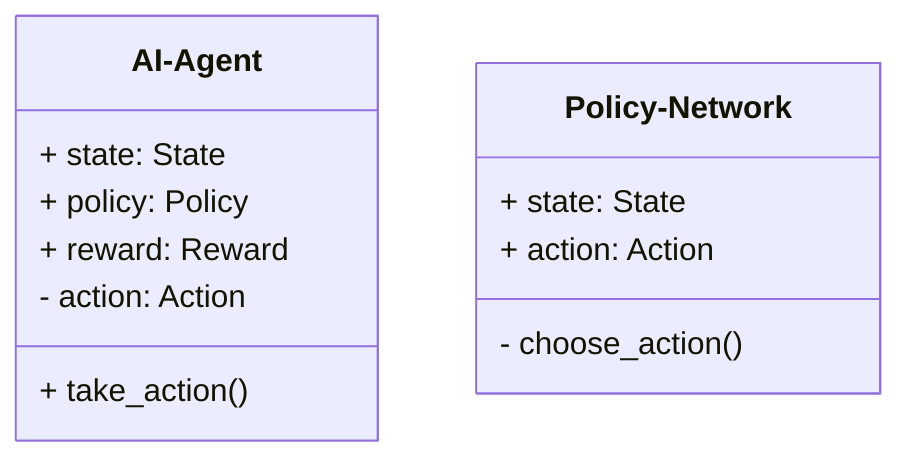
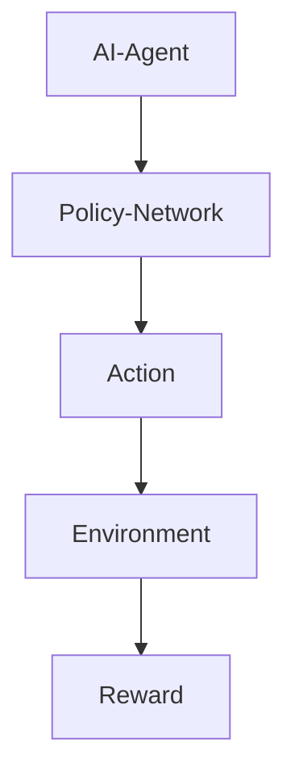

                 


# 企业AI Agent的强化学习在自动化运维中的应用

## 关键词：AI Agent, 强化学习, 自动化运维, 系统架构, 机器学习算法

## 摘要：  
随着企业对自动化运维的需求日益增加，AI Agent结合强化学习的技术逐渐成为实现智能化运维的重要手段。本文深入探讨了AI Agent在企业自动化运维中的应用价值，详细分析了强化学习算法的原理及其在运维场景中的具体实现。通过构建完整的系统架构和实际案例分析，本文展示了如何利用强化学习提升运维效率和决策能力，为企业自动化运维提供了一种创新的解决方案。

---

## 第1章: 企业AI Agent与强化学习概述

### 1.1 问题背景与问题描述
#### 1.1.1 企业运维自动化的需求
企业在数字化转型中，面临着日益复杂的运维环境。传统的运维模式依赖人工操作，效率低下且容易出错。随着业务规模的扩大，企业需要一种更加智能、高效的运维方式，以应对复杂的系统故障和动态变化的业务需求。

#### 1.1.2 问题描述
传统的运维工具虽然能够自动化执行任务，但缺乏智能决策能力。在面对复杂问题时，运维人员仍需手动干预，导致效率低下。此外，运维过程中涉及的决策变量多、目标函数复杂，传统规则引擎难以覆盖所有场景。

#### 1.1.3 解决思路
通过引入AI Agent和强化学习技术，可以实现智能化的运维决策。AI Agent能够根据当前系统状态，选择最优动作以实现目标，而强化学习则通过不断试错和优化策略，提升AI Agent的决策能力。

### 1.2 核心概念与联系
#### 1.2.1 AI Agent的核心特征
AI Agent是一种智能体，能够感知环境、做出决策并执行动作。其核心特征包括自主性、反应性、目标导向性和社会性。

#### 1.2.2 强化学习的基本原理
强化学习通过智能体与环境的交互，学习最优策略。智能体通过选择动作、观察环境反馈和获得奖励，逐步优化策略。

#### 1.2.3 AI Agent与强化学习的结合
AI Agent通过强化学习算法，能够在复杂环境中做出最优决策。这种结合使得AI Agent能够适应动态变化的环境，并在运维场景中实现智能化操作。

---

## 第2章: 强化学习算法原理与数学模型

### 2.1 算法概述
#### 2.1.1 穿透式思考：强化学习的基本流程
强化学习的流程包括状态感知、动作选择、环境反馈和策略优化四个步骤。

#### 2.1.2 算法的数学模型与公式
强化学习的数学模型涉及状态空间、动作空间、奖励函数和策略函数。常用的算法包括Q-Learning和Deep Q-Networks（DQN）。

#### 2.1.3 强化学习的挑战与优化
强化学习在实际应用中面临探索与利用的平衡、奖励函数的设计等挑战。通过引入经验回放和策略网络等技术，可以优化算法性能。

### 2.2 算法实现
#### 2.2.1 算法流程图（Mermaid）


#### 2.2.2 算法实现代码示例
```python
class Agent:
    def __init__(self, state_space, action_space):
        self.state_space = state_space
        self.action_space = action_space
        self.policy = PolicyNetwork(state_space, action_space)
    
    def take_action(self, state):
        action = self.policy.choose_action(state)
        return action

# 示例场景
state = np.array([1, 0, 0])
action = agent.take_action(state)
```

### 2.3 本章小结
本章详细讲解了强化学习算法的原理和数学模型，并通过流程图和代码示例展示了算法实现过程。

---

## 第3章: 系统分析与架构设计

### 3.1 问题场景介绍
企业运维系统包含多个子系统，如服务器监控、日志管理等。通过引入AI Agent，可以实现系统的智能化运维。

### 3.2 系统功能设计
#### 3.2.1 领域模型（Mermaid类图）


#### 3.2.2 系统架构（Mermaid架构图）


### 3.3 系统接口设计
AI Agent通过接口与运维系统交互，接收状态信息、选择动作并返回结果。

### 3.4 本章小结
本章通过系统架构设计，展示了AI Agent如何在企业运维系统中实现智能化操作。

---

## 第4章: 项目实战

### 4.1 环境安装
安装必要的库和工具，如Python、TensorFlow、Keras等。

### 4.2 核心代码实现
#### 4.2.1 AI Agent的核心代码
```python
class PolicyNetwork:
    def __init__(self, input_dim, output_dim):
        self.model = Sequential()
        self.model.add(Dense(64, activation='relu', input_dim=input_dim))
        self.model.add(Dense(output_dim, activation='linear'))
        self.model.compile(optimizer='adam', loss='mse')

    def choose_action(self, state):
        state = np.array([state])
        prediction = self.model.predict(state)
        return np.argmax(prediction[0])
```

#### 4.2.2 环境模拟与训练
```python
def train(agent, env, episodes=1000):
    for episode in range(episodes):
        state = env.reset()
        total_reward = 0
        while True:
            action = agent.choose_action(state)
            next_state, reward, done = env.step(action)
            agent.train(state, action, next_state, reward)
            total_reward += reward
            state = next_state
            if done:
                break
    return total_reward
```

### 4.3 案例分析
通过模拟环境训练AI Agent，展示其在运维场景中的应用效果。

### 4.4 本章小结
本章通过项目实战，详细展示了AI Agent在企业运维中的具体实现和应用效果。

---

## 第5章: 最佳实践与未来展望

### 5.1 最佳实践
#### 5.1.1 算法调优
选择合适的强化学习算法，并进行参数调优。

#### 5.1.2 系统集成
将AI Agent集成到现有运维系统中，确保兼容性和稳定性。

### 5.2 未来展望
随着AI技术的进步，AI Agent在运维中的应用将更加广泛，未来可能会出现更智能、更高效的运维解决方案。

### 5.3 本章小结
本章总结了AI Agent在企业运维中的应用经验，并展望了未来的发展方向。

---

## 作者：AI天才研究院/AI Genius Institute & 禅与计算机程序设计艺术 /Zen And The Art of Computer Programming

---

以上是文章的完整内容，涵盖了从理论到实践的各个方面，确保读者能够全面理解和应用所学内容。

