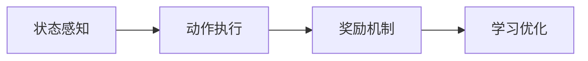
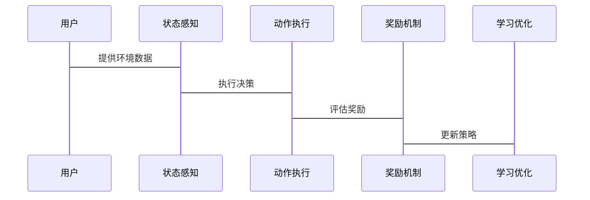

                 


# 企业AI Agent的强化学习应用：持续优化决策

> 关键词：企业AI Agent，强化学习，决策优化，算法实现，系统架构，应用案例

> 摘要：本文详细探讨了强化学习在企业AI Agent中的应用，从基本概念到算法实现，再到系统架构和实际案例，系统地分析了如何通过强化学习持续优化决策过程，为企业智能化转型提供理论和实践指导。

---

# 第一部分: 企业AI Agent的强化学习应用概述

## 第1章: 强化学习与AI Agent基础

### 1.1 强化学习的基本概念

#### 1.1.1 强化学习的定义与核心要素

强化学习（Reinforcement Learning, RL）是一种机器学习范式，通过智能体与环境的交互，学习最优策略以最大化累积奖励。其核心要素包括：

- **状态（State）**：环境的当前情况，如资源分配状态或业务流程进度。
- **动作（Action）**：智能体采取的行为，如资源分配决策。
- **奖励（Reward）**：智能体行为的反馈，指导其学习目标。
- **策略（Policy）**：决定动作的选择机制，如贪心策略或随机策略。
- **值函数（Value Function）**：评估状态或动作价值的函数。

#### 1.1.2 AI Agent的定义与分类

AI Agent是具备自主决策能力的智能体，根据环境信息采取最优行动。企业AI Agent按功能可分为：

- **工具型Agent**：执行特定任务，如资源调度。
- **决策型Agent**：基于环境信息做出决策，如市场预测。
- **协作型Agent**：与其他Agent或人类协作，如团队任务分配。

#### 1.1.3 强化学习在AI Agent中的作用

强化学习通过模拟真实环境，训练AI Agent在复杂场景中做出最优决策，适用于动态变化的企业环境，如供应链管理和风险控制。

### 1.2 强化学习的核心原理

#### 1.2.1 状态、动作、奖励的定义

- **状态（s）**：当前环境情况，如库存水平。
- **动作（a）**：Agent采取的行动，如增加订单。
- **奖励（r）**：对动作的反馈，如利润增加。

#### 1.2.2 策略与价值函数的关系

策略π(a|s)决定在状态s下选择动作a的概率。价值函数V(s)评估状态s的长期收益，帮助优化策略。

#### 1.2.3 探索与利用的平衡

探索：尝试未访问的状态和动作，发现潜在高回报路径。利用：根据当前知识选择最优动作。平衡点影响学习效率和最终收益。

### 1.3 企业AI Agent的应用场景

#### 1.3.1 企业资源优化配置

AI Agent通过强化学习优化资源配置，如库存管理、能源分配。

#### 1.3.2 自动化决策系统的构建

构建自动化决策系统，如智能客服、自动投标系统。

#### 1.3.3 复杂业务流程的智能优化

优化复杂业务流程，如订单处理、客户服务流程。

### 1.4 强化学习与传统机器学习的对比

#### 1.4.1 传统机器学习的特点

- 需要大量标注数据。
- 适用于模式识别、分类任务。
- 无法直接处理动态交互环境。

#### 1.4.2 强化学习的独特优势

- 适用于动态环境和序列决策问题。
- 通过试错学习，无需大量标注数据。
- 能够处理高维复杂状态空间。

#### 1.4.3 两者在企业中的结合应用

结合使用，如利用监督学习预处理数据，强化学习优化决策策略。

### 1.5 本章小结

本章介绍了强化学习的基本概念和核心原理，分析了其在企业AI Agent中的作用及其应用场景，指出了与传统机器学习的区别与结合方式。

---

## 第2章: 强化学习算法的数学模型与公式

### 2.1 Q-learning算法

#### 2.1.1 Q-learning的基本公式

Q-learning通过更新Q值函数逼近最优策略：

$$ Q(s,a) = Q(s,a) + \alpha [r + \gamma \max Q(s',a') - Q(s,a)] $$

其中：
- $\alpha$：学习率，控制更新步长。
- $\gamma$：折扣因子，平衡当前与未来奖励。

#### 2.1.2 Q-learning的收敛性分析

在离线环境下，Q-learning通过经验回放逼近最优策略，具有渐近收敛性。

#### 2.1.3 Q-learning的优缺点

优点：简单易实现，适用于离线环境。缺点：无法处理高维状态空间，收敛速度慢。

### 2.2 Deep Q-Networks (DQN)算法

#### 2.2.1 DQN的网络结构

DQN使用两个深度神经网络，一个用于当前策略（主网络），一个用于目标值（目标网络）。

#### 2.2.2 Experience Replay机制

通过存储历史经验，随机采样训练，加速收敛，避免重复样本影响。

#### 2.2.3 DQN的数学模型

损失函数：

$$ \text{损失函数} = \sum (r + \gamma Q_{\text{target}}(s',a') - Q_{\text{main}}(s,a))^2 $$

其中，$Q_{\text{target}}$和$Q_{\text{main}}$分别为目标网络和主网络的输出。

### 2.3 Actor-Critic算法

#### 2.3.1 Actor网络的作用

Actor网络负责生成动作，通过策略梯度优化，最大化奖励。

#### 2.3.2 Critic网络的作用

Critic网络评估当前状态-动作对的Q值，指导Actor优化策略。

#### 2.3.3 Actor-Critic的联合优化

Actor-Critic通过联合优化策略和价值函数，实现更快收敛和更稳定的训练。

### 2.4 算法选择与优化策略

#### 2.4.1 算法选择的考虑因素

- 状态空间维度
- 动作空间类型
- 环境动态特性
- 计算资源限制

#### 2.4.2 超参数优化方法

- 学习率调整
- 折扣因子选择
- 探索-利用平衡策略

#### 2.4.3 算法性能评估指标

- 收敛速度
- 稳定性
- 最终收益

### 2.5 本章小结

本章详细介绍了Q-learning、DQN和Actor-Critic算法的数学模型与实现，分析了算法选择的优化策略，为实际应用提供了理论基础。

---

## 第3章: 企业AI Agent的系统架构设计

### 3.1 系统功能需求分析

#### 3.1.1 问题场景介绍

以企业资源分配优化为例，分析现有资源分配问题，如库存过剩或短缺，寻求最优分配策略。

#### 3.1.2 系统功能模块划分

- 状态感知模块
- 动作执行模块
- 奖励机制模块
- 学习优化模块

#### 3.1.3 系统输入输出设计

- 输入：环境状态、可用资源
- 输出：优化后的资源分配策略

### 3.2 系统架构设计

#### 3.2.1 分层架构设计

- 数据层：收集和存储环境数据
- 策略层：执行决策和优化
- 执行层：实施决策并反馈结果

#### 3.2.2 微服务架构设计

- 状态服务
- 动作服务
- 奖励服务
- 学习服务

#### 3.2.3 系统架构图



### 3.3 系统接口设计

- API接口定义
- 数据格式规范

### 3.4 系统交互流程



### 3.5 本章小结

本章从系统功能需求出发，设计了分层和微服务架构，明确了系统接口和交互流程，为实际开发提供了指导。

---

## 第4章: 项目实战：基于强化学习的企业AI Agent开发

### 4.1 环境安装与配置

- 安装Python、TensorFlow、Keras等依赖库
- 配置开发环境，如Jupyter Notebook

### 4.2 核心代码实现

#### 4.2.1 状态空间定义

```python
class State:
    def __init__(self, inventory):
        self.inventory = inventory
```

#### 4.2.2 动作空间定义

```python
class Action:
    def __init__(self, type, value):
        self.type = type  # 'order'或'restock'
        self.value = value  # 具体数值
```

#### 4.2.3 强化学习算法实现

```python
class DQN:
    def __init__(self, state_dim, action_dim):
        self.state_dim = state_dim
        self.action_dim = action_dim
        self.model = self.build_model()
    def build_model(self):
        # 网络结构定义
        model = Sequential()
        model.add(Dense(32, input_dim=state_dim, activation='relu'))
        model.add(Dense(action_dim, activation='linear'))
        model.compile(optimizer='adam', loss='mse')
        return model
```

#### 4.2.4 训练与测试

```python
def train():
    env = EnterpriseEnvironment()
    agent = DQN(env.state_dim, env.action_dim)
    for episode in range(1000):
        state = env.reset()
        while True:
            action = agent.act(state)
            next_state, reward, done = env.step(action)
            agent.remember(state, action, reward, next_state)
            agent.train()
            if done:
                break
```

### 4.3 案例分析

以某企业库存管理为例，训练AI Agent优化库存分配策略，降低库存成本和缺货风险。

### 4.4 代码解读与分析

详细分析每部分代码的功能，如状态空间、动作空间、算法模型的定义和训练流程。

### 4.5 本章小结

通过实际项目实战，展示了如何基于强化学习开发企业AI Agent，提供了可参考的代码实现和案例分析。

---

## 第5章: 强化学习在企业AI Agent中的优化策略

### 5.1 算法优化策略

- 网络结构优化
- 超参数调整
- 奖励机制设计

### 5.2 系统优化策略

- 并行计算加速
- 模型压缩与轻量化
- 在线与离线学习结合

### 5.3 业务优化策略

- 数据质量提升
- 业务规则整合
- 多目标优化

### 5.4 本章小结

本章总结了强化学习在企业AI Agent中的优化策略，从算法、系统到业务层面提供了改进建议。

---

## 第6章: 未来趋势与挑战

### 6.1 强化学习的未来发展趋势

- 结合大语言模型（LLM）提升决策能力
- 边缘计算与强化学习的结合
- 多智能体协作优化

### 6.2 当前面临的主要挑战

- 算法可解释性不足
- 高维状态空间处理困难
- 实时决策的计算限制

### 6.3 应用前景与研究方向

- 在更多企业场景中的应用探索
- 新型算法与技术的结合研究
- 人机协作决策模式的创新

### 6.4 本章小结

展望了强化学习在企业AI Agent中的未来发展方向，指出了当前面临的主要挑战和研究热点。

---

## 作者：AI天才研究院/AI Genius Institute & 禅与计算机程序设计艺术 /Zen And The Art of Computer Programming

---

通过以上目录，您可以按照每章的结构和内容逐步展开，撰写详细的技术博客文章。

