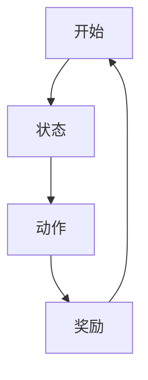
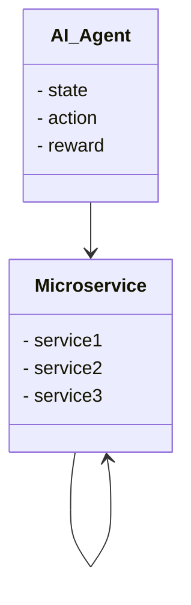
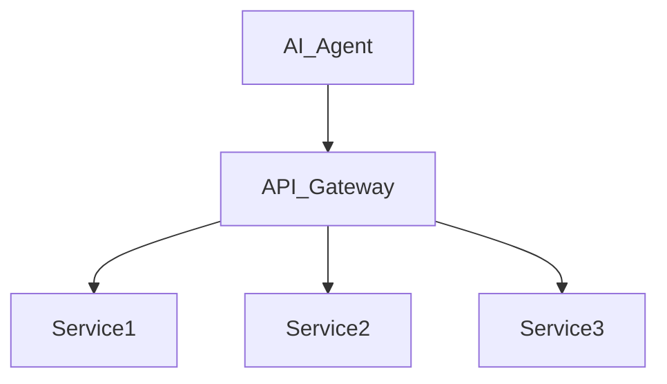
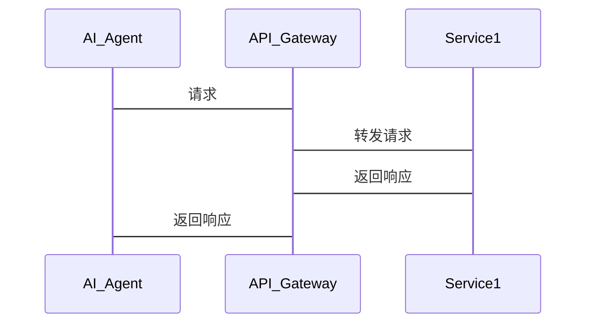

                 


# 企业AI Agent的微服务架构优化策略

## 关键词：AI Agent，微服务架构，优化策略，系统设计，算法原理，强化学习，分布式计算

## 摘要：本文详细探讨了企业AI Agent在微服务架构中的优化策略。通过分析AI Agent的核心原理和微服务架构的优势，结合实际案例和算法实现，提出了一套优化方案，帮助企业提升AI Agent的性能和效率。文章内容涵盖系统分析、算法原理、项目实战等多个方面，为技术人员提供深度的技术指导。

---

## 第1章：企业AI Agent与微服务架构的背景与挑战

### 1.1 AI Agent的基本概念

AI Agent（人工智能代理）是指能够感知环境并采取行动以实现目标的智能实体。它可以分为两类：反应式和认知式。反应式AI Agent基于当前感知做出决策，而认知式AI Agent则具备复杂推理和规划能力。

#### AI Agent的核心功能与特点
- **自主性**：能够独立决策和行动。
- **反应性**：能够实时感知环境变化并做出响应。
- **学习能力**：通过数据和经验不断优化自身行为。

#### 企业级AI Agent的应用场景
- 智能客服：通过自然语言处理为用户提供支持。
- 自动化运维：监控系统并自动修复问题。
- 智能推荐：根据用户行为推荐相关内容。

### 1.2 微服务架构的基本概念

微服务架构是一种将应用程序分解为多个小型、独立服务的设计模式。每个服务负责一个特定功能，通过API进行通信。

#### 微服务架构的优势与劣势
- **优势**：高可扩展性、团队协作效率高、技术栈灵活。
- **劣势**：复杂性增加、运维成本上升、服务间通信延迟。

#### 微服务架构在企业中的应用现状
- 电商平台：使用微服务架构实现订单处理和库存管理。
- 金融系统：通过微服务实现交易处理和风险控制。

### 1.3 AI Agent与微服务架构的结合

AI Agent在微服务架构中的角色至关重要，它负责协调各个服务的协作，优化整体性能。

#### 微服务架构对AI Agent的优化作用
- **分布式计算**：提高AI Agent的计算能力。
- **负载均衡**：确保AI Agent高效运行。

#### 当前企业中AI Agent与微服务架构结合的挑战
- **复杂性**：服务间通信和协调增加系统复杂性。
- **性能瓶颈**：过多的服务可能导致性能下降。

---

## 第2章：企业AI Agent的微服务架构核心概念

### 2.1 AI Agent的核心原理

AI Agent通过感知环境、分析信息并采取行动来实现目标。其核心功能包括感知、推理和行动。

#### AI Agent的基本工作原理
1. **感知环境**：通过传感器或API获取数据。
2. **分析信息**：利用机器学习算法进行数据分析。
3. **制定决策**：基于分析结果做出行动决策。

#### AI Agent的感知与决策机制
- **感知层**：通过API获取实时数据。
- **决策层**：利用强化学习算法优化决策。

#### AI Agent的学习与优化过程
- **监督学习**：基于标记数据进行训练。
- **强化学习**：通过试错优化策略。

### 2.2 微服务架构的核心原理

微服务架构通过分解功能模块，实现系统的高可扩展性和灵活性。

#### 微服务架构的设计原则
- **单一职责**：每个服务只负责一个功能。
- **松耦合**：服务间通过API通信，减少依赖性。

#### 微服务架构的通信机制
- **RESTful API**：基于HTTP协议进行通信。
- **消息队列**：通过Kafka等工具实现异步通信。

#### 微服务架构的部署与扩展
- **容器化**：使用Docker实现服务的独立部署。
- **自动化扩展**：通过Kubernetes实现自动扩缩容。

### 2.3 AI Agent与微服务架构的关联

AI Agent在微服务架构中扮演协调者的角色，优化服务间的协作。

#### AI Agent在微服务架构中的功能模块划分
- **协调服务**：负责服务间的通信和协调。
- **决策服务**：基于实时数据做出决策。

#### 微服务架构对AI Agent性能的影响
- **计算能力**：分布式计算提高计算效率。
- **扩展性**：微服务架构支持AI Agent的横向扩展。

---

## 第3章：微服务架构下AI Agent的优化算法原理

### 3.1 基于强化学习的AI Agent优化算法

强化学习是一种通过试错优化决策的算法，适用于动态环境中的优化问题。

#### 强化学习的基本原理
- **状态（State）**：环境的当前情况。
- **动作（Action）**：AI Agent采取的行动。
- **奖励（Reward）**：对行动的反馈。

#### AI Agent在微服务架构中的强化学习应用
- **服务选择**：动态选择最优服务。
- **路径优化**：优化API调用路径。

#### 基于强化学习的优化算法实现


### 3.2 分布式计算在AI Agent优化中的应用

分布式计算通过多节点协作提高计算效率。

#### 分布式计算的基本概念
- **分布式系统**：由多个节点协作完成任务。
- **任务分配**：将任务分解到多个节点执行。

#### 微服务架构中的分布式计算实现
- **任务分片**：将数据分片处理。
- **并行计算**：多个节点同时处理任务。

#### 分布式计算对AI Agent优化的具体作用
- **提高计算能力**：通过分布式计算加速数据处理。
- **降低延迟**：通过并行计算减少响应时间。

### 3.3 并行计算与负载均衡在AI Agent优化中的应用

并行计算和负载均衡是优化AI Agent性能的关键技术。

#### 并行计算的基本原理
- **并行处理**：多个核心同时处理任务。
- **任务分解**：将任务分解为多个子任务。

#### 微服务架构中的并行计算实现
- **多线程**：在同一节点内使用多线程处理任务。
- **多进程**：在多个节点上运行进程。

#### 负载均衡对AI Agent优化的具体作用
- **动态分配**：根据节点负载动态分配任务。
- **故障恢复**：当节点故障时，自动切换到其他节点。

---

## 第4章：企业AI Agent微服务架构的系统分析与设计

### 4.1 系统分析

#### 问题场景介绍
- **问题描述**：AI Agent在处理大量请求时性能下降。
- **目标**：优化AI Agent的性能和响应速度。

#### 项目介绍
- **项目目标**：通过微服务架构优化AI Agent的性能。
- **项目范围**：覆盖订单处理、库存管理等核心业务。

#### 系统功能设计


### 4.2 系统架构设计

#### 微服务架构设计
- **分层架构**：分为API层、业务逻辑层和数据访问层。
- **服务通信**：通过API Gateway统一管理服务通信。

#### 系统架构图


### 4.3 系统接口设计

#### API接口设计
- **RESTful API**：提供标准接口供AI Agent调用。
- **版本控制**：确保API版本兼容性。

#### API调用流程
1. AI Agent通过API Gateway调用服务。
2. API Gateway根据请求路由到相应服务。
3. 服务处理请求并返回响应。

### 4.4 系统交互设计

#### 交互流程图


---

## 第5章：企业AI Agent微服务架构优化的项目实战

### 5.1 环境搭建

#### 环境要求
- **操作系统**：Linux或Windows。
- **开发工具**：IntelliJ IDEA或PyCharm。
- **依赖管理**：使用Maven或Pip。

#### 安装步骤
1. 安装JDK。
2. 安装Python。
3. 安装Docker和Kubernetes。

### 5.2 核心代码实现

#### AI Agent核心代码
```python
class AI_Agent:
    def __init__(self):
        self.state = None
        self.action = None
        self.reward = None

    def perceive(self, environment):
        self.state = environment.get_state()
        return self.state

    def decide(self):
        # 使用强化学习算法选择最优动作
        pass
```

#### 微服务架构核心代码
```python
from fastapi import FastAPI

app = FastAPI()

@app.get("/api/service1")
def service1():
    return {"service": "Service1"}
```

### 5.3 案例分析

#### 实际案例分析
- **案例1**：优化订单处理流程。
- **案例2**：提升库存管理效率。

#### 案例实现步骤
1. 定义服务接口。
2. 实现服务逻辑。
3. 部署服务到Kubernetes。

### 5.4 项目小结

通过实际项目，验证了微服务架构对AI Agent优化的有效性。

---

## 第6章：总结与展望

### 6.1 总结

本文详细探讨了企业AI Agent在微服务架构中的优化策略，通过理论分析和实际案例，提出了有效的优化方案。

### 6.2 未来展望

未来的研究方向包括：
- 更高效的分布式计算算法。
- 更智能的负载均衡策略。
- 更先进的强化学习算法。

### 6.3 最佳实践 tips

- **模块化设计**：确保每个服务职责单一。
- **自动化测试**：保证系统稳定性和可靠性。
- **持续优化**：定期监控和优化系统性能。

---

## 作者：AI天才研究院/AI Genius Institute & 禅与计算机程序设计艺术 /Zen And The Art of Computer Programming

---

以上是《企业AI Agent的微服务架构优化策略》的完整目录和内容概要，涵盖了从理论到实践的各个方面，结合实际案例和代码实现，为技术人员提供了深度的技术指导。

