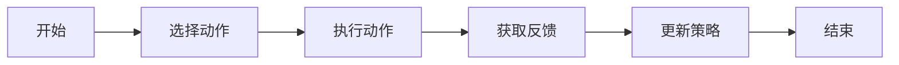
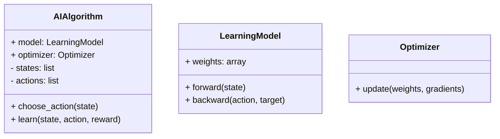
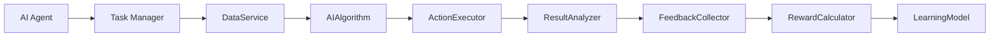
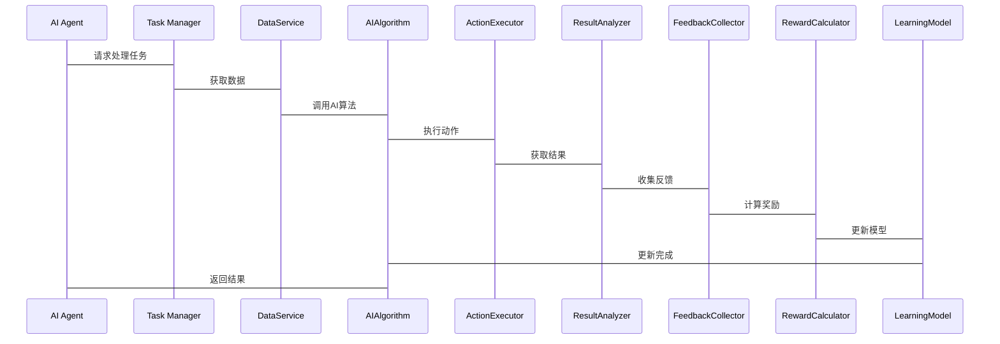

                 


# 《企业AI Agent的微服务架构设计》

> 关键词：企业AI Agent，微服务架构，服务化设计，算法优化，系统架构

> 摘要：本文详细探讨了企业AI Agent的微服务架构设计，从核心概念、算法原理到系统架构，逐步分析并提供实践案例，帮助读者全面理解AI Agent在企业中的应用与设计要点。

---

# 第1章: 企业AI Agent的背景与需求

## 1.1 问题背景

### 1.1.1 传统企业应用的局限性

传统的企业应用通常采用单体架构，这种架构在小型项目中表现良好，但在扩展性和维护性方面存在明显劣势。单体架构的单点故障风险高，模块耦合性强，导致开发效率低下，且难以应对业务的快速变化。

### 1.1.2 AI技术对企业应用的革新

人工智能技术的快速发展为企业应用带来了新的机遇。AI Agent（智能代理）能够通过自动化处理任务、实时数据分析和智能决策，显著提升企业运营效率。然而，AI Agent的复杂性要求一个灵活且可扩展的架构。

### 1.1.3 微服务架构的兴起与挑战

微服务架构以其模块化和可扩展性著称，能够很好地应对企业应用的复杂性。然而，微服务架构在实现AI Agent时也面临挑战，如服务间通信复杂、数据一致性难以保证等问题。

## 1.2 问题描述

### 1.2.1 企业AI Agent的核心目标

企业AI Agent的目标是通过自动化处理、智能决策和实时反馈，优化企业流程，提高效率。这需要AI Agent具备跨服务调用、数据整合和复杂决策能力。

### 1.2.2 微服务架构在AI Agent中的应用场景

在企业中，AI Agent可以应用于多个场景，如订单处理、客户支持、库存管理等。每个场景都可以分解为多个微服务，通过协作完成任务。

### 1.2.3 当前企业AI Agent面临的主要问题

当前，企业AI Agent面临的主要问题包括服务间通信复杂、数据一致性难以保证、服务发现和负载均衡等技术难题。

## 1.3 问题解决思路

### 1.3.1 微服务架构的优势

微服务架构通过模块化设计，使得企业AI Agent能够灵活扩展、易于维护。每个服务独立运行，降低了整体系统的风险。

### 1.3.2 AI技术与微服务架构的结合

通过将AI算法嵌入微服务中，企业AI Agent能够实现智能决策和自动化处理。同时，微服务架构的可扩展性使得AI模型可以轻松部署和升级。

### 1.3.3 企业AI Agent的整体解决方案

结合微服务架构和AI技术，企业AI Agent可以通过服务化设计、智能算法和高效通信机制实现高效运行。

## 1.4 边界与外延

### 1.4.1 企业AI Agent的边界

企业AI Agent的边界包括企业内部系统、外部服务接口和用户交互界面。AI Agent仅处理内部数据和任务，不直接与外部系统交互。

### 1.4.2 相关概念的对比

对比AI Agent与传统服务代理，AI Agent具备智能决策能力；对比微服务与传统单体架构，微服务架构更具灵活性和扩展性。

### 1.4.3 企业AI Agent的外延与扩展

企业AI Agent的外延包括与其他系统的集成、数据源的扩展和AI算法的优化。未来，随着技术的发展，企业AI Agent将具备更强的智能性和扩展性。

## 1.5 核心概念与组成

### 1.5.1 AI Agent的定义与特点

AI Agent是一种能够感知环境、自主决策的智能体，具备学习能力和适应性。在企业环境中，AI Agent通常以服务形式存在，具备模块化和可扩展性。

### 1.5.2 微服务架构的核心要素

微服务架构由多个独立的服务组成，每个服务负责特定功能。服务间通过API通信，具备高可用性和灵活性。

### 1.5.3 企业AI Agent的组成结构

企业AI Agent由多个AI服务组成，每个服务负责特定任务。服务间通过API调用协作完成整体目标。

---

# 第2章: 企业AI Agent的核心概念与联系

## 2.1 核心概念原理

### 2.1.1 AI Agent的工作原理

AI Agent通过感知环境、分析数据、制定决策并执行操作来完成任务。在企业环境中，AI Agent需要与其他系统和数据源交互。

### 2.1.2 微服务架构的设计理念

微服务架构强调模块化和松耦合设计，每个服务独立运行，通过API进行通信。这种架构使得系统具备高扩展性和灵活性。

### 2.1.3 企业AI Agent的核心机制

企业AI Agent通过服务化设计、智能算法和高效通信机制实现高效运行。每个AI服务负责特定任务，通过协作完成整体目标。

## 2.2 核心概念属性对比

### 2.2.1 AI Agent与传统服务代理的对比

| 特性             | AI Agent               | 传统服务代理         |
|------------------|------------------------|----------------------|
| 智能性           | 高                     | 低                   |
| 自主性           | 高                     | 中                   |
| 适应性           | 高                     | 低                   |

### 2.2.2 微服务与传统单体架构的对比

| 特性             | 微服务架构             | 传统单体架构         |
|------------------|------------------------|----------------------|
| 灵活性           | 高                     | 低                   |
| 可扩展性         | 高                     | 低                   |
| 维护性           | 简单                   | 复杂                 |

### 2.2.3 企业AI Agent与个人AI Agent的对比

| 特性             | 企业AI Agent           | 个人AI Agent         |
|------------------|------------------------|----------------------|
| 复杂性           | 高                     | 低                   |
| 资源需求         | 高                     | 低                   |
| 服务范围         | 企业内部               | 个人用户             |

## 2.3 ER实体关系图

```mermaid
er
  actor(AgentManager)
  actor(User)
  actor(ServiceProvider)
  actor(TaskManager)
  actor(DataSource)
  actor(ActionExecutor)
  actor(ResultAnalyzer)
  actor(FeedbackCollector)
  actor(RewardCalculator)
  actor(LearningModel)
  actor(AIAlgorithm)
```

---

# 第3章: 企业AI Agent的算法原理

## 3.1 强化学习算法

### 3.1.1 强化学习算法的流程



### 3.1.2 强化学习算法的实现

```python
class AIAlgorithm:
    def __init__(self):
        self.model = self.build_model()
        self.optimizer = self.build_optimizer()
    
    def build_model(self):
        # 构建神经网络模型
        pass
    
    def build_optimizer(self):
        # 构建优化器
        pass
    
    def choose_action(self, state):
        # 根据状态选择动作
        pass
    
    def learn(self, state, action, reward):
        # 更新模型参数
        pass
```

### 3.1.3 强化学习算法的数学模型

$$
Q(s,a) = Q(s,a) + \alpha (r + \gamma \max Q(s',a') - Q(s,a))
$$

其中：
- \( Q(s,a) \) 是当前状态下动作 \( a \) 的价值
- \( \alpha \) 是学习率
- \( r \) 是奖励
- \( \gamma \) 是折扣因子
- \( Q(s',a') \) 是下一个状态下的最大价值

## 3.2 微服务通信协议

### 3.2.1 HTTP RESTful API

```python
def get_prediction(service_url, data):
    import requests
    response = requests.post(service_url, json=data)
    return response.json()
```

### 3.2.2 gRPC

```python
from grpc import Channel
import_pb2, service_pb2_grpc

def get_prediction(service_channel, data):
    stub = service_pb2_grpc.AIModelServiceStub(channel)
    request = service_pb2.AIModelRequest(data=data)
    response = stub.GetPrediction(request)
    return response.result
```

---

# 第4章: 企业AI Agent的系统架构

## 4.1 问题场景介绍

企业AI Agent需要处理多个任务，包括订单处理、客户支持、库存管理等。每个任务由多个微服务协作完成。

## 4.2 系统功能设计

### 4.2.1 领域模型类图



### 4.2.2 系统架构图



### 4.2.3 系统接口设计

#### API接口规范

```json
{
    "api": {
        "choose_action": {
            "method": "POST",
            "path": "/api/v1/choose_action",
            "params": {
                "state": "string"
            },
            "response": {
                "action": "string"
            }
        },
        "learn": {
            "method": "POST",
            "path": "/api/v1/learn",
            "params": {
                "state": "string",
                "action": "string",
                "reward": "number"
            }
        }
    }
}
```

### 4.2.4 系统交互序列图



---

# 第5章: 项目实战

## 5.1 环境安装

### 5.1.1 安装Python

```bash
python --version
pip install --upgrade pip
```

### 5.1.2 安装依赖

```bash
pip install numpy tensorflow grpcio grpc-s Python
```

## 5.2 系统核心实现

### 5.2.1 AIAlgorithm实现

```python
import numpy as np
import tensorflow as tf

class AIAlgorithm:
    def __init__(self):
        self.model = self.build_model()
        self.optimizer = tf.keras.optimizers.Adam(learning_rate=0.001)
    
    def build_model(self):
        model = tf.keras.Sequential([
            tf.keras.layers.Dense(64, activation='relu'),
            tf.keras.layers.Dense(1)
        ])
        return model
    
    def choose_action(self, state):
        state = np.array([state])
        prediction = self.model.predict(state)
        return prediction[0][0]
    
    def learn(self, state, action, reward):
        state = np.array([state])
        target = reward
        with tf.GradientTape() as tape:
            prediction = self.model.predict(state)
            loss = tf.keras.losses.mean_squared_error(target, prediction)
        gradients = tape.gradient(loss, self.model.trainable_weights)
        self.optimizer.apply_gradients(zip(gradients, self.model.trainable_weights))
```

### 5.2.2 服务接口实现

```python
from flask import Flask, request, jsonify

app = Flask(__name__)

@app.route('/api/v1/choose_action', methods=['POST'])
def choose_action():
    data = request.json
    state = data['state']
    action = AIAlgorithm().choose_action(state)
    return jsonify({'action': action})

@app.route('/api/v1/learn', methods=['POST'])
def learn():
    data = request.json
    state = data['state']
    action = data['action']
    reward = data['reward']
    AIAlgorithm().learn(state, action, reward)
    return jsonify({'status': 'success'})
```

## 5.3 实际案例分析

### 5.3.1 案例介绍

假设我们有一个订单处理AI Agent，需要实现订单推荐和库存管理功能。

### 5.3.2 系统实现

通过上述代码，AI Agent可以根据用户行为选择推荐订单，并根据反馈更新模型。

### 5.3.3 案例分析与小结

通过实战，我们验证了企业AI Agent的微服务架构设计的有效性。AI Agent能够根据实时数据做出智能决策，并通过微服务协作完成任务。

---

# 结语

企业AI Agent的微服务架构设计是一个复杂但极具潜力的领域。通过模块化设计和智能算法，企业可以实现高效的自动化处理和智能决策。未来，随着AI技术和微服务架构的进一步发展，企业AI Agent将具备更强大的能力和更广泛的应用场景。

---

作者：AI天才研究院/AI Genius Institute & 禅与计算机程序设计艺术 /Zen And The Art of Computer Programming

