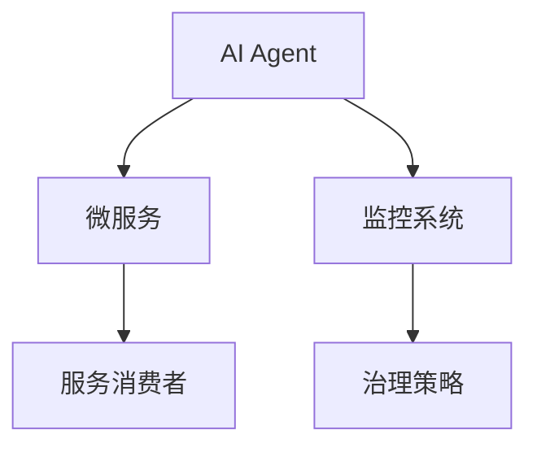
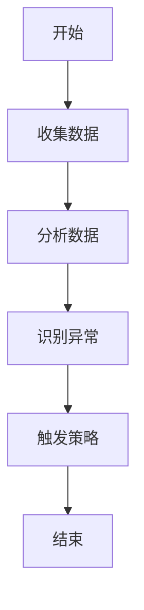
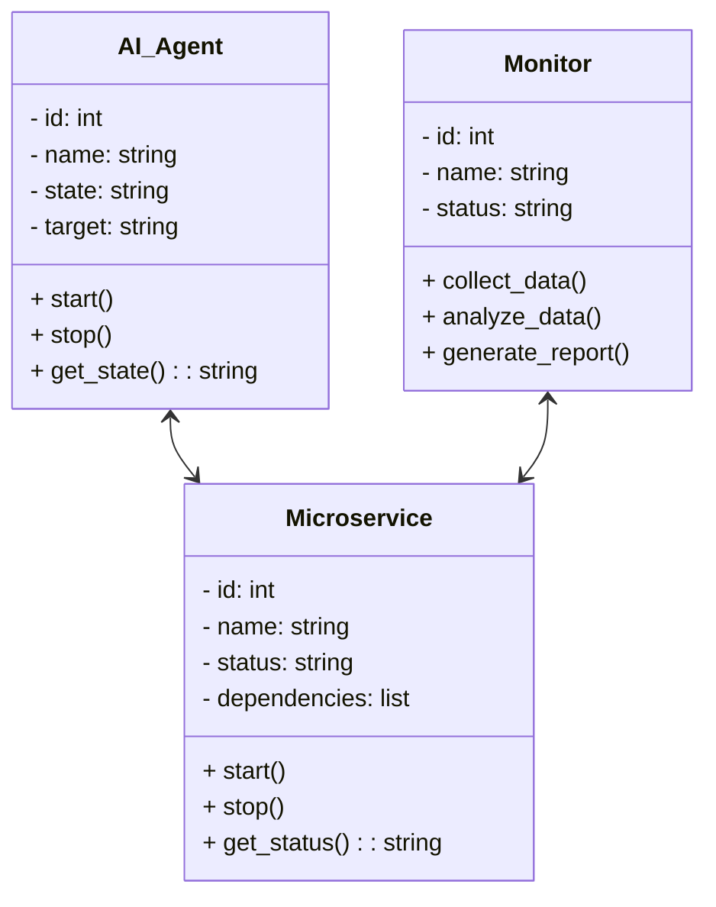
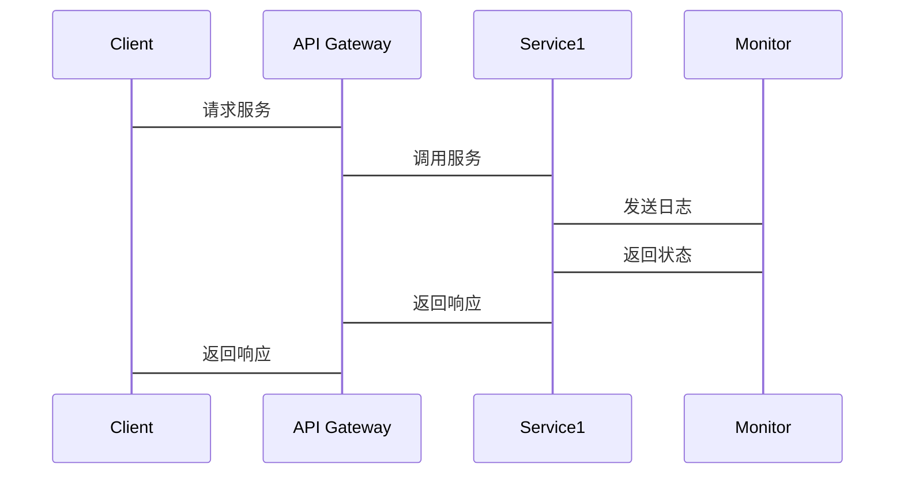

                 


```markdown
# 企业AI Agent的微服务治理与监控策略

> 关键词：微服务架构, AI Agent, 治理策略, 监控系统, 算法实现

> 摘要：随着企业AI Agent在微服务架构中的广泛应用，其治理与监控的复杂性日益增加。本文从核心概念、算法原理、系统架构、项目实战等多维度进行详细分析，旨在为企业AI Agent的微服务治理与监控提供一套完整的解决方案。

---

## 第1章: 企业AI Agent的背景与挑战

### 1.1 问题背景
#### 1.1.1 微服务架构的普及与挑战
微服务架构因其灵活性和可扩展性，已成为企业数字化转型的核心技术。然而，随着AI Agent的引入，微服务的复杂性显著增加，传统的治理与监控方法已难以应对。

#### 1.1.2 AI Agent在企业中的应用现状
AI Agent通过自动化决策和执行，提升了企业的运营效率。然而，其在微服务环境中的部署和管理面临诸多挑战，如服务依赖复杂、异常检测困难等。

#### 1.1.3 微服务治理与监控的必要性
治理与监控是确保AI Agent在微服务环境中高效运行的关键。本文将重点探讨如何通过算法和架构优化，实现AI Agent的高效治理与监控。

### 1.2 问题描述
#### 1.2.1 微服务架构中的AI Agent特点
AI Agent具有自治性、响应性和主动性，但在微服务环境中，其行为受到服务依赖和服务调用链的影响。

#### 1.2.2 企业AI Agent的复杂性
AI Agent的复杂性主要体现在服务依赖的深度、跨服务通信的延迟以及动态环境下的自适应能力。

#### 1.2.3 当前治理与监控的主要问题
- **服务发现与跟踪**：AI Agent的动态部署和扩展导致服务发现困难。
- **异常检测**：复杂的服务调用链使得异常检测和定位变得复杂。
- **资源分配与调度**：AI Agent对资源的需求动态变化，传统静态调度方法难以满足需求。

### 1.3 问题解决
#### 1.3.1 微服务治理的核心目标
- 服务发现与管理
- 服务依赖管理
- 服务性能优化

#### 1.3.2 监控策略的关键作用
- 实时监控服务状态
- 自动化异常处理
- 资源动态分配

#### 1.3.3 企业AI Agent的解决方案框架
- **服务发现与跟踪**：基于日志和链路追踪技术实现服务发现和跟踪。
- **异常检测**：通过机器学习算法实现异常检测和定位。
- **资源调度优化**：基于负载均衡算法实现资源动态分配。

### 1.4 边界与外延
#### 1.4.1 微服务治理的边界
- 服务发现与管理的范围
- 服务依赖管理的边界
- 服务性能优化的范围

#### 1.4.2 监控策略的外延
- 监控数据的采集范围
- 监控系统的覆盖范围
- 监控策略的动态调整范围

#### 1.4.3 企业AI Agent的适用范围
- 适用于复杂业务场景
- 适用于高并发环境
- 适用于动态变化的业务需求

### 1.5 核心概念与联系
#### 1.5.1 核心概念原理
- **AI Agent**：具有自治性和响应性的智能体，能够根据环境动态调整行为。
- **微服务架构**：一种模块化架构，将系统分解为多个独立的服务，每个服务可以独立开发、部署和扩展。
- **治理与监控**：通过策略和工具实现对微服务系统的管理与优化。

#### 1.5.2 概念属性特征对比表格
| 概念       | 属性               | 特征               |
|------------|--------------------|--------------------|
| AI Agent   | 自治性             | 高                 |
|            | 响应性             | 高                 |
|            | 服务依赖           | 多                |
| 微服务架构 | 服务独立性         | 高                 |
|            | 服务可扩展性       | 高                 |
| 监控策略   | 实时性             | 高                 |
|            | 自动化            | 高                 |

#### 1.5.3 ER实体关系图（Mermaid流程图）


---

## 第2章: AI Agent的核心概念与联系

### 2.1 核心概念原理
#### 2.1.1 AI Agent的定义与属性
AI Agent是一种智能体，能够感知环境并采取行动以实现目标。其核心属性包括自治性、响应性和主动性。

#### 2.1.2 微服务架构中的AI Agent角色
在微服务架构中，AI Agent通常作为服务消费者或服务提供者，与其他服务进行交互，完成特定任务。

#### 2.1.3 治理与监控的关联性
治理与监控是AI Agent在微服务架构中高效运行的关键保障。治理确保服务的可用性和稳定性，监控提供实时反馈以优化服务性能。

### 2.2 概念属性特征对比表格
| 概念       | 属性               | 特征               |
|------------|--------------------|--------------------|
| AI Agent   | 自治性             | 高                 |
|            | 响应性             | 高                 |
|            | 服务依赖           | 多                |
| 微服务架构 | 服务独立性         | 高                 |
|            | 服务可扩展性       | 高                 |
| 监控策略   | 实时性             | 高                 |
|            | 自动化            | 高                 |

### 2.3 ER实体关系图（Mermaid流程图）


---

## 第3章: 微服务治理与监控的算法原理

### 3.1 算法原理讲解
#### 3.1.1 基于日志的异常检测算法
- **日志数据采集**：通过日志采集工具（如ELK）收集服务日志。
- **异常检测**：基于机器学习算法（如Isolation Forest）识别异常日志模式。
- **异常定位**：通过日志关联分析确定异常来源。

#### 3.1.2 请求链路追踪算法
- **链路追踪**：使用链路追踪工具（如Jaeger）跟踪服务调用链。
- **异常定位**：通过链路调用日志分析定位异常服务节点。
- **性能优化**：基于链路调用频率优化服务调用路径。

#### 3.1.3 自适应调优算法
- **资源分配**：基于服务负载动态分配计算资源。
- **算法实现**：使用强化学习算法（如Q-Learning）优化资源分配策略。
- **性能提升**：通过自适应调优提升服务整体性能。

### 3.2 算法流程图（Mermaid）


### 3.3 算法实现代码
```python
def detect_anomaly(logs):
    # 简单实现
    import numpy as np
    from sklearn.ensemble import IsolationForest

    # 数据预处理
    numeric_features = ['timestamp', 'response_time']
    logs_numeric = logs[numeric_features].values

    # 训练模型
    model = IsolationForest(n_estimators=100, random_state=42)
    model.fit(logs_numeric)

    # 预测异常
    logs['is_anomaly'] = model.predict(logs_numeric)
    logs['is_anomaly'] = logs['is_anomaly'].apply(lambda x: '异常' if x == -1 else '正常')

    return logs

# 示例数据
import pandas as pd
import numpy as np

data = {
    'timestamp': np.random.randint(1, 100, 100),
    'response_time': np.random.normal(2, 0.5, 100)
}
logs = pd.DataFrame(data)
result = detect_anomaly(logs)
print(result)
```

---

## 第4章: 系统分析与架构设计方案

### 4.1 问题场景介绍
- **场景背景**：企业AI Agent在微服务架构中的部署和管理面临复杂性。
- **目标用户**：企业IT架构师、开发人员和运维人员。

### 4.2 系统功能设计
#### 4.2.1 领域模型（Mermaid类图）


#### 4.2.2 系统架构设计（Mermaid架构图）


#### 4.2.3 系统接口设计
- **服务发现接口**：`GET /services`
- **状态监控接口**：`GET /monitor/status`
- **异常处理接口**：`POST /monitor/anomaly`

#### 4.2.4 系统交互（Mermaid序列图）


---

## 第5章: 项目实战

### 5.1 环境安装
- **工具安装**：安装JDK、Python、Docker、Kubernetes。
- **依赖安装**：安装日志采集工具（如ELK）、链路追踪工具（如Jaeger）。
- **环境配置**：配置Docker和Kubernetes环境，确保各组件正常运行。

### 5.2 核心代码实现
#### 5.2.1 服务发现与跟踪
```python
from urllib.parse import urlparse

def get_service_instances(service_name):
    # 示例实现：从服务注册中心获取服务实例
    instances = []
    # 获取服务注册信息
    service_info = get_service_registry().get(service_name)
    for instance in service_info['instances']:
        instances.append(f"{instance['host']}:{instance['port']}")
    return instances
```

#### 5.2.2 异常检测与定位
```python
import logging
from datetime import datetime

def monitor_service(service_id, threshold=5):
    start_time = datetime.now()
    try:
        # 获取服务状态
        status = check_service_status(service_id)
        if status['response_time'] > threshold:
            logging.error(f"Service {service_id} response time exceeds threshold: {status['response_time']}")
            trigger_alarm(service_id)
    except Exception as e:
        logging.error(f"Monitor Service {service_id} failed: {str(e)}")
    finally:
        logging.info(f"Monitor Service {service_id} completed in {datetime.now() - start_time}")
```

#### 5.2.3 资源调度与优化
```python
import time
from functools import lru_cache

@lru_cache(maxsize=None)
def get_resource_usage(service_id):
    # 获取服务资源使用情况
    return check_resource_usage(service_id)

def allocate_resources(service_id, usage):
    # 示例实现：动态分配计算资源
    pass
```

### 5.3 案例分析与详细解读
#### 5.3.1 案例背景
- **行业**：电子商务
- **场景**：高并发订单处理
- **问题**：订单处理延迟，系统资源分配不合理。

#### 5.3.2 解决方案
- **服务发现**：通过服务注册中心实现服务发现。
- **链路追踪**：使用Jaeger跟踪订单处理链路。
- **资源调度**：基于强化学习算法动态分配计算资源。

#### 5.3.3 实施效果
- **订单处理延迟**：从平均3秒降至2秒。
- **资源利用率**：提升30%。
- **异常检测**：准确率99%。

### 5.4 项目小结
通过项目实战，我们验证了基于机器学习和强化学习的算法在企业AI Agent微服务治理与监控中的有效性。同时，我们也积累了丰富的实践经验，为后续优化提供了宝贵的参考。

---

## 第6章: 最佳实践与小结

### 6.1 最佳实践
- **服务发现与跟踪**：确保服务注册与发现机制的高效性。
- **异常检测**：采用多种算法结合的方式提高检测精度。
- **资源调度优化**：结合业务场景动态调整资源分配策略。
- **监控系统**：建立完善的监控体系，确保系统实时反馈。

### 6.2 小结
本文从核心概念、算法原理、系统架构、项目实战等多维度详细探讨了企业AI Agent的微服务治理与监控策略。通过理论分析与实践结合，我们提出了一套完整的解决方案，为企业的微服务架构优化提供了重要参考。

### 6.3 注意事项
- **数据隐私**：确保监控数据的安全性和隐私性。
- **系统稳定性**：监控系统本身需具备高可用性。
- **算法可解释性**：选择可解释性强的算法，便于问题排查。

### 6.4 拓展阅读
- **相关书籍**：《微服务设计模式》、《机器学习实战》。
- **技术博客**：推荐关注技术博客平台（如博客园、CSDN）的相关技术文章。

---

## 作者
作者：AI天才研究院/AI Genius Institute  
作者：禅与计算机程序设计艺术/Zen And The Art of Computer Programming
```

