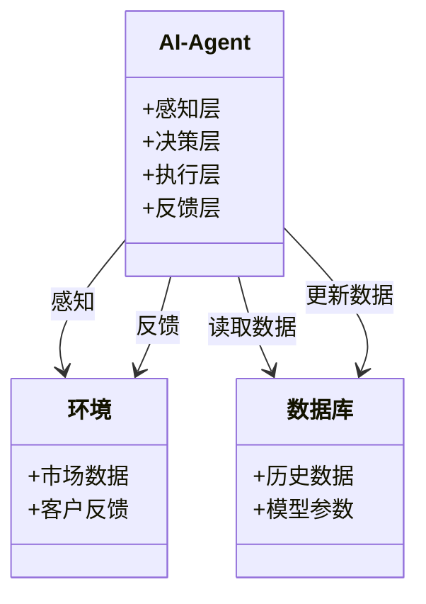
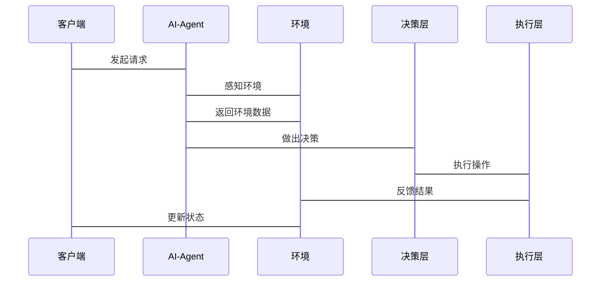

                 


# 企业AI Agent的快速适应框架：应对瞬息万变的市场环境

> 关键词：企业AI Agent，快速适应框架，市场环境，动态适应，AI算法，系统架构，实时反馈

> 摘要：本文探讨了企业AI Agent的快速适应框架，分析了其在应对瞬息万变的市场环境中的作用。通过算法和系统架构的优化，企业可以实现动态适应，提升竞争力。

---

## 第1章: 企业AI Agent的背景与概念

### 1.1 企业AI Agent的基本概念

#### 1.1.1 AI Agent的定义与特征

AI Agent（人工智能代理）是能够感知环境、自主决策并执行任务的智能实体。它具备以下特征：

- **自主性**：无需外部干预，自主决策。
- **反应性**：能实时感知环境变化并做出反应。
- **目标导向**：以实现特定目标为导向。
- **学习能力**：通过经验改进性能。

#### 1.1.2 企业AI Agent的核心属性

- **模块化**：功能模块化设计，便于扩展。
- **实时性**：实时处理数据和任务。
- **可定制性**：根据企业需求定制功能。

#### 1.1.3 企业AI Agent的边界与外延

企业AI Agent的边界包括企业内部系统和外部环境的接口。外延则涵盖从基础AI到高级AI Agent的演变。

### 1.2 企业AI Agent的演进历程

#### 1.2.1 从传统AI到AI Agent的演进

传统AI注重规则和逻辑推理，AI Agent则强调动态适应和自主决策。

#### 1.2.2 AI Agent在企业中的发展史

从简单的自动化工具到复杂的智能系统，AI Agent在企业中的应用日益广泛。

#### 1.2.3 当前AI Agent的技术趋势

智能化、实时化、个性化是当前AI Agent发展的主要趋势。

### 1.3 企业AI Agent的应用场景

#### 1.3.1 客户服务与支持

AI Agent可以提供24/7的客户支持，提升客户满意度。

#### 1.3.2 供应链管理与优化

AI Agent能够实时监控供应链，优化库存管理和物流配送。

#### 1.3.3 市场分析与预测

AI Agent通过分析市场数据，提供精准的市场趋势预测。

#### 1.3.4 内部流程自动化

AI Agent可以自动化处理企业内部的重复性任务，提高效率。

---

## 第2章: 快速适应框架的核心概念

### 2.1 快速适应框架的定义

#### 2.1.1 框架的基本组成

包括感知层、决策层、执行层和反馈层。

#### 2.1.2 框架的核心目标

实现企业AI Agent的快速响应和动态适应。

#### 2.1.3 框架的适用范围

适用于需要快速应对市场变化的企业场景。

### 2.2 快速适应框架的原理

#### 2.2.1 感知与反馈机制

AI Agent通过传感器或API实时感知环境变化，并通过反馈机制调整行为。

#### 2.2.2 自适应学习算法

使用机器学习算法，AI Agent能够根据新数据不断优化模型。

#### 2.2.3 动态调整策略

AI Agent可以根据环境变化动态调整策略，确保目标的实现。

### 2.3 快速适应框架与企业AI Agent的结合

#### 2.3.1 框架在AI Agent中的作用

提供结构化的框架，确保AI Agent的高效运行。

#### 2.3.2 框架如何实现快速适应

通过实时数据处理和动态调整策略，确保AI Agent能够快速适应环境变化。

#### 2.3.3 框架的灵活性与可扩展性

框架设计注重灵活性和可扩展性，便于企业根据需求进行定制和扩展。

---

## 第3章: 企业AI Agent的快速适应算法原理

### 3.1 快速适应算法的核心原理

#### 3.1.1 感知器模型

感知器模型用于处理输入数据，生成中间表示。

$$ y = f(x) $$

#### 3.1.2 决策器模型

决策器模型基于中间表示，做出决策。

$$ y = \max(f(x_i)) $$

#### 3.1.3 执行器模型

执行器模型根据决策结果，执行具体操作。

$$ y = \sum x_i $$

### 3.2 快速适应算法的数学模型

#### 3.2.1 感知器模型的数学表达

感知器模型通过线性组合和非线性激活函数，生成中间表示。

$$ z = Wx + b $$

$$ y = f(z) $$

#### 3.2.2 决策器模型的数学表达

决策器模型通过 softmax 函数，生成概率分布。

$$ y = \text{softmax}(Wz + b) $$

#### 3.2.3 执行器模型的数学表达

执行器模型通过 argmax 函数，选择最大概率的动作。

$$ a = \arg\max(y) $$

### 3.3 快速适应算法的实现流程

#### 3.3.1 数据采集与预处理

通过传感器或API采集数据，并进行清洗和标准化处理。

#### 3.3.2 模型训练与优化

使用机器学习算法训练感知器和决策器模型，并通过反向传播优化参数。

#### 3.3.3 模型部署与监控

将训练好的模型部署到生产环境，并实时监控性能。

---

## 第4章: 企业AI Agent的系统架构设计

### 4.1 问题场景介绍

企业在快速变化的市场环境中，需要快速响应客户需求和市场趋势。

### 4.2 项目介绍

本项目旨在构建一个能够快速适应市场变化的企业AI Agent系统。

### 4.3 系统功能设计

#### 4.3.1 领域模型设计

使用 Mermaid 绘制领域模型类图，展示系统各模块的交互关系。



#### 4.3.2 系统架构设计

使用 Mermaid 绘制系统架构图，展示系统的整体结构。


#### 4.3.3 系统接口设计

系统接口包括感知接口、决策接口、执行接口和反馈接口。

#### 4.3.4 系统交互设计

使用 Mermaid 绘制系统交互序列图，展示系统各模块的交互流程。



---

## 第5章: 项目实战

### 5.1 环境安装与配置

安装Python、TensorFlow、Keras等依赖库，并配置开发环境。

### 5.2 系统核心实现

实现感知器模型、决策器模型和执行器模型的代码。

#### 5.2.1 感知器模型实现

```python
class Perceptor:
    def __init__(self, input_dim, output_dim):
        self.W = np.random.randn(input_dim, output_dim)
        self.b = np.random.randn(output_dim)
    
    def forward(self, x):
        z = np.dot(x, self.W) + self.b
        return z
```

#### 5.2.2 决策器模型实现

```python
class DecisionMaker:
    def __init__(self, input_dim, output_dim):
        self.W = np.random.randn(input_dim, output_dim)
        self.b = np.random.randn(output_dim)
    
    def forward(self, z):
        y = softmax(np.dot(z, self.W) + self.b)
        return y
```

#### 5.2.3 执行器模型实现

```python
class Actuator:
    def __init__(self):
        pass
    
    def execute(self, y):
        action = np.argmax(y)
        return action
```

### 5.3 案例分析与代码解读

通过具体案例分析，展示AI Agent在实际场景中的应用，并解读代码实现。

### 5.4 项目小结

总结项目实现的关键点和经验教训，为后续优化提供参考。

---

## 第6章: 最佳实践与小结

### 6.1 最佳实践

- **数据质量**：确保数据的准确性和及时性。
- **模型优化**：定期更新模型，保持其适应性。
- **系统监控**：实时监控系统性能，及时发现和解决问题。

### 6.2 小结

本文详细探讨了企业AI Agent的快速适应框架，分析了其在应对瞬息万变的市场环境中的重要作用。

---

## 第7章: 附录

### 7.1 术语表

列出本文中涉及的关键术语及其定义。

### 7.2 工具推荐

推荐相关开发工具和资源。

### 7.3 参考文献

列出本文参考的文献和资料。

---

作者：AI天才研究院 & 禅与计算机程序设计艺术

