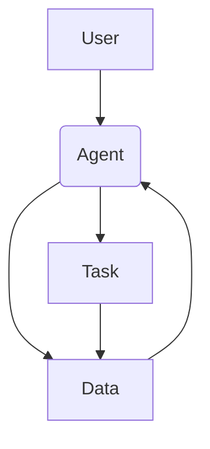
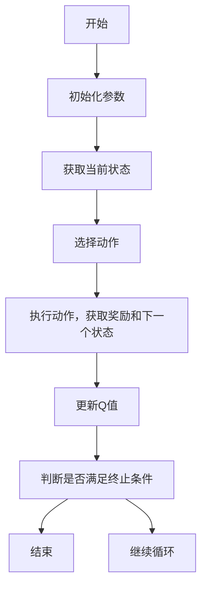
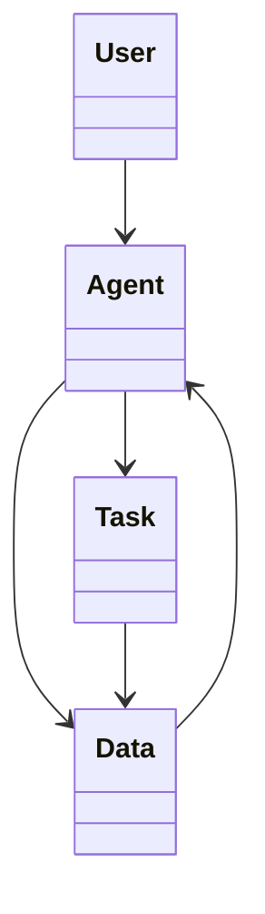

                 

# 企业AI Agent的性能优化策略

## 关键词：企业AI Agent，性能优化，算法原理，系统架构，强化学习，数学模型

## 摘要：企业AI Agent的性能优化是实现高效自动化和智能决策的关键。本文从AI Agent的基本概念出发，结合实际应用场景，系统地分析了其性能优化的核心策略，包括算法原理、系统架构设计、优化方法和实战案例。通过详细的技术分析和实例解读，为读者提供了全面的优化思路和实践指导。

---

# 第一部分: 企业AI Agent的性能优化背景与基础

## 第1章: 企业AI Agent概述

### 1.1 什么是AI Agent

#### 1.1.1 AI Agent的定义与核心概念

AI Agent（人工智能代理）是指能够感知环境、自主决策并执行任务的智能实体。它通过传感器获取信息，利用算法进行分析和推理，最终采取行动以实现特定目标。AI Agent的核心在于其自主性、反应性和主动性，能够适应动态变化的环境。

在企业场景中，AI Agent通常用于自动化流程、客户服务、数据分析等领域。例如，一个AI Agent可以自动处理客户的咨询请求，或者优化企业的供应链管理。

#### 1.1.2 AI Agent的类型与特点

AI Agent可以根据功能和应用场景分为多种类型，常见的包括：

- **简单反射型Agent**：基于固定的规则执行任务，适用于环境简单、任务明确的场景。
- **基于模型的反射型Agent**：维护环境模型，能够根据模型进行推理和决策。
- **目标驱动型Agent**：基于目标进行规划和行动，适用于复杂任务。
- **效用驱动型Agent**：通过最大化效用函数来优化决策。

#### 1.1.3 企业AI Agent的独特性

企业AI Agent相较于通用AI Agent，具有以下独特性：

1. **目标明确**：企业AI Agent通常服务于特定的商业目标，如提高效率、降低成本。
2. **数据驱动**：依赖于企业内部的数据，能够进行深度学习和优化。
3. **高可用性**：需要在复杂环境中稳定运行，支持7×24小时工作。
4. **可扩展性**：能够处理大规模数据和复杂任务。

### 1.2 企业AI Agent的应用场景

#### 1.2.1 企业内部流程自动化

AI Agent可以用于自动化处理企业内部的流程，如审批流程、订单处理等。例如，一个AI Agent可以自动审核员工提交的差旅报销单，并将其归档到数据库中。

#### 1.2.2 客户服务与支持

在客户服务领域，AI Agent可以作为智能客服，通过自然语言处理（NLP）技术理解和解决客户的问题。例如，当客户咨询产品信息时，AI Agent可以通过对话生成技术提供准确的答案。

#### 1.2.3 数据分析与决策支持

AI Agent可以分析企业的数据，提供决策支持。例如，AI Agent可以通过分析销售数据，预测市场需求，并为企业制定库存管理策略。

### 1.3 企业AI Agent的性能优化需求

#### 1.3.1 性能优化的核心目标

企业AI Agent的性能优化需要关注以下方面：

1. **响应速度**：在处理客户请求时，AI Agent需要快速响应，以提升用户体验。
2. **准确性**：决策的准确性直接影响企业的利益，因此优化算法以提高准确性是关键。
3. **资源利用率**：优化AI Agent的资源利用率，降低计算成本。
4. **可扩展性**：确保AI Agent能够处理大规模数据和复杂任务。

#### 1.3.2 优化的必要性与挑战

优化的必要性主要体现在提升效率、降低成本和提高客户满意度。然而，优化也面临诸多挑战，如复杂的环境、多目标冲突、动态变化等。

#### 1.3.3 优化策略的多样性

企业AI Agent的性能优化需要结合具体应用场景，采用多样化的策略，如算法优化、架构优化、数据优化等。

---

## 第2章: 企业AI Agent的核心概念与联系

### 2.1 核心概念原理

#### 2.1.1 AI Agent的基本原理

AI Agent的核心原理包括感知、决策和行动三个环节。感知是通过传感器获取环境信息，决策是基于算法进行分析和推理，行动是通过执行器采取具体行动。

#### 2.1.2 企业AI Agent的系统架构

企业AI Agent的系统架构通常包括以下部分：

1. **感知层**：负责获取环境信息，如客户咨询、订单数据等。
2. **决策层**：基于感知信息进行分析和决策，通常涉及机器学习算法。
3. **执行层**：根据决策结果执行具体操作，如发送邮件、更新数据库等。

#### 2.1.3 多智能体系统与单智能体系统的区别

多智能体系统（MAS）由多个相互作用的智能体组成，而单智能体系统（SIS）仅包含一个智能体。多智能体系统适用于复杂的分布式环境，而单智能体系统适用于简单或集中化的环境。

### 2.2 核心概念属性特征对比

以下是一个对比表格，展示了企业AI Agent与通用AI Agent的核心属性对比：

| **属性**        | **企业AI Agent**                              | **通用AI Agent**                              |
|------------------|---------------------------------------------|---------------------------------------------|
| **目标**         | 提高企业效率、降低成本                       | 提供通用智能服务                             |
| **数据来源**     | 企业内部数据（如CRM、ERP）                 | 多样化的数据源                              |
| **决策复杂度**   | 较高，涉及商业逻辑和策略                   | 较低，主要处理简单任务                       |
| **可扩展性**     | 高，支持大规模数据处理                     | 中，适用于特定场景                           |
| **响应时间**     | 快，需要实时处理客户请求                   | 较慢，适用于非实时场景                       |

### 2.3 ER实体关系图

以下是一个简单的ER图，展示了企业AI Agent的核心实体关系：

---

## 第3章: 企业AI Agent的算法原理

### 3.1 基础算法概述

#### 3.1.1 强化学习算法

强化学习是一种通过试错机制优化决策的算法。AI Agent通过与环境交互，不断调整策略以最大化累积奖励。

#### 3.1.2 贪心算法

贪心算法是一种在每一步选择当前状态下最优解的算法。适用于简单任务，但可能无法全局最优。

#### 3.1.3 遗传算法

遗传算法是一种基于生物进化原理的优化算法，通过选择、交叉和变异操作生成新的解。

### 3.2 优化算法的数学模型

#### 3.2.1 强化学习的数学公式

强化学习的核心公式是Q-learning算法：

$$ Q(s, a) = r + \gamma \max Q(s', a') $$

其中，$s$是当前状态，$a$是动作，$r$是奖励，$\gamma$是折扣因子，$s'$是下一个状态。

#### 3.2.2 贪心算法的实现逻辑

贪心算法的实现逻辑如下：

1. 初始化当前状态$s$。
2. 在当前状态下选择最优动作$a$。
3. 执行动作$a$，转移到下一个状态$s'$。
4. 重复步骤2，直到达到终止状态。

#### 3.2.3 遗传算法的步骤分解

遗传算法的步骤如下：

1. 初始化种群。
2. 计算适应度。
3. 选择父代。
4. 交叉和变异生成子代。
5. 重复步骤2-4，直到满足终止条件。

### 3.3 算法流程图

以下是一个强化学习算法的流程图：

---

## 第4章: 企业AI Agent的系统分析与架构设计

### 4.1 问题场景介绍

#### 4.1.1 企业AI Agent的应用场景

企业AI Agent的应用场景包括客户服务、数据分析、流程自动化等。例如，在客户服务中，AI Agent需要实时响应客户的问题，并提供准确的答案。

#### 4.1.2 系统需要解决的核心问题

系统需要解决的核心问题包括：

1. **高响应速度**：确保在客户咨询时能够快速回复。
2. **高准确性**：提供准确的答案，避免错误信息。
3. **高可用性**：支持7×24小时运行，确保系统稳定。

#### 4.1.3 系统设计的目标与约束

系统设计的目标是实现高效、准确的客户服务。约束包括：数据安全、系统稳定性、可扩展性等。

### 4.2 系统功能设计

#### 4.2.1 领域模型

以下是一个客户服务领域的领域模型图：

---

### 总结

通过以上分析，我们全面探讨了企业AI Agent的性能优化策略，从基础概念到算法原理，再到系统架构设计，提供了详细的分析和指导。希望这篇文章能够为读者在优化企业AI Agent性能方面提供有价值的参考和实践指导。

--- 

**作者：AI天才研究院/AI Genius Institute & 禅与计算机程序设计艺术 /Zen And The Art of Computer Programming**

