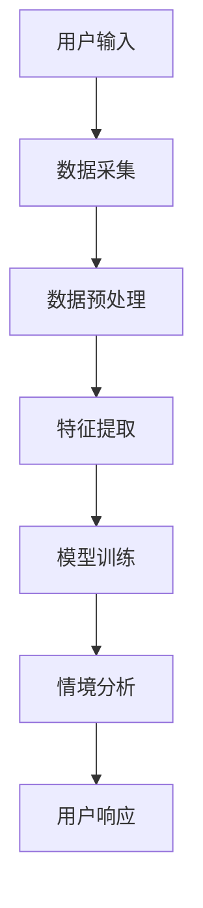
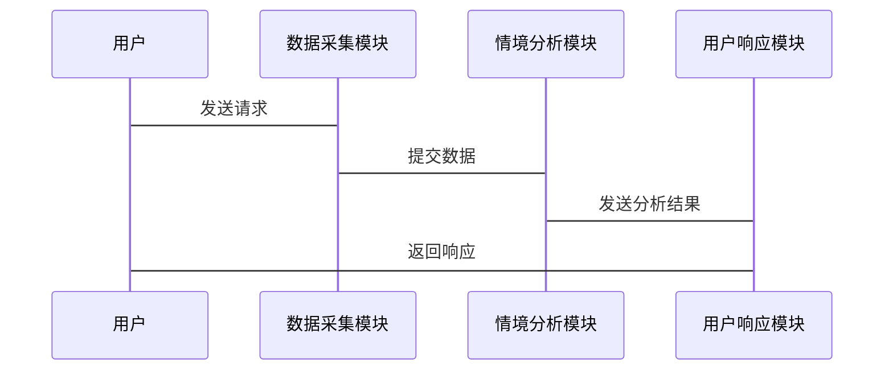

                 


# 企业AI Agent的情境感知能力：提升用户体验

> 关键词：企业AI Agent、情境感知、用户体验、自然语言处理、用户行为分析、机器学习

> 摘要：企业AI Agent的情境感知能力通过理解和分析用户行为、环境数据和语境信息，提升用户体验。本文深入探讨情境感知的核心概念、算法原理、系统架构设计以及项目实战，帮助读者全面理解并有效应用。

---

# 第1章: 企业AI Agent与情境感知能力概述

## 1.1 企业AI Agent的定义与背景

### 1.1.1 AI Agent的基本概念

AI Agent（人工智能代理）是能够感知环境并采取行动以实现目标的智能体。企业AI Agent专注于企业场景，通过自动化任务和提供决策支持，优化企业运营。

### 1.1.2 企业AI Agent的应用场景

- **客户支持**: 自动处理客户查询和问题。
- **任务自动化**: 自动化重复性任务，如数据录入。
- **决策支持**: 基于数据分析提供业务决策建议。

### 1.1.3 情境感知能力的定义与重要性

情境感知能力是指AI Agent能够理解当前情境，包括用户行为、环境数据和语境信息。这种能力使AI Agent能够提供更精准和个性化的服务，显著提升用户体验。

---

## 1.2 企业AI Agent的核心功能

### 1.2.1 自然语言处理

AI Agent通过NLP技术理解用户输入的自然语言，识别意图和情感。

### 1.2.2 用户行为分析

分析用户的交互行为，如点击、输入频率，以理解用户需求和偏好。

### 1.2.3 环境数据采集与分析

收集环境数据，如时间、地点，结合用户行为进行情境分析。

---

## 1.3 情境感知能力的实现原理

### 1.3.1 数据采集与处理

AI Agent收集用户输入、环境数据和历史行为数据，进行预处理和特征提取。

### 1.3.2 情境分析与推理

利用机器学习模型分析数据，理解情境并预测用户意图。

### 1.3.3 用户意图预测与响应

基于情境分析结果，生成个性化响应，提供精准服务。

---

## 1.4 本章小结

本章介绍了企业AI Agent的定义、应用场景和核心功能，重点强调了情境感知能力的重要性及其实现原理。

---

# 第2章: 情境感知能力的核心概念与联系

## 2.1 情境感知能力的核心要素

### 2.1.1 用户行为数据

包括用户的输入、点击和操作频率，反映用户的互动模式。

### 2.1.2 环境数据

如时间、地点和设备信息，影响用户的使用情境。

### 2.1.3 语境信息

包括上下文和对话历史，帮助理解用户的意图。

---

## 2.2 情境感知能力与相关技术的联系

### 2.2.1 自然语言处理

用于理解和生成自然语言，提升用户交互体验。

### 2.2.2 用户行为分析

通过分析用户行为数据，优化AI Agent的响应策略。

### 2.2.3 机器学习

利用机器学习模型进行情境分析和用户意图预测。

---

## 2.3 情境感知能力的实现框架

### 2.3.1 数据流模型

展示数据从采集到处理的流程。



### 2.3.2 知识图谱构建

构建知识图谱，表示实体及其关系。

### 2.3.3 情境推理算法

使用图神经网络进行情境推理。

---

## 2.4 本章小结

本章探讨了情境感知的核心要素和相关技术，展示了实现框架和数据流模型。

---

# 第3章: 情境感知能力的算法原理

## 3.1 情境感知算法概述

### 3.1.1 基于规则的算法

通过预定义规则匹配特定情境。

### 3.1.2 基于统计的算法

使用统计方法分析数据，识别模式。

### 3.1.3 基于深度学习的算法

利用深度学习模型进行情境分析。

---

## 3.2 情境分析的流程

### 3.2.1 数据预处理

清洗数据，提取特征。

### 3.2.2 特征提取

利用NLP技术提取语义特征。

### 3.2.3 模型训练与推理

训练模型并进行情境推理。

---

## 3.3 深度学习模型在情境感知中的应用

### 3.3.1 Transformer模型

用于自然语言处理，提升语境理解能力。

### 3.3.2 图神经网络

用于情境推理，分析实体关系。

### 3.3.3 混合模型

结合多种模型的优势，提升性能。

---

## 3.4 本章小结

本章详细讲解了情境感知的算法原理，包括基于规则、统计和深度学习的方法。

---

# 第4章: 情境感知能力的系统架构设计

## 4.1 系统功能模块设计

### 4.1.1 数据采集模块

负责收集用户输入和环境数据。

### 4.1.2 情境分析模块

进行情境分析和用户意图预测。

### 4.1.3 用户响应模块

生成个性化响应并反馈给用户。

---

## 4.2 系统架构设计

### 4.2.1 分层架构

将系统分为数据层、业务逻辑层和 presentation 层。

### 4.2.2 微服务架构

各模块独立运行，便于扩展和维护。

### 4.2.3 可扩展性设计

设计模块化接口，支持功能扩展。

---

## 4.3 系统接口设计

### 4.3.1 数据接口

定义数据格式和传输协议。

### 4.3.2 用户接口

设计友好的用户交互界面。

### 4.3.3 第三方服务接口

集成第三方服务，如天气API。

---

## 4.4 系统交互流程



---

## 4.5 本章小结

本章设计了系统架构，展示了功能模块、接口和交互流程。

---

# 第5章: 企业AI Agent的情境感知能力项目实战

## 5.1 项目背景与目标

### 5.1.1 项目背景

开发一个企业级AI Agent，提升用户体验。

### 5.1.2 项目目标

实现情境感知能力，优化用户交互。

### 5.1.3 项目范围

包括数据采集、情境分析和用户响应模块。

---

## 5.2 系统核心实现

### 5.2.1 数据采集模块实现

使用Flask框架创建API，收集用户输入和环境数据。

```python
from flask import Flask
import json

app = Flask(__name__)

@app.route('/api/data', methods=['POST'])
def receive_data():
    data = json.loads(request.get_data())
    # 处理数据
    return jsonify({'status': 'success'})
```

### 5.2.2 情境分析模块实现

利用预训练的Transformer模型进行语义理解。

### 5.2.3 用户响应模块实现

根据分析结果生成个性化响应。

---

## 5.3 项目代码实现

### 5.3.1 环境安装与配置

安装Python、Flask和深度学习框架。

### 5.3.2 核心代码实现

实现数据采集、情境分析和响应生成。

### 5.3.3 代码解读与分析

详细解释代码的功能和实现细节。

---

## 5.4 项目测试与优化

### 5.4.1 功能测试

验证各模块的功能是否正常。

### 5.4.2 性能优化

优化数据处理和模型推理效率。

### 5.4.3 用户反馈与改进

收集用户反馈，持续改进系统。

---

## 5.5 本章小结

本章通过实际项目展示了情境感知能力的实现，包括环境安装、代码实现和测试优化。

---

# 第6章: 情境感知能力的最佳实践与未来展望

## 6.1 最佳实践

### 6.1.1 数据质量的重要性

确保数据准确性和完整性。

### 6.1.2 模型选择与优化

根据需求选择合适的模型并持续优化。

### 6.1.3 用户隐私保护

遵守数据隐私法规，保护用户隐私。

---

## 6.2 情境感知能力的注意事项

### 6.2.1 数据安全

防止数据泄露和滥用。

### 6.2.2 模型可解释性

确保模型决策可追溯和解释。

### 6.2.3 用户体验优化

持续关注用户体验，进行功能迭代。

---

## 6.3 未来发展趋势

### 6.3.1 多模态融合

结合文本、语音和视觉信息，提升感知能力。

### 6.3.2 智能化升级

利用更先进的AI技术，如GPT-4，提升系统智能性。

### 6.3.3 个性化服务

提供更个性化的用户体验，满足不同用户需求。

---

## 6.4 本章小结

本章总结了情境感知能力的最佳实践，并展望了未来的发展趋势。

---

# 作者：AI天才研究院/AI Genius Institute & 禅与计算机程序设计艺术 /Zen And The Art of Computer Programming

---

以上是完整的目录和文章内容，涵盖企业AI Agent的情境感知能力各个方面，帮助读者深入了解并有效应用。

