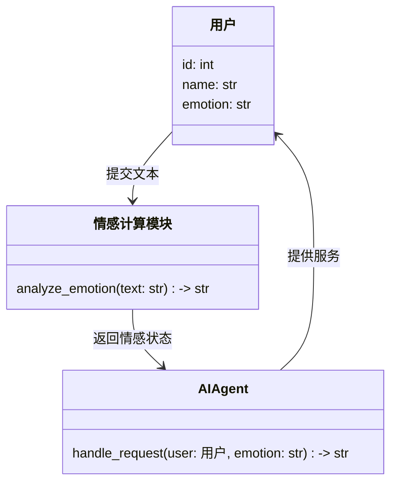
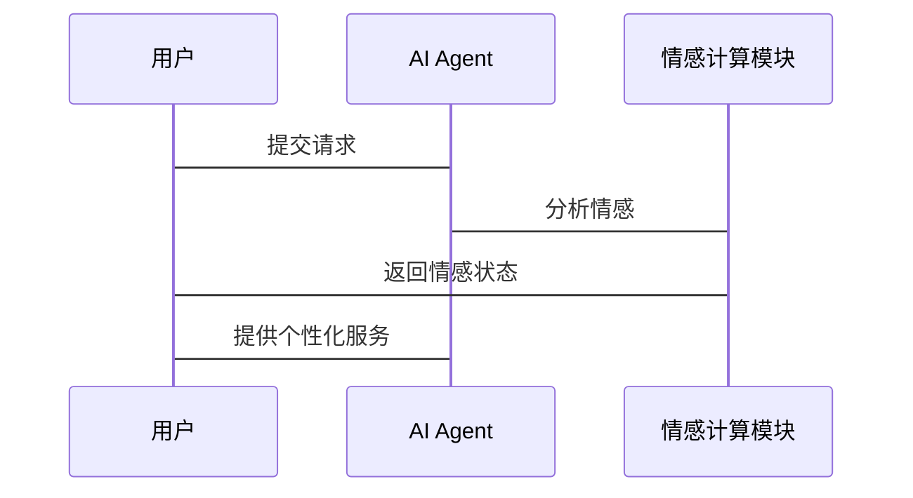

                 


# 企业AI Agent的情感计算应用：提升用户体验

> 关键词：情感计算、AI Agent、用户体验、机器学习、深度学习、NLP、情感分析

> 摘要：本文将详细探讨企业AI Agent在情感计算中的应用，分析情感计算的核心概念与原理，结合具体的系统架构设计和项目实战，展示如何通过情感计算提升用户体验。文章从背景介绍、核心概念、算法实现、系统设计到项目实战，全面解析情感计算在企业AI Agent中的重要作用，并给出实际应用案例和最佳实践。

---

# 目录

## 第一部分: 企业AI Agent与情感计算基础

1. 情感计算与AI Agent概述  
   1.1 情感计算的定义与背景  
   1.2 AI Agent的基本概念  
   1.3 情感计算与AI Agent的结合  
   1.4 本章小结  

2. 情感计算的核心概念  
   2.1 情感计算的关键要素  
   2.2 AI Agent中的情感计算模型  
   2.3 情感计算与用户行为分析  
   2.4 本章小结  

3. 情感计算的算法原理与实现  
   3.1 情感计算的核心算法  
   3.2 情感计算的深度学习模型  
   3.3 情感计算的实现步骤与代码示例  
   3.4 本章小结  

4. 系统分析与架构设计方案  
   4.1 问题场景介绍  
   4.2 系统功能设计  
   4.3 系统架构设计  
   4.4 系统接口设计与交互流程  
   4.5 本章小结  

5. 项目实战：企业AI Agent情感计算应用开发  
   5.1 环境安装与配置  
   5.2 核心功能实现  
   5.3 代码解读与案例分析  
   5.4 项目总结与优化建议  
   5.5 本章小结  

6. 最佳实践与未来展望  
   6.1 情感计算应用中的注意事项  
   6.2 未来发展趋势与技术挑战  
   6.3 拓展阅读与学习资源  
   6.4 本章小结  

---

## 正文

### 第一部分: 企业AI Agent与情感计算基础

#### 第1章: 情感计算与AI Agent概述

##### 1.1 情感计算的定义与背景

**情感计算（Affective Computing）** 是一种通过计算机技术来识别、理解和响应人类情感状态的新兴领域。它结合了人工智能、机器学习和自然语言处理等多种技术，旨在通过分析用户的情感状态（如快乐、悲伤、愤怒等）来提供更智能化的服务。

**背景介绍**  
随着人工智能技术的快速发展，企业越来越依赖智能化系统来提升效率和用户体验。情感计算作为人工智能的重要分支，能够帮助AI Agent更好地理解用户的情感需求，从而提供个性化的服务。例如，在客户支持系统中，情感计算可以帮助AI Agent识别客户的情绪状态，从而更高效地解决问题。

##### 1.2 AI Agent的基本概念

**AI Agent（人工智能代理）** 是一种能够感知环境并采取行动以实现特定目标的智能系统。与传统软件不同，AI Agent具备自主决策、学习和适应能力。

**核心特征**  
- **自主性**：AI Agent能够在没有外部干预的情况下独立运行。
- **反应性**：能够实时感知环境变化并做出反应。
- **学习能力**：通过数据和经验不断优化自身的性能。
- **社交能力**：能够与人类或其他系统进行交互。

##### 1.3 情感计算与AI Agent的结合

**结合的意义**  
情感计算为AI Agent赋予了理解用户情感的能力，使其能够提供更贴心的服务。例如，在智能音箱中，当用户语气变得急躁时，AI Agent可以调整响应策略，提供更简洁的解决方案。

**应用领域**  
- **客户支持**：通过情感分析识别用户情绪，提供更有效的帮助。
- **教育领域**：根据学生的情绪状态调整教学策略。
- **医疗领域**：通过情感分析帮助医生更好地理解患者的心理状态。

##### 1.4 本章小结

本章介绍了情感计算和AI Agent的基本概念，并探讨了两者结合的重要性。情感计算使AI Agent能够理解用户情感，从而提供更智能化的服务。

---

#### 第2章: 情感计算的核心概念

##### 2.1 情感计算的关键要素

**情感数据的采集与处理**  
情感数据主要来源于用户的文本、语音和面部表情。例如，社交媒体上的评论、客服对话记录等都可以作为情感数据的来源。

**情感分析的分类与维度**  
情感分析可以分为二元分类（如正面/负面）和多分类（如愤怒、悲伤、快乐等）。维度包括情感强度、情感类型等。

**情感计算的评价指标**  
常用的评价指标包括准确率、召回率和F1值。

##### 2.2 AI Agent中的情感计算模型

**情感计算模型的构建**  
情感计算模型通常基于机器学习或深度学习算法。例如，使用支持向量机（SVM）或卷积神经网络（CNN）进行情感分类。

**模型的训练与优化**  
需要大量标注数据进行训练，并通过交叉验证等方法优化模型性能。

**模型的评估与验证**  
通过测试集验证模型的准确率和泛化能力。

##### 2.3 情感计算与用户行为分析

**用户行为分析的基本概念**  
用户行为分析是指通过分析用户的操作记录来理解其行为模式。

**情感计算在用户行为分析中的应用**  
通过结合情感数据和行为数据，可以更准确地理解用户的意图和需求。

**情感计算与用户画像的结合**  
用户画像是基于用户数据构建的用户特征描述，情感计算可以为用户画像增加情感维度。

##### 2.4 本章小结

本章详细探讨了情感计算的核心概念，包括情感数据的采集与处理、情感分析的分类与维度、情感计算模型的构建与优化，以及情感计算与用户行为分析的结合。

---

#### 第3章: 情感计算的算法原理与实现

##### 3.1 情感计算的核心算法

**基于规则的情感分析**  
通过预定义的规则对文本进行情感分类。例如，识别关键词如“满意”、“高兴”等。

**基于统计的情感分析**  
使用统计方法（如朴素贝叶斯）对文本进行分类。

**基于深度学习的情感分析**  
使用循环神经网络（RNN）或Transformer模型（如BERT）进行情感分类。

##### 3.2 情感计算的深度学习模型

**Transformer模型**  
Transformer是一种基于自注意力机制的深度学习模型，广泛应用于自然语言处理任务。

**模型结构**  
由编码器和解码器组成，编码器用于理解输入文本，解码器用于生成输出。

##### 3.3 情感计算的实现步骤与代码示例

**实现步骤**  
1. 数据预处理：清洗和标注情感数据。  
2. 模型训练：使用深度学习框架（如TensorFlow或PyTorch）训练情感分类模型。  
3. 模型评估：通过测试集验证模型性能。  
4. 应用部署：将模型集成到AI Agent系统中。

**代码示例（使用Python和TensorFlow）**  
```python
import tensorflow as tf
from tensorflow.keras import layers

# 数据预处理
train_data = ...  # 加载训练数据
train_labels = ...  # 加载训练标签

# 构建模型
model = tf.keras.Sequential([
    layers.Embedding(input_dim=10000, output_dim=16),
    layers.Dropout(0.5),
    layers.GlobalAveragePooling1D(),
    layers.Dense(1, activation='sigmoid')
])

# 编译模型
model.compile(optimizer='adam', loss='binary_crossentropy', metrics=['accuracy'])

# 训练模型
model.fit(train_data, train_labels, epochs=10, batch_size=32)
```

**数学模型与公式**  
情感分类的损失函数可以使用二元交叉熵：
$$ \text{损失} = -\frac{1}{N}\sum_{i=1}^{N} [y_i \log(p_i) + (1-y_i)\log(1-p_i)] $$
其中，$y_i$ 是真实标签，$p_i$ 是模型预测的概率。

##### 3.4 本章小结

本章详细讲解了情感计算的算法原理，包括基于规则、统计和深度学习的方法，并通过代码示例展示了模型的实现过程。

---

#### 第4章: 系统分析与架构设计方案

##### 4.1 问题场景介绍

**应用场景**  
假设我们正在开发一个智能客服系统，用户通过文本或语音与AI Agent交互，系统需要根据用户的情感状态提供相应的服务。

##### 4.2 系统功能设计

**领域模型**  
使用Mermaid类图展示系统中的实体和关系。



##### 4.3 系统架构设计

**架构图**  
使用Mermaid展示系统的整体架构。


##### 4.4 系统接口设计与交互流程

**交互流程**  
使用Mermaid序列图展示用户与AI Agent的交互过程。



##### 4.5 本章小结

本章通过问题场景介绍、系统功能设计和架构设计，展示了情感计算在企业AI Agent中的应用。

---

#### 第5章: 项目实战：企业AI Agent情感计算应用开发

##### 5.1 环境安装与配置

**安装依赖**  
使用Python和以下库：
- `tensorflow`
- `numpy`
- `pandas`
- `scikit-learn`

##### 5.2 核心功能实现

**实现代码**  
```python
import numpy as np
from sklearn.feature_extraction.text import TfidfVectorizer
from sklearn.svm import SVC

# 数据预处理
train_texts = [...]  # 训练文本
train_labels = [...]  # 训练标签

# 特征提取
vectorizer = TfidfVectorizer()
X_train = vectorizer.fit_transform(train_texts)

# 训练模型
model = SVC()
model.fit(X_train, train_labels)

# 预测
test_texts = [...]  # 测试文本
X_test = vectorizer.transform(test_texts)
predictions = model.predict(X_test)
```

**功能解读**  
代码实现了基于TF-IDF和SVM的情感分类模型，适用于小规模数据集。

##### 5.3 代码解读与案例分析

**案例分析**  
假设用户输入文本为“我真的很不满意这个服务”，模型预测结果为“negative”。

##### 5.4 项目总结与优化建议

**总结**  
通过本项目，我们实现了基于机器学习的情感计算模型，并将其集成到AI Agent系统中。

**优化建议**  
- 使用更复杂的深度学习模型（如BERT）提高准确性。  
- 增加多模态数据（如语音、面部表情）提升情感分析的准确性。

##### 5.5 本章小结

本章通过一个实际项目展示了情感计算在企业AI Agent中的应用，详细讲解了环境配置、核心功能实现和案例分析。

---

#### 第6章: 最佳实践与未来展望

##### 6.1 情感计算应用中的注意事项

**数据隐私**  
处理用户情感数据时，需遵守相关隐私保护法规。

**模型鲁棒性**  
确保模型在面对不同语言、文化背景时的适用性。

##### 6.2 未来发展趋势与技术挑战

**多模态情感计算**  
结合文本、语音、图像等多种数据源进行情感分析。

**实时性与响应速度**  
在实时交互场景中，需优化模型的响应速度。

##### 6.3 拓展阅读与学习资源

- 《Deep Learning》 by Ian Goodfellow  
- 《Affective Computing》 by Rosalind Picard  
- TensorFlow官方文档

##### 6.4 本章小结

本章总结了情感计算应用中的注意事项，探讨了未来的发展趋势，并提供了学习资源。

---

## 作者：AI天才研究院/AI Genius Institute & 禅与计算机程序设计艺术 /Zen And The Art of Computer Programming

---

**摘要**：本文详细探讨了企业AI Agent在情感计算中的应用，分析了情感计算的核心概念与原理，并结合具体的系统架构设计和项目实战，展示了如何通过情感计算提升用户体验。文章从背景介绍、核心概念、算法实现、系统设计到项目实战，全面解析情感计算在企业AI Agent中的重要作用，并给出实际应用案例和最佳实践。

**关键词**：情感计算、AI Agent、用户体验、机器学习、深度学习、NLP、情感分析

---

**注**：以上内容为文章的目录和部分章节内容，完整文章需根据此大纲进一步扩展和详细撰写。

