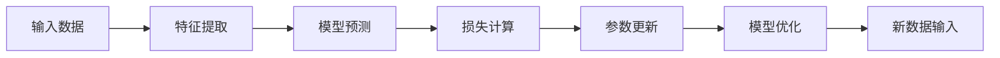
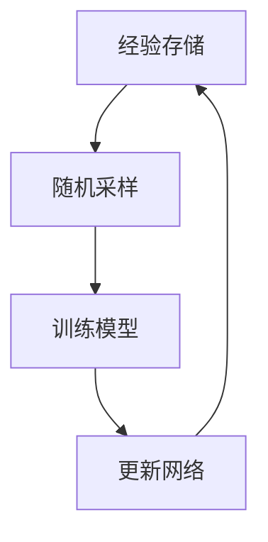
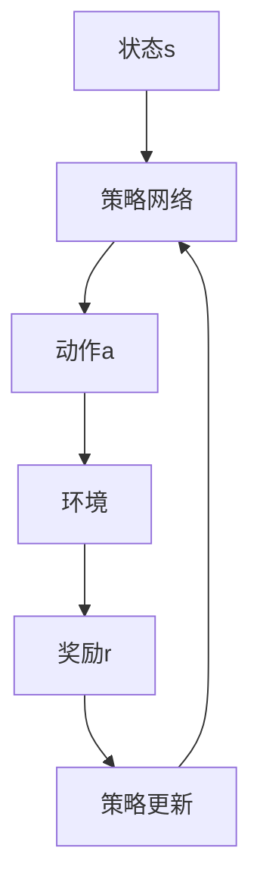
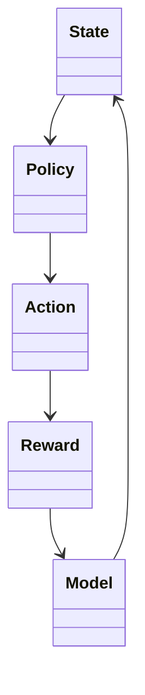
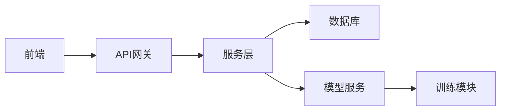
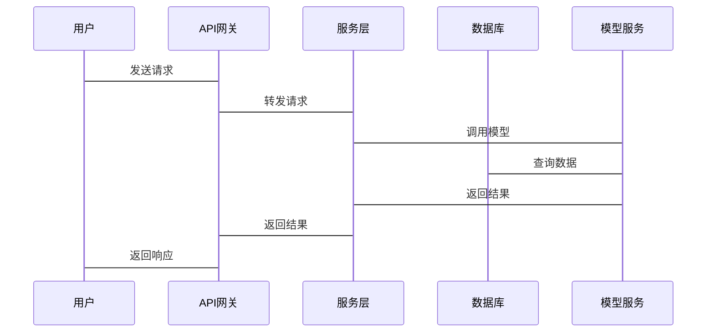

                 


# 企业AI Agent的持续学习与更新机制

> 关键词：AI Agent, 持续学习, 更新机制, 企业应用, 算法原理, 系统设计

> 摘要：本文系统探讨企业AI Agent的持续学习与更新机制，涵盖核心概念、算法原理、系统设计及项目实战，分析其在企业中的应用场景与价值，为技术实践提供深度指导。

---

# 第一部分: 企业AI Agent的持续学习与更新机制概述

## 第1章: AI Agent的基本概念与持续学习的重要性

### 1.1 AI Agent的定义与特点

#### 1.1.1 AI Agent的定义
AI Agent（人工智能代理）是能够感知环境、自主决策并执行任务的智能实体，具备主动性、目标导向性和适应性。在企业场景中，AI Agent常用于自动化流程优化、决策支持和智能客服等领域。

#### 1.1.2 AI Agent的核心特点
- **主动性**：无需外部干预，主动执行任务。
- **目标导向性**：基于目标优化行为。
- **适应性**：能根据环境变化调整策略。
- **可扩展性**：支持多种任务和复杂场景。

#### 1.1.3 企业AI Agent的应用场景
- **流程自动化**：优化企业运营流程。
- **决策支持**：辅助管理层做出决策。
- **智能客服**：提供个性化服务。
- **风险管理**：实时监控和预警。

### 1.2 持续学习的背景与问题背景

#### 1.2.1 AI Agent在企业中的应用挑战
- 数据动态变化：企业环境复杂多变，数据更新频繁。
- 任务多样性：需要处理多种任务。
- 环境不确定性：环境变化影响决策。

#### 1.2.2 持续学习的必要性
- 适应环境变化：及时更新模型应对新挑战。
- 提升性能：通过持续学习优化决策。
- 实时响应：快速适应新数据和任务。

#### 1.2.3 问题的边界与外延
- **边界**：限定于企业内部数据和任务。
- **外延**：涵盖AI Agent的全生命周期，包括学习、推理和执行。

---

## 第2章: 持续学习与更新机制的核心概念

### 2.1 持续学习的基本原理

#### 2.1.1 在线学习与批量学习的对比
| 对比维度 | 在线学习 | 批量学习 |
|----------|----------|----------|
| 数据使用 | 流式数据 | 批处理数据 |
| 训练效率 | 实时更新 | 周期性训练 |
| 资源消耗 | 较低 | 较高 |

#### 2.1.2 迁移学习的核心思想
- 利用已有知识快速适应新任务。
- 减少数据依赖，提升学习效率。

#### 2.1.3 知识蒸馏的实现方式
- 知识蒸馏：将大模型的知识迁移到小模型。
- 师生对抗训练：教师模型指导学生模型学习。

### 2.2 更新机制的关键要素

#### 2.2.1 参数更新策略
- **在线更新**：实时更新模型参数。
- **批量更新**：周期性批量更新。
- **混合更新**：结合在线和批量更新。

#### 2.2.2 模型版本控制
- 版本管理：记录每次更新的状态。
- 回滚机制：应对更新失败的情况。

#### 2.2.3 更新过程中的稳定性保障
- 停止条件：设定更新终止的条件。
- 监控指标：实时监控更新过程。

### 2.3 持续学习与更新机制的核心概念联系

#### 2.3.1 持续学习与更新机制的原理图


---

## 第3章: 持续学习与更新机制的算法原理

### 3.1 经验回放算法

#### 3.1.1 算法流程


#### 3.1.2 核心代码实现
```python
import random
import torch
import numpy as np

class ExperienceReplayBuffer:
    def __init__(self, capacity):
        self.capacity = capacity
        self.memory = []
    
    def push(self, transition):
        self.memory.append(transition)
        if len(self.memory) > self.capacity:
            self.memory.pop(0)
    
    def sample(self, batch_size):
        return random.sample(self.memory, batch_size)

# 示例网络训练
class DQN(nn.Module):
    def __init__(self, input_size, hidden_size, output_size):
        super(DQN, self).__init__()
        self.fc1 = nn.Linear(input_size, hidden_size)
        self.fc2 = nn.Linear(hidden_size, output_size)
    
    def forward(self, x):
        x = torch.relu(self.fc1(x))
        x = self.fc2(x)
        return x

# 训练过程
def train_replay(buffer, model, optimizer, criterion, batch_size):
    if len(buffer.memory) < batch_size:
        return
    transitions = buffer.sample(batch_size)
    inputs = torch.stack([torch.tensor(t.state) for t in transitions])
    targets = torch.stack([torch.tensor(t.target) for t in transitions])
    
    outputs = model(inputs)
    loss = criterion(outputs, targets)
    optimizer.zero_grad()
    loss.backward()
    optimizer.step()
```

#### 3.1.3 算法数学模型
$$
Q(s, a) = Q(s, a) + \alpha (r + \gamma \max Q(s', a') - Q(s, a))
$$

---

## 第4章: 基于策略梯度的持续学习

### 4.1 策略梯度算法原理

#### 4.1.1 算法流程


#### 4.1.2 核心代码实现
```python
import torch
import torch.nn as nn
import torch.optim as optim

class PolicyNetwork(nn.Module):
    def __init__(self, input_size, hidden_size, output_size):
        super(PolicyNetwork, self).__init__()
        self.fc1 = nn.Linear(input_size, hidden_size)
        self.fc2 = nn.Linear(hidden_size, output_size)
    
    def forward(self, x):
        x = torch.relu(self.fc1(x))
        x = torch.sigmoid(self.fc2(x))
        return x

# 策略梯度训练
def train_policy_gradient(policy, optimizer, env, episodes):
    for episode in range(episodes):
        state = env.reset()
        done = False
        while not done:
            action_probs = policy(torch.tensor(state))
            action = np.random.choice([0, 1], p=action_probs.detach().numpy()[0])
            next_state, reward, done, _ = env.step(action)
            optimizer.zero_grad()
            loss = -torch.log(action_probs) * reward
            loss.backward()
            optimizer.step()
```

#### 4.1.3 算法数学模型
$$
\nabla \theta = \frac{1}{N} \sum_{i=1}^N \nabla \log \pi_\theta(a_i|s_i) Q_\theta(s_i, a_i)
$$

---

## 第5章: 系统分析与架构设计方案

### 5.1 问题场景介绍

#### 5.1.1 企业AI Agent的应用场景
- **智能推荐系统**：个性化推荐。
- **自动化交易系统**：实时市场响应。
- **智能监控系统**：异常检测。

### 5.2 系统功能设计

#### 5.2.1 领域模型类图


#### 5.2.2 系统架构图


#### 5.2.3 接口设计
- 输入接口：接收环境状态。
- 输出接口：返回动作或决策。
- 监控接口：实时监控模型状态。

#### 5.2.4 系统交互序列图


---

## 第6章: 项目实战

### 6.1 环境安装

#### 6.1.1 安装Python和依赖
```bash
python -m pip install --upgrade pip
pip install torch numpy matplotlib
```

### 6.2 核心代码实现

#### 6.2.1 经验回放实现
```python
import torch
import numpy as np

class ExperienceReplayBuffer:
    def __init__(self, capacity):
        self.capacity = capacity
        self.memory = []
    
    def push(self, transition):
        self.memory.append(transition)
        if len(self.memory) > self.capacity:
            self.memory.pop(0)
    
    def sample(self, batch_size):
        return np.array(random.sample(self.memory, batch_size))
```

#### 6.2.2 策略网络实现
```python
import torch
import torch.nn as nn
import torch.optim as optim

class PolicyNetwork(nn.Module):
    def __init__(self, input_size, hidden_size, output_size):
        super(PolicyNetwork, self).__init__()
        self.fc1 = nn.Linear(input_size, hidden_size)
        self.fc2 = nn.Linear(hidden_size, output_size)
    
    def forward(self, x):
        x = torch.relu(self.fc1(x))
        x = torch.sigmoid(self.fc2(x))
        return x
```

### 6.3 代码应用解读与分析

#### 6.3.1 经验回放的优势
- 减少数据冗余，提升训练效率。
- 实现在线学习，适应动态数据。

#### 6.3.2 策略梯度的应用场景
- 处理高维状态空间。
- 适用于离散动作空间。

### 6.4 案例分析与详细讲解

#### 6.4.1 智能推荐系统的应用
- 使用经验回放处理用户行为数据。
- 策略梯度优化推荐策略。

#### 6.4.2 实际案例分析
- 数据预处理：清洗和归一化。
- 模型训练：经验回放和策略优化。
- 结果评估：准确率和召回率。

### 6.5 项目小结

#### 6.5.1 项目总结
- 经验回放有效提升模型泛化能力。
- 策略梯度适用于复杂决策任务。

#### 6.5.2 项目经验
- 参数调优的重要性。
- 模型监控的必要性。

---

## 第7章: 总结与展望

### 7.1 总结
企业AI Agent的持续学习与更新机制在提升模型性能和适应性方面具有重要意义。通过经验回放和策略梯度等算法，企业能够实现高效的知识更新和动态调整。

### 7.2 注意事项
- 数据质量：确保数据的完整性和准确性。
- 模型监控：实时监控模型状态，及时调整。
- 系统设计：合理设计系统架构，确保可扩展性。

### 7.3 拓展阅读
- 《Reinforcement Learning: Theory and Algorithms》
- 《Neural Networks and Deep Learning》

---

作者：AI天才研究院/AI Genius Institute & 禅与计算机程序设计艺术 /Zen And The Art of Computer Programming

